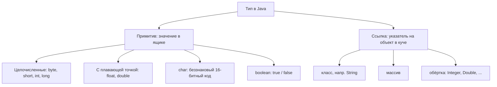
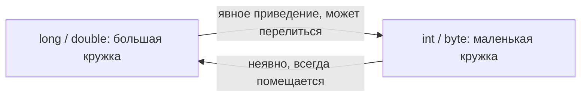
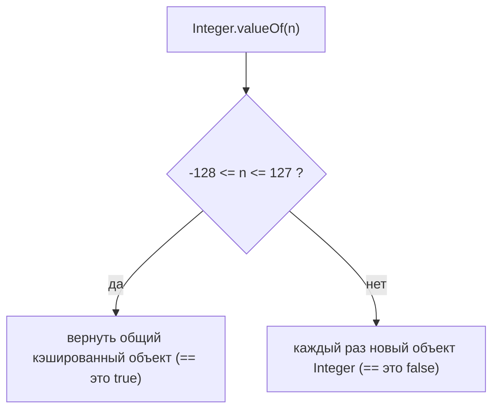

# Типы данных в Java и как они работают

## Интуиция

Представь склад, на котором всего **два вида стеллажей**. Первый вид — набор
**ящиков фиксированного размера** с печатью, что именно в них лежит: маленький
ящик под одну монету, побольше — под кирпич. Второй вид — **квитанция-бирка**: на
полке лежит лишь бумажка «ваш диван в 12-м ряду», а сам диван стоит где-то в другом
конце здания.

Java устроена так же. В ней ровно **два семейства типов**:

- **Примитивные типы** — ящики фиксированного размера. Значение лежит *прямо* в
  переменной, у ящика фиксированный размер в битах, и он **никогда** не бывает
  пустым (никогда не `null`). Их ровно **восемь**: `byte`, `short`, `int`, `long`,
  `float`, `double`, `char`, `boolean`.
- **Ссылочные типы** — квитанции. Переменная держит лишь **указатель** (бирку) на
  объект, который живёт в куче; переменная может быть `null` (пустая квитанция).
  Всё, что не входит в восьмёрку примитивов, — ссылочный тип: классы вроде
  `String`, массивы, интерфейсы, перечисления и классы-**обёртки** `Integer`,
  `Double`, `Boolean`, …

Это то же разделение, что и в темах [Что хранит переменная и где](topic:variable-storage)
и [Где хранятся ссылочные типы](topic:reference-types-storage); ящики живут на
стеке, а объекты — в куче, как в теме
[Как устроена память Java: стек против кучи](topic:jvm-memory-areas).

## У ящиков фиксированного размера фиксированная вместимость

У каждого примитивного ящика **проштампована вместимость**, как у почтовых ящиков,
принимающих посылки только до определённого веса:

| Тип | Размер | Вмещает |
| --- | --- | --- |
| `byte` | 8 бит | -128 .. 127 |
| `short` | 16 бит | -32 768 .. 32 767 |
| `int` | 32 бита | ~ ±2,1 миллиарда |
| `long` | 64 бита | ~ ±9,2 квинтиллиона |
| `float` | 32 бита | ~7 значащих цифр |
| `double` | 64 бита | ~16 значащих цифр |
| `char` | 16 бит | 0 .. 65 535 |
| `boolean` | 1 бит (логически) | `true` / `false` |

Поскольку ящик не может вырасти, `int` на максимуме ведёт себя как **одометр
автомобиля, который перещёлкивает**: прибавь 1 к `Integer.MAX_VALUE`, и значение не
станет больше, а **завернётся** в самое отрицательное. Это тихое **переполнение** —
классический баг: если счётчик может превысить ~2,1 миллиарда, используй `long`.

## char — это число в костюме

`char` выглядит как буква, но внутри ящика это просто **беззнаковое 16-битное
число** — как номерок в гардеробе, где `'A'` на самом деле номерок 65. Сделай над
ним арифметику — и костюм спадает: `'A' + 1` **повышается до `int`** и даёт `66`, а
не символ `'B'`. Из-за этого повышения смешивать `char` и `int` нужно аккуратно.

## Плавающая точка — это неточная мерная кружка

`float` и `double` хранят числа в **двоичном** виде, и у многих привычных десятичных
дробей (например, `0.1`) **нет точной двоичной формы** — как у `1/3` нет точной
десятичной. Это мерная кружка с двоичными делениями: можно подойти *очень* близко к
`0.1`, но не ровно. Поэтому `0.1 + 0.2` выдаёт `0.30000000000000004`, а не `0.3`.
Правило: **никогда не считай деньги в `double`** — используй `BigDecimal` или
целые копейки, где каждая сумма попадает ровно на деление.

## Переливание между ящиками: расширение против сужения

Перемещение значения из одного примитивного ящика в другой похоже на переливание
жидкости между мерными кружками:

- **Расширение** (`int` → `long`, `int` → `double`) — переливание из маленькой
  кружки в большую. Всегда помещается, поэтому Java делает это **неявно** и **без
  потерь**.
- **Сужение** (`long` → `int`, `int` → `byte`) — переливание из большой кружки в
  маленькую. Может **перелиться через край**, поэтому Java откажется, пока ты не
  сделаешь **явное приведение**. Приведение оставляет только младшие биты:
  `(byte) 300` тихо превращается в `44`.

## Автоупаковка: монета в витрине

Иногда примитиву нужно вести себя как объекту — например, чтобы попасть в `List`,
который хранит только ссылки. **Автоупаковка** оборачивает монету-примитив в
**витрину** (`int` → `Integer`), и эта витрина — *ссылочный тип*, который живёт в
куче и может быть `null`. Распаковка достаёт монету обратно.

С витриной приходят две ловушки:

1. **Стоимость** — упаковка выделяет объект; в горячем цикле это плодит мусор и
   замедляет код. В горячих местах предпочитай примитивы.
2. **Кэш `Integer`** — `Integer.valueOf` держит **общую витрину** для каждого
   значения в **-128 .. 127**. Поэтому `==` (которое сравнивает *идентичность* —
   «это та же самая витрина?») возвращает `true` для двух упакованных `127`, но
   `false` для двух упакованных `200`, которым достаются разные витрины. **Всегда
   сравнивай обёртки через `equals`,** а не `==`. (Идентичность ссылки против
   равенства значений — та же мысль, что и в теме
   [Неизменяемость String](topic:string-immutability) и интернировании `String`.)

## Значения по умолчанию: пустые полки

Когда ты создаёшь объект, его **поля** начинают с **заводских полок по
умолчанию**: примитивные поля — **ноль** (`0`, `0.0`, `' '`, `false`), а ссылочные
поля — **`null`** (пустая квитанция). Поэтому примитив **никогда** не может быть
`null` — только его обёртка. Обрати внимание на асимметрию, которую любят на
собеседованиях: **локальные переменные значения по умолчанию не получают** —
компилятор заставляет присвоить их до использования.

## Ответ за 60 секунд

> В Java два семейства типов. **Примитивы** — восемь `byte`, `short`, `int`,
> `long`, `float`, `double`, `char`, `boolean` — хранят значение напрямую, имеют
> фиксированный размер и диапазон и никогда не `null`. Всё остальное — **ссылочный
> тип**: переменная держит указатель на объект в куче и может быть `null`. Так как
> примитивы фиксированной ширины, целые **переполняются** (заворачиваются) за
> максимумом; `char` — это на самом деле беззнаковое 16-битное число; а `double` —
> двоичная плавающая точка, поэтому `0.1 + 0.2 != 0.3` — для денег используй
> `BigDecimal`. Расширяющие преобразования неявные, сужающие требуют явного
> приведения и могут потерять данные. У каждого примитива есть класс-**обёртка**;
> **автоупаковка** конвертирует между ними, но упакованные значения нужно сравнивать
> через `equals`, а не `==`, потому что `Integer.valueOf` кэширует только
> `-128..127`. Наконец, примитивные поля по умолчанию равны нулю/`false`, а
> ссылочные — `null`.

## Частые заблуждения и ловушки

- **«`String` — это примитив».** Нет — `String` ссылочный тип (класс). Примитивов
  ровно восемь, и ни один из них не пишется с большой буквы.
- **«Числам побольше просто нужно значение побольше».** Тип фиксированной ширины
  вместо этого **переполняется**; `Integer.MAX_VALUE + 1` отрицателен. Используй
  `long` (или `Math.addExact`, чтобы упасть с ошибкой).
- **«`char` — это буква».** Это беззнаковый 16-битный код; арифметика повышает его
  до `int`.
- **«`0.1 + 0.2 == 0.3`».** Неверно — двоичная плавающая точка неточна. Сравнивай
  `double` с допуском, а для денег используй `BigDecimal`.
- **«`==` сравнивает значения обёрток».** Оно сравнивает **идентичность**. Случайно
  работает для кэшированных маленьких `Integer` и ломается выше 127. Используй
  `equals`.
- **«Примитив может быть `null`».** Никогда. Может только его обёртка, и распаковка
  `null`-обёртки бросает `NullPointerException`.
- **«Приведение `long` к `int` безопасно».** Сужение может тихо обрезать значение;
  проверяй диапазон или используй `Math.toIntExact`.
