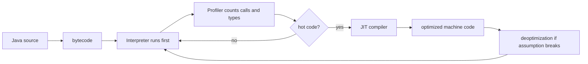
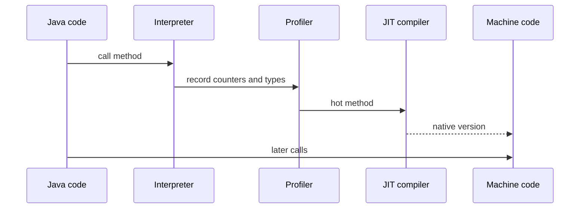

# Why Java is often faster than Python and how JIT works

Java is usually faster than CPython for CPU-bound application code because the JVM does not only "run bytecode". It watches the program while it runs, learns which methods and branches are actually used, and compiles the hot parts to native machine code. Think of a busy post office: at first every parcel goes through the normal desk, but after the staff sees the same route all morning, they open a dedicated express lane for that route.

Python, specifically CPython, usually executes bytecode through an interpreter with highly dynamic object and type rules. Every operation may need runtime checks: what type is this object, which method should be called, can this operator be overloaded, what reference counts must change? It is like a kitchen where every ingredient arrives in an unlabelled box, so the cook checks the box before each step. Java still has runtime checks, but bytecode, declared types and primitives give the JVM a more regular recipe to optimize; see [Java data types](topic:java-data-types) and [primitive vs object types](topic:primitive-vs-object-types).

## What the JVM does at runtime

1. Java source is compiled ahead of time to bytecode. Bytecode is portable instructions for the JVM, not final CPU instructions. Analogy: a restaurant chain sends the same prep card to every kitchen, then each kitchen uses its own equipment.
2. The JVM starts by interpreting bytecode. This keeps startup flexible and avoids spending compilation time on code that might run once. Analogy: a clerk handles the first few customers manually before deciding whether a special counter is worth opening.
3. The profiler records real execution data: call counts, branch frequency, receiver types, loop behavior and allocation patterns. Analogy: a traffic camera counts which lanes are crowded instead of guessing from the city map.
4. Hot methods or loops reach a threshold and are compiled by JIT. HotSpot commonly uses tiered compilation: quick C1 compilation first, then more aggressive C2 optimization for very hot code. Analogy: a cafe first writes a short checklist for a busy order, then later redesigns the whole station for peak hour.
5. Later calls can jump to optimized native machine code. Method calls still use stack frames, so connect this with [method call stack frames](topic:method-call-stack-frames). Analogy: a delivery van now follows a prepared route instead of asking for directions at every corner.

## What JIT can optimize

- Inlining copies a small callee into the caller, removing call overhead and exposing more code to further optimization. Analogy: a cook keeps a frequently used sauce at the same station instead of walking to the pantry each time.
- Devirtualization turns a dynamic virtual call into a direct call when profiling shows one receiver type dominates. Analogy: if 99 out of 100 parcels go to the same counter, the clerk stops asking which counter until the pattern changes.
- Escape analysis proves an object does not escape a method or thread, so allocation may be removed or replaced with scalar values. This matters with the heap and GC, so review [JVM memory areas](topic:jvm-memory-areas) and [heap generations](topic:heap-generations). Analogy: if a sandwich is eaten in the kitchen, nobody needs to wrap it for delivery.
- Bounds-check elimination, loop optimizations and constant folding remove repeated checks or calculations when the JVM can prove they are redundant. Analogy: after measuring the same shelf many times, a warehouse worker marks the limit once and stops measuring every box.

These optimizations depend on facts observed at runtime. That is why Java can become faster after warmup: the JVM has more evidence. It is also why optimized code can be deoptimized. If a new subclass appears or a branch pattern changes, the JVM can throw away the compiled version and return to the interpreter. Analogy: if roadworks close the express lane, traffic returns to the normal route until a better route is built.

## Why Python is usually slower

The usual comparison means Java on HotSpot versus CPython. CPython is optimized, but it is mostly an interpreter for dynamic bytecode. Python integers, strings and user objects are heap objects with metadata; operations often require dynamic lookup and reference-count updates. Java can use primitives directly and can optimize object-heavy code after profiling. Analogy: Java often moves labelled crates on a conveyor belt, while CPython opens many boxes to check what is inside.

The Global Interpreter Lock also limits CPU-bound parallel Python threads in CPython, while Java threads can run CPU work in parallel on multiple cores. That does not make every Java program faster, but it matters for CPU-heavy services; see [Java multithreading](topic:java-multithreading). Analogy: one Python kitchen often has one head cook approving CPU-heavy steps, while Java can let several cooks work at once if the recipe is safe.

## 60-second interview answer

Java is often faster than Python because Java code runs on a JVM that can profile real execution and JIT-compile hot bytecode to native machine code. CPython usually interprets dynamic bytecode, where operations need runtime type lookup and object handling. The JVM starts by interpreting code, collects counters and type profiles, then compiles frequently executed methods or loops. JIT can inline methods, devirtualize calls, remove allocations with escape analysis and eliminate redundant checks. The tradeoff is warmup: short scripts may not benefit, and optimized JVM code can be deoptimized if a speculative assumption becomes false. Python can still be fast when work is done by native extensions like NumPy, when the program is I/O-bound, or when a different implementation such as PyPy is used.

## Production relevance

For services, benchmarks and latency work, warmup matters. A Java service may look slower during startup and much faster after hot paths compile. Analogy: an industrial oven is slow to heat, but excellent once the bakery is busy. This is why production measurements often ignore warmup iterations and observe steady-state throughput separately from startup latency.

JIT also explains why microbenchmarks are tricky. Dead-code elimination, inlining and constant folding can make a benchmark measure nothing useful. Analogy: timing a delivery route with no parcels gives a beautiful number and a useless conclusion. Use proper benchmark tools such as JMH when accuracy matters.

## Common misconceptions

- "Java is always faster than Python." Not always. Startup, I/O, database calls, native Python libraries and algorithm choice can dominate. Analogy: for one cup of tea, a kettle beats a factory boiler.
- "JIT compiles everything." It usually compiles hot code, not every method. Cold code may stay interpreted forever. Analogy: the post office opens express lanes only for crowded routes.
- "JIT optimization is permanent." It can be undone by deoptimization when runtime assumptions break. Analogy: a traffic shortcut closes when road conditions change.
- "Python is slow because it is not compiled at all." CPython does compile source to bytecode, but it usually interprets that bytecode instead of producing heavily optimized native code for hot paths. Analogy: Python has a prep card too, but the cook still checks many details during service.
- "JIT removes the need for good code." The JVM can optimize a lot, but poor algorithms, excessive allocation, blocking I/O and bad data structures still matter. For collections behavior, connect this with [Java Collections Overview](topic:java-collections-overview).
