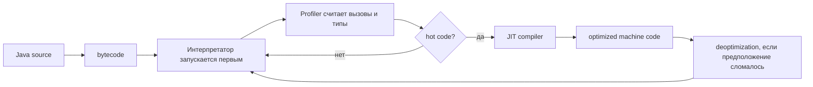
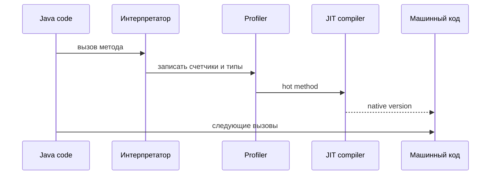

# Почему Java часто быстрее Python и как работает JIT

Java обычно быстрее CPython для CPU-bound кода приложений, потому что JVM не просто "запускает bytecode". Она наблюдает за программой во время выполнения, понимает, какие методы и ветки реально используются, и компилирует hot parts в native machine code. Представь загруженное почтовое отделение: сначала каждая посылка идет через обычное окно, но когда сотрудники видят один и тот же маршрут все утро, они открывают для него отдельную express lane.

Python, точнее CPython, обычно выполняет bytecode через интерпретатор с очень динамическими правилами объектов и типов. Каждая операция может требовать runtime checks: какой тип у этого объекта, какой метод вызвать, можно ли перегрузить этот оператор, какие reference counts нужно изменить? Это как кухня, куда каждый ингредиент приходит в коробке без этикетки, и повар проверяет коробку перед каждым шагом. В Java тоже есть runtime checks, но bytecode, объявленные типы и primitives дают JVM более регулярный рецепт для оптимизации; смотри [Java data types](topic:java-data-types) и [primitive vs object types](topic:primitive-vs-object-types).

## Что JVM делает во время выполнения

1. Java source заранее компилируется в bytecode. Bytecode - это переносимые инструкции для JVM, а не финальные CPU instructions. Аналогия: сеть ресторанов отправляет одну и ту же prep card на каждую кухню, а каждая кухня использует свое оборудование.
2. JVM начинает с интерпретации bytecode. Это сохраняет гибкий старт и не тратит время компиляции на код, который может выполниться один раз. Аналогия: клерк вручную обслуживает первых клиентов, прежде чем решить, стоит ли открывать специальное окно.
3. Profiler записывает реальные данные выполнения: call counts, branch frequency, receiver types, поведение loops и allocation patterns. Аналогия: дорожная камера считает, какие полосы загружены, вместо того чтобы гадать по карте города.
4. Hot methods или loops достигают threshold и компилируются через JIT. HotSpot часто использует tiered compilation: сначала быстрая C1 compilation, затем более агрессивная C2 optimization для очень горячего кода. Аналогия: кафе сначала пишет короткий checklist для популярного заказа, а позже перестраивает всю станцию под час пик.
5. Следующие вызовы могут переходить в optimized native machine code. Method calls все равно используют stack frames, поэтому свяжи это с [method call stack frames](topic:method-call-stack-frames). Аналогия: фургон доставки теперь едет по подготовленному маршруту, а не спрашивает дорогу на каждом перекрестке.

## Что может оптимизировать JIT

- Inlining копирует маленький callee внутрь caller, убирает накладные расходы вызова и открывает больше кода для следующих оптимизаций. Аналогия: повар держит часто используемый соус на той же станции, а не ходит в кладовую каждый раз.
- Devirtualization превращает dynamic virtual call в direct call, когда profiling показывает, что один receiver type доминирует. Аналогия: если 99 из 100 посылок идут к одному окну, клерк перестает каждый раз спрашивать, какое окно нужно, пока шаблон не изменится.
- Escape analysis доказывает, что объект не выходит за пределы метода или потока, поэтому allocation можно убрать или заменить scalar values. Это связано с heap и GC, поэтому повтори [JVM memory areas](topic:jvm-memory-areas) и [heap generations](topic:heap-generations). Аналогия: если сэндвич съедают на кухне, его не нужно заворачивать для доставки.
- Bounds-check elimination, loop optimizations и constant folding убирают повторные проверки или вычисления, когда JVM может доказать, что они лишние. Аналогия: после множества измерений одной полки работник склада отмечает предел один раз и перестает мерить каждую коробку.

Эти оптимизации зависят от фактов, увиденных во время выполнения. Поэтому Java может ускоряться после прогрева: у JVM появляется больше доказательств. Поэтому же optimized code может быть deoptimized. Если появляется новый subclass или меняется branch pattern, JVM может выбросить compiled version и вернуться к интерпретатору. Аналогия: если дорожные работы закрыли express lane, трафик возвращается на обычный маршрут, пока не построят лучший.

## Почему Python обычно медленнее

Обычно сравнивают Java на HotSpot с CPython. CPython оптимизирован, но это в основном интерпретатор динамического bytecode. Python integers, strings и user objects - heap objects с metadata; операции часто требуют dynamic lookup и обновления reference-count. Java может напрямую использовать primitives и оптимизировать object-heavy code после profiling. Аналогия: Java часто перемещает подписанные ящики по конвейеру, а CPython открывает много коробок, чтобы проверить содержимое.

Global Interpreter Lock также ограничивает CPU-bound параллельные Python threads в CPython, а Java threads могут выполнять CPU work параллельно на нескольких ядрах. Это не делает каждую Java программу быстрее, но важно для CPU-heavy сервисов; смотри [Java multithreading](topic:java-multithreading). Аналогия: на Python кухне часто есть один главный повар, который утверждает CPU-heavy шаги, а Java может дать нескольким поварам работать одновременно, если рецепт безопасен.

## Ответ за 60 секунд

Java часто быстрее Python, потому что Java code выполняется на JVM, которая профилирует реальное выполнение и JIT-компилирует hot bytecode в native machine code. CPython обычно интерпретирует динамический bytecode, где операциям нужны runtime type lookup и object handling. JVM начинает с интерпретации кода, собирает counters и type profiles, затем компилирует часто выполняемые методы или loops. JIT может inline methods, devirtualize calls, убрать allocations через escape analysis и устранить лишние checks. Компромисс - warmup: короткие скрипты могут не получить выгоды, а optimized JVM code может быть deoptimized, если спекулятивное предположение стало ложным. Python все еще может быть быстрым, когда работа выполняется native extensions вроде NumPy, когда программа I/O-bound или когда используется другая реализация, например PyPy.

## Значение в production

Для сервисов, benchmarks и latency work прогрев важен. Java service может выглядеть медленнее при startup и намного быстрее после компиляции hot paths. Аналогия: промышленная печь долго нагревается, но отлично работает, когда пекарня загружена. Поэтому production measurements часто игнорируют warmup iterations и отдельно смотрят steady-state throughput и startup latency.

JIT также объясняет, почему microbenchmarks опасны. Dead-code elimination, inlining и constant folding могут заставить benchmark измерять ничего полезного. Аналогия: засекать маршрут доставки без посылок дает красивое число и бесполезный вывод. Используй правильные инструменты для benchmark, например JMH, когда важна точность.

## Частые заблуждения

- "Java всегда быстрее Python." Не всегда. Startup, I/O, database calls, native Python libraries и выбор алгоритма могут доминировать. Аналогия: для одной чашки чая чайник лучше заводского бойлера.
- "JIT компилирует все." Обычно он компилирует hot code, а не каждый метод. Cold code может навсегда остаться интерпретируемым. Аналогия: почта открывает express lanes только для загруженных маршрутов.
- "JIT optimization навсегда." Ее можно отменить через deoptimization, когда runtime assumptions ломаются. Аналогия: дорожный shortcut закрывается, когда условия на дороге меняются.
- "Python медленный, потому что он вообще не компилируется." CPython компилирует source в bytecode, но обычно интерпретирует этот bytecode, а не создает сильно оптимизированный native code для hot paths. Аналогия: у Python тоже есть prep card, но повар все равно проверяет много деталей во время работы.
- "JIT отменяет необходимость писать хороший код." JVM может многое оптимизировать, но плохие алгоритмы, чрезмерные allocations, blocking I/O и неподходящие data structures все равно важны. Для поведения коллекций свяжи это с [Java Collections Overview](topic:java-collections-overview).
