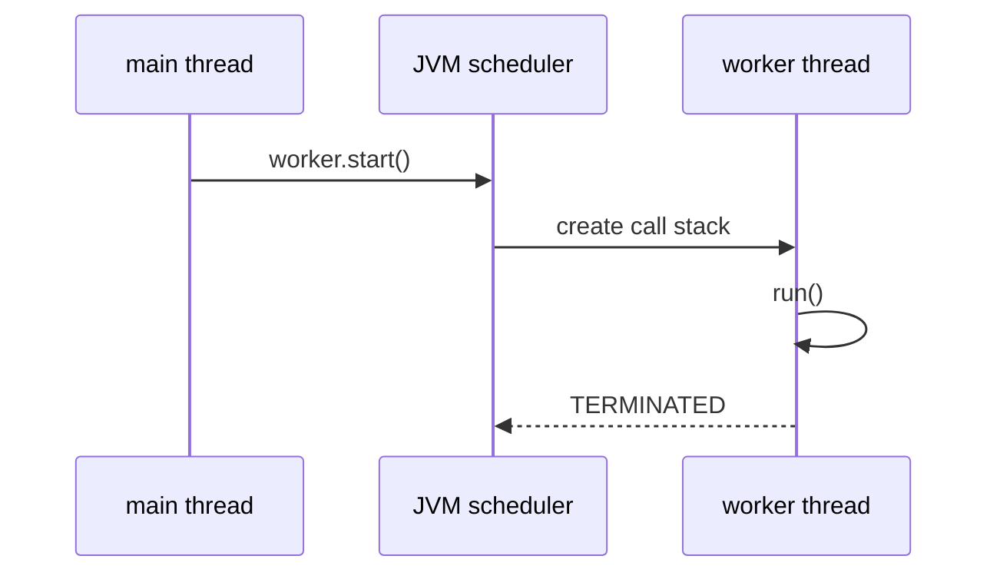
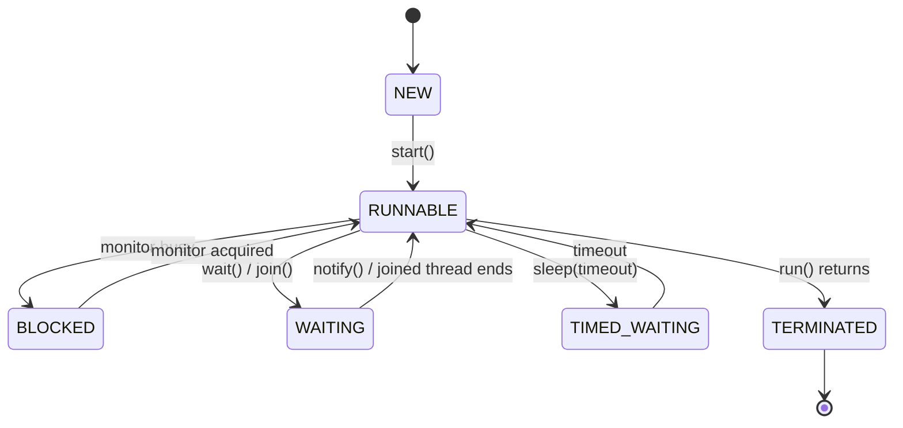
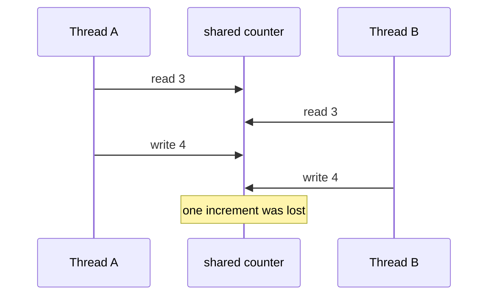

# Java Multithreading

Java multithreading means one JVM process can have several Java threads making
progress through code at the same time. Each thread has its own call stack and
current instruction, while objects on the heap are shared by default. Think of a
restaurant: every cook has a private order pad, but they all reach into the same
pantry.

## What Actually Runs

A `Thread` is an execution path managed by the JVM and the operating system. A
`Runnable` is just the work to do; the difference is covered in more detail in
[Thread vs Runnable](topic:thread-vs-runnable). The important interview point is
that `start()` asks the JVM to create a new execution path, while direct `run()`
is only a normal method call on the current thread. In a post office analogy,
`start()` opens another service window; `run()` asks the same clerk to do one more
task before moving on.

The scheduler decides when a runnable thread gets CPU time. Java code should not
depend on exact timing because the operating system can switch between threads at
different points on each run. It is like traffic lights: the route is known, but
the exact wait at each intersection changes.

## Lifecycle

The simplified lifecycle is `NEW -> RUNNABLE -> TERMINATED`, with waiting states
when a thread blocks on a monitor, sleeps, waits for another thread, or waits for
I/O. A `Thread` object can be started only once. That is like a delivery ticket:
once the courier has completed it, you make a new ticket for the next delivery.

## Memory And Shared State

Each thread has its own stack: local variables, method frames, and return
addresses. Objects live on the heap, so two threads can read and write the same
object. The private stack is like each cook's clipboard; the heap is the shared
kitchen counter. The clipboard is safe from other cooks, but anything left on the
counter needs rules.

The danger is not "many threads" by itself; it is shared mutable state. A statement
such as `counter++` is a read-modify-write sequence, so two threads can read the
same old value and overwrite each other. That specific protected region is a
[critical section](topic:critical-section). In the kitchen analogy, two cooks can
both see "3 soups prepared", write "4", and accidentally lose one soup unless the
counter update has one owner at a time.

Java gives several coordination tools: `synchronized`, `Lock`, atomic classes,
thread-safe collections, immutable objects, message queues, and higher-level APIs
such as `ExecutorService`, `CompletableFuture`, and parallel streams. In Spring,
features such as [`@Async`](topic:spring-async-self-invocation) build on the same
idea but add proxy rules. In real systems, prefer these higher-level tools over
manually creating raw `Thread` objects. It is like running a busy restaurant with
a shift manager and order queue instead of asking cooks to invent a schedule every
morning.

## 60-Second Interview Answer

Java multithreading lets one JVM process execute multiple threads. Each thread has
its own stack and program counter, but threads share heap objects. Calling
`start()` on a `Thread` asks the JVM and OS to schedule a new execution path that
will call `run()`; calling `run()` directly just executes a normal method on the
current thread. Because scheduling is nondeterministic, code must not rely on a
particular interleaving. Shared mutable state must be protected with
`synchronized`, locks, atomics, immutable data, thread-safe collections, or
higher-level concurrency APIs. In production I usually avoid manually managing
raw threads and use executors, futures, queues, or framework abstractions.

## Production Relevance

Servers use multithreading constantly: request handling, background jobs,
connection pools, async tasks, timers, and parallel data processing. The same heap
sharing that makes communication cheap can also create races, deadlocks, stale
reads, and performance bottlenecks. A traffic-control analogy helps: adding more
lanes improves throughput only if intersections have clear rules.

The JVM memory model defines when writes by one thread become visible to another.
`synchronized`, `volatile`, atomics, and concurrent collections provide visibility
guarantees, not just mutual exclusion. Without them, one thread may keep seeing an
old value. It is like a post office notice board: everyone needs an agreed moment
when the board is updated and checked, otherwise clerks work from stale notes.

## Common Misconceptions

- "`run()` starts a new thread." It does not; only `start()` creates a separate
  execution path. `run()` is the same clerk doing more work at the same window.
- "More threads always make code faster." Extra threads help when work can wait
  on I/O or use spare CPU cores; too many threads add context switching and memory
  overhead. More cooks in one tiny kitchen can slow service down.
- "Local variables are shared." Local variables on a thread stack are private, but
  references can point to shared heap objects. A cook's note is private; the pot
  the note points to is shared.
- "`volatile` makes compound actions atomic." `volatile` helps visibility and
  ordering, but `counter++` still needs an atomic class or a lock. Seeing the
  kitchen counter clearly does not reserve it.
- "Thread-safe collections solve every concurrency issue." They protect their own
  operations, not your larger business invariant. A safe cash drawer does not
  automatically make the whole checkout process correct.
