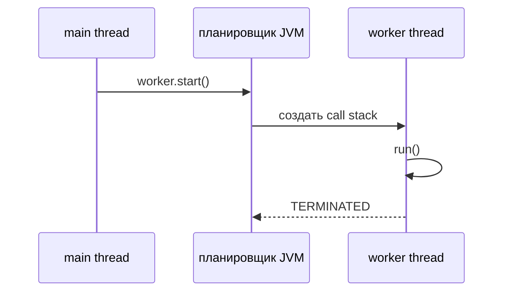
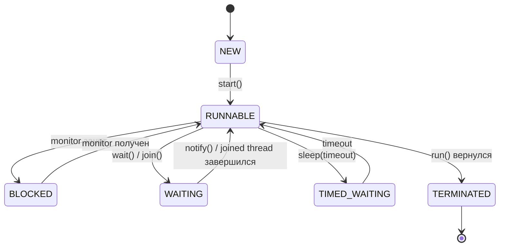
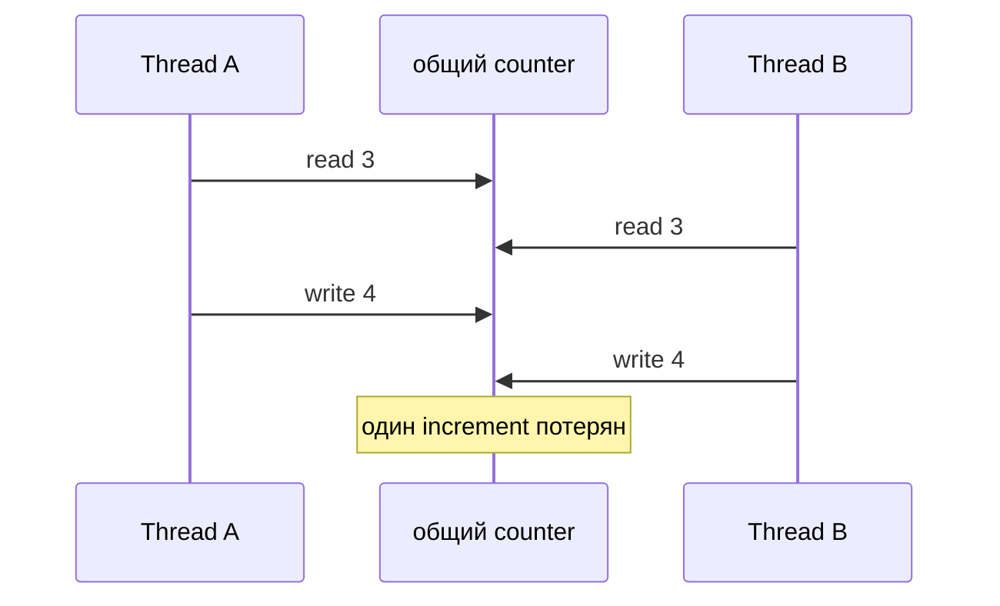

# Многопоточность в Java

Многопоточность в Java означает, что один процесс JVM может иметь несколько Java
threads, которые продвигаются по коду одновременно. У каждого thread есть свой
call stack и текущая инструкция, а объекты в heap по умолчанию общие. Представь
ресторан: у каждого повара есть личный блокнот заказов, но все тянутся к одной
и той же кладовой.

## Что На Самом Деле Выполняется

`Thread` — это путь выполнения, которым управляют JVM и операционная система.
`Runnable` — это только работа, которую нужно сделать; подробнее разница разобрана
в [Thread vs Runnable](topic:thread-vs-runnable). Главный момент для интервью:
`start()` просит JVM создать новый путь выполнения, а прямой `run()` является
обычным вызовом метода в текущем thread. В аналогии с почтой `start()` открывает
еще одно окно обслуживания; `run()` просит того же сотрудника выполнить еще одну
задачу перед продолжением.

Планировщик решает, когда runnable thread получит CPU time. Java-код не должен
зависеть от точного тайминга, потому что операционная система может переключать
threads в разных местах при каждом запуске. Это как светофоры: маршрут известен,
но точное ожидание на каждом перекрестке меняется.

## Lifecycle

Упрощенный lifecycle выглядит как `NEW -> RUNNABLE -> TERMINATED`, а состояния
ожидания появляются, когда thread блокируется на monitor, спит, ждет другой
thread или ждет I/O. Объект `Thread` можно запустить только один раз. Это как
квитанция на доставку: когда курьер ее выполнил, для следующей доставки нужна
новая квитанция.

## Память И Общее Состояние

У каждого thread есть свой stack: локальные переменные, frames методов и адреса
возврата. Объекты живут в heap, поэтому два threads могут читать и писать один и
тот же объект. Приватный stack похож на блокнот каждого повара; heap — это общий
кухонный стол. Блокнот защищен от других поваров, но для всего, что лежит на
столе, нужны правила.

Опасность не в "многих threads" сама по себе, а в общем изменяемом состоянии.
Оператор вроде `counter++` — это последовательность read-modify-write, поэтому
два threads могут прочитать одно старое значение и перезаписать результат друг
друга. Такая защищаемая область называется [critical section](topic:critical-section).
В кухонной аналогии два повара могут оба увидеть "готово 3 супа", записать "4" и
случайно потерять один суп, если у обновления счетчика нет одного владельца в
момент времени.

Java дает несколько инструментов координации: `synchronized`, `Lock`, atomic
classes, thread-safe collections, immutable objects, message queues и более
высокоуровневые API вроде `ExecutorService`, `CompletableFuture` и parallel
streams. В Spring возможности вроде [`@Async`](topic:spring-async-self-invocation)
строятся на той же идее, но добавляют правила proxy. В реальных системах лучше
использовать эти высокоуровневые инструменты, а не вручную создавать raw `Thread`
objects. Это как управлять оживленным рестораном через менеджера смены и очередь
заказов, а не просить поваров каждое утро придумывать расписание.

## Ответ За 60 Секунд

Многопоточность в Java позволяет одному процессу JVM выполнять несколько threads.
У каждого thread есть свой stack и program counter, но threads разделяют объекты
в heap. Вызов `start()` у `Thread` просит JVM и OS запланировать новый путь
выполнения, который вызовет `run()`; прямой вызов `run()` просто выполняет обычный
метод в текущем thread. Так как scheduling недетерминирован, код не должен
полагаться на конкретное чередование. Общее изменяемое состояние нужно защищать
через `synchronized`, locks, atomics, immutable data, thread-safe collections или
более высокоуровневые concurrency APIs. В production я обычно избегаю ручного
управления raw threads и использую executors, futures, queues или framework
abstractions.

## Значение В Production

Серверы постоянно используют многопоточность: обработка requests, background jobs,
connection pools, async tasks, timers и parallel data processing. То же общее
использование heap, которое делает коммуникацию дешевой, может создавать races,
deadlocks, stale reads и bottlenecks производительности. Помогает аналогия с
дорожным движением: дополнительные полосы повышают throughput только тогда, когда
на перекрестках есть понятные правила.

JVM memory model определяет, когда записи одного thread становятся видимыми для
другого. `synchronized`, `volatile`, atomics и concurrent collections дают
гарантии visibility, а не только mutual exclusion. Без них один thread может
продолжать видеть старое значение. Это как доска объявлений на почте: всем нужен
согласованный момент, когда доска обновляется и проверяется, иначе сотрудники
работают по устаревшим заметкам.

## Частые Заблуждения

- "`run()` запускает новый thread." Нет; только `start()` создает отдельный путь
  выполнения. `run()` — это тот же сотрудник, который делает больше работы в том
  же окне.
- "Больше threads всегда ускоряют код." Дополнительные threads помогают, когда
  работа ждет I/O или может использовать свободные CPU cores; слишком много
  threads добавляют context switching и расход памяти. Больше поваров на крошечной
  кухне могут замедлить обслуживание.
- "Локальные переменные общие." Локальные переменные в stack thread приватны, но
  ссылки могут указывать на общие heap objects. Записка повара приватна; кастрюля,
  на которую она указывает, общая.
- "`volatile` делает составные действия atomic." `volatile` помогает с visibility
  и ordering, но `counter++` все равно требует atomic class или lock. Хорошо видеть
  кухонный стол не означает зарезервировать его.
- "Thread-safe collections решают любую concurrency-проблему." Они защищают свои
  операции, но не твой более широкий business invariant. Безопасный денежный ящик
  не делает автоматически корректным весь checkout process.
