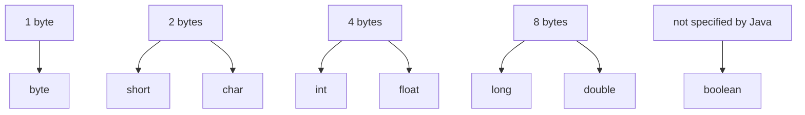

# Primitive Type Sizes in Java

Java has eight primitive types. Seven of them have a fixed value width that you can answer in bytes: `byte` is 1, `short` is 2, `int` is 4, `long` is 8, `float` is 4, `double` is 8, and `char` is 2. Think of a kitchen shelf with jars of fixed capacity: an `int` jar always has room for 4 bytes of value, no matter whether the current value is `0` or `1_000_000`.

`boolean` is the interview trap. It stores only `true` or `false`, but the Java language does not promise a portable byte size for its storage. A JVM may represent booleans differently in fields, arrays, locals, or optimized code. In the kitchen analogy, `boolean` is a yes/no sticker, not a jar with a guaranteed public capacity label.

## The Table To Memorize

| Type | Bits | Bytes | Main note |
| --- | ---: | ---: | --- |
| `byte` | 8 | 1 | Small signed integer, `-128..127`. Like a tiny spice jar: useful when the range is truly small. |
| `short` | 16 | 2 | Signed integer, rarely used in ordinary business code. Like a medium jar that exists, but you do not reach for it first. |
| `int` | 32 | 4 | Default integer choice for most counters and indexes. Like the standard measuring cup in the kitchen. |
| `long` | 64 | 8 | Large signed integer for ids, timestamps, and counts that can exceed `int`. Like a stock pot for numbers. |
| `float` | 32 | 4 | Single-precision floating point, lower precision. Like a rough kitchen scale: compact, but not exact for fine money math. |
| `double` | 64 | 8 | Default floating-point choice, higher precision. Like a better scale, still binary and still not for exact money. |
| `char` | 16 | 2 | One UTF-16 code unit, not necessarily one complete user-perceived character. Like one postal label segment, not always the whole address. |
| `boolean` | not specified | not specified | Values are `true` and `false`; portable byte storage is not guaranteed. Like a yes/no stamp whose storage box is chosen by the post office. |

This topic is a focused companion to [Java Data Types](topic:java-data-types) and [Primitive vs Object Types](topic:primitive-vs-object-types). Those topics explain the broader split between primitive values and references; here we only pin down the byte-size answer.

## 60-Second Interview Answer

The fixed primitive value sizes are: `byte` - 1 byte, `short` - 2 bytes, `int` - 4 bytes, `long` - 8 bytes, `float` - 4 bytes, `double` - 8 bytes, and `char` - 2 bytes because it is a 16-bit UTF-16 code unit. `boolean` is the special case: Java defines only the two values `true` and `false`, not a portable storage size in bytes. Also, these are value widths, not necessarily the full memory footprint of an object field, array element, or local variable.

Use the kitchen shelf memory aid: most primitives are jars with printed capacities, but `boolean` is only a yes/no label. The shelf, tray, and packaging around the jars are a separate memory-layout question.

## Production Relevance

Primitive sizes matter when you read binary protocols, file formats, network packets, or low-level serialization. If a packet says the next field is a 32-bit signed integer, Java `int` matches that 4-byte value width. Like packing a delivery box, the field size must match the label on the form.

They also matter for arrays and large volumes of data. A `long[]` needs roughly twice the element value space of an `int[]`, before array headers and alignment. Like choosing between small and large containers in a pantry, the per-item difference becomes important when you store millions of items.

For normal application objects, do not multiply field count by primitive byte sizes and call it exact memory usage. Object headers, padding, compressed references, JVM implementation choices, and alignment all affect the final footprint. For that broader picture, connect this table to [How Java Memory Is Organized: Stack vs Heap](topic:jvm-memory-areas), [What a Variable Stores and Where](topic:variable-storage), and [Method Calls and Stack Frames](topic:method-call-stack-frames). The kitchen analogy is packaging: the jar capacity is not the same as the whole boxed shipment.

## Common Misconceptions

`boolean` is not a guaranteed 1-byte primitive in portable Java. It often behaves that way in common JVM layouts, especially in arrays, but the language-level answer should include the caveat. Like a post office that may choose different bins internally, the public contract is only true or false.

`char` is not a full Unicode character. It is one 16-bit UTF-16 code unit, so some characters require two `char` values as a surrogate pair. Like a long street address split across two labels, one label is not always the whole address.

Primitive value size is not object size. A class with an `int` field does not automatically use exactly 4 bytes more in every JVM layout; padding and object headers can change the footprint. Like jars on a tray, the tray itself also takes space.

`float` and `double` are not decimal money types. Their byte sizes are fixed, but they use binary floating-point representation. Like a kitchen scale that rounds in its own units, it can be useful for measurements but wrong for exact currency arithmetic.
