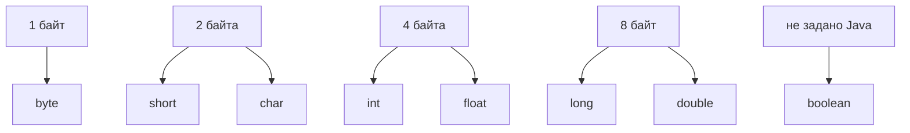

# Размеры примитивных типов в Java

В Java есть восемь примитивных типов. У семи из них есть фиксированная ширина значения, которую можно назвать в байтах: `byte` - 1, `short` - 2, `int` - 4, `long` - 8, `float` - 4, `double` - 8, а `char` - 2. Представьте кухонную полку с банками фиксированного объема: банка `int` всегда рассчитана на 4 байта значения, неважно, лежит внутри `0` или `1_000_000`.

`boolean` - ловушка на собеседовании. Он хранит только `true` или `false`, но язык Java не обещает переносимый размер хранения в байтах. JVM может представлять boolean по-разному в полях, массивах, локальных переменных или оптимизированном коде. В кухонной аналогии `boolean` - это наклейка да/нет, а не банка с гарантированной публичной емкостью.

## Таблица, которую нужно запомнить

| Тип | Биты | Байты | Главное замечание |
| --- | ---: | ---: | --- |
| `byte` | 8 | 1 | Маленькое знаковое целое, `-128..127`. Как крошечная баночка для специй: полезна, когда диапазон правда мал. |
| `short` | 16 | 2 | Знаковое целое, редко используется в обычном бизнес-коде. Как средняя банка, которая есть, но не первая под рукой. |
| `int` | 32 | 4 | Типичный выбор для счетчиков и индексов. Как стандартный мерный стакан на кухне. |
| `long` | 64 | 8 | Большое знаковое целое для id, timestamp и счетчиков, которые могут выйти за пределы `int`. Как большая кастрюля для чисел. |
| `float` | 32 | 4 | Одинарная точность с плавающей точкой, точность ниже. Как грубые кухонные весы: компактно, но не точно для денежных расчетов. |
| `double` | 64 | 8 | Обычный выбор для floating-point, точность выше. Как более точные весы, но все еще двоичные и все еще не для точных денег. |
| `char` | 16 | 2 | Одна кодовая единица UTF-16, не обязательно полный символ с точки зрения пользователя. Как один сегмент почтовой наклейки, не всегда весь адрес. |
| `boolean` | не задано | не задано | Значения `true` и `false`; переносимый размер хранения в байтах не гарантирован. Как печать да/нет, коробку для которой выбирает почта. |

Эта тема - узкое дополнение к [Java Data Types](topic:java-data-types) и [Primitive vs Object Types](topic:primitive-vs-object-types). Там объясняется общий раздел между примитивными значениями и ссылками; здесь мы фиксируем именно ответ про байты.

## Ответ за 60 секунд

Фиксированные размеры значений примитивов такие: `byte` - 1 байт, `short` - 2 байта, `int` - 4 байта, `long` - 8 байт, `float` - 4 байта, `double` - 8 байт, а `char` - 2 байта, потому что это 16-битная кодовая единица UTF-16. `boolean` - особый случай: Java определяет только два значения, `true` и `false`, но не переносимый размер хранения в байтах. Еще важно сказать, что это ширина значения, а не обязательно полный след в памяти у поля объекта, элемента массива или локальной переменной.

Запоминалка с кухонной полкой: большинство примитивов - банки с напечатанной емкостью, а `boolean` - только наклейка да/нет. Полка, поднос и упаковка вокруг банок - отдельный вопрос раскладки памяти.

## Зачем это в продакшене

Размеры примитивов важны, когда вы читаете бинарные протоколы, форматы файлов, сетевые пакеты или низкоуровневую сериализацию. Если в пакете сказано, что следующее поле - 32-битное знаковое целое, Java `int` совпадает с этой шириной значения в 4 байта. Как при упаковке посылки: размер поля должен совпасть с надписью на форме.

Они также важны для массивов и больших объемов данных. `long[]` требует примерно вдвое больше места под значения элементов, чем `int[]`, если не считать заголовки массивов и выравнивание. Как выбор между маленькими и большими контейнерами в кладовой: разница на одном предмете становится заметной на миллионах предметов.

Для обычных объектов приложения не стоит умножать количество полей на размеры примитивов и называть это точной памятью. Заголовки объектов, выравнивание, compressed references, решения конкретной JVM и alignment влияют на итоговый след. Для общей картины свяжите эту таблицу с [How Java Memory Is Organized: Stack vs Heap](topic:jvm-memory-areas), [What a Variable Stores and Where](topic:variable-storage) и [Method Calls and Stack Frames](topic:method-call-stack-frames). Кухонная аналогия - упаковка: емкость банки не равна всей коробке с доставкой.

## Частые заблуждения

`boolean` не является гарантированно 1-байтным примитивом в переносимой Java. В распространенных раскладках JVM он часто выглядит так, особенно в массивах, но ответ на уровне языка должен содержать оговорку. Как почта, которая может выбирать разные внутренние ячейки: публичный контракт - только true или false.

`char` - это не полный Unicode-символ. Это одна 16-битная кодовая единица UTF-16, поэтому для некоторых символов нужны два значения `char` как surrogate pair. Как длинный адрес, разделенный на две наклейки: одна наклейка не всегда весь адрес.

Размер значения примитива - это не размер объекта. Класс с полем `int` не обязательно использует ровно на 4 байта больше в любой раскладке JVM; выравнивание и заголовки объектов могут изменить след. Как банки на подносе: сам поднос тоже занимает место.

`float` и `double` - не десятичные денежные типы. Их размеры фиксированы, но они используют двоичное представление с плавающей точкой. Как кухонные весы, которые округляют в собственных единицах: удобно для измерений, но неправильно для точных расчетов валюты.
