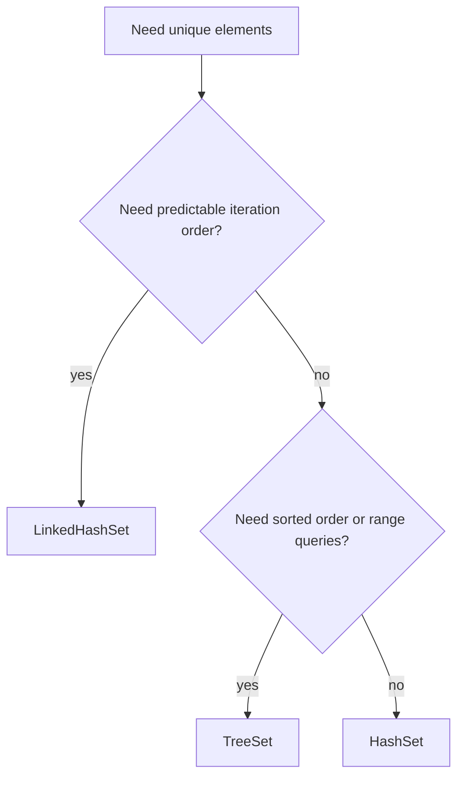
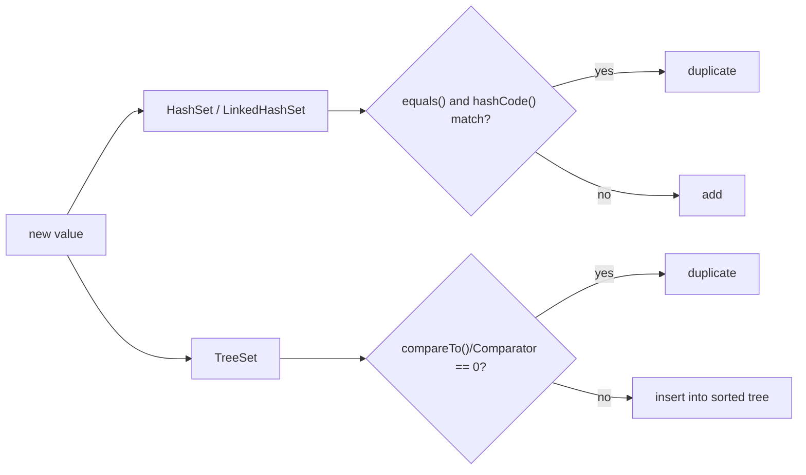

# HashSet vs LinkedHashSet vs TreeSet

`Set` means unique elements: adding the same logical element again does not create a second copy. Think of a kitchen checklist where "salt" appears once even if three cooks ask for it. In Java, the important question is not only "is it unique?", but also "what iteration order do I need?" and "how much lookup cost can I accept?"

If you need the wider collection context first, start with [Java Collections Overview](topic:java-collections-overview). This topic focuses on the three everyday `Set` implementations you are most likely to discuss in an interview.

## The Three Choices

`HashSet` is the default choice when you only care about fast membership checks: "have we seen this value already?" It is backed by a hash table, much like a post office sorting letters into boxes by postal code. In normal conditions, `add`, `contains` and `remove` are average `O(1)`, but iteration order is not part of the contract. For the bucket mechanics behind that promise, see [HashMap Internals](topic:hashmap) and [HashMap Lookup Speed](topic:hashmap-lookup-complexity).

`LinkedHashSet` is a `HashSet` with an extra linked list that remembers insertion order. It is like a deli queue with ticket numbers: lookup still uses the fast desk system, but serving order follows arrival order. Use it when stable output matters, such as returning tags, menu items, or IDs in the order the user supplied them. It costs a bit more memory than `HashSet` because it stores links between entries.

`TreeSet` stores elements in sorted order using a balanced tree. It is like a traffic control board where signs are always arranged by priority or street name, not by the time they arrived. `add`, `contains` and `remove` are usually `O(log n)`, and it supports sorted operations such as `first`, `last`, `lower`, `ceiling`, `subSet`, `headSet` and `tailSet`. For a deeper focused topic, see [TreeSet](topic:treeset).

## Uniqueness Rules

`HashSet` and `LinkedHashSet` decide whether two elements are the same by `equals()` and `hashCode()`. The hash is the shelf label, and `equals()` is the worker checking the item before putting it on the shelf. If these methods are inconsistent, lookup and duplicate detection become unreliable; review the [equals() and hashCode() contract](topic:equals-hashcode-contract).

`TreeSet` decides uniqueness by sorting comparison: natural ordering through `Comparable`, or a supplied `Comparator`. If comparison returns `0`, `TreeSet` treats the new value as a duplicate even when `equals()` would return `false`. In a kitchen analogy, a shelf sorted only by jar height may treat two different jars of the same height as the same slot. For comparison rules, see [Comparator vs Comparable](topic:comparator-vs-comparable).

## Null And Mutability

`HashSet` and `LinkedHashSet` can store one `null` value. It is like one empty label in the post office cabinet: allowed, but only once. A naturally ordered `TreeSet` usually rejects `null` because it cannot compare `null` with real values; a custom null-aware `Comparator` is required if you want that behavior.

Mutable elements are dangerous in every `Set`. If an object changes the fields used by `hashCode()`, `equals()`, `compareTo()` or `Comparator` after insertion, the collection may no longer find it. It is like moving a kitchen item to another shelf without updating the shelf index.

## 60-Second Interview Answer

`HashSet`, `LinkedHashSet` and `TreeSet` all implement `Set`, so they store unique elements. `HashSet` is usually the default: it uses hashing and gives average `O(1)` `add`, `contains` and `remove`, but it does not guarantee iteration order. `LinkedHashSet` keeps the same hash-based uniqueness and average complexity, but also preserves insertion order, with extra memory overhead. `TreeSet` keeps elements sorted using natural ordering or a `Comparator`; its operations are usually `O(log n)`, and it supports range and nearest-value queries. Hash-based sets use `equals()` and `hashCode()` for uniqueness, while `TreeSet` uses comparison, so a comparator returning `0` means "duplicate".

## Production Relevance

Use `HashSet` for deduplication and fast membership: processed IDs, blocked usernames, feature flags already seen. It is the warehouse bin lookup: quick, but the walking order through bins is not promised.

Use `LinkedHashSet` when the order is part of the output contract: user-selected filters, CSV column names, recently discovered IDs. It is the queue at a post office: every ticket is unique, and the line still matters.

Use `TreeSet` when sorted views or range queries matter: scores, timestamps, price thresholds, route numbers. It is the traffic board sorted by street number, so nearest and bounded lookups are natural.

## Common Misconceptions

- "HashSet is random." It is better to say "unspecified order." You may see a stable order in one run, like the same mailboxes being visited in the same route, but Java does not promise that route.
- "LinkedHashSet sorts elements." It does not sort; it preserves insertion order, like a queue.
- "TreeSet uses equals()." It uses comparison for uniqueness. If `compare(a, b) == 0`, one of them is treated as already present.
- "TreeSet is always better because it is ordered." Sorted order costs `O(log n)` operations and comparator complexity. If you only need membership, `HashSet` is usually simpler and faster.
- "null works the same everywhere." Hash-based sets can keep one `null`; naturally ordered `TreeSet` rejects it unless the comparator explicitly handles `null`.
- "Changing a stored object is harmless." If the changed fields affect hashing or comparison, the Set's internal address book no longer matches the object.
