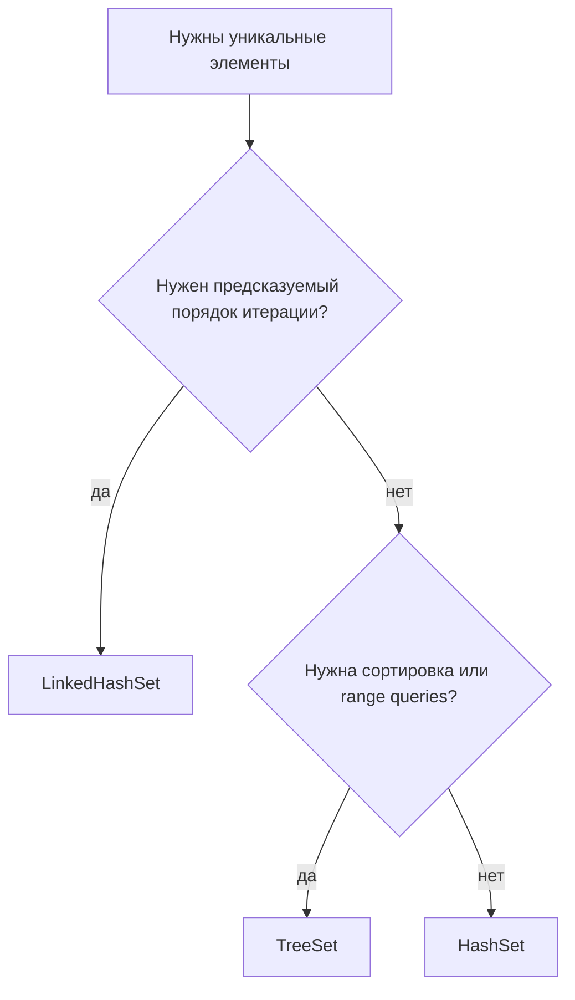
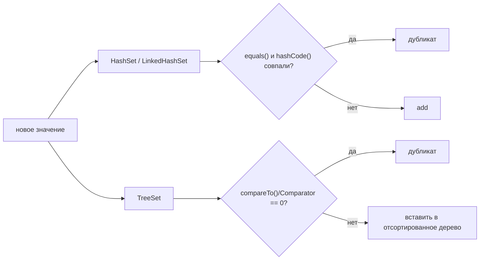

# HashSet, LinkedHashSet и TreeSet

`Set` означает уникальные элементы: повторное добавление того же логического элемента не создаёт вторую копию. Представь кухонный список, где "salt" остаётся одной строкой, даже если три повара попросили её добавить. В Java важен не только вопрос "уникально ли это?", но и "какой порядок итерации нужен?" и "какую стоимость поиска можно принять?"

Если сначала нужен общий контекст коллекций, начни с [Java Collections Overview](topic:java-collections-overview). Эта тема фокусируется на трёх повседневных реализациях `Set`, о которых чаще всего спрашивают на интервью.

## Три варианта

`HashSet` — выбор по умолчанию, когда важна только быстрая проверка наличия: "видели ли мы это значение раньше?" Он основан на хэш-таблице, как почтовое отделение, которое сортирует письма по ящикам через почтовый код. В обычных условиях `add`, `contains` и `remove` работают в среднем за `O(1)`, но порядок итерации не входит в контракт. Механику бакетов за этим обещанием можно посмотреть в [HashMap Internals](topic:hashmap) и [HashMap Lookup Speed](topic:hashmap-lookup-complexity).

`LinkedHashSet` — это `HashSet` с дополнительным связным списком, который помнит порядок вставки. Это похоже на очередь в кулинарии с номерками: поиск всё ещё использует быструю систему стойки, но порядок обслуживания идёт по приходу. Используй его, когда важен стабильный вывод, например теги, пункты меню или ID в порядке, в котором их передал пользователь. Он требует чуть больше памяти, чем `HashSet`, потому что хранит связи между записями.

`TreeSet` хранит элементы в отсортированном порядке через сбалансированное дерево. Это похоже на дорожное табло, где знаки всегда расположены по приоритету или названию улицы, а не по времени поступления. `add`, `contains` и `remove` обычно работают за `O(log n)`, а ещё есть операции сортированного множества: `first`, `last`, `lower`, `ceiling`, `subSet`, `headSet` и `tailSet`. Более глубокая отдельная тема: [TreeSet](topic:treeset).

## Правила уникальности

`HashSet` и `LinkedHashSet` решают, одинаковы ли два элемента, через `equals()` и `hashCode()`. Хэш — это ярлык полки, а `equals()` — сотрудник, который проверяет предмет перед тем, как положить его на полку. Если эти методы несогласованы, поиск и обнаружение дубликатов становятся ненадёжными; повтори [equals() and hashCode() contract](topic:equals-hashcode-contract).

`TreeSet` решает уникальность через сравнение для сортировки: natural ordering через `Comparable` или переданный `Comparator`. Если сравнение возвращает `0`, `TreeSet` считает новое значение дубликатом, даже когда `equals()` вернул бы `false`. В кухонной аналогии полка, отсортированная только по высоте банки, может считать две разные банки одной ячейкой, если высота совпала. Правила сравнения разобраны в [Comparator vs Comparable](topic:comparator-vs-comparable).

## Null и изменяемость

`HashSet` и `LinkedHashSet` могут хранить одно значение `null`. Это как один пустой ярлык в шкафу почтового отделения: можно, но только один раз. `TreeSet` с natural ordering обычно отвергает `null`, потому что не может сравнить `null` с реальными значениями; если такое поведение нужно, требуется `Comparator`, который явно умеет работать с `null`.

Изменяемые элементы опасны в любом `Set`. Если объект после вставки меняет поля, которые используются в `hashCode()`, `equals()`, `compareTo()` или `Comparator`, коллекция может перестать его находить. Это как переложить кухонный предмет на другую полку, но не обновить индекс полок.

## Ответ за 60 секунд

`HashSet`, `LinkedHashSet` и `TreeSet` реализуют `Set`, поэтому хранят уникальные элементы. `HashSet` обычно выбирают по умолчанию: он использует хэширование и даёт среднюю сложность `O(1)` для `add`, `contains` и `remove`, но не гарантирует порядок итерации. `LinkedHashSet` сохраняет ту же хэш-уникальность и среднюю сложность, но дополнительно сохраняет порядок вставки ценой лишней памяти. `TreeSet` хранит элементы отсортированными через natural ordering или `Comparator`; его операции обычно `O(log n)`, зато доступны range и nearest-value запросы. Хэш-реализации используют `equals()` и `hashCode()` для уникальности, а `TreeSet` использует сравнение, поэтому `Comparator`, возвращающий `0`, означает "дубликат".

## Практическая польза

Используй `HashSet` для дедупликации и быстрого membership: обработанные ID, заблокированные имена пользователей, уже встреченные feature flags. Это складской поиск по ящику: быстро, но порядок обхода ящиков не обещан.

Используй `LinkedHashSet`, когда порядок является частью контракта вывода: выбранные пользователем фильтры, имена колонок CSV, недавно найденные ID. Это очередь в почтовом отделении: каждый номерок уникален, и сама очередь всё ещё важна.

Используй `TreeSet`, когда важны отсортированные представления или range queries: scores, timestamps, price thresholds, route numbers. Это дорожное табло, отсортированное по номеру улицы, поэтому ближайшие и ограниченные поиски естественны.

## Частые заблуждения

- "HashSet случайный." Точнее говорить "порядок не специфицирован." В одном запуске он может выглядеть стабильным, как один и тот же маршрут по почтовым ящикам, но Java этот маршрут не обещает.
- "LinkedHashSet сортирует элементы." Он не сортирует; он сохраняет порядок вставки, как очередь.
- "TreeSet использует equals()." Он использует сравнение для уникальности. Если `compare(a, b) == 0`, один из объектов считается уже присутствующим.
- "TreeSet всегда лучше, потому что он упорядочен." Сортировка стоит `O(log n)` на операции и добавляет сложность `Comparator`. Если нужен только membership, `HashSet` обычно проще и быстрее.
- "null работает одинаково везде." Хэш-реализации могут хранить один `null`; `TreeSet` с natural ordering отвергает его, если `Comparator` явно не поддерживает `null`.
- "Изменять сохранённый объект безопасно." Если изменённые поля влияют на хэширование или сравнение, внутренний адресный справочник Set больше не совпадает с объектом.
