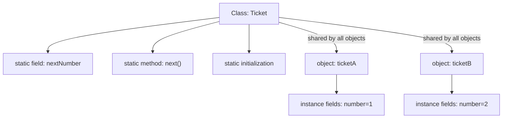
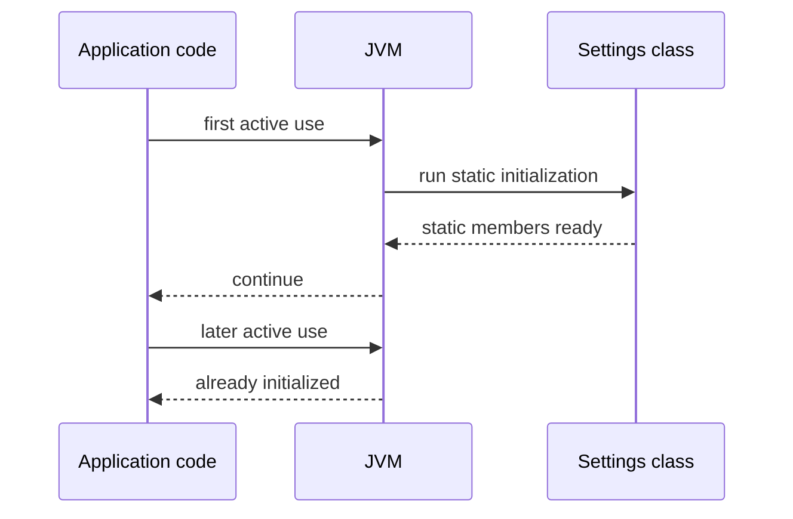

# static in Java

`static` means that a member belongs to the class itself, not to a particular object. If `Ticket.nextNumber` is static, there is one `nextNumber` for the `Ticket` class; if `ticketA.number` is an instance field, each ticket object has its own value. Think of a post office: the branch has one public queue counter on the wall, while every parcel has its own tracking label.

This sits close to the mental model from [what a variable stores](topic:variable-storage) and [JVM memory areas](topic:jvm-memory-areas): object state is per object, while static state is associated with the loaded class and its class loader. In a kitchen analogy, every order ticket has its own notes, but the kitchen has one shared opening checklist and one shared clock.

## Where static can be used

You can use `static` on fields, methods, initialization blocks, and nested classes. Interfaces can also declare `static` methods, and interface fields are implicitly `public static final`. A `static import` lets you refer to a static member without repeating its class name. It is like putting a frequently used kitchen tool on the common counter: everyone can reach it by name, but it still belongs to the shared kitchen setup.

You cannot make a local variable, constructor, or top-level class `static`. The phrase "static class" in Java means a static nested class, not a top-level class. In a post office analogy, you can have a shared branch notice board, but you cannot make a single package's handwritten note belong to the whole branch just by wishing it.

## Class initialization

Java initializes a class on first active use: for example `new SomeClass()`, calling a static method, reading or writing a non-constant static field, or reflective access that triggers initialization. Static field initializers and `static { ... }` blocks run in textual order, once per class loader. The JVM also synchronizes class initialization, so two threads do not run the same static initializer twice. This is like opening a shop: the first worker unlocks the door and runs the opening checklist once; later workers use the already opened shop.

## Static fields

A static field is shared by all code that sees that loaded class. This is useful for constants, caches, counters, registries, or configuration handles, but mutable static fields are global state. If several threads write them, you need the same discipline as with any shared data; otherwise you get the problems covered in [Java multithreading](topic:java-multithreading) and [race condition avoidance](topic:race-condition-avoidance). In a restaurant analogy, one shared whiteboard is useful, but if several cooks erase it at the same time, orders get lost.

Static references can also keep objects alive as long as the class loader is alive. A large object stored in a static collection can become an accidental memory leak. That is like leaving boxes in the post office's permanent storage room: they will not disappear just because one clerk finished their shift.

## Static methods

A static method is selected through the class and has no `this` or `super`. It can use parameters, local variables, and static members directly. If it needs object state, you must pass an object or create one and access instance members through that reference. In a kitchen analogy, a printed conversion chart can convert grams to ounces without knowing which chef is holding it; if it needs a specific chef's station, you must point to that station explicitly.

Static methods are hidden, not overridden polymorphically. If a subclass declares a static method with the same signature, the method chosen depends on the reference type at compile time. Compare this with real instance overriding in [overriding vs overloading](topic:override-vs-overload). In post office terms, two branches can have signs with the same label, but the route printed on your form decides which branch sign you read.

## static final constants

`static final` often means a class-level constant. If the value is a compile-time constant of a primitive or `String`, Java clients may inline it into their bytecode, and reading it may not initialize the declaring class. If you change such a public constant in a library, old clients may keep the old value until they are recompiled. This is like printing a delivery fee on thousands of paper forms: changing the master board does not update forms already printed.

## Static nested classes

A static nested class is declared inside another class for grouping, but it does not hold an implicit reference to an outer object. A non-static inner class does hold such an outer reference. This is like a recipe card filed inside the bakery's folder: the card is organized under the bakery name, but it is not attached to one specific cake order.

## 60-second interview answer

`static` means "belongs to the class, not to an object." It can be used for fields, methods, initialization blocks, nested classes, interface static methods, and via `static import`. A static field has one value per loaded class, shared by all instances. A static method has no `this`, so it cannot directly access instance fields or instance methods; it must work with parameters, static members, or an explicit object reference. Static initialization runs once per class loader on first active use. `static final` compile-time constants may be inlined. Mutable static state is effectively global state, so it needs care with testing, lifecycle, memory, and thread safety.

## Production relevance

Use `static final` for true constants and small stateless utility methods when that keeps the code simpler. For application state, prefer dependency-injected objects or explicit ownership instead of mutable static fields. It is like assigning a kitchen manager for inventory instead of letting anyone scribble stock changes on a public napkin.

Static is also the basis of common patterns such as a thread-safe singleton, but the details matter; see [thread-safe singleton](topic:singleton-thread-safe). A static holder can be elegant, while a mutable global cache can become a testing and deployment headache. In real-world terms, a locked shared cabinet is useful; an unlocked pile of shared keys is not.

## Common misconceptions

- "`static` means stored on the stack." No. Stack frames are for method calls and local variables; static state is tied to the class, not the call stack. The stack is the clerk's current form; static state is the branch notice board.
- "A static method can use any field of the class." It can directly use only static members. Instance fields require an object. The common kitchen scale can weigh ingredients, but it cannot read a specific order ticket unless you hand it that ticket.
- "Static fields are per object." They are per loaded class. Every object sees the same static field. One traffic light controls the intersection; each car does not get its own copy.
- "`static final` is always a runtime constant lookup." Compile-time primitive and `String` constants can be inlined. A printed menu price may already be copied onto customer flyers.
- "Static methods are overridden." They are hidden. Instance methods participate in polymorphism; static methods are selected by compile-time type. The address printed on the envelope decides which post office counter to use.
- "Static is always bad." Static constants and stateless helpers are normal. The risk is mutable shared state with unclear ownership, like a shared kitchen board that nobody is responsible for maintaining.
