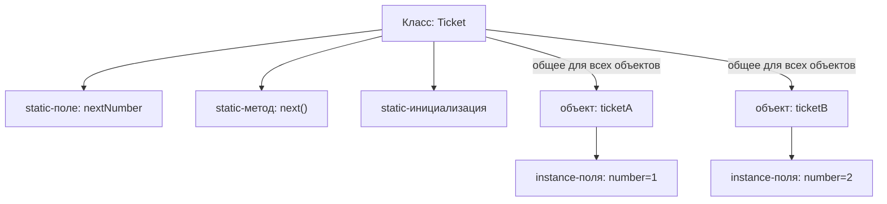
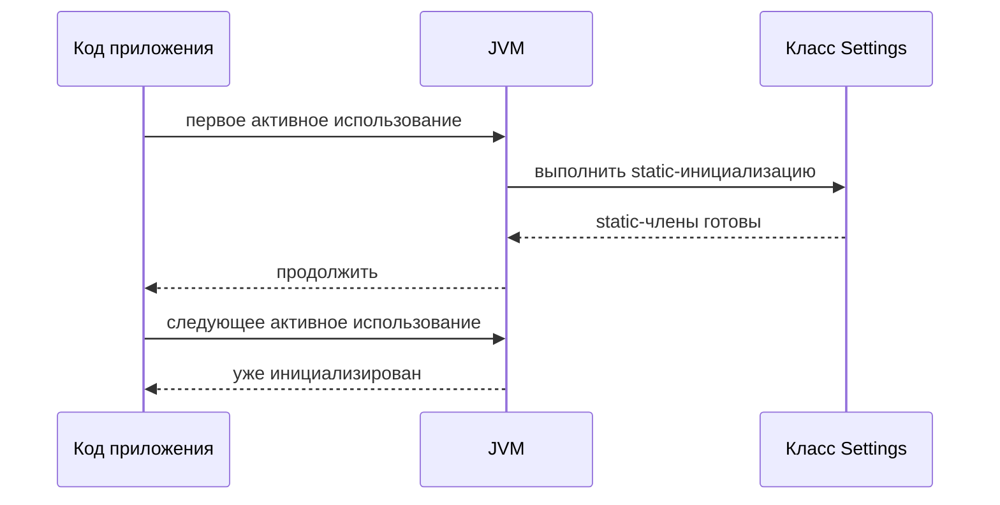

# static в Java

`static` означает, что член принадлежит самому классу, а не конкретному объекту. Если `Ticket.nextNumber` static, то для класса `Ticket` есть один `nextNumber`; если `ticketA.number` - instance-поле, у каждого объекта билета своё значение. Представь почтовое отделение: у отделения один общий номер очереди на стене, а у каждой посылки своя наклейка с трек-номером.

Это связано с моделью из темы [что хранит переменная](topic:variable-storage) и [областями памяти JVM](topic:jvm-memory-areas): состояние объекта относится к объекту, а static-состояние связано с загруженным классом и его class loader. В кухонной аналогии у каждого заказа свои заметки, но у кухни один общий чек-лист открытия и одни общие часы.

## Где можно использовать static

`static` можно использовать у полей, методов, блоков инициализации и вложенных классов. Интерфейсы тоже могут объявлять `static` методы, а поля интерфейса неявно являются `public static final`. `static import` позволяет обращаться к static-члену без повторения имени класса. Это похоже на часто используемый кухонный инструмент на общем столе: все могут взять его по имени, но он всё равно относится к общей кухонной зоне.

Нельзя сделать `static` локальную переменную, конструктор или top-level class. Фраза "static class" в Java означает static nested class, а не класс верхнего уровня. В аналогии с почтой можно иметь общую доску объявлений отделения, но нельзя сделать рукописную заметку на одной посылке общей для всего отделения просто по желанию.

## Инициализация класса

Java инициализирует класс при первом активном использовании: например, `new SomeClass()`, вызов static-метода, чтение или запись неконстантного static-поля либо reflective access, который запускает инициализацию. Инициализаторы static-полей и блоки `static { ... }` выполняются в текстовом порядке, один раз на class loader. JVM также синхронизирует инициализацию класса, поэтому два потока не выполнят один и тот же static-инициализатор дважды. Это похоже на открытие магазина: первый сотрудник отпирает дверь и один раз выполняет чек-лист открытия; остальные работают уже в открытом магазине.

## Static-поля

Static-поле общее для всего кода, который видит этот загруженный класс. Это полезно для констант, кэшей, счётчиков, реестров или ссылок на конфигурацию, но изменяемые static-поля - это глобальное состояние. Если несколько потоков пишут в них, нужна та же дисциплина, что и с любыми общими данными; иначе появятся проблемы из тем [Java multithreading](topic:java-multithreading) и [race condition avoidance](topic:race-condition-avoidance). В ресторанной аналогии одна общая доска полезна, но если несколько поваров одновременно стирают на ней записи, заказы теряются.

Static-ссылки также могут удерживать объекты живыми, пока жив class loader. Большой объект в static-коллекции может стать случайной утечкой памяти. Это похоже на коробки в постоянной кладовой почтового отделения: они не исчезнут только потому, что один сотрудник закончил смену.

## Static-методы

Static-метод выбирается через класс и не имеет `this` или `super`. Он может напрямую использовать параметры, локальные переменные и static-члены. Если ему нужно состояние объекта, объект нужно передать или создать и обращаться к instance-членам через эту ссылку. В кухонной аналогии печатная таблица мер может перевести граммы в унции, не зная, какой повар её держит; если нужна конкретная рабочая станция повара, на неё нужно указать явно.

Static-методы скрываются, а не переопределяются полиморфно. Если подкласс объявляет static-метод с такой же сигнатурой, выбранный метод зависит от типа ссылки на этапе компиляции. Сравни это с настоящим instance-переопределением в теме [overriding vs overloading](topic:override-vs-overload). В терминах почты у двух отделений могут быть таблички с одинаковым названием, но маршрут, напечатанный на бланке, решает, какую табличку ты читаешь.

## static final константы

`static final` часто означает константу уровня класса. Если значение является compile-time constant примитивного типа или `String`, Java-клиенты могут встроить его в свой bytecode, и чтение такого значения может не инициализировать объявляющий класс. Если изменить такую public-константу в библиотеке, старые клиенты могут сохранить старое значение, пока их не пересоберут. Это как напечатать стоимость доставки на тысячах бумажных бланков: изменение главной доски не обновит уже распечатанные бланки.

## Static nested classes

Static nested class объявлен внутри другого класса для группировки, но не хранит неявную ссылку на внешний объект. Нестатический inner class такую ссылку хранит. Это похоже на карточку рецепта в папке пекарни: карточка организована под именем пекарни, но не привязана к одному конкретному заказу торта.

## Ответ за 60 секунд

`static` означает "принадлежит классу, а не объекту". Его можно использовать для полей, методов, блоков инициализации, вложенных классов, static-методов интерфейсов и через `static import`. Static-поле имеет одно значение на загруженный класс и разделяется всеми экземплярами. Static-метод не имеет `this`, поэтому не может напрямую обращаться к instance-полям или instance-методам; он работает с параметрами, static-членами или явно переданной ссылкой на объект. Static-инициализация выполняется один раз на class loader при первом активном использовании. `static final` константы времени компиляции могут быть встроены. Изменяемое static-состояние фактически является глобальным состоянием, поэтому с ним нужно аккуратно обращаться в тестах, lifecycle, памяти и многопоточности.

## Зачем это в production

Используй `static final` для настоящих констант и небольшие stateless utility-методы, когда это делает код проще. Для состояния приложения чаще лучше использовать dependency-injected объекты или явное владение, а не изменяемые static-поля. Это как назначить ответственного за склад кухни вместо того, чтобы разрешить всем записывать остатки на общей салфетке.

Static также лежит в основе распространённых подходов вроде thread-safe singleton, но детали важны; смотри [thread-safe singleton](topic:singleton-thread-safe). Static holder может быть аккуратным решением, а изменяемый глобальный cache - головной болью для тестирования и деплоя. В реальности закрытый общий шкаф полезен; незакрытая куча общих ключей - нет.

## Частые заблуждения

- "`static` значит, что хранится на стеке." Нет. Stack frames нужны для вызовов методов и локальных переменных; static-состояние связано с классом, а не со стеком вызовов. Стек - это текущий бланк сотрудника, static-состояние - доска объявлений отделения.
- "Static-метод может использовать любое поле класса." Напрямую он может использовать только static-члены. Для instance-полей нужен объект. Общие кухонные весы могут взвесить ингредиенты, но не прочитают конкретный заказ, если ты не передашь им этот заказ.
- "Static-поля есть у каждого объекта." Они есть у загруженного класса. Все объекты видят одно и то же static-поле. Один светофор управляет перекрёстком; каждая машина не получает свою копию.
- "`static final` всегда читается как runtime-константа." Compile-time constants с примитивами и `String` могут быть встроены. Цена из распечатанного меню уже могла попасть на листовки клиентов.
- "Static-методы переопределяются." Они скрываются. Instance-методы участвуют в полиморфизме; static-методы выбираются по compile-time type. Адрес, напечатанный на конверте, решает, к какому почтовому окну идти.
- "Static всегда плох." Static-константы и stateless helpers нормальны. Риск создаёт изменяемое общее состояние с неясным владельцем, как общая кухонная доска, за которую никто не отвечает.
