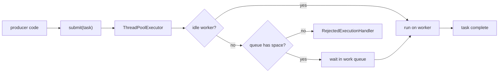
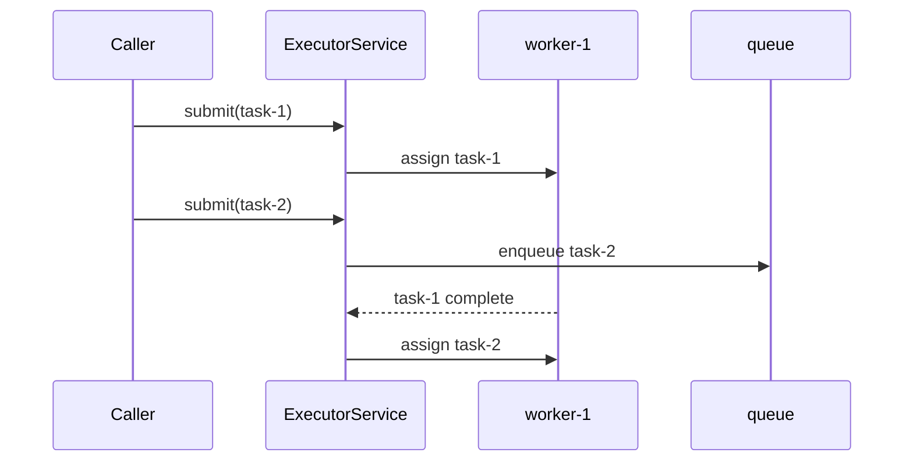

# Java Thread Pool

A **Thread Pool** is a managed group of reusable worker threads. Instead of
creating a fresh `Thread` for every unit of work, you submit tasks to an
`ExecutorService`; idle workers take tasks, busy pools queue accepted tasks, and
overloaded pools can reject extra work. Think of a kitchen with a fixed team of
cooks: new orders go to available cooks, wait on the rail, or are refused when
the kitchen is already full.

If you need the basic contrast with manually creating threads, see
[Thread vs ThreadPool](topic:thread-vs-threadpool). If you need the lower-level
building blocks, start with [Thread vs Runnable](topic:thread-vs-runnable) and
[Java Multithreading](topic:java-multithreading).

## The Mental Model

A pool has three practical parts: **workers**, a **work queue**, and a **rejection
policy**. Workers are the cooks; they execute tasks. The queue is the order rail;
it holds accepted work while every cook is busy. The rejection policy is the
front desk rule for what happens when the rail is full.

In Java, you usually interact through `ExecutorService`, while
`ThreadPoolExecutor` is the configurable implementation. `Executors.newFixedThreadPool(n)`
is convenient, but interviewers often expect you to know what it hides. It uses a
fixed number of workers and an unbounded queue, which can protect threads but can
still let memory grow if producers submit faster than workers finish. That is
like a post office with a fixed number of clerks but an endless lobby: the clerks
do not multiply, but the waiting crowd can still become the problem.

A bounded queue gives the system **backpressure**. Once workers and queue slots
are full, the pool rejects or handles the task according to its
`RejectedExecutionHandler`. In production, that rejection is often better than
silently accepting unlimited latency and memory pressure. It is like a restaurant
that stops seating guests when the kitchen is saturated instead of promising
dinner to everyone and collapsing.

## What It Is Used For

Thread pools are used to run many independent tasks without creating unbounded
threads: handling web requests, processing messages, sending notifications,
running background jobs, parallelizing I/O waits, and isolating slow work from a
main request thread. It is the same idea as a delivery depot: packages arrive all
day, but the depot controls how many drivers are on the road.

They are especially useful when work arrives repeatedly and each task is short or
moderate. Creating a Java thread has memory and scheduling cost; reusing workers
keeps that cost stable. It is like reusing the same checkout lanes instead of
building a new register for every customer.

Thread pools do **not** make the task code automatically safe. If several tasks
mutate shared state, you still need synchronization, thread-safe collections, or
another concurrency design. See [Critical Section](topic:critical-section) and
[Concurrent vs Synchronized Collections](topic:concurrent-synchronized-collections).
The pool is the kitchen staff schedule; it does not stop two cooks from grabbing
the same pan unless the kitchen has rules for shared tools.

## Sizing The Pool

For CPU-bound work, start near the number of available CPU cores because extra
threads mostly compete for the same cores. In a kitchen analogy, adding more
cooks than stove burners does not cook more soup; it adds bumping and waiting.

For I/O-bound work, a larger pool can make sense because many threads spend time
waiting for network, disk, or another service. That is like postal clerks waiting
for a slow label printer: while one clerk waits, another can serve the next
customer. The right number still depends on latency, downstream limits, memory,
and measurements.

Avoid one global pool for everything. Separate CPU-heavy work, blocking I/O, and
low-priority background tasks when they can hurt each other. A bakery does not
make wedding cakes, dishwashing, and front-counter service fight for one tiny
line.

## Shutdown

Always shut down pools you own. `shutdown()` stops accepting new tasks and lets
already accepted tasks finish. `shutdownNow()` attempts to interrupt running work
and returns tasks that never started. That is the difference between closing a
restaurant after the current tables finish and turning the lights on immediately
while meals are still in progress.

In application servers and Spring, many executors are lifecycle-managed for you,
but custom executors still need a lifecycle owner. If you forget, non-daemon
worker threads can keep the JVM alive or keep resources open.

## 60-Second Interview Answer

A Thread Pool in Java is a set of reusable worker threads managed through APIs
such as `ExecutorService` and `ThreadPoolExecutor`. Instead of creating a new
`Thread` for every task, you submit tasks to the pool. If a worker is idle, it
runs the task; if all workers are busy, accepted tasks wait in a queue; if the
pool and queue are saturated, a rejection policy decides what happens. We use
pools to limit concurrency, reduce thread creation cost, improve throughput for
many small tasks, and protect the system from overload. Important details are
pool size, queue bounds, rejection policy, shutdown, and the fact that a pool
does not remove the need for thread-safe task code.

## Common Misconceptions

- **"More threads always means faster."** Not for CPU-bound work. Too many
  threads create context switching and contention, like too many cooks around one
  stove.
- **"A pool prevents overload by itself."** Only if its size, queue, and rejection
  policy are chosen intentionally. An unbounded queue can hide overload until
  memory or latency fails, like an endless waiting room.
- **"ExecutorService means no shared-state bugs."** Tasks still run concurrently.
  Shared mutable data still needs protection.
- **"shutdown() kills running tasks."** `shutdown()` is graceful: it stops new
  submissions and lets accepted work finish. `shutdownNow()` is the more abrupt
  interrupt attempt.
- **"Thread pools are only for web servers."** They are useful anywhere repeated
  asynchronous or parallel work needs controlled concurrency.
