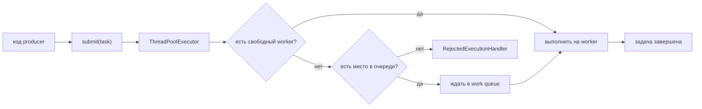
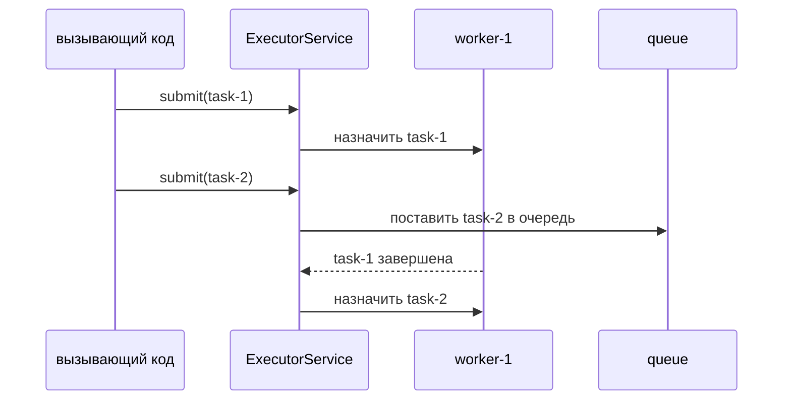

# Пул потоков в Java

**Thread Pool** — это управляемая группа переиспользуемых worker threads. Вместо
создания нового `Thread` для каждой единицы работы ты отправляешь задачи в
`ExecutorService`; свободные workers берут задачи, занятые pools ставят принятые
задачи в очередь, а перегруженные pools могут отклонять лишнюю работу. Представь
кухню с фиксированной командой поваров: новые заказы идут свободным поварам,
ждут на рейке или не принимаются, когда кухня уже заполнена.

Если нужен базовый контраст с ручным созданием threads, смотри
[Thread vs ThreadPool](topic:thread-vs-threadpool). Если нужны более низкоуровневые
кирпичики, начни с [Thread vs Runnable](topic:thread-vs-runnable) и
[Java Multithreading](topic:java-multithreading).

## Ментальная модель

У pool есть три практические части: **workers**, **work queue** и **rejection
policy**. Workers — это повара; они выполняют задачи. Очередь — рейка с заказами;
она держит принятую работу, пока все повара заняты. Rejection policy — правило на
стойке приема: что делать, когда рейка заполнена.

В Java обычно работают через `ExecutorService`, а `ThreadPoolExecutor` является
настраиваемой реализацией. `Executors.newFixedThreadPool(n)` удобен, но на
собеседовании часто ждут понимания того, что он скрывает. Он использует
фиксированное число workers и неограниченную очередь: это защищает от роста числа
threads, но память все равно может расти, если producers отправляют задачи
быстрее, чем workers их завершают. Это как почта с фиксированным числом
операторов и бесконечным залом ожидания: операторы не размножаются, но очередь
людей все равно может стать проблемой.

Ограниченная очередь дает системе **backpressure**. Когда workers и места в
очереди заполнены, pool отклоняет или обрабатывает задачу по своему
`RejectedExecutionHandler`. В production такое отклонение часто лучше, чем
тихо принимать бесконечную задержку и давление на память. Это как ресторан,
который прекращает рассаживать гостей, когда кухня перегружена, вместо обещания
ужина всем подряд и последующего обвала.

## Для чего используется

Thread pools используют, чтобы выполнять много независимых задач без
неограниченного создания threads: обработка web requests, обработка сообщений,
отправка уведомлений, фоновые jobs, параллельное ожидание I/O и изоляция
медленной работы от основного request thread. Это та же идея, что у
доставочного склада: посылки приходят весь день, но склад контролирует, сколько
водителей одновременно в пути.

Они особенно полезны, когда работа приходит регулярно, а каждая задача короткая
или средняя по длительности. Создание Java thread стоит памяти и работы
планировщика; переиспользование workers удерживает эту цену стабильной. Это как
переиспользовать одни и те же кассы вместо строительства новой кассы для каждого
покупателя.

Thread pools **не** делают код задачи автоматически безопасным. Если несколько
задач изменяют общее состояние, все еще нужны synchronization,
thread-safe collections или другой concurrency-дизайн. Смотри
[Critical Section](topic:critical-section) и
[Concurrent vs Synchronized Collections](topic:concurrent-synchronized-collections).
Pool — это расписание персонала кухни; оно не мешает двум поварам схватить одну
и ту же сковородку, если на кухне нет правил для общих инструментов.

## Размер pool

Для CPU-bound работы начинай примерно с числа доступных CPU cores, потому что
лишние threads в основном конкурируют за те же cores. В кухонной аналогии
добавление поваров сверх числа конфорок не варит больше супа; оно добавляет
толкотню и ожидание.

Для I/O-bound работы больший pool может быть оправдан, потому что многие threads
часть времени ждут сеть, диск или другой сервис. Это как операторы на почте,
которые ждут медленный принтер этикеток: пока один оператор ждет, другой может
обслужить следующего клиента. Правильное число все равно зависит от latency,
ограничений downstream-систем, памяти и измерений.

Избегай одного глобального pool на все. Разделяй CPU-heavy работу, blocking I/O
и низкоприоритетные фоновые задачи, когда они могут вредить друг другу. Пекарня
не заставляет свадебные торты, мойку посуды и обслуживание стойки бороться за
одну маленькую очередь.

## Shutdown

Всегда останавливай pools, которыми владеешь. `shutdown()` прекращает прием новых
задач и дает уже принятым задачам завершиться. `shutdownNow()` пытается прервать
выполняющуюся работу и возвращает задачи, которые не успели стартовать. Это
разница между закрытием ресторана после завершения текущих столиков и мгновенным
включением света, пока блюда еще готовятся.

В application servers и Spring многие executors управляются жизненным циклом
автоматически, но custom executors все равно должны иметь владельца жизненного
цикла. Если забыть, non-daemon worker threads могут удерживать JVM живой или
держать ресурсы открытыми.

## Ответ за 60 секунд

Thread Pool в Java — это набор переиспользуемых worker threads, управляемый через
API вроде `ExecutorService` и `ThreadPoolExecutor`. Вместо создания нового
`Thread` для каждой задачи ты отправляешь задачи в pool. Если worker свободен,
он выполняет задачу; если все workers заняты, принятые задачи ждут в очереди;
если pool и очередь заполнены, rejection policy решает, что делать. Pools нужны,
чтобы ограничивать concurrency, уменьшать стоимость создания threads, повышать
throughput для множества небольших задач и защищать систему от перегрузки. Важные
детали — размер pool, границы очереди, rejection policy, shutdown и то, что pool
не отменяет необходимость писать thread-safe код задач.

## Частые заблуждения

- **«Больше threads всегда быстрее».** Не для CPU-bound работы. Слишком много
  threads создают context switching и contention, как слишком много поваров у
  одной плиты.
- **«Pool сам предотвращает перегрузку».** Только если размер, очередь и
  rejection policy выбраны осознанно. Неограниченная очередь может скрывать
  перегрузку до отказа по памяти или latency, как бесконечный зал ожидания.
- **«ExecutorService значит, что ошибок общего состояния нет».** Задачи все еще
  выполняются конкурентно. Общее изменяемое состояние все еще требует защиты.
- **«shutdown() убивает выполняющиеся задачи».** `shutdown()` работает мягко: он
  запрещает новые отправки и дает принятой работе завершиться. `shutdownNow()` —
  более резкая попытка interrupt.
- **«Thread pools нужны только web servers».** Они полезны везде, где повторяющаяся
  асинхронная или параллельная работа требует контролируемой concurrency.
