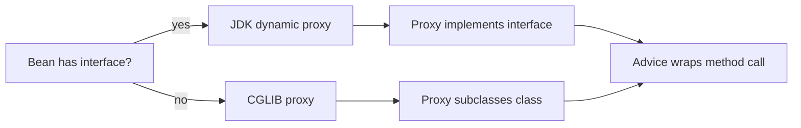

# JDK Dynamic Proxy vs CGLIB Proxy

[Spring AOP](topic:spring-aop-basics) needs a proxy object in front of the real
bean. The proxy is the place where advice, [transactions](topic:spring-transactional-proxy),
logging, caching, and metrics can run before or after the real method. Post office analogy: the counter clerk stands between
the customer and the sorting room, so the clerk can stamp and route the parcel.

## The two proxy styles

A JDK dynamic proxy is interface-based. If a bean implements an interface, Spring
can create a new object that implements the same interface and forwards calls to
the target through an `InvocationHandler`. Kitchen analogy: the waiter presents
the same menu as the kitchen, but every order goes through the waiter first.

A CGLIB proxy is class-based. It creates a runtime subclass of the target class
and overrides eligible methods so advice can run around the call. Traffic
analogy: the proxy builds a controlled lane that looks like the original road,
then places a checkpoint in that lane.

## Choosing the proxy

In plain Spring AOP, if an interface is available, a JDK dynamic proxy is the
traditional default. If there is no interface, Spring must use a class-based
CGLIB proxy. Spring Boot commonly enables class-based proxies by default, so many
Boot apps use CGLIB even when interfaces exist. Post office analogy: one branch
prefers paper forms, another branch prefers scanners, but both still process the
parcel at the counter.

`proxyTargetClass=true` forces class-based proxying. This can be useful when code
injects the concrete class rather than an interface, but it also brings CGLIB's
subclassing limits. Kitchen analogy: asking for a custom serving lane can help
one workflow, but that lane still has to fit the kitchen layout.

## Limitations

JDK dynamic proxies expose interface methods. If client code needs to call
methods that are only on the concrete class, an interface proxy will not provide
those methods. Traffic analogy: the public road signs only show official exits,
not every maintenance door inside the depot.

CGLIB proxies cannot subclass a `final` class and cannot override a `final`
method. A final method therefore cannot be advised by a subclass proxy. This is
one reason Kotlin classes often need Spring's `all-open` plugin when used with
proxy-based Spring features. Post office analogy: a sealed room cannot become a
counter lane, and a locked hatch cannot be replaced by the clerk.

Both proxy styles share the same core boundary: advice runs when the call enters
through the proxy. Private methods, static methods, constructor calls, and
[self-invocation](topic:spring-transactional-self-invocation) are not fixed just
by switching from JDK proxy to CGLIB. Kitchen
analogy: changing the style of the serving pass does not help a dish that never
reaches the pass.

## 60-second interview answer

> Spring AOP usually works by putting a proxy in front of a bean. A JDK dynamic
> proxy is interface-based: it creates an object that implements the same
> interface and delegates through an `InvocationHandler`. A CGLIB proxy is
> class-based: it creates a subclass and overrides methods to insert advice.
> Spring can use JDK proxies when there is an interface; CGLIB is needed when
> proxying a concrete class, and Spring Boot often uses CGLIB by default. The
> trade-off is that JDK proxies expose interface methods only, while CGLIB cannot
> proxy final classes or final methods because subclassing and overriding are
> required. In both cases, calls still need to go through the proxy.

## Common misconceptions

- "CGLIB is always better." No. It is useful for class-based proxying, but it has
  subclassing limits and does not remove proxy-boundary behavior.
- "JDK proxies wrap the concrete class." No. They implement interfaces and route
  interface calls through an invocation handler.
- "A final method can still be advised because the annotation is visible." No.
  CGLIB cannot override the method, so it cannot insert advice there.
- "Switching proxy type fixes self-invocation." No. An internal `this.method()`
  call still bypasses the proxy.
