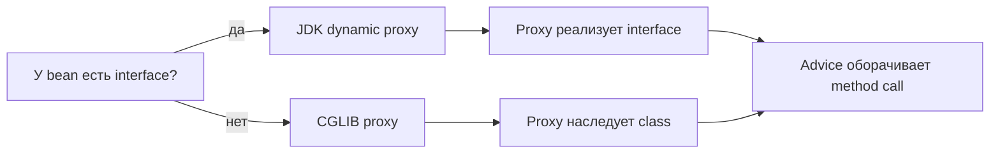

# JDK Dynamic Proxy и CGLIB Proxy

[Spring AOP](topic:spring-aop-basics) нужен proxy object перед настоящим bean.
Proxy — это место, где advice, [transactions](topic:spring-transactional-proxy),
logging, caching и metrics могут выполниться до или после реального method. Почтовая аналогия: сотрудник за стойкой стоит между клиентом и
сортировочной комнатой, поэтому может поставить штамп и направить посылку.

## Два вида proxy

JDK dynamic proxy основан на interface. Если bean реализует interface, Spring
может создать новый объект, который реализует тот же interface и передаёт вызовы
target через `InvocationHandler`. Кухонная аналогия: официант показывает то же
меню, что и кухня, но каждый заказ сначала проходит через официанта.

CGLIB proxy основан на class. Он создаёт runtime subclass target class и
переопределяет подходящие методы, чтобы advice мог выполниться вокруг вызова.
Дорожная аналогия: proxy строит контролируемую полосу, похожую на исходную
дорогу, и ставит на ней checkpoint.

## Как выбирается proxy

В обычном Spring AOP, если есть interface, традиционный default — JDK dynamic
proxy. Если interface нет, Spring должен использовать class-based CGLIB proxy.
Spring Boot часто включает class-based proxies по умолчанию, поэтому многие Boot
apps используют CGLIB даже при наличии interfaces. Почтовая аналогия: один
филиал предпочитает бумажные бланки, другой — сканеры, но оба всё равно
обрабатывают посылку у стойки.

`proxyTargetClass=true` принудительно включает class-based proxying. Это может
помочь, когда код inject конкретный class, а не interface, но вместе с этим
приходят ограничения subclassing у CGLIB. Кухонная аналогия: отдельная полоса
раздачи может помочь одному процессу, но она всё равно должна вписываться в
планировку кухни.

## Ограничения

JDK dynamic proxies показывают interface methods. Если клиентскому коду нужно
вызывать методы, которые есть только в concrete class, interface proxy таких
методов не даст. Дорожная аналогия: публичные дорожные указатели показывают
официальные выезды, а не каждую служебную дверь внутри склада.

CGLIB proxies не могут наследовать `final` class и не могут переопределить
`final` method. Поэтому final method не может получить advice через subclass
proxy. Это одна из причин, почему Kotlin classes со Spring часто используют
plugin `all-open` для proxy-based Spring features. Почтовая аналогия:
запечатанную комнату нельзя превратить в стойку, а закрытый люк нельзя заменить
сотрудником.

У обоих видов proxy есть одна общая граница: advice выполняется, когда вызов
входит через proxy. Private methods, static methods, constructor calls и
[self-invocation](topic:spring-transactional-self-invocation) не исправляются
простым переключением с JDK proxy на CGLIB.
Кухонная аналогия: смена вида раздачи не поможет блюду, которое вообще не дошло
до раздачи.

## Ответ за 60 секунд

> Spring AOP обычно работает через proxy перед bean. JDK dynamic proxy основан
> на interface: он создаёт объект, который реализует тот же interface и
> делегирует вызовы через `InvocationHandler`. CGLIB proxy основан на class: он
> создаёт subclass и переопределяет методы, чтобы вставить advice. Spring может
> использовать JDK proxies, когда есть interface; CGLIB нужен для проксирования
> concrete class, и Spring Boot часто использует CGLIB по умолчанию. Компромисс в
> том, что JDK proxies показывают только interface methods, а CGLIB не может
> проксировать final classes или final methods, потому что ему нужны наследование
> и переопределение. В обоих случаях вызов всё равно должен идти через proxy.

## Частые заблуждения

- "CGLIB всегда лучше." Нет. Он полезен для class-based proxying, но имеет
  ограничения subclassing и не отменяет proxy-boundary behavior.
- "JDK proxies оборачивают concrete class." Нет. Они реализуют interfaces и
  направляют interface calls через invocation handler.
- "Final method всё равно получит advice, потому что annotation видна." Нет.
  CGLIB не может переопределить method, поэтому не может вставить туда advice.
- "Переключение proxy type исправляет self-invocation." Нет. Внутренний вызов
  `this.method()` всё равно обходит proxy.
