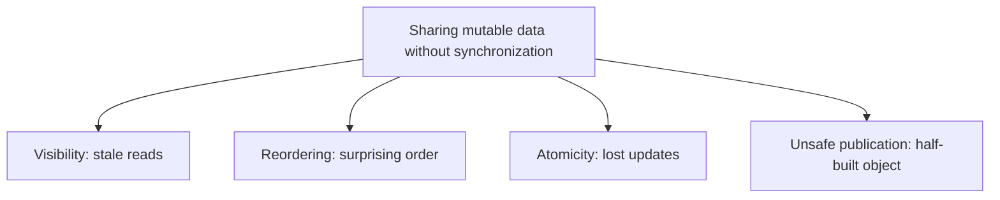
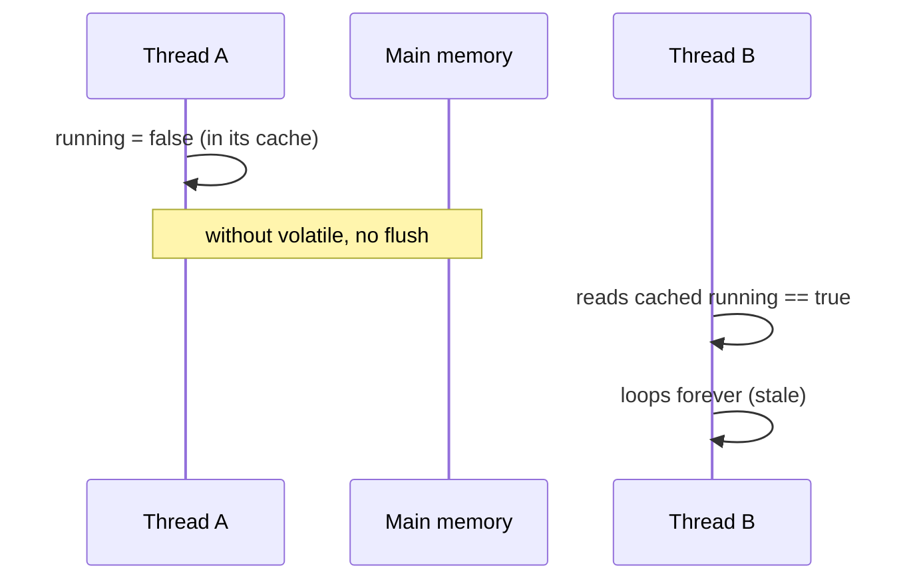

# Problems in the Java Memory Model

The **Java Memory Model (JMM)** is the rulebook that says what one thread is
*guaranteed* to see of what another thread did. Without it, the compiler, the JIT
and the CPU are all free to cache values in registers, reorder instructions, and
keep per-core copies of memory — because for a single thread none of that is
observable. The trouble starts the moment two threads share **mutable** data.

> Real life: think of an office where every employee keeps a private sticky-note
> copy of the shared whiteboard on their own desk. As long as one person works
> alone, the notes and the board agree. The chaos begins when several people edit
> the same board and trust their own stale sticky notes instead of walking over to
> read it.

Four classic problems come out of this. They are different bugs, but they all
trace back to "I shared data without telling the JMM to synchronize."

## 1. Visibility — stale reads

A write by thread A may simply never become visible to thread B. B can spin on a
`boolean running` flag *forever* even after A set it to `false`, because B reads
its own cached/register copy. There is no automatic "flush to main memory" and no
automatic "refresh from main memory".

> Real life: the manager crosses "shift over, go home" off the master whiteboard,
> but the worker keeps reading the old line from the sticky note on their desk and
> never goes home.

The fix is to create a [happens-before](topic:happens-before) edge: declare the
flag [volatile](topic:volatile), or guard the data with a lock /
[synchronized](topic:wait-notify-synchronized). Both force the writer's changes to
be published and the reader to re-read.

## 2. Reordering — the order you wrote is not the order that runs

To go faster, the compiler and CPU can reorder independent instructions. Within
one thread the result is identical (the *as-if-serial* rule), but another thread
can observe the writes in a different order. The classic symptom: a `data` field
looks empty even though a `ready` flag is already `true`, because the two writes
were reordered.

> Real life: a chef told to "boil the pasta, then set the table" may set the table
> first if the kitchen is faster that way. Eating alone, you never notice. A guest
> who walks in mid-prep can see the table set but no pasta yet.

The cure is again a happens-before relationship: writing a `volatile` flag *after*
the data publishes everything written before it, and reading that flag makes those
writes visible.

## 3. Atomicity — read-modify-write is three steps, not one

`count++` is not one operation; it is *read, add one, write back*. Two threads can
both read `5`, both compute `6`, and both write `6` — one increment is lost. This
is the textbook [race condition](topic:race-condition-avoidance), and `volatile`
does **not** fix it — `volatile` gives visibility, not atomicity.

> Real life: two clerks both read "stock: 5" off the board, both sell one item,
> both write "stock: 4". Two items left the shelf but the board says only one did.

The fixes are mutual exclusion ([synchronized](topic:critical-section) / a
[Lock](topic:lock-alternatives)) so only one thread does the read-modify-write at a
time, or a lock-free atomic via [compare-and-set](topic:compare-and-set) /
`AtomicInteger`. See also [thread-safe addition](topic:thread-safe-addition). A
related low-level wrinkle: a non-`volatile` `long`/`double` write is allowed to
happen as two 32-bit halves, so a reader can see a torn value — making it
`volatile` (or guarded) makes the 64-bit write atomic.

## 4. Unsafe publication — sharing a half-built object

Even a correctly built object can be seen *partially constructed* by another
thread if the reference is published through a data race. The reader may see the
reference but not yet the field values written in the constructor. This is exactly
why the double-checked-locking [singleton](topic:singleton-thread-safe) needs a
`volatile` field, and why `final` fields get a special publication guarantee.

> Real life: you hand a customer the keys to a flat that is still being furnished —
> they walk in and find half the rooms empty, even though you "finished" the place
> before handing over the keys.

Safe publication means publishing the reference through a happens-before edge:
`volatile`/`final` fields, a `static` initializer, a concurrent collection, or
proper locking.

## 60-second interview answer

> The JMM defines what writes by one thread are visible to another. Share mutable
> data without synchronization and you hit four problems. **Visibility**: a write
> may never be seen, so a thread spins on a stale flag — fixed with `volatile` or a
> lock. **Reordering**: the compiler/CPU reorder independent instructions, so
> another thread sees writes out of order — fixed by a happens-before edge.
> **Atomicity**: `count++` is read-modify-write, so concurrent increments are lost
> — `volatile` doesn't help; you need `synchronized`/`Lock` or an atomic/CAS.
> **Unsafe publication**: another thread can see a half-constructed object — publish
> via `volatile`/`final`/locks. All four are solved by establishing happens-before,
> which `volatile`, `synchronized`, locks and `Thread.start`/`join` provide.

## Common misconceptions

- ❌ "`volatile` makes `count++` thread-safe." — It only fixes visibility and
  ordering; the read-modify-write is still not atomic. Use an atomic or a lock.
- ❌ "If single-threaded code is correct, multithreaded code is too." — The JMM only
  guarantees as-if-serial behaviour *per thread*; cross-thread you must add
  happens-before.
- ❌ "Reordering is a CPU-only thing." — The compiler and JIT reorder too; it is not
  just hardware.
- ❌ "Reads/writes are always atomic." — A non-`volatile` `long`/`double` may be
  written in two halves and read torn.
- ❌ "Adding `synchronized` somewhere fixes everything." — Visibility and atomicity
  are only guaranteed when *both* the writer and the reader synchronize on the same
  monitor (or use the same `volatile`).
