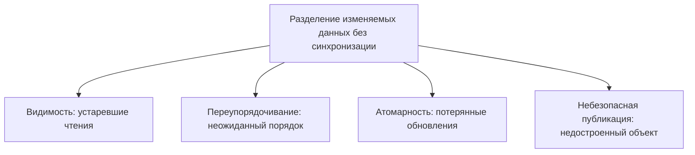
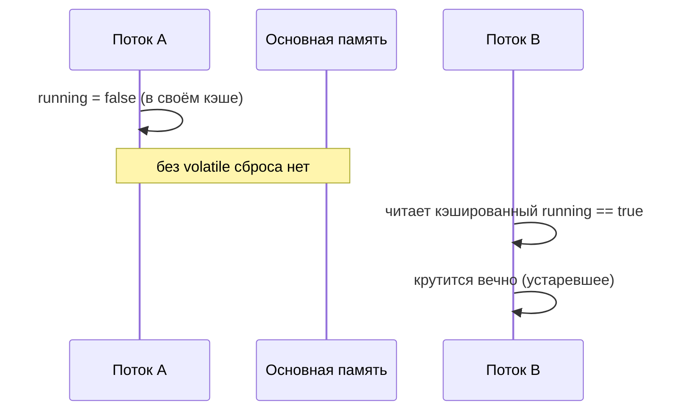

# Проблемы в модели памяти Java

**Модель памяти Java (JMM)** — это свод правил, который говорит, что один поток
*гарантированно* видит из того, что сделал другой. Без неё компилятор, JIT и
процессор вправе кэшировать значения в регистрах, переупорядочивать инструкции и
держать покопийные копии памяти на каждом ядре — ведь для одного потока это
никак не наблюдается. Беда начинается ровно тогда, когда два потока разделяют
**изменяемые** данные.

> Из жизни: представьте офис, где у каждого сотрудника на столе своя личная
> копия общей доски на стикерах. Пока человек работает один, стикеры и доска
> совпадают. Хаос начинается, когда несколько людей правят одну доску и доверяют
> своим устаревшим стикерам вместо того, чтобы подойти и прочитать саму доску.

Из этого вырастают четыре классические проблемы. Это разные баги, но все они
сводятся к одному: «я разделил данные, не сказав JMM синхронизироваться».

## 1. Видимость — устаревшие чтения

Запись потока A может попросту никогда не стать видимой потоку B. B может крутиться
на флаге `boolean running` *вечно*, даже после того как A выставил его в `false`,
потому что B читает свою кэшированную/регистровую копию. Нет автоматического
«сброса в основную память» и нет автоматического «обновления из основной памяти».

> Из жизни: менеджер вычёркивает «смена окончена, по домам» на главной доске, но
> работник продолжает читать старую строку со стикера на своём столе и так и не
> уходит домой.

Лечение — создать ребро [happens-before](topic:happens-before): объявить флаг
[volatile](topic:volatile) или защитить данные блокировкой /
[synchronized](topic:wait-notify-synchronized). И то и другое заставляет изменения
писателя опубликоваться, а читателя — перечитать заново.

## 2. Переупорядочивание — порядок написания не равен порядку выполнения

Ради скорости компилятор и процессор могут переупорядочивать независимые
инструкции. Внутри одного потока результат тот же (правило *as-if-serial*), но
другой поток может увидеть записи в ином порядке. Классический симптом: поле
`data` выглядит пустым, хотя флаг `ready` уже `true`, потому что две записи были
переставлены местами.

> Из жизни: повару сказали «свари пасту, потом накрой стол», но он может сперва
> накрыть стол, если так на кухне быстрее. Ужиная в одиночку, вы этого не
> замечаете. Гость, зашедший в середине готовки, увидит накрытый стол, но пасты
> ещё нет.

Лекарство снова — отношение happens-before: запись `volatile`-флага *после* данных
публикует всё, что было записано до неё, а чтение этого флага делает те записи
видимыми.

## 3. Атомарность — «прочитать-изменить-записать» это три шага, а не один

`count++` — не одна операция, а *прочитать, прибавить единицу, записать обратно*.
Два потока могут оба прочитать `5`, оба вычислить `6` и оба записать `6` — один
инкремент теряется. Это хрестоматийная
[гонка данных](topic:race-condition-avoidance), и `volatile` её **не** чинит —
`volatile` даёт видимость, но не атомарность.

> Из жизни: два продавца читают с доски «остаток: 5», оба продают по одной штуке,
> оба пишут «остаток: 4». С полки ушло два товара, а доска утверждает, что только
> один.

Лечение — взаимное исключение ([synchronized](topic:critical-section) /
[Lock](topic:lock-alternatives)), чтобы «прочитать-изменить-записать» делал лишь
один поток за раз, либо безблокировочная атомарная операция через
[compare-and-set](topic:compare-and-set) / `AtomicInteger`. См. также
[потокобезопасное сложение](topic:thread-safe-addition). Связанная низкоуровневая
тонкость: запись не-`volatile` `long`/`double` вправе происходить двумя
32-битными половинами, поэтому читатель может увидеть «разорванное» значение —
`volatile` (или защита блокировкой) делает 64-битную запись атомарной.

## 4. Небезопасная публикация — передача недостроенного объекта

Даже корректно собранный объект может быть увиден другим потоком *частично
сконструированным*, если ссылка опубликована через гонку данных. Читатель может
увидеть ссылку, но ещё не значения полей, записанных в конструкторе. Именно
поэтому [синглтону](topic:singleton-thread-safe) с двойной проверкой блокировки
нужно `volatile`-поле, и именно поэтому `final`-поля получают особую гарантию
публикации.

> Из жизни: вы вручаете клиенту ключи от квартиры, которую ещё обставляют — он
> заходит и обнаруживает половину комнат пустыми, хотя вы «закончили» жильё перед
> передачей ключей.

Безопасная публикация означает публикацию ссылки через ребро happens-before:
поля `volatile`/`final`, статический инициализатор, конкурентную коллекцию или
корректную блокировку.

## Ответ за 60 секунд

> JMM определяет, какие записи одного потока видны другому. Раздели изменяемые
> данные без синхронизации — получишь четыре проблемы. **Видимость**: запись может
> никогда не стать видимой, и поток крутится на устаревшем флаге — лечится
> `volatile` или блокировкой. **Переупорядочивание**: компилятор/процессор
> переставляют независимые инструкции, и другой поток видит записи не по порядку —
> лечится ребром happens-before. **Атомарность**: `count++` это
> прочитать-изменить-записать, и параллельные инкременты теряются — `volatile` не
> поможет, нужны `synchronized`/`Lock` или атомарная операция/CAS. **Небезопасная
> публикация**: другой поток может увидеть недостроенный объект — публикуй через
> `volatile`/`final`/блокировки. Все четыре решаются установлением happens-before,
> которое дают `volatile`, `synchronized`, блокировки и `Thread.start`/`join`.

## Распространённые заблуждения

- ❌ «`volatile` делает `count++` потокобезопасным.» — Он чинит лишь видимость и
  порядок; «прочитать-изменить-записать» по-прежнему не атомарно. Нужна атомарная
  операция или блокировка.
- ❌ «Если однопоточный код корректен, то и многопоточный тоже.» — JMM гарантирует
  поведение as-if-serial лишь *для одного потока*; между потоками нужно добавлять
  happens-before.
- ❌ «Переупорядочивание — это только про процессор.» — Компилятор и JIT тоже
  переупорядочивают; это не только железо.
- ❌ «Чтения/записи всегда атомарны.» — Не-`volatile` `long`/`double` может быть
  записан двумя половинами и прочитан разорванным.
- ❌ «Добавил где-нибудь `synchronized` — и всё починилось.» — Видимость и
  атомарность гарантированы лишь когда *и* писатель, *и* читатель синхронизируются
  на одном мониторе (или используют один `volatile`).
