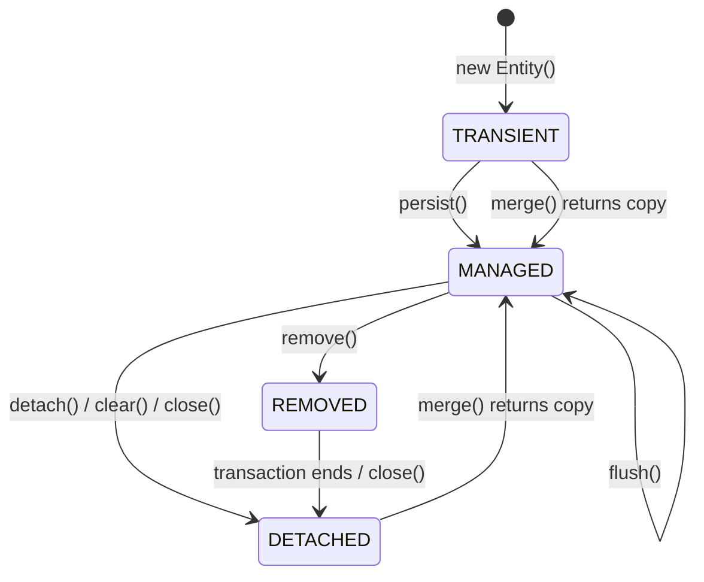
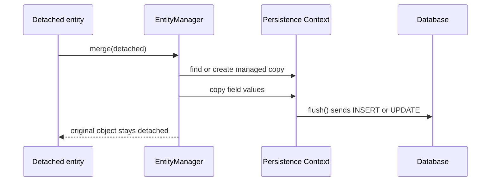

# JPA Entity States

JPA does not care only that an object has an `@Entity` annotation. It also cares
whether that object is currently inside a Persistence Context. Think of the
Persistence Context as a post office service desk: papers on the desk are tracked
and processed; papers in your pocket are just your copies.

The four interview states are:

- `transient`: a normal Java object created with `new`, not known to the
  `EntityManager`. It is like a handwritten delivery note that has not reached
  the post office desk.
- `managed`: an object inside the Persistence Context. JPA tracks it, keeps one
  instance per database identity, and can flush changes. It is like an order
  ticket clipped onto the kitchen rail: the staff can see and update it.
- `detached`: an object that is no longer tracked, often because the
  `EntityManager` was closed, `clear()` was called, or the object crossed a layer
  boundary. It is like taking a photocopy of a form home: you can write on it, but
  the office copy does not change.
- `removed`: a managed object marked for deletion. The row is deleted when JPA
  flushes. It is like a parcel stamped "discard" but still waiting in the outgoing
  tray.

## Main Transitions

`new Entity()` creates a `transient` object. JPA will not insert it just because
the class is annotated. Kitchen analogy: writing a recipe card at home does not
make the restaurant cook it.

`persist(entity)` moves a `transient` entity to `managed`. The INSERT may happen
immediately or later depending on id generation and flush timing, but the key
state change is that the Persistence Context now owns the object. Post office
analogy: the parcel has been accepted at the counter, even if the truck has not
left yet.

`find()`, `getReference()`, or a query usually returns `managed` entities. The
Persistence Context is also a first-level cache: if it already tracks `Order#10`,
another `find(Order.class, 10)` returns the same managed instance. This fits with
[Hibernate Under the Hood](topic:hibernate-under-the-hood), where the Persistence
Context is more than a plain map. Analogy: the clerk first checks the active desk
folder before walking to the archive.

Changing fields on a `managed` entity does not require `save()`. Dirty checking
detects changes and `flush()` sends SQL. This is why transaction scope matters;
in Spring, the lifecycle is commonly tied to the proxied `@Transactional` method
described in [How @Transactional Works](topic:spring-transactional-proxy).
Analogy: changing a kitchen ticket on the rail is visible to the cook; changing a
copy in your bag is not.

`detach(entity)` removes one managed object from the Persistence Context.
`clear()` detaches all managed objects. `close()` ends the Persistence Context,
so tracked objects become detached. Analogy: one form can be taken off the desk,
the whole desk can be cleared, or the office can close for the day.

`merge(detached)` is the transition candidates often get wrong. It does not make
the same detached object managed again. It copies the detached object's state
into a managed instance and returns that managed instance. Use the return value.
Analogy: the clerk copies your handwritten corrections onto an official form; the
paper you brought in is still your paper.

`remove(managed)` marks a managed entity as `removed`. The DELETE is sent on
`flush()` or before commit, not necessarily at the exact line where `remove()` is
called. Analogy: the parcel is stamped for disposal, but the outgoing tray is
processed in a batch.

`flush()` synchronizes pending INSERT, UPDATE and DELETE statements with the
database, but it is not the same as commit. Commit belongs to the transaction,
with guarantees explained by [ACID Principles](topic:acid-principles). Analogy:
flush is handing today's envelopes to the mail room; commit is confirming the
whole delivery round.

## 60-Second Interview Answer

JPA entities have four main states. `transient` means a new Java object that the
`EntityManager` does not know. `managed` means the object is inside the
Persistence Context; changes are tracked and flushed to the database. `detached`
means the object used to be managed or has an id, but it is no longer tracked, so
field changes are ignored until you merge it. `removed` means a managed entity is
scheduled for deletion. You move transient to managed with `persist()` or by
using the managed copy returned from `merge()`. You get managed entities from
`find()` or queries. You move managed to detached with `detach()`, `clear()` or
`close()`. `merge()` copies detached state into a managed instance and returns
that instance; the original remains detached. `remove()` marks a managed entity
for DELETE, and `flush()` synchronizes pending SQL.

## Production Relevance

Most "JPA surprises" are state surprises. A controller receives an entity after
the transaction ended, changes a field, and nothing is saved because the object is
detached. That is like editing a photocopy after the post office counter is
closed.

Lazy associations also depend on state and context. A detached entity cannot
freely initialize lazy fields because the Persistence Context that could load
them is gone. That connects to [Default Entity Loading Strategy](topic:hibernate-default-fetch-strategy)
and performance traps like [The N+1 Select Problem](topic:hibernate-n-plus-one).
Kitchen analogy: a ticket outside the kitchen rail cannot ask the pantry for more
ingredients.

Long-lived Persistence Contexts can hide memory and stale-data problems. If too
many entities stay managed, the desk is covered with active folders, dirty
checking costs grow, and old snapshots may influence decisions. In normal Spring
services, keep transaction boundaries clear and avoid passing managed entities as
if they were simple DTOs.

## Common Misconceptions

"An entity with an id is managed" is false. A detached object may have a perfectly
valid id and still be outside tracking. A passport number on a paper does not put
that paper on the clerk's desk.

"Calling a setter always updates the database" is false. Setters update Java
memory. Only managed objects are checked and flushed. Writing on a kitchen ticket
matters only while the ticket is on the rail.

"merge attaches my object" is false. `merge()` returns the managed object; the
argument remains detached. Keep using the returned reference, like using the
official copied form rather than the note you brought from home.

"remove deletes immediately" is incomplete. `remove()` marks a managed entity as
removed; DELETE is emitted at flush time and the transaction can still roll back.
The disposal stamp is not the same as the truck leaving.

"commit and flush are identical" is false. Flush sends SQL to the database inside
the transaction; commit finalizes the transaction. The mail room can receive
envelopes before the route is officially confirmed.
