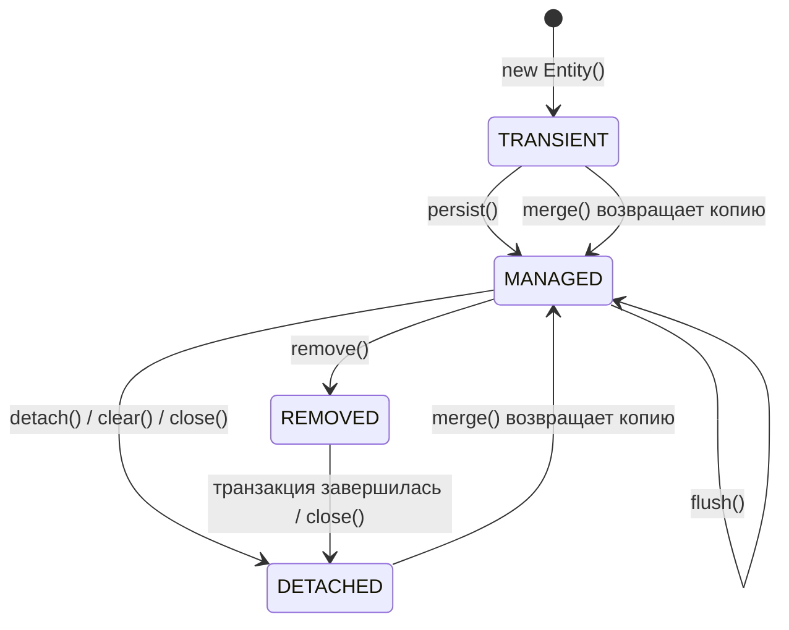
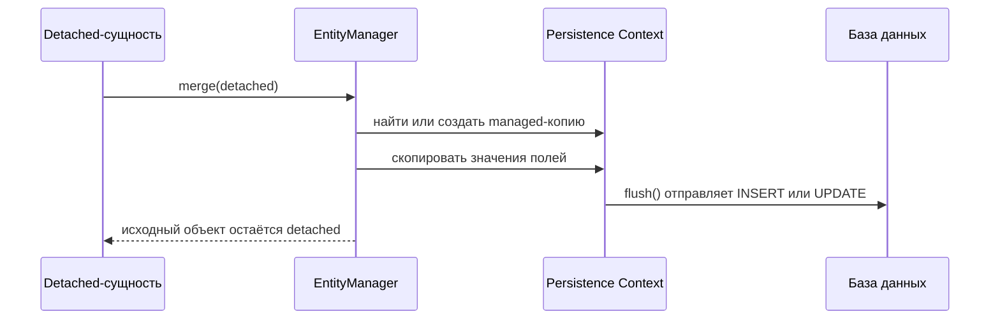

# Состояния сущности в JPA

Для JPA важно не только то, что у класса есть аннотация `@Entity`. Важно ещё,
находится ли конкретный объект внутри Persistence Context. Представь Persistence
Context как стойку в почтовом отделении: документы на стойке отслеживаются и
обрабатываются, а документы в твоём кармане остаются просто твоими копиями.

Четыре состояния, которые ждут на собеседовании:

- `transient`: обычный Java-объект, созданный через `new`, неизвестный
  `EntityManager`. Это как рукописная накладная, которая ещё не попала на стойку
  почты.
- `managed`: объект внутри Persistence Context. JPA отслеживает его, держит один
  экземпляр на одну database identity и может выполнить flush изменений. Это как
  заказ, закреплённый на кухонной рейке: команда видит его и может обновлять.
- `detached`: объект больше не отслеживается, часто потому что `EntityManager`
  закрыли, вызвали `clear()` или объект пересёк границу слоя. Это как копия
  бланка, которую унесли домой: на ней можно писать, но офисный экземпляр не
  изменится.
- `removed`: managed-объект, помеченный на удаление. Строка удаляется, когда JPA
  выполняет flush. Это как посылка со штампом «утилизировать», которая ещё ждёт в
  исходящем лотке.

## Основные переходы

`new Entity()` создаёт `transient`-объект. JPA не вставит его в базу только из-за
того, что класс размечен аннотациями. Кухонная аналогия: написать дома карточку
рецепта не значит, что ресторан начнёт её готовить.

`persist(entity)` переводит `transient`-сущность в `managed`. INSERT может
случиться сразу или позже, в зависимости от генерации id и момента flush, но
главный переход в том, что Persistence Context теперь владеет объектом. Почтовая
аналогия: посылку приняли на стойке, даже если машина ещё не уехала.

`find()`, `getReference()` или query обычно возвращают `managed`-сущности.
Persistence Context работает и как first-level cache: если он уже отслеживает
`Order#10`, ещё один `find(Order.class, 10)` вернёт тот же managed-экземпляр. Это
связано с темой [Hibernate под капотом](topic:hibernate-under-the-hood), где
Persistence Context больше, чем обычная map. Аналогия: сотрудник сначала смотрит
активную папку на стойке и только потом идёт в архив.

Изменение полей у `managed`-сущности не требует `save()`. Dirty checking замечает
изменения, а `flush()` отправляет SQL. Поэтому важны границы транзакции; в Spring
жизненный цикл часто привязан к проксированному `@Transactional`-методу из темы
[Как работает @Transactional](topic:spring-transactional-proxy). Аналогия:
исправление кухонного заказа на рейке видно повару, а исправление копии в сумке -
нет.

`detach(entity)` убирает один managed-объект из Persistence Context. `clear()`
делает detached все managed-объекты. `close()` завершает Persistence Context,
поэтому отслеживаемые объекты становятся detached. Аналогия: можно снять со
стойки один бланк, можно очистить всю стойку, а можно закрыть отделение на день.

`merge(detached)` - переход, на котором часто ошибаются. Он не делает тот же
detached-объект managed снова. Он копирует состояние detached-объекта в
managed-экземпляр и возвращает этот managed-экземпляр. Используй возвращаемое
значение. Аналогия: сотрудник переносит твои рукописные правки в официальный
бланк; бумага, которую ты принёс, всё ещё остаётся твоей бумагой.

`remove(managed)` помечает managed-сущность как `removed`. DELETE отправляется на
`flush()` или перед commit, а не обязательно ровно в строке вызова `remove()`.
Аналогия: посылку проштамповали на утилизацию, но исходящий лоток обрабатывается
партией.

`flush()` синхронизирует pending INSERT, UPDATE и DELETE с базой, но это не то же
самое, что commit. Commit относится к транзакции и её гарантиям, которые
объясняются в теме [ACID Principles](topic:acid-principles). Аналогия: flush -
это передать сегодняшние конверты в почтовую комнату, а commit - подтвердить
весь маршрут доставки.

## Ответ за 60 секунд

У JPA-сущности есть четыре основных состояния. `transient` - новый Java-объект,
о котором `EntityManager` не знает. `managed` - объект внутри Persistence
Context; изменения отслеживаются и уходят в базу при flush. `detached` - объект
раньше был managed или имеет id, но больше не отслеживается, поэтому изменения
полей игнорируются, пока ты не сделаешь merge. `removed` - managed-сущность,
запланированная на удаление. Transient переводят в managed через `persist()` или
через managed-копию, которую возвращает `merge()`. Managed-сущности обычно
получают через `find()` или query. Managed переводят в detached через `detach()`,
`clear()` или `close()`. `merge()` копирует состояние detached-объекта в
managed-экземпляр и возвращает его; исходный объект остаётся detached.
`remove()` помечает managed-сущность на DELETE, а `flush()` синхронизирует
pending SQL.

## Зачем это в production

Большинство сюрпризов JPA - это сюрпризы состояния. Controller получает entity
после завершения транзакции, меняет поле, и ничего не сохраняется, потому что
объект detached. Это как редактировать фотокопию после закрытия почтовой стойки.

Lazy-связи тоже зависят от состояния и контекста. Detached-сущность не может
свободно инициализировать lazy-поля, потому что Persistence Context, который мог
бы их загрузить, уже исчез. Это связано с темами
[Default Entity Loading Strategy](topic:hibernate-default-fetch-strategy) и
производительными ловушками вроде [проблемы N+1](topic:hibernate-n-plus-one).
Кухонная аналогия: билет вне кухонной рейки не может попросить кладовую принести
ещё ингредиенты.

Долго живущий Persistence Context может скрывать проблемы с памятью и устаревшими
данными. Если слишком много сущностей остаётся managed, стойка завалена активными
папками, dirty checking дорожает, а старые snapshots могут влиять на решения. В
обычных Spring-сервисах держи границы транзакций явными и не передавай managed
entities так, будто это простые DTO.

## Частые заблуждения

«У entity есть id, значит она managed» - неверно. Detached-объект может иметь
совершенно валидный id и всё равно быть вне отслеживания. Номер паспорта на
бумаге не кладёт эту бумагу на стол сотрудника.

«Вызов setter всегда обновляет базу» - неверно. Setter меняет Java-память.
Только managed-объекты проверяются и уходят в flush. Запись на кухонном заказе
важна только пока заказ висит на рейке.

«merge прикрепляет мой объект» - неверно. `merge()` возвращает managed-объект, а
аргумент остаётся detached. Продолжай работать с возвращённой ссылкой, как с
официальной копией бланка, а не с запиской, которую принёс из дома.

«remove удаляет сразу» - неполно. `remove()` помечает managed-сущность как
removed; DELETE появляется во время flush, а транзакция всё ещё может
откатиться. Штамп на утилизацию не равен отъезду машины.

«commit и flush - одно и то же» - неверно. Flush отправляет SQL в базу внутри
транзакции; commit завершает транзакцию. Почтовая комната может получить
конверты до того, как маршрут официально подтверждён.
