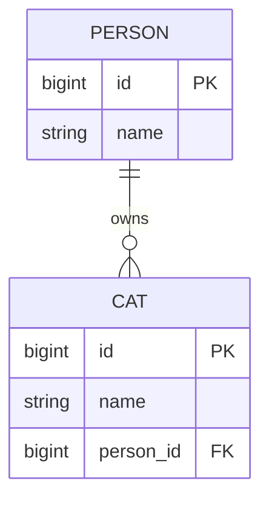

# JPA One-to-Many Mapping with a Join Table

In a `Person` to `Cat` model, the domain sentence is simple: one `Person` can have many `Cat` objects, and one `Cat` belongs to at most one `Person`. JPA must translate that sentence into a database shape and into object navigation rules. Think of a post office: the person is the customer account, each cat is a parcel, and the important question is where the delivery slip that says "this parcel belongs to this customer" is stored.

There are two common database shapes. The usual one keeps a foreign key on the child table, `cat.person_id`. The join-table variant keeps `person` and `cat` separate and stores the association in a link table such as `person_cat`. In the join-table variant, `person_cat.cat_id` must be `UNIQUE` if one cat cannot be assigned to two people. Like a coat-check desk, the same coat ticket cannot be put under two different customer names.



```mermaid
erDiagram
  PERSON ||--o{ PERSON_CAT : owns
  CAT ||--o| PERSON_CAT : "linked once"
  PERSON {
    bigint id PK
    string name
  }
  CAT {
    bigint id PK
    string name
  }
  PERSON_CAT {
    bigint person_id FK
    bigint cat_id FK_UK
  }
```

## The usual mapping: child foreign key

The most practical mapping is bidirectional: `Cat` has `@ManyToOne Person owner`, and `Person` has `@OneToMany(mappedBy = "owner") List<Cat> cats`. The owning side is `Cat.owner`, because the database column `cat.person_id` is written from that side. `mappedBy` on `Person.cats` says "this collection is the inverse view; do not create another relationship column". In kitchen terms, the official order ticket is attached to the dish, and the cook's board only groups dishes by customer.

```java
@Entity
class Person {
    @Id
    private Long id;

    @OneToMany(mappedBy = "owner", cascade = CascadeType.ALL, orphanRemoval = true)
    private List<Cat> cats = new ArrayList<>();

    public void addCat(Cat cat) {
        cats.add(cat);
        cat.setOwner(this);
    }

    public void removeCat(Cat cat) {
        cats.remove(cat);
        cat.setOwner(null);
    }
}

@Entity
class Cat {
    @Id
    private Long id;

    @ManyToOne(fetch = FetchType.LAZY, optional = false)
    @JoinColumn(name = "person_id", nullable = false)
    private Person owner;

    public void setOwner(Person owner) {
        this.owner = owner;
    }
}
```

Helper methods are not decoration. In memory, Hibernate does not magically update both sides of a bidirectional association when you change only one Java field; you keep the collection and the child reference in sync. Like a restaurant bill and kitchen ticket, both papers should describe the same table, or the staff will get confused before the database even sees the change.

`cascade = CascadeType.ALL` means operations on `Person` are propagated to its cats, and `orphanRemoval = true` means removing a cat from the collection deletes the orphan row. These settings describe lifecycle ownership, not just the foreign key. Like a storage locker contract, deciding who owns the locker is different from deciding which shelf label points to it.

## Unidirectional collection with a child foreign key

If `Cat` does not need to navigate back to `Person`, JPA also allows a unidirectional parent collection with `@OneToMany` and `@JoinColumn`. The database still has `cat.person_id`, but the Java model exposes only `Person.cats`. This is like a warehouse register where the customer folder lists the parcels, but the parcel form does not show the customer object in your Java code.

```java
@Entity
class Person {
    @Id
    private Long id;

    @OneToMany(cascade = CascadeType.ALL, orphanRemoval = true)
    @JoinColumn(name = "person_id", nullable = false)
    private List<Cat> cats = new ArrayList<>();
}

@Entity
class Cat {
    @Id
    private Long id;

    private String name;
}
```

This keeps the object model simpler, but bidirectional `@ManyToOne` is often clearer for queries and updates because the child row physically owns the foreign key. In traffic terms, it is easier to route a delivery when the truck's own manifest says where it belongs, not only a manager's clipboard.

## One-to-many through a join table

Use a join table when the schema is legacy, the child table must not contain a nullable parent column, the association needs its own table for auditing, or you intentionally want to decouple the child table from the parent table. This is less common than a child foreign key for real ownership. Like a post office that keeps a separate sorting ledger, the extra ledger is useful when the parcel label cannot be changed, but it is still another place to maintain.

```java
@Entity
class Person {
    @Id
    private Long id;

    @OneToMany(cascade = CascadeType.ALL, orphanRemoval = true)
    @JoinTable(
        name = "person_cat",
        joinColumns = @JoinColumn(name = "person_id", nullable = false),
        inverseJoinColumns = @JoinColumn(name = "cat_id", nullable = false),
        uniqueConstraints = @UniqueConstraint(
            name = "uk_person_cat_cat",
            columnNames = "cat_id"
        )
    )
    private List<Cat> cats = new ArrayList<>();
}
```

The critical detail is the unique constraint on `cat_id`. Without it, the same `cat_id` can appear in two rows with two different `person_id` values, which is exactly a many-to-many association. For the SQL side of that idea, compare it with [Many-to-Many in SQL](topic:sql-many-to-many). The analogy is a coat-check ledger: if ticket `C42` can be written next to both Alice and Bob, the desk has not enforced one owner.

The database DDL should express the rule, not only the annotation. A typical link table is:

```sql
create table person_cat (
    person_id bigint not null,
    cat_id bigint not null,
    constraint fk_person_cat_person foreign key (person_id) references person(id),
    constraint fk_person_cat_cat foreign key (cat_id) references cat(id),
    constraint uk_person_cat_cat unique (cat_id)
);
```

You may also add a primary key or unique pair on `(person_id, cat_id)` to prevent duplicate identical links, but that pair alone is not enough. It prevents the same person-cat row twice; it does not prevent the same cat from being linked to another person. Like a parking lot, preventing the same car from taking the same exact space twice is not the same as preventing the car from being assigned two spaces.

## Fetching, constraints, and production details

`@OneToMany` is LAZY by default in JPA, which is usually what you want, but it means collection access can issue SQL later. Plan the use case with `JOIN FETCH`, entity graphs, projections, or explicit queries when needed; see the focused topics on [default fetch strategy](topic:hibernate-default-fetch-strategy) and [eager fetching for one query](topic:hibernate-eager-for-one-query). Like a delivery route, do not load the whole truck for every errand, but do plan the route before rush hour.

Indexes matter. The foreign key columns in `cat.person_id` or `person_cat.person_id` and the unique `person_cat.cat_id` constraint need backing indexes in real databases so joins, deletes, and uniqueness checks stay efficient. This connects directly to [database indexes](topic:database-indexes). Like a sorted shelf at a post office, the label is useful only if staff can find it quickly.

Think about nullability. If every cat must have an owner, use `nullable = false` and a `NOT NULL` foreign key or link column. If cats can exist before assignment, allow null in the FK model or allow a cat with no row in the link table. Like a kitchen prep item, a dish can either require a table number immediately or wait on a prep shelf until assigned.

For richer join data, such as adoption date, role, or ordering metadata, do not hide the join table behind `@OneToMany @JoinTable`. Model it as a real link entity, for example `PersonCatAssignment`, with two `@ManyToOne` associations and a unique constraint on `cat_id`. Like a post office ledger with timestamps and clerk names, once the ledger has its own facts, it deserves its own form.

## 60-second interview answer

For a normal one-to-many `Person` to `Cat`, I usually put the foreign key on the child table and map `Cat.owner` as `@ManyToOne(fetch = LAZY) @JoinColumn(name = "person_id")`. On `Person`, I map `@OneToMany(mappedBy = "owner")`. The owning side is the child because it owns the FK column, and helper methods should keep both Java sides synchronized. If I want a unidirectional parent collection, I can use `@OneToMany @JoinColumn(name = "person_id")`, but the database is still a child-FK design. If I need a join table, I map `Person.cats` with `@OneToMany @JoinTable(name = "person_cat", joinColumns = ..., inverseJoinColumns = ...)`. To keep it one-to-many rather than many-to-many, the join table must have a unique constraint on `cat_id`, plus foreign keys and useful indexes. Cascades and `orphanRemoval` are lifecycle decisions, not a replacement for the database constraint.

## Production relevance

This mapping affects generated SQL, delete behavior, constraints, and how easy it is to query from the child side. A simple FK is usually easier to reason about, while a join table adds one more table to join, index, migrate, and validate. Like choosing between writing the customer number on each parcel or keeping a separate postal ledger, the separate ledger can be valid, but it costs an extra lookup.

Wrong ownership produces painful bugs: Hibernate may create an unwanted join table, ignore changes made only on the inverse side, or issue extra updates. Understanding the owning side is part of understanding what Hibernate does under the hood, covered more broadly in [Hibernate Under the Hood](topic:hibernate-under-the-hood). Like a restaurant, if two people think the other one sent the order, the meal never reaches the kitchen.

The database must enforce the rule. If business logic says a cat has one owner, the schema should make conflicting rows impossible with `UNIQUE(cat_id)` in the link table or a single `cat.person_id` foreign key. This is the same habit as good [database normalization](topic:database-normalization): put the fact in one reliable place. Like a coat-check ticket, a rule remembered only by the clerk is weaker than a rule printed into the ledger.

## Common misconceptions

**"`@OneToMany` automatically means a child FK."** Not always. Without `mappedBy`, `@JoinColumn`, or `@JoinTable`, a provider may use a join table for a unidirectional collection. The annotation says cardinality; the join annotations say table shape. Like saying "one customer has many parcels" does not say whether the parcel label or a separate ledger stores the assignment.

**"`mappedBy` owns the relationship."** It is the opposite. `mappedBy` marks the inverse side and points to the field that owns the relationship. Like a whiteboard summary in a kitchen, it reflects the official order ticket; it is not the ticket itself.

**"A join table always means many-to-many."** A join table with no unique constraint on the child side behaves like many-to-many. A join table with `UNIQUE(cat_id)` enforces one-to-many. Like a parking pass, the same card can open many gates only if nobody restricts it to one assigned spot.

**"`cascade` enforces one parent per child."** Cascade only propagates operations such as persist or remove. It does not stop two parents from linking the same child. The database constraint does that. Like a manager telling staff to move all boxes together, it says how work travels, not who is allowed to own each box.

**"`orphanRemoval` just removes the link row."** With entity ownership, `orphanRemoval = true` usually means the child entity is deleted when removed from the collection. If you only want to remove an association and keep the child, model that carefully, often with a link entity. Like returning a coat-check ticket, decide whether you are only removing the ticket or throwing away the coat.

**"A `List` preserves database order by itself."** A `List<Cat>` does not guarantee stable database ordering unless you map it with `@OrderColumn` or use `@OrderBy` where appropriate. Like parcels on a counter, they have an order only if someone writes the order down.
