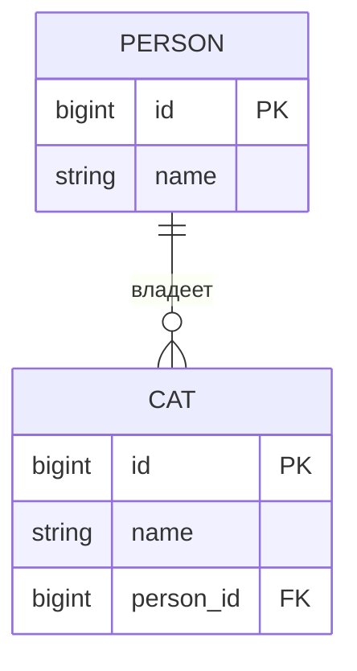

# One-to-many в JPA через внешний ключ и join table

В модели `Person` и `Cat` доменное правило звучит просто: у одного `Person` может быть много объектов `Cat`, а один `Cat` принадлежит максимум одному `Person`. JPA должна перевести это правило в форму таблиц и в правила навигации между объектами. Представьте почту: person - это клиентский аккаунт, каждый cat - посылка, а главный вопрос в том, где хранится квитанция "эта посылка принадлежит этому клиенту".

Есть две частые формы базы. Обычная форма хранит внешний ключ в дочерней таблице, `cat.person_id`. Вариант с join table держит `person` и `cat` отдельно, а связь хранит в таблице вроде `person_cat`. В варианте с join table колонка `person_cat.cat_id` должна быть `UNIQUE`, если один `Cat` не может быть назначен двум объектам `Person`. Как в гардеробе: один и тот же номерок нельзя записать сразу на двух клиентов.



```mermaid
erDiagram
  PERSON ||--o{ PERSON_CAT : владеет
  CAT ||--o| PERSON_CAT : "связана один раз"
  PERSON {
    bigint id PK
    string name
  }
  CAT {
    bigint id PK
    string name
  }
  PERSON_CAT {
    bigint person_id FK
    bigint cat_id FK_UK
  }
```

## Обычный маппинг: внешний ключ у ребёнка

Самый практичный маппинг - bidirectional: у `Cat` есть `@ManyToOne Person owner`, а у `Person` есть `@OneToMany(mappedBy = "owner") List<Cat> cats`. Owning side - это `Cat.owner`, потому что колонка базы `cat.person_id` записывается с этой стороны. `mappedBy` на `Person.cats` означает: "эта коллекция - обратное представление; не создавай ещё одну колонку или таблицу связи". В кухонной аналогии официальный заказ прикреплён к блюду, а доска повара только группирует блюда по клиентам.

```java
@Entity
class Person {
    @Id
    private Long id;

    @OneToMany(mappedBy = "owner", cascade = CascadeType.ALL, orphanRemoval = true)
    private List<Cat> cats = new ArrayList<>();

    public void addCat(Cat cat) {
        cats.add(cat);
        cat.setOwner(this);
    }

    public void removeCat(Cat cat) {
        cats.remove(cat);
        cat.setOwner(null);
    }
}

@Entity
class Cat {
    @Id
    private Long id;

    @ManyToOne(fetch = FetchType.LAZY, optional = false)
    @JoinColumn(name = "person_id", nullable = false)
    private Person owner;

    public void setOwner(Person owner) {
        this.owner = owner;
    }
}
```

Helper-методы - не украшение. В памяти Hibernate не обновляет магически обе стороны bidirectional-связи, если вы поменяли только одно Java-поле; коллекцию и ссылку ребёнка нужно держать согласованными. Как счёт в ресторане и кухонный талон: обе бумаги должны описывать один и тот же стол, иначе персонал запутается ещё до того, как база увидит изменение.

`cascade = CascadeType.ALL` означает, что операции над `Person` распространяются на его cats, а `orphanRemoval = true` означает, что удаление cat из коллекции удалит осиротевшую строку. Эти настройки описывают владение жизненным циклом, а не просто внешний ключ. Как договор на кладовку: решить, кто владеет шкафчиком, - это не то же самое, что решить, какая наклейка на полке на него указывает.

## Однонаправленная коллекция с внешним ключом у ребёнка

Если `Cat` не должен навигировать обратно к `Person`, JPA также позволяет однонаправленную коллекцию родителя через `@OneToMany` и `@JoinColumn`. В базе всё равно есть `cat.person_id`, но Java-модель показывает только `Person.cats`. Это похоже на складской журнал, где папка клиента перечисляет посылки, но форма самой посылки не показывает объект клиента в Java-коде.

```java
@Entity
class Person {
    @Id
    private Long id;

    @OneToMany(cascade = CascadeType.ALL, orphanRemoval = true)
    @JoinColumn(name = "person_id", nullable = false)
    private List<Cat> cats = new ArrayList<>();
}

@Entity
class Cat {
    @Id
    private Long id;

    private String name;
}
```

Так объектная модель проще, но bidirectional `@ManyToOne` часто понятнее для запросов и обновлений, потому что дочерняя строка физически владеет внешним ключом. В дорожной аналогии доставку проще направить, когда в манифесте самого грузовика написано, куда он относится, а не только в планшете диспетчера.

## One-to-many через join table

Join table используют, когда схема legacy, дочерняя таблица не должна содержать nullable-колонку родителя, связи нужна отдельная таблица для аудита или вы намеренно хотите отделить дочернюю таблицу от родительской. Для настоящего владения это менее частый вариант, чем внешний ключ у ребёнка. Как почта с отдельным сортировочным журналом: дополнительный журнал полезен, когда нельзя менять наклейку на посылке, но это всё равно ещё одно место, которое нужно поддерживать.

```java
@Entity
class Person {
    @Id
    private Long id;

    @OneToMany(cascade = CascadeType.ALL, orphanRemoval = true)
    @JoinTable(
        name = "person_cat",
        joinColumns = @JoinColumn(name = "person_id", nullable = false),
        inverseJoinColumns = @JoinColumn(name = "cat_id", nullable = false),
        uniqueConstraints = @UniqueConstraint(
            name = "uk_person_cat_cat",
            columnNames = "cat_id"
        )
    )
    private List<Cat> cats = new ArrayList<>();
}
```

Критически важная деталь - unique constraint на `cat_id`. Без него один и тот же `cat_id` может появиться в двух строках с разными `person_id`, а это уже связь many-to-many. SQL-сторону этой идеи можно сравнить с темой [Many-to-Many в SQL](topic:sql-many-to-many). Аналогия с гардеробом простая: если номерок `C42` можно записать рядом и с Alice, и с Bob, стойка выдачи не обеспечивает одного владельца.

Правило должна выражать DDL базы, а не только аннотация. Типичная link table:

```sql
create table person_cat (
    person_id bigint not null,
    cat_id bigint not null,
    constraint fk_person_cat_person foreign key (person_id) references person(id),
    constraint fk_person_cat_cat foreign key (cat_id) references cat(id),
    constraint uk_person_cat_cat unique (cat_id)
);
```

Можно также добавить primary key или unique pair на `(person_id, cat_id)`, чтобы запретить дублирующие одинаковые связи, но только этой пары недостаточно. Она запрещает одну и ту же строку person-cat дважды; она не запрещает связать того же cat с другим person. Как на парковке: запретить одной машине занять одно и то же место два раза - не то же самое, что запретить назначить машине два места.

## Fetching, constraints и production-детали

`@OneToMany` по умолчанию LAZY в JPA, и это обычно правильно, но доступ к коллекции может выполнить SQL позже. Планируйте use case через `JOIN FETCH`, entity graphs, projections или явные queries, когда это нужно; см. отдельные темы про [стратегию загрузки по умолчанию](topic:hibernate-default-fetch-strategy) и [eager fetching для одного запроса](topic:hibernate-eager-for-one-query). Как с маршрутом доставки: не загружайте весь грузовик для каждого поручения, но планируйте путь до часа пик.

Индексы важны. Колонки внешних ключей в `cat.person_id` или `person_cat.person_id` и уникальное ограничение `person_cat.cat_id` в реальных базах должны иметь backing indexes, чтобы joins, deletes и проверки уникальности оставались быстрыми. Это напрямую связано с темой [индексов базы данных](topic:database-indexes). Как отсортированная полка на почте: наклейка полезна только тогда, когда сотрудник может быстро её найти.

Продумайте nullability. Если каждый cat обязан иметь owner, используйте `nullable = false` и `NOT NULL` для внешнего ключа или link-колонки. Если cats могут существовать до назначения, разрешите null в FK-модели или разрешите cat без строки в link table. Как кухонная заготовка: блюдо может требовать номер стола сразу или ждать на prep-полке до назначения.

Если у связи появляются собственные данные, например adoption date, role или ordering metadata, не прячьте join table за `@OneToMany @JoinTable`. Смоделируйте её как настоящую link entity, например `PersonCatAssignment`, с двумя `@ManyToOne` и unique constraint на `cat_id`. Как почтовый журнал с timestamps и именами сотрудников: когда у журнала есть собственные факты, ему нужна собственная форма.

## Ответ за 60 секунд

Для обычной связи one-to-many `Person` to `Cat` я обычно кладу внешний ключ в дочернюю таблицу и маплю `Cat.owner` как `@ManyToOne(fetch = LAZY) @JoinColumn(name = "person_id")`. На `Person` маплю `@OneToMany(mappedBy = "owner")`. Owning side - это ребёнок, потому что он владеет FK-колонкой, а helper-методы должны синхронизировать обе Java-стороны. Если нужна однонаправленная коллекция родителя, можно использовать `@OneToMany @JoinColumn(name = "person_id")`, но в базе это всё равно дизайн с FK у ребёнка. Если нужна join table, я маплю `Person.cats` через `@OneToMany @JoinTable(name = "person_cat", joinColumns = ..., inverseJoinColumns = ...)`. Чтобы это осталось one-to-many, а не many-to-many, в join table нужен unique constraint на `cat_id`, плюс foreign keys и полезные indexes. Cascades и `orphanRemoval` - это решения о lifecycle, а не замена constraint в базе.

## Значение в production

Этот маппинг влияет на generated SQL, поведение delete, constraints и то, насколько удобно запрашивать данные со стороны ребёнка. Простой FK обычно легче понимать, а join table добавляет ещё одну таблицу для joins, indexes, migrations и validation. Это как выбирать между записью номера клиента на каждой посылке и отдельным почтовым журналом: отдельный журнал может быть правильным, но стоит дополнительного поиска.

Неверное владение даёт болезненные баги: Hibernate может создать ненужную join table, проигнорировать изменения, сделанные только на inverse side, или выполнить лишние updates. Понимание owning side - часть понимания того, что Hibernate делает под капотом; шире это разобрано в теме [Hibernate под капотом](topic:hibernate-under-the-hood). Как в ресторане: если два человека думают, что заказ отправит другой, еда не попадёт на кухню.

База должна обеспечивать правило. Если бизнес-логика говорит, что у `Cat` один owner, схема должна делать конфликтующие строки невозможными через `UNIQUE(cat_id)` в link table или один внешний ключ `cat.person_id`. Это та же привычка, что и хорошая [нормализация базы данных](topic:database-normalization): хранить факт в одном надёжном месте. Как номерок в гардеробе: правило, которое помнит только сотрудник, слабее правила, напечатанного в журнале.

## Частые заблуждения

**"`@OneToMany` автоматически означает FK у ребёнка."** Не всегда. Без `mappedBy`, `@JoinColumn` или `@JoinTable` provider может использовать join table для unidirectional collection. Аннотация говорит cardinality; join-аннотации говорят table shape. Как фраза "у одного клиента много посылок" ещё не говорит, где хранится назначение: на наклейке посылки или в отдельном журнале.

**"`mappedBy` владеет связью."** Всё наоборот. `mappedBy` помечает inverse side и указывает на поле, которое владеет связью. Как сводка на кухонной доске: она отражает официальный заказ, но не является самим заказом.

**"Join table всегда означает many-to-many."** Join table без unique constraint на стороне ребёнка ведёт себя как many-to-many. Join table с `UNIQUE(cat_id)` обеспечивает one-to-many. Как пропуск на парковку: одна карточка открывает много ворот только если её не ограничили одним назначенным местом.

**"`cascade` обеспечивает одного родителя на ребёнка."** Cascade только распространяет операции вроде persist или remove. Он не запрещает двум родителям сослаться на одного ребёнка. Это делает database constraint. Как менеджер, который говорит сотрудникам переносить все коробки вместе: он описывает, как движется работа, а не кто имеет право владеть каждой коробкой.

**"`orphanRemoval` просто удаляет link row."** При entity ownership `orphanRemoval = true` обычно означает удаление child entity, когда её убрали из коллекции. Если нужно только удалить связь и оставить child, моделируйте это аккуратно, часто через link entity. Как сдать гардеробный номерок: решите, вы убираете только номерок или выбрасываете пальто.

**"`List` сам сохраняет порядок в базе."** `List<Cat>` не гарантирует стабильный порядок в базе, если вы не замапили его через `@OrderColumn` или не используете `@OrderBy`, где это уместно. Как посылки на стойке: порядок есть только если кто-то его записал.
