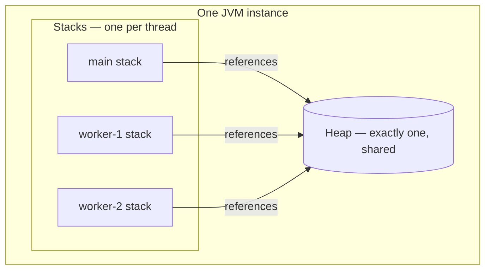
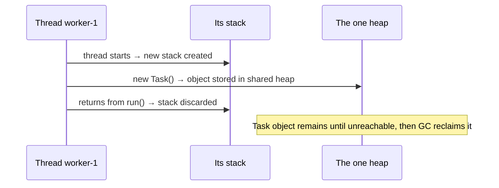

# How Many Heaps and Stacks in One JVM Instance

## The short answer

Inside one running JVM instance there is **exactly one heap** and **one stack per
thread**. The heap is a single region shared by every thread and managed by the
[garbage collector](topic:gc-configuration); each thread, the moment it starts,
gets its own private stack of method frames.

So the counts are:

- **Heaps:** always **1**, no matter how many threads run.
- **Stacks:** **one per live thread** — the number rises when a thread starts and
  falls when a thread finishes.

> **Real world.** Think of the JVM as one office building. There is a single shared
> stockroom on the ground floor — that is the heap, and everybody fetches and stores
> things there. Every employee carries their own personal notepad of "what I'm doing
> right now" — that is their stack. Hire a new employee and a new notepad appears;
> the stockroom stays the one stockroom.

## Why one heap but many stacks

A **stack** records *what a single thread is doing*: each method call pushes a
frame holding that call's local variables and partial results, and returning pops
it. Two threads execute different code at the same time, so each needs its own
independent column of frames. Sharing one stack between threads would be
nonsense — their calls have nothing to do with each other.

> **Real world.** Two chefs working different orders cannot share one notepad of
> steps; each keeps their own running list and crosses items off as they finish.

The **heap** holds *the objects themselves* — the data the program works on. That
data is what threads need to **share** and pass around, so it lives in one common
place. Putting objects in a single heap is exactly what lets one thread hand an
object to another.

> **Real world.** The ingredients live in one shared pantry precisely so any chef
> can grab the same jar; if every chef had a private pantry they could never cook
> the same dish together.

This split is the same one covered in
[Stack vs Heap](topic:jvm-memory-areas) and
[Method Calls and Stack Frames](topic:method-call-stack-frames) — here we are just
*counting* the regions.

## Stacks are born and die with their thread

A thread's stack is created when the thread starts and is thrown away whole when
the thread finishes. The objects that thread allocated do **not** die with it:
they stay in the one heap and survive as long as something still references them,
only becoming eligible for the [garbage collector](topic:gc-configuration) once
they are unreachable.

> **Real world.** When an employee leaves, you bin their personal notepad
> immediately — but the boxes they put in the shared stockroom stay on the shelves
> until someone decides nobody needs them.

## Why this matters in production

- **Thread safety.** Because the heap is shared, two threads touching the same
  object can race; stack locals are private and never race. This is the root of
  almost every concurrency bug — see
  [Avoiding Race Conditions](topic:race-condition-avoidance) and
  [Java Multithreading](topic:java-multithreading).
- **Sizing.** The heap is sized with `-Xms`/`-Xmx`; each thread's stack is sized
  with `-Xss`. More threads means more stacks, so thousands of threads can exhaust
  memory in stacks alone — one reason to prefer a
  [thread pool](topic:java-thread-pool).
- **Errors map to areas.** A too-deep call chain overflows *one thread's* stack
  ([StackOverflowError](topic:stackoverflow-error)); too many live objects exhaust
  the *one* heap (`OutOfMemoryError: Java heap space`).

## The 60-second interview answer

"One JVM instance has a single heap shared by all threads, and one stack per
thread. The heap stores objects — the data threads share — and is managed by the
garbage collector. Each thread gets its own stack the moment it starts; the stack
holds one frame per active method call with that call's local variables, and it is
discarded when the thread ends. So the number of heaps is always one, while the
number of stacks equals the number of live threads. That is also why heap access
needs synchronization but stack locals are inherently thread-safe."

## Common misconceptions and traps

- **"Each thread has its own heap."** No — there is one heap for the whole
  instance. (Modern GCs do give each thread a small *thread-local allocation
  buffer* inside that one heap for fast allocation, but it is still part of the
  single shared heap, not a separate heap.)
- **"There is one global stack."** No — the stack is per thread. The single-stack
  picture only looks right in a one-thread program.
- **"Objects die when the thread that created them ends."** No — objects live in
  the shared heap and survive as long as they are reachable, regardless of which
  thread made them.
- **"Heap and stack are the only runtime areas."** They are the two you are asked
  about, but the JVM also has the method area / Metaspace (class metadata, loaded
  by the [ClassLoaders](topic:classloader)), a per-thread PC register, the runtime
  constant pool, and per-thread native method stacks.
- **"The stack stores objects."** The stack stores frames with primitive locals
  and *references*; the objects those references point to live in the heap (see
  [Where Reference Types Are Stored](topic:reference-types-storage)).
