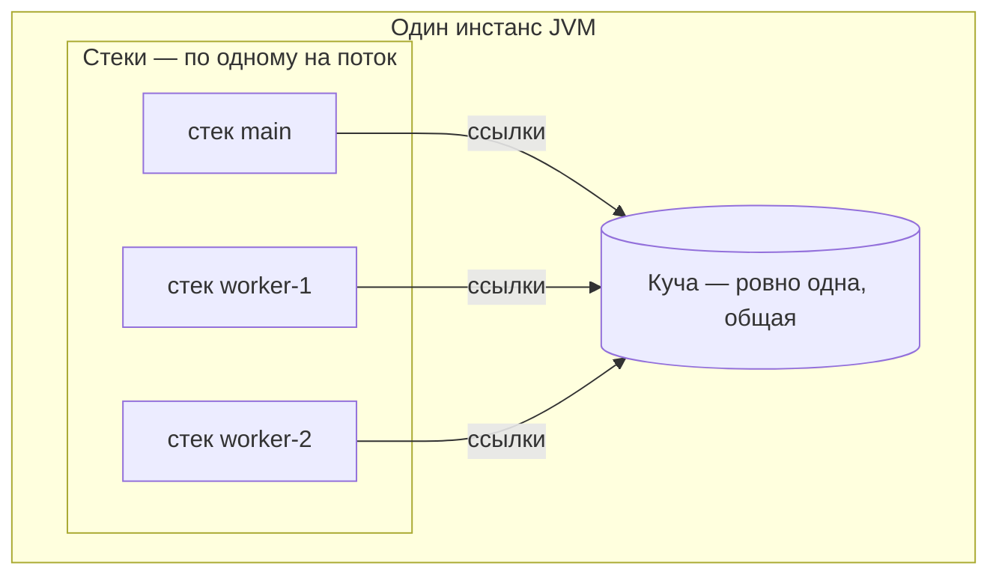
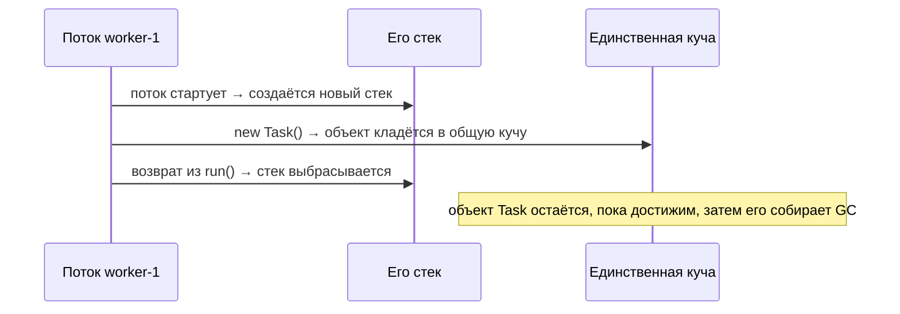

# Сколько куч и стеков в одном инстансе JVM

## Короткий ответ

Внутри одного работающего инстанса JVM есть **ровно одна куча** и **по одному
стеку на поток**. Куча — единая область, общая для всех потоков и управляемая
[сборщиком мусора](topic:gc-configuration); каждый поток в момент старта получает
собственный приватный стек кадров методов.

Итого подсчёт такой:

- **Куч:** всегда **1**, сколько бы потоков ни работало.
- **Стеков:** **по одному на живой поток** — число растёт при старте потока и
  падает при его завершении.

> **Из жизни.** Представьте JVM как одно офисное здание. На первом этаже — единая
> общая кладовая: это куча, и все берут и кладут вещи именно туда. У каждого
> сотрудника свой личный блокнот «что я делаю прямо сейчас» — это его стек. Нанимаем
> нового сотрудника — появляется новый блокнот; кладовая остаётся той же одной
> кладовой.

## Почему куча одна, а стеков много

**Стек** фиксирует, *что делает один поток*: каждый вызов метода кладёт кадр с
локальными переменными и промежуточными результатами этого вызова, а возврат его
снимает. Два потока одновременно выполняют разный код, поэтому каждому нужна своя
независимая колонка кадров. Делить один стек между потоками было бы бессмыслицей —
их вызовы никак не связаны друг с другом.

> **Из жизни.** Два повара, готовящие разные заказы, не могут вести один блокнот
> шагов; каждый держит свой список и вычёркивает пункты по мере выполнения.

**Куча** хранит *сами объекты* — данные, с которыми работает программа. Именно эти
данные потокам нужно **разделять** и передавать друг другу, поэтому они живут в
одном общем месте. Размещение объектов в единой куче — это ровно то, что позволяет
одному потоку передать объект другому.

> **Из жизни.** Ингредиенты лежат в одной общей кладовой именно для того, чтобы
> любой повар мог взять ту же банку; будь у каждого своя кладовая, они никогда не
> приготовили бы одно блюдо вместе.

Это то же разделение, что разбирается в темах
[Стек и куча](topic:jvm-memory-areas) и
[Вызовы методов и кадры стека](topic:method-call-stack-frames) — здесь мы лишь
*считаем* эти области.

## Стеки рождаются и умирают вместе со своим потоком

Стек потока создаётся при старте потока и целиком выбрасывается при его
завершении. Объекты, которые этот поток разместил, **не** умирают вместе с ним:
они остаются в единственной куче и живут, пока на них есть хоть одна ссылка, и
становятся доступны [сборщику мусора](topic:gc-configuration) только когда
становятся недостижимыми.

> **Из жизни.** Когда сотрудник уходит, его личный блокнот выбрасывают сразу — но
> коробки, что он поставил в общую кладовую, остаются на полках, пока кто-то не
> решит, что они больше никому не нужны.

## Почему это важно на проде

- **Потокобезопасность.** Поскольку куча общая, два потока, трогающие один объект,
  могут устроить гонку; локальные переменные стека приватны и не гоняются. Это
  корень почти всех багов конкурентности — см.
  [Избегание гонок](topic:race-condition-avoidance) и
  [Многопоточность в Java](topic:java-multithreading).
- **Размеры.** Куча задаётся через `-Xms`/`-Xmx`; стек каждого потока — через
  `-Xss`. Больше потоков — больше стеков, поэтому тысячи потоков могут исчерпать
  память одними лишь стеками — одна из причин предпочитать
  [пул потоков](topic:java-thread-pool).
- **Ошибки привязаны к областям.** Слишком глубокая цепочка вызовов переполняет
  стек *одного потока* ([StackOverflowError](topic:stackoverflow-error)); слишком
  много живых объектов исчерпывают *одну* кучу (`OutOfMemoryError: Java heap
  space`).

## Ответ на собеседовании за 60 секунд

«В одном инстансе JVM одна куча, общая для всех потоков, и по одному стеку на
поток. Куча хранит объекты — данные, которые потоки разделяют, — и управляется
сборщиком мусора. Каждый поток получает свой стек в момент старта; стек хранит по
одному кадру на каждый активный вызов метода с локальными переменными этого вызова
и выбрасывается, когда поток завершается. Поэтому куч всегда одна, а число стеков
равно числу живых потоков. Это же объясняет, почему доступу к куче нужна
синхронизация, а локальные переменные стека потокобезопасны по своей природе».

## Частые заблуждения и ловушки

- **«У каждого потока своя куча».** Нет — куча одна на весь инстанс. (Современные
  GC действительно дают каждому потоку небольшой *thread-local allocation buffer*
  внутри этой одной кучи для быстрого выделения, но это всё ещё часть единой общей
  кучи, а не отдельная куча.)
- **«Есть один глобальный стек».** Нет — стек у каждого потока свой. Картинка с
  одним стеком выглядит верной только в однопоточной программе.
- **«Объекты умирают, когда завершается создавший их поток».** Нет — объекты живут
  в общей куче и существуют, пока достижимы, независимо от того, какой поток их
  создал.
- **«Куча и стек — единственные области времени выполнения».** Это две, о которых
  спрашивают, но у JVM есть ещё область методов / Metaspace (метаданные классов,
  загружаемые [ClassLoader'ами](topic:classloader)), PC-регистр на каждый поток,
  runtime constant pool и нативные стеки методов на каждый поток.
- **«Стек хранит объекты».** Стек хранит кадры с примитивными локальными
  переменными и *ссылками*; сами объекты, на которые указывают эти ссылки, живут в
  куче (см. [Где хранятся ссылочные типы](topic:reference-types-storage)).
