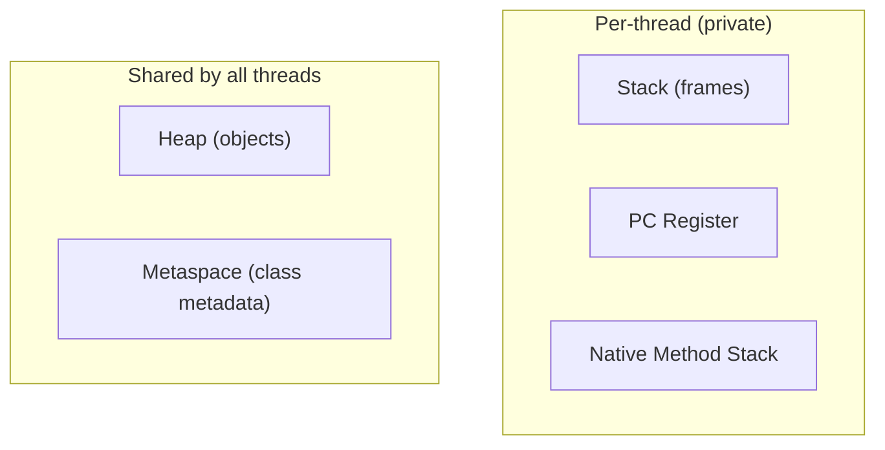
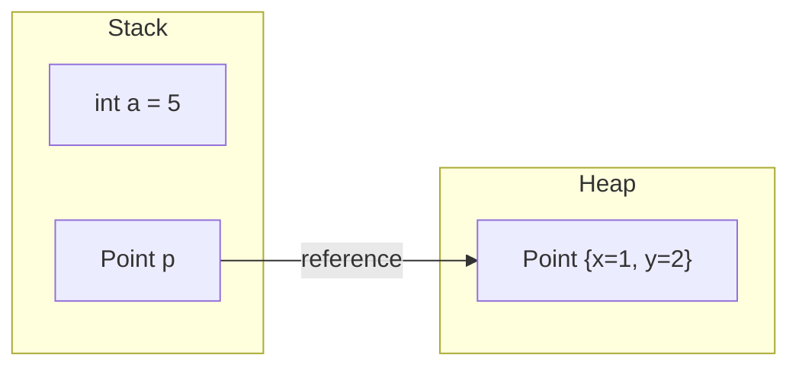

# How Java Memory Is Organized: Stack vs Heap

When you run a Java program, the JVM does not hand your code one undivided block
of memory. It carves the process memory into **runtime data areas**, each with a
different job and a different lifetime. Think of a busy restaurant: the kitchen
isn't one big room — there's a **worktable at each cook's station**, a **shared
pantry/warehouse** out back, and a **binder of recipes** on the wall. Different
things, different rules.

## The areas at a glance

- **Stack** — one per thread. Holds a **frame** for every method call in progress
  (its parameters, local variables, and primitive values). *Like the spike of
  order tickets at one cook's station: tickets stack up as orders come in and are
  torn off as they're finished — strictly last-in, first-out, and nobody else
  touches this cook's spike.*
- **Heap** — one for the whole JVM, shared by every thread. Holds **every object**
  (everything created with `new`, plus arrays). *Like the shared warehouse out
  back: any cook can fetch a box from a shelf, and a cleanup crew hauls away
  whatever no longer has a claim ticket.*
- **Metaspace** — class metadata: the loaded classes, method bytecode, field
  layouts. *The wall binder of recipes — loaded once, consulted by everyone, not
  recreated per order.*
- **PC Register** and **Native Method Stack** — small per-thread bookkeeping (which
  instruction is next; the stack for native `C` calls). *The little "I'm on step 4"
  note clipped to each cook's board.* Interviewers rarely dig here.

The two you'll be asked to compare are almost always the **stack** and the **heap**.

## Stack vs heap: the real difference

A primitive local like `int a = 5` stores the **value itself** in its slot on the
stack — *the quantity is written right on the order ticket.* An object created
with `new` lives on the **heap**; the variable on the stack holds only a
**reference** (a handle) to it — *the ticket just says "shelf #42", and the actual
box of goods sits on that shelf in the warehouse.* See [what a variable stores and
where](topic:variable-storage) and [where reference types are
stored](topic:reference-types-storage) for this distinction up close.

| | Stack | Heap |
|---|---|---|
| Holds | frames: locals + primitive values + references | objects and arrays |
| Scope | private to one thread | shared by all threads |
| Lifetime | freed automatically when the method returns (frame popped) | reclaimed by the garbage collector when unreachable |
| Allocation | trivially fast (move a pointer) | slower; managed, may trigger GC |
| Size | small, fixed-ish (`-Xss` per thread) | large (`-Xms`/`-Xmx`) |
| Failure | `StackOverflowError` (e.g. infinite recursion) | `OutOfMemoryError: Java heap space` |

**Lifetime is the heart of it.** A frame is born when a method is called and dies
the instant it returns — see [method calls and stack frames](topic:method-call-stack-frames).
*The ticket is torn off the spike the moment that order ships; you never garbage-collect a
spike.* A heap object, by contrast, lives as long as **something can still reach
it**. When the last reference is dropped, it becomes garbage and waits for the GC
— *a box with no claim ticket sits in the warehouse until the cleanup crew comes
by.* The heap itself is split into generations to make that collection cheap; see
[JVM heap generations](topic:heap-generations).

**Sharing is the other half.** Because the heap is shared, two threads (or two
variables) can point at the **same** object and see each other's changes — which
is exactly why object mutation needs care under concurrency. Stacks are private,
so a thread's locals are never visible to another thread. A [memory-sensitive
cache](topic:reference-types-cache) leans on the heap and GC precisely because the
heap is the shared, collected area.

## 60-second interview answer

> The JVM splits runtime memory into areas. The two that matter most are the
> **stack** and the **heap**. Each thread has its own **stack**, made of frames —
> one frame per method call, holding that method's parameters, local variables and
> primitive values. A frame is pushed on call and popped on return, so stack memory
> is freed automatically and is strictly LIFO. The **heap** is a single area shared
> by all threads where every object (everything made with `new`) lives; variables
> on the stack only hold references into it. The heap is managed by the **garbage
> collector**, which reclaims objects once they're unreachable. So: stack = small,
> fast, per-thread, auto-freed, primitives and references; heap = large, shared,
> GC-managed, the objects themselves. Beyond those, **Metaspace** holds class
> metadata, and there's a per-thread PC register and native stack. Running out of
> stack gives a `StackOverflowError`; running out of heap gives an
> `OutOfMemoryError`.

## Production relevance

- **Sizing.** `-Xmx` caps the heap; `-Xss` sets each thread's stack size. Deep
  recursion or huge local arrays stress the stack; large caches and object graphs
  stress the heap.
- **Diagnosing crashes.** A `StackOverflowError` points at runaway recursion or
  cyclic calls. An `OutOfMemoryError: Java heap space` points at a leak or an
  undersized heap — take a heap dump, not a thread dump.
- **Concurrency.** Shared heap state is what makes visibility and atomicity hard;
  thread-local data on the stack is inherently safe.
- **Escape analysis.** The JIT can sometimes prove an object never escapes a method
  and allocate it on the stack (or scalar-replace it), avoiding the heap entirely —
  a real optimization, though you don't control it directly.

## Common misconceptions and traps

- **"Objects can be on the stack."** By the Java model, all objects are on the heap;
  only the JIT's escape analysis may quietly do otherwise. Don't claim it as the
  rule.
- **"Primitives are always on the stack."** A *local* primitive is. A primitive
  **field** of an object lives **inside that object on the heap**. Location depends
  on where the variable is declared, not on the type alone.
- **"The reference and the object live together."** No — the reference is a stack
  slot (or a field); the object is on the heap. They're in different areas.
- **"Java is pass-by-reference."** Java is always **pass-by-value**; for objects the
  *value copied* is the reference. The callee can mutate the shared object but can't
  repoint the caller's variable.
- **"`String`s are special / in the stack."** `String` objects are heap objects;
  the **string pool** is just a region of the heap that interns literals — see
  [String immutability](topic:string-immutability).
- **"Stack vs heap is about value vs object types."** It's about **lifetime and
  ownership** (per-call, auto-freed, private vs. long-lived, GC'd, shared), not a
  simple type rule.
- **"PermGen."** Class metadata moved from PermGen to **Metaspace** in Java 8;
  mentioning PermGen as current dates you.
