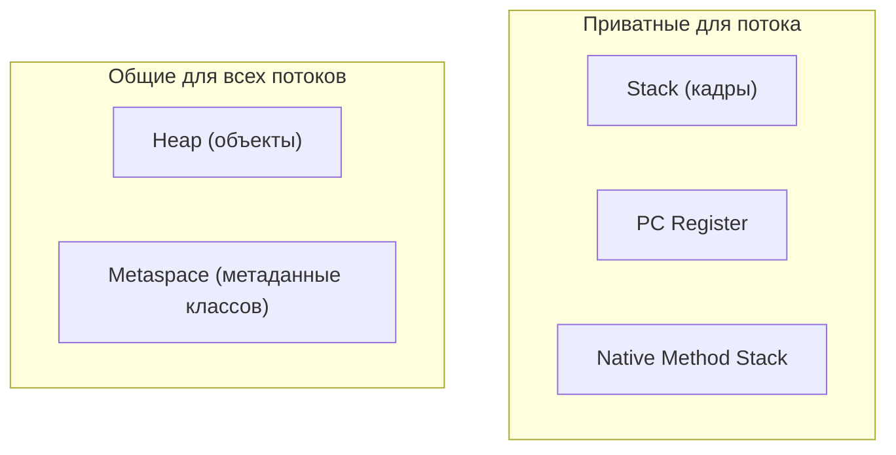
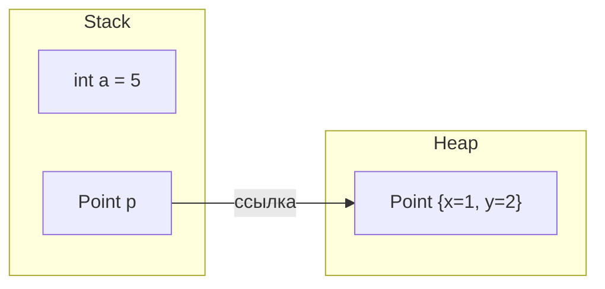

# Как устроена память в Java: стек и куча

Когда вы запускаете Java-программу, JVM не выдаёт коду один цельный кусок памяти.
Она делит память процесса на **области данных времени выполнения**, у каждой —
своя задача и свой срок жизни. Представьте загруженный ресторан: кухня — это не
одна большая комната, а **рабочий стол у станции каждого повара**, **общая
кладовая/склад** в подсобке и **папка с рецептами** на стене. Разные вещи —
разные правила.

## Области одним взглядом

- **Stack (стек)** — по одному на поток. Хранит **кадр** для каждого текущего
  вызова метода (его параметры, локальные переменные и значения примитивов). *Как
  спица с тикетами заказов на станции одного повара: тикеты накапливаются по мере
  поступления заказов и срываются, когда заказ готов, — строго «последним пришёл —
  первым ушёл», и чужую спицу никто не трогает.*
- **Heap (куча)** — одна на всю JVM, общая для всех потоков. Хранит **все объекты**
  (всё, что создано через `new`, а также массивы). *Как общий склад в подсобке:
  любой повар может взять коробку с полки, а бригада уборки увозит всё, на что
  больше нет квитанции.*
- **Metaspace** — метаданные классов: загруженные классы, байт-код методов,
  раскладка полей. *Настенная папка с рецептами — загружается один раз, ею
  пользуются все, она не создаётся заново под каждый заказ.*
- **PC Register** и **Native Method Stack** — небольшая приватная для потока
  служебная информация (какая инструкция следующая; стек для нативных `C`-вызовов).
  *Маленькая записка «я на шаге 4», приколотая к доске каждого повара.* На
  собеседовании сюда копают редко.

Сравнить почти всегда просят именно **стек** и **кучу**.

## Стек и куча: реальное отличие

Примитивная локальная переменная вроде `int a = 5` хранит **само значение** в
своём слоте на стеке — *количество записано прямо на тикете заказа.* Объект,
созданный через `new`, живёт в **куче**; переменная на стеке хранит лишь
**ссылку** (указатель) на него — *на тикете написано только «полка №42», а сама
коробка с товаром стоит на этой полке на складе.* Подробнее — в темах [что хранит
переменная и где](topic:variable-storage) и [где хранятся ссылочные
типы](topic:reference-types-storage).

| | Стек | Куча |
|---|---|---|
| Хранит | кадры: локальные переменные + значения примитивов + ссылки | объекты и массивы |
| Область видимости | приватна для одного потока | общая для всех потоков |
| Срок жизни | освобождается автоматически при возврате метода (кадр снят) | освобождается сборщиком мусора, когда объект недостижим |
| Выделение | тривиально быстрое (сдвиг указателя) | медленнее; управляемое, может запустить GC |
| Размер | небольшой, почти фиксированный (`-Xss` на поток) | большой (`-Xms`/`-Xmx`) |
| Сбой | `StackOverflowError` (например, бесконечная рекурсия) | `OutOfMemoryError: Java heap space` |

**Срок жизни — суть всего.** Кадр рождается при вызове метода и умирает в момент
возврата — см. [вызовы методов и кадры стека](topic:method-call-stack-frames).
*Тикет срывают со спицы, как только заказ отгружен; спицу не нужно «убирать
сборщиком».* Объект в куче, наоборот, живёт ровно столько, сколько **до него
можно дотянуться**. Когда сброшена последняя ссылка, он становится мусором и ждёт
GC — *коробка без квитанции стоит на складе, пока не придёт бригада уборки.* Сама
куча разбита на поколения, чтобы сборка была дешёвой; см. [поколения кучи
JVM](topic:heap-generations).

**Совместное использование — вторая половина истории.** Поскольку куча общая, два
потока (или две переменные) могут указывать на **один и тот же** объект и видеть
изменения друг друга — именно поэтому мутация объектов требует осторожности при
конкурентности. Стеки приватны, поэтому локальные переменные потока никогда не
видны другому потоку. [Кэш, чувствительный к памяти](topic:reference-types-cache),
опирается на кучу и GC именно потому, что куча — это общая, собираемая область.

## Ответ за 60 секунд

> JVM делит память времени выполнения на области. Важнее всего две — **стек** и
> **куча**. У каждого потока свой **стек** из кадров: один кадр на вызов метода,
> хранит параметры, локальные переменные и значения примитивов этого метода. Кадр
> добавляется при вызове и снимается при возврате, поэтому память стека
> освобождается автоматически и работает строго по принципу LIFO. **Куча** — это
> одна область, общая для всех потоков, где живут все объекты (всё, созданное через
> `new`); переменные на стеке хранят лишь ссылки в неё. Кучей управляет **сборщик
> мусора**, который освобождает объекты, как только они становятся недостижимы.
> Итого: стек = маленький, быстрый, на поток, освобождается сам, примитивы и
> ссылки; куча = большая, общая, под управлением GC, сами объекты. Кроме них,
> **Metaspace** хранит метаданные классов, и есть приватные для потока PC register
> и нативный стек. Кончился стек — `StackOverflowError`; кончилась куча —
> `OutOfMemoryError`.

## Где это важно на практике

- **Размеры.** `-Xmx` ограничивает кучу; `-Xss` задаёт размер стека каждого потока.
  Глубокая рекурсия или огромные локальные массивы нагружают стек; большие кэши и
  графы объектов нагружают кучу.
- **Диагностика сбоев.** `StackOverflowError` указывает на разросшуюся рекурсию или
  циклические вызовы. `OutOfMemoryError: Java heap space` указывает на утечку или
  недостаточную кучу — снимайте heap dump, а не thread dump.
- **Конкурентность.** Именно общее состояние в куче делает сложными видимость и
  атомарность; данные на стеке, локальные для потока, безопасны по своей природе.
- **Escape analysis.** JIT иногда может доказать, что объект не «убегает» из метода,
  и разместить его на стеке (или разложить на скаляры), полностью минуя кучу, — это
  реальная оптимизация, хотя напрямую вы ею не управляете.

## Частые заблуждения и ловушки

- **«Объекты могут быть на стеке».** По модели Java все объекты — в куче; только
  escape analysis в JIT может тихо сделать иначе. Не выдавайте это за правило.
- **«Примитивы всегда на стеке».** *Локальный* примитив — да. А примитивное **поле**
  объекта живёт **внутри этого объекта в куче**. Местоположение зависит от того, где
  объявлена переменная, а не только от типа.
- **«Ссылка и объект живут вместе».** Нет — ссылка это слот на стеке (или поле); сам
  объект в куче. Они в разных областях.
- **«Java передаёт по ссылке».** Java всегда передаёт **по значению**; для объектов
  *копируется значение* ссылки. Вызванный метод может изменить общий объект, но не
  может переприсвоить переменную вызывающего.
- **«`String` особенный / лежит на стеке».** Объекты `String` — это объекты в куче;
  **пул строк** — это всего лишь участок кучи, который интернирует литералы, см.
  [неизменяемость String](topic:string-immutability).
- **«Стек против кучи — это про типы-значения и объектные типы».** Это про **срок
  жизни и владение** (на вызов, освобождается сам, приватно — против долгоживущего,
  собираемого GC, общего), а не простое правило по типу.
- **«PermGen».** Метаданные классов переехали из PermGen в **Metaspace** в Java 8;
  упоминание PermGen как актуального вас выдаёт.
