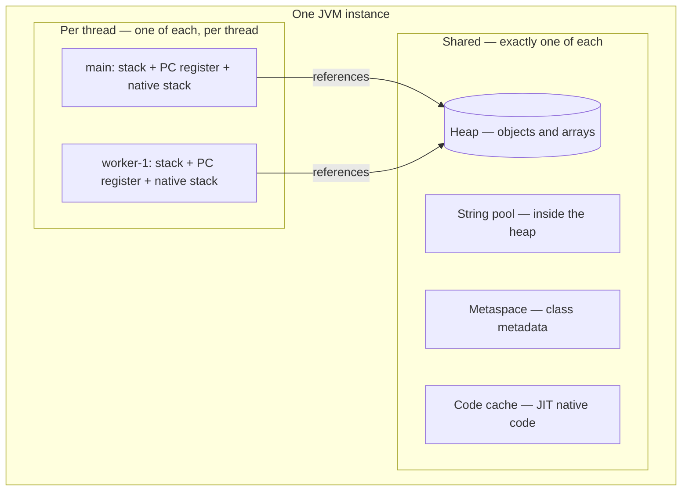
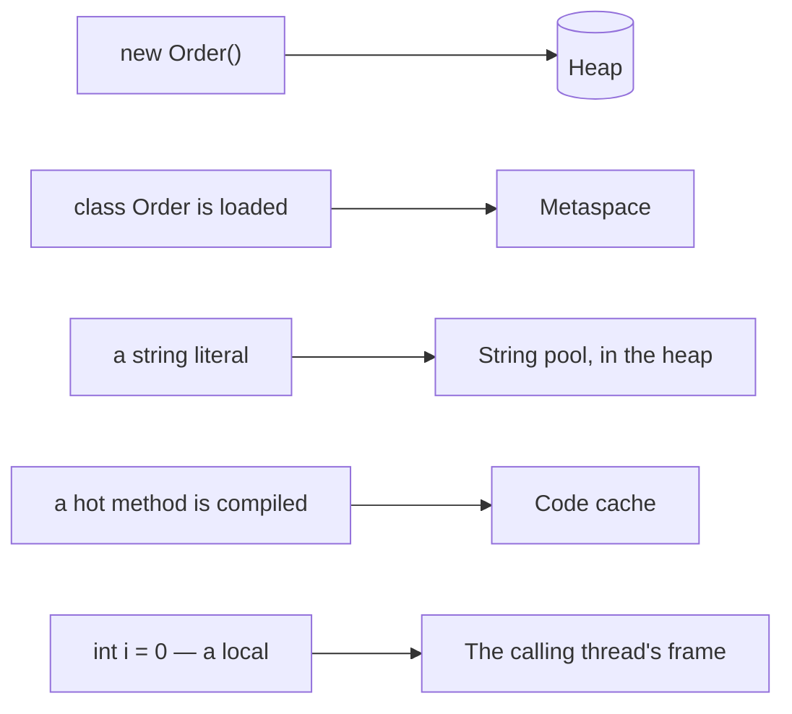

# Memory Structures in Java: the JVM Runtime Data Areas

## The short answer

A running JVM does not have "some memory" — it has a fixed set of **runtime data
areas**, and every area falls into one of two groups:

- **Shared by the whole instance — exactly one of each:** the **heap** (all
  objects and arrays, managed by the garbage collector), the **string pool**
  (a table inside the heap), **Metaspace** (class metadata and runtime constant
  pools, in native memory) and the **code cache** (native code produced by the
  JIT).
- **Private to a thread — one of each per live thread:** the **JVM stack** (one
  frame per active method call), the **PC register** (where in the current method
  this thread is) and the **native method stack** (for `native`/JNI calls).

So the counting question answers itself: **one heap** — always, no matter how many
threads run — and **as many stacks as there are live threads**, a number that
rises when a thread starts and falls when it finishes.

## The shared areas

**Heap.** Every object and every array created with `new` lives here, whichever
thread ran the `new`. It is the only area the garbage collector manages, it is
sized with `-Xms`/`-Xmx`, and it is internally split into
[generations](topic:heap-generations) so that short-lived objects are collected
cheaply. Because it is shared, two threads touching the same object can race —
that is where synchronization comes in.

**String pool.** Interned string literals are deduplicated in one table so that
equal literals are one object. Since Java 7 that table sits **inside the heap**
(it lived in PermGen before), which is why interned strings are now garbage
collectable. `new String("OK")` deliberately bypasses the pool and allocates a
separate heap object — the classic reason `==` fails on strings (see
[String Immutability](topic:string-immutability)).

**Metaspace (the method area).** When a [ClassLoader](topic:classloader) loads a
class, the class's *metadata* — field and method descriptors, bytecode, the
runtime constant pool, and the `static` fields' home — is stored here, once per
class, no matter how many instances you create. Since Java 8 it is **native
memory outside the heap**, so it is not limited by `-Xmx` but by
`-XX:MaxMetaspaceSize`. This area is what PermGen used to be.

**Code cache.** The [JIT compiler](topic:java-jit-compilation) turns hot methods
into machine code, and that machine code is kept here — neither in the heap nor
in Metaspace. It is why a long-running Java process gets faster over time, and
why `-XX:ReservedCodeCacheSize` exists.

## The per-thread areas

Every thread gets its own three areas the moment it starts and loses all three
when it ends:

- **JVM stack** — one frame per active method call, holding that call's local
  variables, the operand stack and the return address. Locals are pushed and
  popped, never garbage collected; see
  [Method Calls and Stack Frames](topic:method-call-stack-frames). Sized with
  `-Xss`.
- **PC register** — the address of the bytecode instruction this thread is
  currently executing. It is what makes a
  [context switch](topic:context-switch) possible: the thread can be paused and
  resumed exactly where it was. (Its value is undefined while a native method
  runs.)
- **Native method stack** — the stack used when the thread calls a `native`
  method through JNI, kept separate from the Java frames.

The split is the point: a stack records *what one thread is doing*, so it cannot
be shared; the heap holds *the data*, which is exactly what threads need to share.
This is the same boundary covered by
[Stack vs Heap](topic:jvm-memory-areas) and counted in
[How Many Heaps and Stacks](topic:jvm-heaps-stacks-count).

## Why this matters in production

- **Each error names its area.** `StackOverflowError` means *one thread's* stack
  ran out of frames ([StackOverflowError](topic:stackoverflow-error));
  `OutOfMemoryError: Java heap space` means the one heap is full of reachable
  objects ([Exceptions and OutOfMemoryError](topic:exceptions-out-of-memory));
  `OutOfMemoryError: Metaspace` means too many loaded classes (a classic symptom
  of repeated redeploys or runaway proxy generation);
  `OutOfMemoryError: unable to create new native thread` means the OS refused
  another *stack*.
- **Sizing is per area.** `-Xmx` caps the heap only. Thread stacks (`-Xss`,
  typically 512 KB–1 MB each) live *outside* it, so thousands of threads consume
  hundreds of megabytes that `-Xmx` never accounted for — one practical reason to
  use a [thread pool](topic:java-thread-pool). A container killed by the OOM
  killer while the heap looks healthy is usually stacks, Metaspace or native
  buffers ([Diagnosing Memory Growth](topic:diagnosing-memory-leaks)).
- **Only the heap is collected.** Stack frames disappear on return, for free; heap
  objects wait for the [garbage collector](topic:gc-configuration) and leak while
  something still references them ([Memory Leaks](topic:memory-leaks)).

## The 60-second interview answer

"The JVM splits runtime memory into areas that are either shared or per-thread.
Shared, one of each per instance: the heap with all objects and arrays, managed by
the GC and containing the string pool since Java 7; Metaspace with class metadata
and static fields, in native memory since Java 8, replacing PermGen; and the code
cache with JIT-compiled native code. Per thread, one of each per live thread: the
JVM stack with a frame per method call, the PC register, and the native method
stack. So one application has exactly one heap — always — and one stack per live
thread, so the stack count changes as threads start and finish. It also tells you
where each error comes from: StackOverflowError is one thread's stack, heap-space
OOM is the shared heap, Metaspace OOM is class metadata."

## Common misconceptions and traps

- **"Every thread has its own heap."** No — one heap per JVM instance. Modern GCs
  give each thread a *thread-local allocation buffer* inside that heap for fast
  bump allocation, but it is a slice of the one heap, not a separate heap.
- **"There is one stack for the application."** No — the stack is per thread. That
  picture only looks right in a single-threaded program.
- **"Heap and stack are all there is."** They are the two you are asked about
  first, but forgetting Metaspace, the code cache, the PC register and the native
  method stack is exactly what the question is probing.
- **"Metaspace is part of the heap / `-Xmx` limits it."** No — it is native memory
  since Java 8 and is capped by `-XX:MaxMetaspaceSize`. That is also why a
  Metaspace leak keeps growing while heap dumps look clean.
- **"PermGen still exists."** It was removed in Java 8 and replaced by Metaspace;
  `-XX:MaxPermSize` is ignored.
- **"`static` fields live in the stack."** The field slots live with the class in
  Metaspace, and the objects they point at live in the heap.
- **"The stack stores objects."** It stores frames with primitive locals and
  *references*; the objects those references point at are in the heap (see
  [Where Reference Types Are Stored](topic:reference-types-storage) and
  [What a Variable Stores](topic:variable-storage)).
- **"Objects die when the thread that created them ends."** No — the thread's
  stack is discarded, but its objects stay in the shared heap as long as anything
  reachable still references them.
