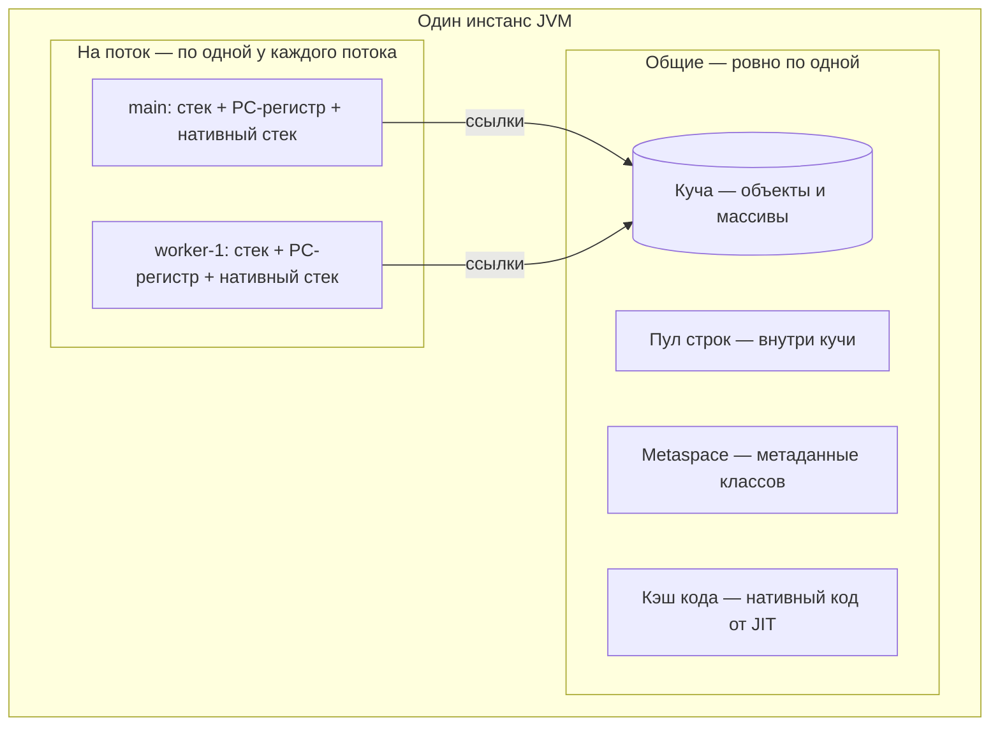
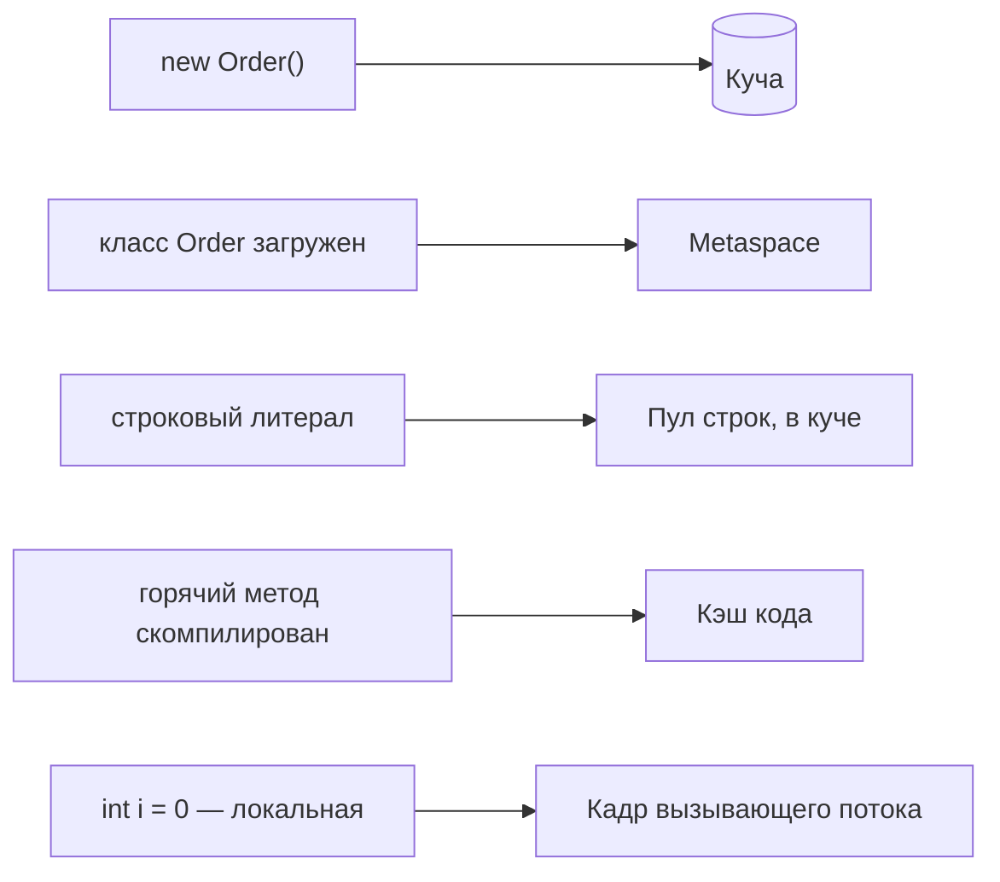

# Структуры памяти в Java: области данных времени выполнения JVM

## Короткий ответ

У работающей JVM нет «просто памяти» — у неё есть фиксированный набор **областей
данных времени выполнения**, и каждая область относится к одной из двух групп:

- **Общие для всего инстанса — ровно по одной:** **куча** (все объекты и массивы,
  управляется сборщиком мусора), **пул строк** (таблица внутри кучи),
  **Metaspace** (метаданные классов и runtime constant pool, в нативной памяти) и
  **кэш кода** (нативный код, порождённый JIT).
- **Приватные для потока — по одной на каждый живой поток:** **JVM-стек** (по
  одному кадру на каждый активный вызов метода), **PC-регистр** (где именно
  внутри текущего метода находится этот поток) и **стек нативных методов** (для
  вызовов `native`/JNI).

Поэтому вопрос о количестве отвечает сам на себя: **куча одна** — всегда, сколько
бы потоков ни работало, — и **стеков столько, сколько живых потоков**: это число
растёт при старте потока и падает при его завершении.

## Общие области

**Куча.** Каждый объект и каждый массив, созданный через `new`, живёт здесь —
каким бы потоком ни был выполнен `new`. Это единственная область, которой
управляет сборщик мусора; её размер задаётся `-Xms`/`-Xmx`, а внутри она разделена
на [поколения](topic:heap-generations), чтобы недолговечные объекты собирались
дёшево. Именно из-за того, что куча общая, два потока, трогающие один объект,
могут гоняться за данными — отсюда и нужда в синхронизации.

**Пул строк.** Интернированные строковые литералы дедуплицируются в одной
таблице, поэтому одинаковые литералы — это один объект. С Java 7 эта таблица
находится **внутри кучи** (раньше она жила в PermGen), поэтому интернированные
строки теперь собираются сборщиком мусора. `new String("OK")` намеренно обходит
пул и выделяет отдельный объект в куче — классическая причина, по которой `==` на
строках не работает (см. [Неизменяемость String](topic:string-immutability)).

**Metaspace (method area).** Когда [ClassLoader](topic:classloader) загружает
класс, *метаданные* класса — дескрипторы полей и методов, байт-код, runtime
constant pool и место для `static`-полей — сохраняются здесь, по одному
экземпляру на класс, сколько бы объектов вы ни создали. С Java 8 это **нативная
память вне кучи**, поэтому её ограничивает не `-Xmx`, а
`-XX:MaxMetaspaceSize`. Именно эта область пришла на смену PermGen.

**Кэш кода.** [JIT-компилятор](topic:java-jit-compilation) превращает горячие
методы в машинный код, и этот машинный код хранится здесь — не в куче и не в
Metaspace. Поэтому долго живущий Java-процесс со временем ускоряется, и поэтому
существует флаг `-XX:ReservedCodeCacheSize`.

## Области, приватные для потока

Каждый поток получает свои три области в момент старта и теряет все три при
завершении:

- **JVM-стек** — по одному кадру на активный вызов метода; кадр хранит локальные
  переменные вызова, стек операндов и адрес возврата. Локальные переменные
  кладутся и снимаются, сборщик мусора здесь ни при чём; см.
  [Вызовы методов и кадры стека](topic:method-call-stack-frames). Размер задаётся
  через `-Xss`.
- **PC-регистр** — адрес байт-код-инструкции, которую этот поток выполняет прямо
  сейчас. Именно он делает возможным
  [переключение контекста](topic:context-switch): поток можно приостановить и
  возобновить ровно с того места, где он был. (Пока выполняется нативный метод,
  его значение не определено.)
- **Стек нативных методов** — стек, который используется при вызове `native`
  метода через JNI; он отделён от кадров Java.

Смысл разделения именно в этом: стек фиксирует, *что делает один поток*, поэтому
его нельзя разделять; куча хранит *данные*, а данными потокам как раз и нужно
обмениваться. Та же граница разбирается в
[Стек и куча](topic:jvm-memory-areas) и подсчитывается в
[Сколько куч и стеков](topic:jvm-heaps-stacks-count).

## Почему это важно в продакшене

- **Каждая ошибка называет свою область.** `StackOverflowError` означает, что у
  *одного потока* кончились кадры стека
  ([StackOverflowError](topic:stackoverflow-error));
  `OutOfMemoryError: Java heap space` — что единственная куча забита достижимыми
  объектами ([Исключения и OutOfMemoryError](topic:exceptions-out-of-memory));
  `OutOfMemoryError: Metaspace` — что загружено слишком много классов (классический
  симптом повторных передеплоев или бесконтрольной генерации прокси);
  `OutOfMemoryError: unable to create new native thread` — что ОС отказала в ещё
  одном *стеке*.
- **Размер задаётся отдельно для каждой области.** `-Xmx` ограничивает только
  кучу. Стеки потоков (`-Xss`, обычно по 512 КБ — 1 МБ) живут *вне* неё, поэтому
  тысячи потоков съедают сотни мегабайт, которых `-Xmx` никогда не учитывал, — ещё
  одна практическая причина использовать [пул потоков](topic:java-thread-pool).
  Если контейнер убит OOM killer, а куча выглядит здоровой, обычно виноваты стеки,
  Metaspace или нативные буферы
  ([Диагностика роста памяти](topic:diagnosing-memory-leaks)).
- **Собирается только куча.** Кадры стека исчезают при возврате бесплатно;
  объекты в куче ждут [сборщик мусора](topic:gc-configuration) и утекают, пока на
  них кто-то ссылается ([Утечки памяти](topic:memory-leaks)).

## Ответ за 60 секунд на собеседовании

«JVM делит память времени выполнения на области, которые либо общие, либо
приватны для потока. Общие, по одной на инстанс: куча со всеми объектами и
массивами, управляемая GC и содержащая пул строк начиная с Java 7; Metaspace с
метаданными классов и статическими полями — в нативной памяти с Java 8, вместо
PermGen; и кэш кода со скомпилированным JIT нативным кодом. На поток, по одной у
каждого живого потока: JVM-стек с кадром на каждый вызов метода, PC-регистр и стек
нативных методов. Значит, у одного приложения ровно одна куча — всегда — и по
одному стеку на живой поток, поэтому число стеков меняется по мере старта и
завершения потоков. Это же говорит, откуда какая ошибка: StackOverflowError — стек
одного потока, OOM heap space — общая куча, OOM Metaspace — метаданные классов».

## Заблуждения и ловушки

- **«У каждого потока своя куча».** Нет — куча одна на инстанс JVM. Современные
  сборщики дают каждому потоку *thread-local allocation buffer* внутри этой кучи
  для быстрого выделения, но это кусок одной кучи, а не отдельная куча.
- **«У приложения один стек».** Нет — стек у каждого потока свой. Такая картина
  выглядит верной только в однопоточной программе.
- **«Кроме кучи и стека ничего нет».** Про них спрашивают первыми, но забыть
  Metaspace, кэш кода, PC-регистр и стек нативных методов — именно то, что этот
  вопрос и проверяет.
- **«Metaspace — часть кучи / его ограничивает `-Xmx`».** Нет — с Java 8 это
  нативная память, и её ограничивает `-XX:MaxMetaspaceSize`. Поэтому утечка в
  Metaspace растёт, пока дампы кучи выглядят чистыми.
- **«PermGen всё ещё существует».** Он удалён в Java 8 и заменён на Metaspace;
  флаг `-XX:MaxPermSize` игнорируется.
- **«`static`-поля лежат в стеке».** Слоты полей лежат вместе с классом в
  Metaspace, а объекты, на которые они ссылаются, — в куче.
- **«Стек хранит объекты».** Он хранит кадры с примитивными локальными
  переменными и *ссылками*; объекты, на которые указывают эти ссылки, находятся в
  куче (см. [Где хранятся ссылочные типы](topic:reference-types-storage) и
  [Что хранит переменная](topic:variable-storage)).
- **«Объекты умирают вместе с создавшим их потоком».** Нет — выбрасывается стек
  потока, а его объекты остаются в общей куче, пока на них есть достижимые ссылки.
