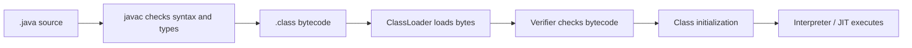
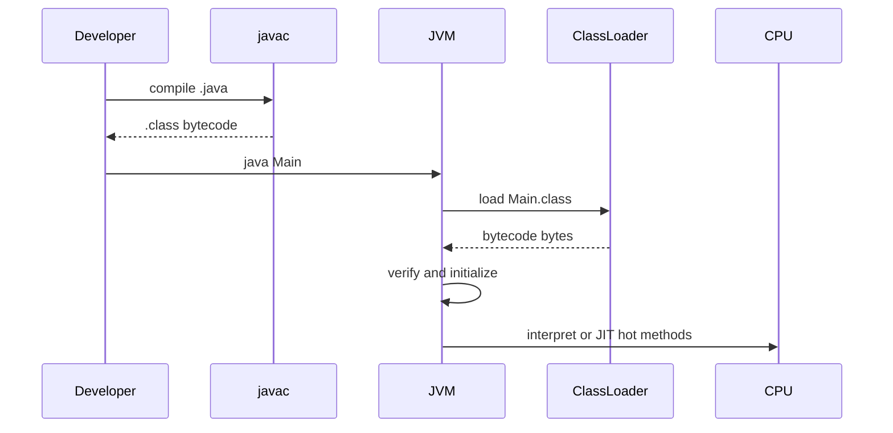

# How Java Source Code Becomes Running Code

## Key idea

The JVM does not execute Java source code directly. It executes JVM bytecode from `.class` files. `javac` belongs to the JDK and translates `.java` source into bytecode; the JVM then loads, verifies, initializes and executes that bytecode. Think of the `.java` file as a kitchen recipe written for humans, and `.class` bytecode as the standardized kitchen ticket that the production line can follow reliably.

## The path from `.java` to execution

1. The developer writes `.java` source code. It contains classes, methods, imports and statements in a human-readable form. Like a handwritten order in a cafe, it is understandable to people, but the kitchen machines do not run on handwriting.

2. `javac` compiles the source into `.class` files. It checks syntax, resolves names, checks types and emits JVM bytecode plus metadata. Like a post office sorting center, it turns a messy-looking letter into a standard labeled parcel that can move through the system.

3. The JVM starts from a main class and asks a `ClassLoader` for bytecode. Real loading details are covered in [ClassLoaders and Their Types](topic:classloader). Like a warehouse clerk, the loader does not cook the meal; it finds the right packaged ingredient and brings it to the counter.

4. The verifier checks the bytecode before it can run. It verifies format, supported class-file version, stack-map frames and type-safety rules. Like a traffic inspection checkpoint, it does not care what the driver wanted to do; it checks whether the vehicle is allowed on the road.

5. The class is prepared and initialized. Static fields receive default values, then explicit static initializers run before first active use. Like opening a kitchen station, the JVM stocks the counter before the first order is served.

6. The interpreter executes bytecode instructions. Method calls create stack frames, and objects are allocated on the heap; for the memory side, see [How Java Memory Is Organized: Stack vs Heap](topic:jvm-memory-areas) and [Method Calls and Stack Frames](topic:method-call-stack-frames). Like a cook following a ticket step by step, the interpreter handles instructions immediately.

7. Hot methods may be compiled by the JIT compiler into native machine code and stored in the Code Cache. Like a restaurant preparing a shortcut for a dish ordered all night, the JVM spends extra work on code that is used often enough to pay back the cost.

## 60-second interview answer

The JVM does not work with Java source code directly. The source file is compiled by `javac` into `.class` files containing JVM bytecode. When the program starts, the JVM uses class loaders to find bytecode, verifies that the bytecode is safe and well-formed, prepares and initializes the class, and then executes bytecode through the interpreter. During execution, frequently used methods can be compiled by the JIT compiler into native machine code for better performance. The source belongs to compile time; bytecode and runtime metadata are what the JVM actually consumes.

## Why this matters in production

Build failures happen before the JVM runs anything. If `javac` cannot compile the source, there is no `.class` artifact to deploy. Like a restaurant that cannot serve a dish without a printed kitchen ticket, production cannot run code that never became bytecode.

Runtime failures can happen even when compilation succeeded. Missing classes, wrong classpath entries, incompatible class-file versions and broken dependencies appear during loading or verification. Like a parcel with a valid label but a missing destination shelf, the package exists but cannot be used where the worker needs it.

Performance changes after warmup. The first requests often run through interpretation, while hot methods get JIT-compiled later. Like traffic lights adapting after rush hour begins, the JVM learns which routes deserve optimization.

Memory behavior starts when bytecode runs. Metadata goes to Metaspace, stack frames hold active method calls, heap objects hold runtime state, and generated native code lives in the Code Cache. Like a busy kitchen with labeled stations, each kind of work has its own counter.

## Common misconceptions

- "The JVM compiles `.java` files." Not in the normal flow: `javac` compiles source, the JVM executes bytecode. The JVM is the kitchen line, not the person rewriting the handwritten recipe into a ticket.
- "Bytecode is native machine code." Bytecode is portable JVM instruction format; native code is CPU-specific and appears after JIT compilation. It is like a universal parcel label versus a local courier route.
- "JIT means Java is always compiled before it starts." Java usually starts by interpreting bytecode and compiles hot parts later. It is like opening the cafe with normal procedures, then optimizing the dishes people keep ordering.
- "Class loading just reads a file." Loading includes search rules, delegation, linking, verification and initialization boundaries. It is closer to a warehouse receiving process than simply opening a box.
- "If source compiles, it must run everywhere." It still needs a compatible JVM version, available dependencies and valid runtime configuration. A perfect recipe still fails if the kitchen lacks the required tools.
