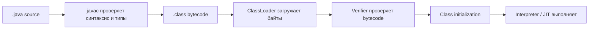
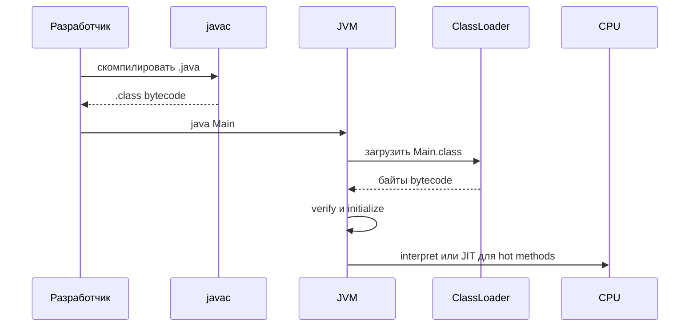

# Как Java source code становится работающей программой

## Главная идея

JVM не выполняет Java source code напрямую. Она выполняет JVM bytecode из `.class` файлов. `javac` относится к JDK и переводит `.java` source в bytecode; затем JVM загружает, проверяет, инициализирует и выполняет этот bytecode. Представь `.java` файл как рецепт на кухне, написанный для людей, а `.class` bytecode как стандартный кухонный чек, по которому линия готовки работает предсказуемо.

## Путь от `.java` к выполнению

1. Разработчик пишет `.java` source code. В нем есть классы, методы, imports и statements в форме, понятной человеку. Как рукописный заказ в кафе, он понятен людям, но кухонные машины не работают по рукописным заметкам.

2. `javac` компилирует source в `.class` файлы. Он проверяет синтаксис, разрешает имена, проверяет типы и создает JVM bytecode вместе с metadata. Как сортировочный центр на почте, он превращает неформально выглядящее письмо в стандартную промаркированную посылку, которая может двигаться по системе.

3. JVM стартует с main class и просит `ClassLoader` найти bytecode. Детали реальной загрузки разобраны в теме [ClassLoader и их виды](topic:classloader). Как кладовщик на складе, загрузчик не готовит блюдо; он находит нужный упакованный ингредиент и приносит его к стойке.

4. Verifier проверяет bytecode до выполнения. Он проверяет формат, поддерживаемую class-file version, stack-map frames и правила type-safety. Как пост дорожной инспекции, он не оценивает намерения водителя; он проверяет, можно ли выпускать машину на дорогу.

5. Класс подготавливается и инициализируется. Static fields получают значения по умолчанию, затем explicit static initializers выполняются перед первым active use. Как открытие кухонной станции, JVM раскладывает все по местам до первого заказа.

6. Interpreter выполняет bytecode instructions. Method calls создают stack frames, а objects выделяются в heap; про сторону памяти смотри [How Java Memory Is Organized: Stack vs Heap](topic:jvm-memory-areas) и [Method Calls and Stack Frames](topic:method-call-stack-frames). Как повар, который идет по чеку шаг за шагом, interpreter сразу выполняет инструкции.

7. Hot methods могут быть скомпилированы JIT compiler в native machine code и сохранены в Code Cache. Как ресторан, который делает быстрый маршрут для блюда, заказанного весь вечер, JVM тратит дополнительные усилия на код, который используется достаточно часто.

## Ответ за 60 секунд

JVM не работает с Java source code напрямую. Source file компилируется через `javac` в `.class` файлы, содержащие JVM bytecode. Когда программа стартует, JVM использует class loaders, чтобы найти bytecode, проверяет, что bytecode безопасен и корректно устроен, подготавливает и инициализирует класс, а затем выполняет bytecode через interpreter. Во время выполнения часто используемые методы могут быть скомпилированы JIT compiler в native machine code для лучшей производительности. Source относится к compile time; bytecode и runtime metadata — это то, что JVM реально потребляет.

## Почему это важно в production

Build failures происходят до того, как JVM что-либо запустит. Если `javac` не может скомпилировать source, то `.class` artifact для деплоя не появляется. Как ресторан не может подать блюдо без напечатанного кухонного чека, production не может выполнить код, который не стал bytecode.

Runtime failures могут случиться даже после успешной компиляции. Missing classes, неправильные classpath entries, несовместимые class-file versions и сломанные dependencies проявляются во время loading или verification. Как посылка с правильной этикеткой, но без нужной полки назначения, package существует, но работник не может использовать его там, где нужно.

Performance меняется после warmup. Первые запросы часто идут через interpretation, а hot methods компилируются JIT позже. Как светофоры, которые подстраиваются после начала часа пик, JVM понимает, какие маршруты стоит оптимизировать.

Memory behavior начинается, когда bytecode выполняется. Metadata попадает в Metaspace, stack frames держат активные method calls, heap objects хранят runtime state, а сгенерированный native code живет в Code Cache. Как на занятой кухне с подписанными станциями, у каждого вида работы есть своя стойка.

## Частые заблуждения

- «JVM компилирует `.java` файлы». В обычном потоке это не так: `javac` компилирует source, JVM выполняет bytecode. JVM — это кухонная линия, а не человек, переписывающий рукописный рецепт в чек.
- «Bytecode — это native machine code». Bytecode — переносимый формат инструкций JVM; native code зависит от CPU и появляется после JIT compilation. Это как универсальная почтовая маркировка против локального маршрута курьера.
- «JIT означает, что Java всегда компилируется до старта». Java обычно стартует с interpretation bytecode и компилирует hot части позже. Это как открыть кафе с обычными процедурами, а потом оптимизировать блюда, которые постоянно заказывают.
- «Class loading просто читает файл». Loading включает правила поиска, delegation, linking, verification и границы initialization. Это больше похоже на приемку товара на складе, чем на простое открытие коробки.
- «Если source компилируется, он обязан работать везде». Нужны совместимая JVM version, доступные dependencies и корректная runtime configuration. Даже идеальный рецепт не сработает, если на кухне нет нужных инструментов.
