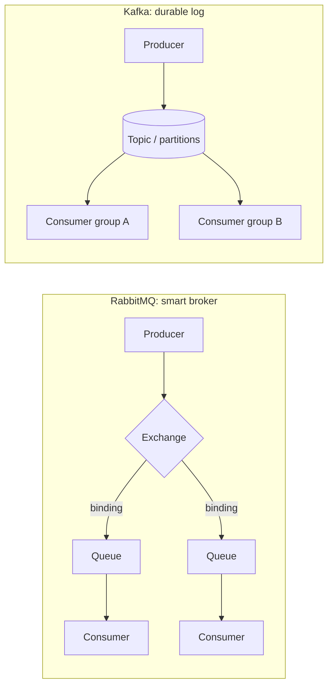
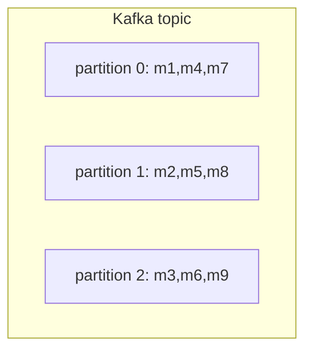
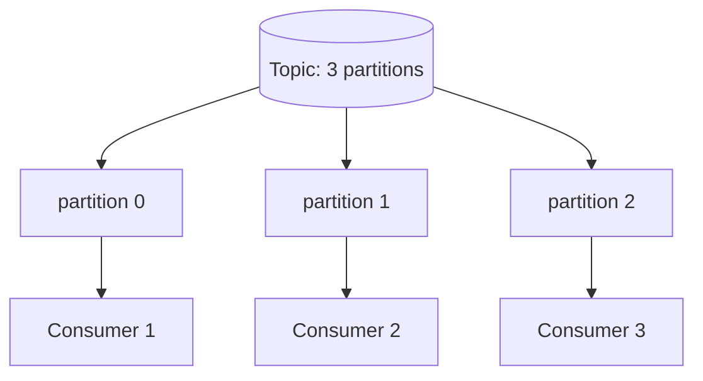

# Kafka vs RabbitMQ

Both move messages between services so producers and consumers don't have to talk
directly. But they are built on two different ideas, and that one idea explains
almost every other difference.

- **RabbitMQ is a post office.** You drop a letter at the counter; the post office
  reads the address, sorts it into the right mailbox, and delivers it. Once the
  recipient signs for it, the letter is gone — the post office doesn't keep a copy.
- **Kafka is a newspaper archive.** Every event is printed in order and kept on the
  shelf for a set time. Any number of readers can come in, each remembers which
  page they've reached, and they can re-read yesterday's paper whenever they want.

That difference — *deliver-then-forget* vs *append-to-a-log* — is the heart of the
comparison.

## Delivery model: push vs pull

RabbitMQ **pushes**. The broker is active: it routes each message and hands it to a
consumer, tracks acknowledgements, and re-delivers if the consumer crashes before
acking. *Like the post office actively driving the letter to your door and waiting
for a signature.*

Kafka **pulls**. The broker is mostly a dumb, fast log; consumers ask "give me
everything after offset 42" and advance their own bookmark (the *offset*). *Like a
reader walking into the archive and turning to the page where they left off.*
Because the broker isn't tracking per-message state for everyone, Kafka sustains
very high throughput.

## What happens after a message is read

This is the difference candidates most often miss:

- **RabbitMQ:** once a message is acknowledged it is **removed** from the queue. A
  message is normally consumed by exactly one consumer of a queue. *The signed-for
  letter leaves the post office.*
- **Kafka:** reading a message **does not delete it**. Records stay until a
  retention policy expires them (e.g. 7 days) or a size limit is hit. A new consumer
  group can start from the beginning and **replay** history. *Yesterday's newspaper
  is still on the shelf for the next reader.*

This is why Kafka shines for event sourcing, audit logs and feeding several
independent systems (analytics, search index, billing) from the **same** stream.

## Ordering

Kafka guarantees order **within a single partition**, not across the whole topic.
Messages sharing a key (e.g. `userId`) land in the same partition and stay ordered
relative to each other. *Each shelf in the archive is in strict date order, but two
different shelves aren't interleaved.* RabbitMQ keeps FIFO order **within one
queue** as long as a single consumer reads it; add competing consumers or
re-delivery and strict ordering weakens.

## Routing

RabbitMQ has rich, broker-side routing through **exchanges** and **bindings**
(direct, topic, fanout, headers). The producer just publishes; the exchange decides
which queues get a copy based on routing keys. *The post office's sorting room
applies clever rules to fan one letter out to many mailboxes.*

Kafka's routing is deliberately simpler: a producer writes to a **topic**, and a key
chooses the partition. Filtering and fan-out logic typically live in the consumers
or in stream-processing (Kafka Streams), not in the broker. *The archive just files
papers under a section; readers decide what to do with them.*

## Scaling consumers

Kafka scales reads through **partitions and consumer groups**: within a group, each
partition is read by exactly one consumer, so parallelism is capped by the partition
count. RabbitMQ scales a queue with **competing consumers** — several workers pull
from one queue and the broker load-balances messages between them (the classic
work-queue / task-distribution pattern). *Post office: more clerks emptying one
mailbox. Kafka: more readers, but no more than one per shelf.*

## Delivery semantics

- **RabbitMQ:** at-most-once (auto-ack, fire and forget) or at-least-once (manual
  ack with re-delivery on failure). Because re-delivery can duplicate a message,
  consumers should be idempotent.
- **Kafka:** at-least-once by default; **exactly-once** is achievable within Kafka
  using idempotent producers and transactions. Across external systems you still
  guard against duplicates.

Either way, when a service must publish a message *and* commit a database change
atomically, neither broker solves that alone — use the
[Outbox pattern](topic:outbox-pattern) to publish reliably, and the
[Inbox pattern](topic:inbox-pattern) to deduplicate redelivered messages on the
consumer side. "Exactly-once" end-to-end is really at-least-once plus idempotency,
which is why people lean on the database's [ACID](topic:acid-principles)
guarantees here. Spring apps often publish such events with a
[`@TransactionalEventListener`](topic:spring-transactional-event-listener) after
the transaction commits.

## 60-second interview answer

> RabbitMQ is a traditional message broker: a smart broker / dumb consumer model.
> It routes messages through exchanges and bindings, pushes them to consumers, and
> deletes each message once it's acknowledged. It's ideal for task queues, RPC, and
> complex routing where messages are commands to be processed once. Kafka is a
> distributed, append-only commit log: a dumb broker / smart consumer model.
> Producers append to partitioned topics, consumers pull by offset and track their
> own position, and messages are retained and replayable for a configured time
> regardless of who read them. Kafka is built for high-throughput event streaming
> and many independent consumers reading the same data. Rule of thumb: pick
> RabbitMQ for work queues and flexible routing; pick Kafka for event streaming,
> replay, and very high throughput.

## Common misconceptions

- ❌ "They're interchangeable message queues." — Kafka is a *log*, not a queue;
  reading doesn't remove data and consumers manage their own offsets.
- ❌ "Kafka guarantees total ordering." — Only **within a partition**. Across a topic
  there is no global order.
- ❌ "RabbitMQ can't scale / Kafka is always faster." — RabbitMQ handles large
  workloads fine; Kafka's edge is *streaming throughput and replay*, not magic.
- ❌ "Kafka gives exactly-once for free." — It's at-least-once by default;
  exactly-once needs idempotent producers/transactions and is bounded to Kafka.
- ❌ "More Kafka consumers in a group = more parallelism, always." — Parallelism is
  capped by the partition count; extra consumers in a group sit idle.
- ❌ "Kafka stores messages forever." — Only until the retention window or size limit;
  it's a buffer, not a database (unless you enable log compaction for keyed state).
