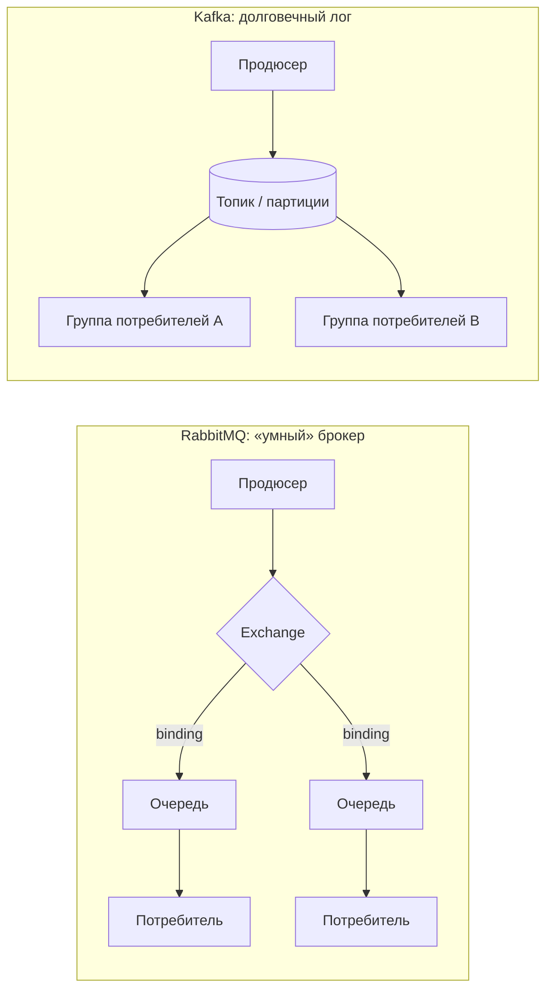
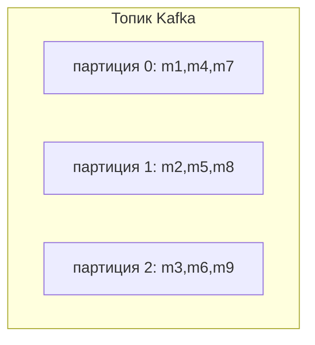
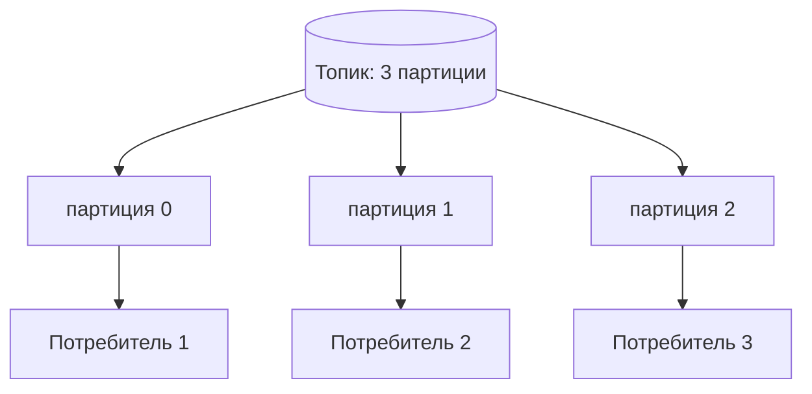

# Чем Kafka отличается от RabbitMQ

Обе системы передают сообщения между сервисами, чтобы продюсеры и потребители не
общались напрямую. Но они построены на двух разных идеях, и одна эта идея
объясняет почти все остальные различия.

- **RabbitMQ — это почта.** Вы сдаёте письмо в окошко; почта читает адрес,
  сортирует его в нужный ящик и доставляет. Как только получатель расписался,
  письмо исчезает — почта копию не хранит.
- **Kafka — это архив газет.** Каждое событие напечатано по порядку и лежит на
  полке заданное время. Сколько угодно читателей могут зайти, каждый помнит, до
  какой страницы дочитал, и они могут перечитать вчерашнюю газету когда захотят.

Это различие — *доставить-и-забыть* против *дописать-в-лог* — и есть суть
сравнения.

## Модель доставки: push против pull

RabbitMQ **проталкивает** (push). Брокер активен: он маршрутизирует каждое
сообщение и отдаёт его потребителю, отслеживает подтверждения (ack) и доставляет
повторно, если потребитель упал до подтверждения. *Как почта, которая сама везёт
письмо к вашей двери и ждёт подписи.*

Kafka **отдаёт по запросу** (pull). Брокер — это в основном «глупый», быстрый лог;
потребители просят «дай мне всё после смещения 42» и сами двигают свою закладку
(*offset*). *Как читатель, который заходит в архив и открывает страницу, где
остановился.* Поскольку брокер не отслеживает состояние каждого сообщения для
всех, Kafka выдерживает очень высокую пропускную способность.

## Что происходит с сообщением после прочтения

Этот момент кандидаты упускают чаще всего:

- **RabbitMQ:** как только сообщение подтверждено, оно **удаляется** из очереди.
  Сообщение обычно получает ровно один потребитель очереди. *Письмо, за которое
  расписались, покидает почту.*
- **Kafka:** чтение сообщения **не удаляет его**. Записи лежат, пока их не удалит
  политика хранения (например, 7 дней) или пока не достигнут лимит размера. Новая
  группа потребителей может начать с самого начала и **перечитать** историю.
  *Вчерашняя газета всё ещё на полке для следующего читателя.*

Поэтому Kafka хороша для event sourcing, журналов аудита и подачи одного и того же
потока в несколько независимых систем (аналитика, поисковый индекс, биллинг).

## Упорядочивание

Kafka гарантирует порядок **внутри одной партиции**, а не по всему топику.
Сообщения с одним ключом (например, `userId`) попадают в одну партицию и сохраняют
порядок относительно друг друга. *Каждая полка в архиве строго по датам, но две
разные полки не перемешаны между собой.* RabbitMQ сохраняет порядок FIFO **внутри
одной очереди**, пока её читает один потребитель; добавьте конкурирующих
потребителей или повторную доставку — и строгий порядок ослабевает.

## Маршрутизация

В RabbitMQ богатая маршрутизация на стороне брокера через **exchange** и
**binding** (direct, topic, fanout, headers). Продюсер просто публикует; exchange
по ключам маршрутизации решает, какие очереди получат копию. *Сортировочный зал
почты применяет хитрые правила, чтобы разослать одно письмо по многим ящикам.*

Маршрутизация Kafka намеренно проще: продюсер пишет в **топик**, а ключ выбирает
партицию. Логика фильтрации и размножения обычно живёт в потребителях или в
потоковой обработке (Kafka Streams), а не в брокере. *Архив просто подшивает
газеты по разделам; что с ними делать — решают читатели.*

## Масштабирование потребителей

Kafka масштабирует чтение через **партиции и группы потребителей**: внутри группы
каждую партицию читает ровно один потребитель, поэтому параллелизм ограничен числом
партиций. RabbitMQ масштабирует очередь через **конкурирующих потребителей** —
несколько воркеров тянут из одной очереди, а брокер распределяет сообщения между
ними (классический шаблон рабочей очереди / распределения задач). *Почта: больше
клерков опустошают один ящик. Kafka: больше читателей, но не более одного на
полку.*

## Семантики доставки

- **RabbitMQ:** at-most-once (auto-ack, «выстрелил и забыл») или at-least-once
  (ручной ack с повторной доставкой при сбое). Поскольку повторная доставка может
  продублировать сообщение, потребители должны быть идемпотентны.
- **Kafka:** по умолчанию at-least-once; **exactly-once** достижима внутри Kafka с
  помощью идемпотентных продюсеров и транзакций. На стыке с внешними системами всё
  равно защищайтесь от дубликатов.

В любом случае, когда сервис должен опубликовать сообщение *и* зафиксировать
изменение в БД атомарно, ни один брокер сам по себе это не решает — используйте
[шаблон Outbox](topic:outbox-pattern) для надёжной публикации и
[шаблон Inbox](topic:inbox-pattern) для дедупликации повторно доставленных
сообщений на стороне потребителя. Сквозной «exactly-once» — это на деле
at-least-once плюс идемпотентность, поэтому здесь опираются на гарантии
[ACID](topic:acid-principles) базы данных. Spring-приложения часто публикуют такие
события через
[`@TransactionalEventListener`](topic:spring-transactional-event-listener) после
фиксации транзакции.

## Ответ за 60 секунд

> RabbitMQ — традиционный брокер сообщений: модель «умный брокер / простой
> потребитель». Он маршрутизирует сообщения через exchange и binding,
> проталкивает их потребителям и удаляет каждое сообщение после подтверждения.
> Он идеален для очередей задач, RPC и сложной маршрутизации, где сообщения — это
> команды, которые надо обработать один раз. Kafka — распределённый, дописываемый
> в конец лог фиксаций: модель «простой брокер / умный потребитель». Продюсеры
> дописывают в партиционированные топики, потребители читают по offset и сами
> хранят свою позицию, а сообщения сохраняются и доступны для перечитывания
> заданное время независимо от того, кто их прочитал. Kafka создана для
> высоконагруженной потоковой обработки событий и множества независимых
> потребителей одних и тех же данных. Правило большого пальца: выбирайте RabbitMQ
> для рабочих очередей и гибкой маршрутизации; выбирайте Kafka для потоковой
> обработки, перечитывания и очень высокой пропускной способности.

## Частые заблуждения

- ❌ «Это взаимозаменяемые очереди сообщений.» — Kafka — это *лог*, а не очередь;
  чтение не удаляет данные, а потребители сами управляют своими offset.
- ❌ «Kafka гарантирует полный порядок.» — Только **внутри партиции**. По всему
  топику глобального порядка нет.
- ❌ «RabbitMQ не масштабируется / Kafka всегда быстрее.» — RabbitMQ нормально
  держит большие нагрузки; преимущество Kafka — *потоковая пропускная способность
  и перечитывание*, а не магия.
- ❌ «Kafka даёт exactly-once бесплатно.» — По умолчанию это at-least-once;
  exactly-once требует идемпотентных продюсеров/транзакций и ограничен пределами
  Kafka.
- ❌ «Больше потребителей в группе Kafka = всегда больше параллелизма.» —
  Параллелизм ограничен числом партиций; лишние потребители в группе простаивают.
- ❌ «Kafka хранит сообщения вечно.» — Только до окна хранения или лимита размера;
  это буфер, а не база данных (если не включить log compaction для состояния по
  ключу).
