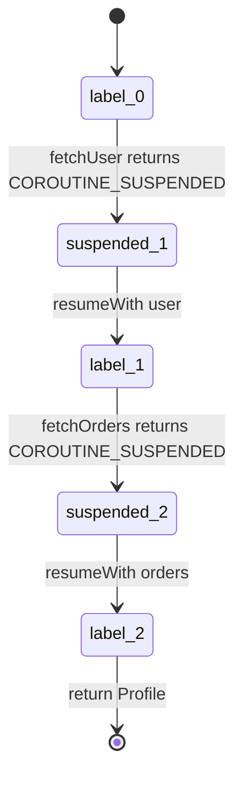
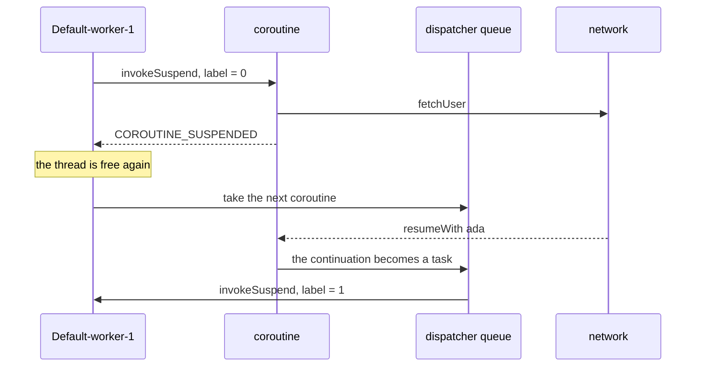
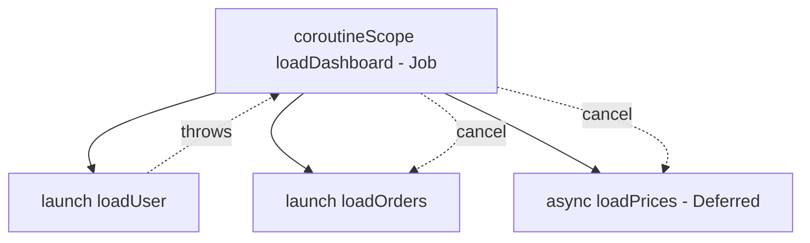

# How Kotlin Coroutines Work

## The sentence that decides the interview

**A coroutine is not a thread. It is an object on the heap, produced by a
compiler transformation, that knows where to continue from.**

Almost everyone answers "coroutines are lightweight threads". That is a slogan,
not a mechanism, and the next question is always *why* they are lightweight. The
real answer has three separable parts, and a strong candidate names all three:

1. **The compiler** rewrites every `suspend fun` into a state machine class.
2. **The runtime library** (`kotlinx.coroutines`) supplies dispatchers, which
   decide which thread runs a resumed state machine.
3. **Structured concurrency** puts every coroutine in a `Job` tree, which decides
   what happens when one of them finishes, fails, or is cancelled.

Part 1 is the language. Parts 2 and 3 are an ordinary library you could have
written yourself. Knowing where the line falls is most of the answer.

## Part 1 — what the compiler generates

Kotlin has exactly one keyword for this: `suspend`. Everything else is a library.

A suspend function can pause at a **suspension point** — a call to another
suspend function — and continue later. To do that without a thread stack, the
compiler applies a **CPS transform** (continuation-passing style):

```kotlin
suspend fun loadProfile(userId: Int): Profile {
    val user   = fetchUser(userId)      // suspension point
    val orders = fetchOrders(user.id)   // suspension point
    return Profile(user, orders)
}
```

Compiles, roughly, to a JVM method with **one extra parameter you never wrote**
and a generated class to be that parameter:

```java
// The signature the JVM actually sees: an extra Continuation, and Object as the
// return type, because it returns either a Profile or the COROUTINE_SUSPENDED marker.
Object loadProfile(int userId, Continuation<? super Profile> $completion)
```

```java
final class loadProfile$1 extends ContinuationImpl {
    int label;          // where to resume
    Object L$0;         // one field per local that must survive a suspension
    Object result;

    Object invokeSuspend(Object result) {
        switch (label) {
            case 0:  label = 1;
                     if (fetchUser(userId, this) == COROUTINE_SUSPENDED) return COROUTINE_SUSPENDED;
            case 1:  user = result; label = 2;
                     if (fetchOrders(user.id, this) == COROUTINE_SUSPENDED) return COROUTINE_SUSPENDED;
            case 2:  orders = result;
                     return new Profile(user, orders);
        }
    }
}
```

Three details are the whole mechanism:

- **`label` is written down before the call leaves.** That is the only
  bookkeeping a continuation needs, and it is why resuming lands on a *statement*
  rather than re-running a function.
- **Suspending is returning.** `COROUTINE_SUSPENDED` is a normal return value.
  `invokeSuspend` returns it, its caller returns it too, and the JVM
  [stack frames](topic:method-call-stack-frames) unwind completely — while the
  coroutine survives as `loadProfile$1` on the heap, holding its label and its
  locals. Compare that with `Thread.sleep`, which cannot return, so the thread
  has nowhere to go.
- **Resuming is a method call.** `continuation.resumeWith(Result.success(user))`
  calls `invokeSuspend` on the *same object* again, possibly on a different
  thread, and `switch (label)` jumps straight to case 1.



`Continuation<T>` itself is tiny — a `CoroutineContext` plus
`resumeWith(result: Result<T>)`. It is a callback. **Coroutines are callbacks
that the compiler writes for you**, which is why the code reads sequentially
while executing like a chain of completion handlers, and why they replace the
[anonymous-class](topic:anonymous-class) callback pyramids they were invented to
kill.

**A suspend function does not run in the background.** Until it hits a real
suspension point it executes on the caller's thread like any other call — and
most suspend calls return without suspending at all (a cache hit, an already
complete `Deferred`). `suspend` marks the *possibility*, not a thread change.

The cost of this approach is **function colouring**: a suspend function can only
be called from another suspend function or a coroutine builder. That is the price
Kotlin pays for a compile-time solution, and the main thing Java's virtual threads
avoid.

## Part 2 — dispatchers, and the difference between suspending and blocking

The compiler decides *how* a coroutine pauses; a `CoroutineDispatcher` decides
*which thread* runs it when it is resumed. It is essentially a
[thread pool](topic:java-thread-pool) whose tasks are continuations:

| Dispatcher | Threads | For |
| --- | --- | --- |
| `Default` | `max(2, cores)` | CPU work: parsing, sorting, hashing |
| `IO` | 64 or cores, whichever is larger | blocking calls: JDBC, files, legacy clients |
| `Main` | 1 | the UI thread (Android, Swing, JavaFX) |
| `Unconfined` | none of its own | resumes on whatever thread resumed it — for edge cases, not for you |

`Default` and `IO` share one underlying pool, so switching between them usually
costs no thread creation at all.



This is where the single most common production bug lives. **Being inside a
coroutine changes nothing about a call that is not a suspend function.**

```kotlin
launch(Dispatchers.Default) {
    val rows = jdbc.executeQuery(sql)   // BUG: blocks a Default worker
}
```

`Default` has one thread per core, so on a four-core box **four such calls stop
the entire dispatcher**. Nothing throws, nothing is logged; latency simply grows
with load and every other coroutine on `Default` — including cancellations that
want to run a `finally` block — waits. The fixes, in order of preference:

1. use a suspending client (R2DBC, Ktor client, `WebClient.awaitBody()`);
2. `withContext(Dispatchers.IO) { jdbc.executeQuery(sql) }` — a pool whose
   threads exist to be blocked;
3. your own `Dispatchers.IO.limitedParallelism(n)` when the resource behind it
   has a limit anyway, which is the coroutine spelling of a
   [semaphore](topic:semaphore).

`withContext` is **not** a new coroutine: it is one coroutine suspending on one
dispatcher and resuming on another, which is why it returns a value like an
ordinary call. And `delay(1000)` is not `Thread.sleep(1000)`: `delay` suspends
and schedules a resume, so a thousand delayed coroutines cost a thousand small
objects and one timer thread, while a thousand sleeping threads cost a thousand
stacks.

Because a coroutine can resume on a *different* worker of the same dispatcher,
**`ThreadLocal` is unreliable inside one**. Use `CoroutineContext` elements
(`asContextElement()`, `MDCContext` for logging). And nothing here removes the
[Java memory model](topic:happens-before): `kotlinx.coroutines` guarantees
happens-before between a suspension and its resumption, but two coroutines
touching the same variable are still an ordinary
[race condition](topic:race-condition-avoidance).

## Part 3 — structured concurrency

Every coroutine has a `CoroutineContext`, and the important element in it is the
**`Job`**. A `CoroutineScope` is little more than a holder for such a context, and
a coroutine started inside a scope becomes a **child of that scope's Job**.



Four rules follow, and they are the reason the feature exists:

- **A scope cannot finish before its children.** The closing brace of
  `coroutineScope { }` is a suspension point: the function suspends there — it
  does not block a thread — until every child is done. So you cannot accidentally
  return before the work you started has finished, which is exactly the guarantee
  [waiting for a pool of tasks](topic:executor-wait-all) makes you write by hand.
- **Cancelling a parent cancels the whole subtree.** One `cancel()` on a screen's
  scope takes its eleven in-flight requests with it.
- **A failing child cancels its siblings and the parent.** Half a loaded screen is
  usually worse than none.
- **`supervisorScope` changes only that last rule.** Independent children — five
  dashboard widgets — survive each other's failures. The price: the exception is
  now yours to handle, with `try/catch` around `await()` or a
  `CoroutineExceptionHandler`, or nobody hears about it.

`launch` returns a `Job` (fire and forget, exceptions propagate to the parent);
`async` returns a `Deferred<T>` (a Job with a result, exceptions also stored and
rethrown at `await()`). **Concurrency comes from starting both before awaiting
either:**

```kotlin
coroutineScope {
    val rate = async { fetchRate() }     // both requests are now in flight
    val fees = async { fetchFees() }
    Quote(rate.await(), fees.await())
}
```

Write `async { }.await()` on one line and you have written sequential code with
extra allocation — and the compiler will not warn you.

`GlobalScope.launch` opts out of all of this: no parent, so nobody waits for it,
nobody cancels it, and its failure is reported nowhere you are looking. It is the
coroutine version of starting a thread and dropping the reference. Use a scope
tied to a lifecycle (`viewModelScope`, `lifecycleScope`, a `CoroutineScope` your
component cancels in `close()`).

## Cancellation is cooperative

`job.cancel()` **does not stop anything**. It sets `isActive` to `false` and
returns. Two things can happen next:

- The coroutine is at (or reaches) a **suspension point**. Every suspending
  function in `kotlinx.coroutines` is cancellable, so instead of resuming with a
  value the continuation is resumed with a `CancellationException`, which unwinds
  the coroutine and runs its `finally` blocks. This is effectively instant.
- The coroutine is in a **loop that never suspends**. Nothing checks the flag, so
  it runs to the end and produces a result nobody will read.

```kotlin
while (isActive) { hash(nextBlock()) }   // exits with a partial result
// or
while (true) { ensureActive(); hash(nextBlock()) }   // throws CancellationException
// or
while (true) { yield(); hash(nextBlock()) }          // also lets others run
```

This is the same cooperative design as [stopping a thread](topic:stopping-a-thread)
with a flag, and for the same reason: forcibly killing a computation leaves
objects half-mutated, which is why `Thread.stop` was deprecated.

Two rules follow that interviewers look for:

- **Never swallow `CancellationException`.** `catch (e: Exception)` around a
  suspending call catches it too, and a coroutine that catches its own
  cancellation is uncancellable. Rethrow it, or catch narrowly.
- **Suspending cleanup needs `NonCancellable`.** In an already-cancelled coroutine
  every other suspension point throws immediately, so a `finally` that closes a
  connection over the network must be wrapped:
  `withContext(NonCancellable) { session.close() }`.

`withTimeout(500) { ... }` is built on exactly this: it cancels the block and
throws `TimeoutCancellationException` (`withTimeoutOrNull` returns `null`) — which
gives you a per-call deadline, but not retries or a circuit breaker; see
[timeouts, fallbacks and circuit breakers](topic:service-timeouts-fallbacks).

## Why it actually scales

| 100 000 concurrent operations | Memory | OS threads | Realistic? |
| --- | --- | --- | --- |
| platform threads | ~100 GB of reserved stack | 100 000 | no |
| coroutines | ~20 MB of continuation objects | 4 | yes |
| virtual threads (Java 21) | ~100 MB of heap stacks | 4 | yes |

A suspended coroutine holds **no stack, no OS thread and no kernel object** — it
is one object whose size is its captured locals. Resuming it is a virtual method
call, not a [context switch](topic:context-switch), which is the other half of the
saving: no kernel entry, no scheduler, no cache invalidation.

Compared with [Java's threading model](topic:java-multithreading), the trade is:
coroutines are a **compile-time** solution, so they work on Java 8 and Android and
give you structured concurrency and cancellation for free, at the cost of
colouring every function with `suspend`. **Java 21 virtual threads** are a
**runtime** solution — the JVM parks and unparks the continuation itself — so
ordinary blocking code becomes cheap with no keyword and no API change, but there
is no built-in cancellation tree (structured concurrency is still being finished)
and per-task memory is somewhat higher.

## The 60-second interview answer

> A coroutine is not a thread — it is an object. The Kotlin compiler rewrites
> every `suspend fun` into a state machine: a generated class with an `int label`,
> one field per local that has to survive a suspension, and a hidden
> `Continuation` parameter. At a suspension point the function either returns a
> value or returns the marker `COROUTINE_SUSPENDED`; in that case `invokeSuspend`
> returns, the JVM stack unwinds and the thread is released, while the coroutine
> stays alive on the heap. Resuming means calling `invokeSuspend` on the same
> object again, and `when (label)` jumps back to the statement where it stopped —
> so suspending is a return and blocking is not, which is the entire difference.
> A `CoroutineDispatcher` decides which thread a resumed continuation runs on:
> `Default` is sized to the cores for computation, `IO` is large because its
> threads are meant to be blocked. That is why a JDBC call on `Dispatchers.Default`
> is a real bug — it holds a core hostage and nothing tells you. On top of that,
> structured concurrency puts every coroutine in a `Job` tree: a scope does not
> return before its children, cancelling a parent cancels the subtree, and a
> failing child cancels its siblings unless you asked for a `supervisorScope`.
> Cancellation is cooperative — instant at a suspension point, invisible in a loop
> that never suspends, which is why you add `ensureActive()` or `yield()`. And
> because a suspended coroutine costs an object rather than a megabyte of stack,
> a hundred thousand of them fit on four threads.

## What actually breaks in production

- **Blocking on `Dispatchers.Default`.** JDBC, `Thread.sleep`, `File.readBytes`,
  any old SDK. Symptom: latency grows with load, thread dumps show workers inside
  socket reads, and CPU is low. Move it to `IO` or use a suspending client.
- **`runBlocking` inside a suspend function or a request handler.** It blocks the
  calling thread until the coroutine finishes, undoing the whole point. It belongs
  in `main`, in tests (`runTest`) and at the edge of a blocking framework —
  nowhere else.
- **`GlobalScope`.** Work that outlives the screen or the request that wanted it,
  keeps its references alive, and fails silently. Not a JVM
  [memory leak](topic:memory-leaks) exactly — worse, because the work is running.
- **Swallowed `CancellationException`.** A generic `catch (e: Exception)` makes a
  coroutine that cannot be cancelled and a timeout that does not time out.
- **`async` that is never awaited.** In a `supervisorScope` its exception is
  stored in the `Deferred` and, if nobody calls `await()`, disappears entirely.
- **A `finally` that suspends after cancellation.** It throws instantly, so the
  connection is never closed. Wrap it in `withContext(NonCancellable)`.
- **`ThreadLocal`-based context.** Security context, MDC, transaction bindings and
  anything else keyed by thread breaks the moment a coroutine resumes on a
  different worker. Use context elements.
- **Shared mutable state.** Coroutines do not make anything thread-safe. On a
  multi-threaded dispatcher you still need `Mutex` (suspending, not blocking —
  don't hold a [monitor](topic:critical-section) across a suspension point),
  atomics, [concurrent collections](topic:concurrent-synchronized-collections), or
  confinement to a single-threaded dispatcher.
- **Unbounded fan-out.** `list.map { async { call(it) } }` on ten thousand items
  starts ten thousand requests. `limitedParallelism`, a `Semaphore` or chunking is
  still your job.
- **Debugging blind.** Stack traces are short because the stack is gone. Turn on
  `-Dkotlinx.coroutines.debug`, name coroutines with `CoroutineName`, and use
  `DebugProbes` or the IntelliJ coroutine debugger to see who is suspended where.

## Common traps and misconceptions

- **"Coroutines are lightweight threads."** They are objects. Nothing about them
  is a thread; they borrow one only while executing.
- **"`suspend` makes it run in the background."** It marks a function as
  *suspendable*. Its code runs on the caller's thread until something actually
  suspends. `suspend fun` with a blocking body is a blocking function with a
  misleading signature.
- **"Coroutines are always faster."** They make waiting cheap. Pure computation is
  exactly as expensive as it was, plus a little allocation and a few virtual
  calls.
- **"Coroutines are parallel."** They are *concurrent*. Parallelism comes only
  from a dispatcher with more than one thread — on `Dispatchers.Main` or a
  `limitedParallelism(1)` dispatcher, two coroutines never run at the same
  instant.
- **"So a single-threaded dispatcher makes my state safe."** Only against
  simultaneous access — a coroutine can still suspend in the middle of a
  multi-step update and another can run between the steps. Confinement removes
  data races, not logical ones.
- **"`launch` starts running immediately."** It schedules; the block may not have
  started when `launch` returns. `start = CoroutineStart.UNDISPATCHED` is the
  opt-out.
- **"`async` gives me concurrency."** Only if you start everything before the
  first `await()`.
- **"`cancel()` stops the coroutine."** It requests cancellation. A loop that
  never suspends never notices.
- **"An exception in a coroutine is lost."** The opposite: it fails the Job and
  propagates to the parent, cancelling siblings — which surprises people far more
  often than losing it would.
- **"Coroutines replaced threads."** Underneath every coroutine there is a
  perfectly ordinary [thread pool](topic:thread-vs-threadpool). Coroutines are a
  way to stop wasting the threads you have.
- **"Coroutines are magic."** They are a `switch` on an `int` field plus a queue
  of callbacks. Being able to say that sentence is what separates a memorised
  answer from an understood one.
