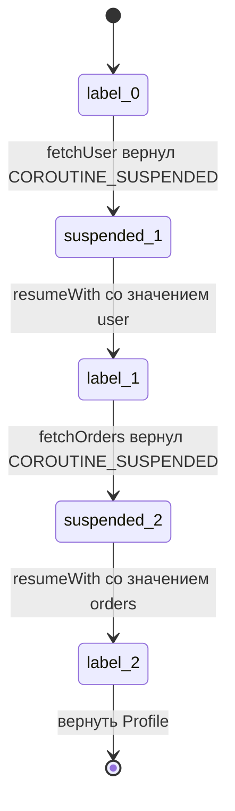
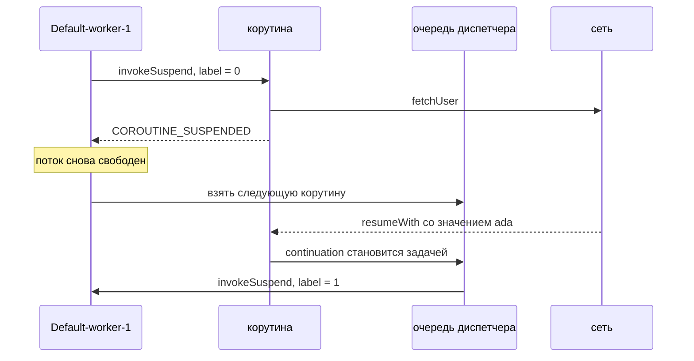
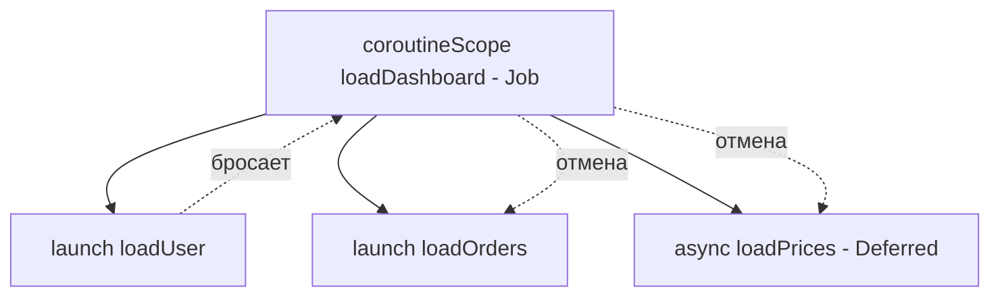

# Как работают корутины Kotlin

## Фраза, которая решает собеседование

**Корутина — это не поток. Это объект в куче, порождённый преобразованием
компилятора, который знает, откуда продолжать.**

Почти все отвечают «корутины — это лёгкие потоки». Это лозунг, а не механизм, и
следующий вопрос всегда — *почему* они лёгкие. Настоящий ответ состоит из трёх
отделимых частей, и сильный кандидат называет все три:

1. **Компилятор** переписывает каждую `suspend fun` в класс-машину состояний.
2. **Библиотека времени выполнения** (`kotlinx.coroutines`) даёт диспетчеры,
   которые решают, какой поток выполнит возобновлённую машину состояний.
3. **Структурная конкурентность** помещает каждую корутину в дерево `Job`, а оно
   решает, что произойдёт, когда одна из них завершится, упадёт или будет
   отменена.

Часть 1 — это язык. Части 2 и 3 — обычная библиотека, которую вы могли бы
написать сами. Понимание, где проходит эта граница, — уже большая часть ответа.

## Часть 1 — что генерирует компилятор

В Kotlin для всего этого есть ровно одно ключевое слово: `suspend`. Всё остальное
— библиотека.

Suspend-функция может остановиться в **точке приостановки** — на вызове другой
suspend-функции — и продолжиться позже. Чтобы делать это без стека потока,
компилятор применяет **CPS-преобразование** (передача продолжений):

```kotlin
suspend fun loadProfile(userId: Int): Profile {
    val user   = fetchUser(userId)      // точка приостановки
    val orders = fetchOrders(user.id)   // точка приостановки
    return Profile(user, orders)
}
```

Компилируется примерно в метод JVM с **одним лишним параметром, которого вы не
писали**, и сгенерированный класс, который этим параметром и является:

```java
// Сигнатура, которую реально видит JVM: лишний Continuation и Object в качестве
// возвращаемого типа, потому что возвращается либо Profile, либо маркер COROUTINE_SUSPENDED.
Object loadProfile(int userId, Continuation<? super Profile> $completion)
```

```java
final class loadProfile$1 extends ContinuationImpl {
    int label;          // откуда продолжать
    Object L$0;         // по полю на каждую локальную переменную, переживающую приостановку
    Object result;

    Object invokeSuspend(Object result) {
        switch (label) {
            case 0:  label = 1;
                     if (fetchUser(userId, this) == COROUTINE_SUSPENDED) return COROUTINE_SUSPENDED;
            case 1:  user = result; label = 2;
                     if (fetchOrders(user.id, this) == COROUTINE_SUSPENDED) return COROUTINE_SUSPENDED;
            case 2:  orders = result;
                     return new Profile(user, orders);
        }
    }
}
```

Весь механизм — в трёх деталях:

- **`label` записывается до того, как вызов уходит.** Это единственная
  бухгалтерия, нужная continuation, и именно поэтому возобновление попадает на
  *оператор*, а не заново выполняет функцию.
- **Приостановка — это возврат.** `COROUTINE_SUSPENDED` — обычное возвращаемое
  значение. `invokeSuspend` возвращает его, вызвавший тоже возвращает,
  и [кадры стека JVM](topic:method-call-stack-frames) полностью разматываются — а
  корутина выживает объектом `loadProfile$1` в куче, храня свой label и свои
  локальные переменные. Сравните с `Thread.sleep`, который вернуться не может,
  поэтому потоку некуда деваться.
- **Возобновление — это вызов метода.**
  `continuation.resumeWith(Result.success(user))` снова вызывает `invokeSuspend`
  на *том же объекте*, возможно на другом потоке, и `switch (label)` прыгает сразу
  в ветку 1.



Сам `Continuation<T>` крошечный — `CoroutineContext` плюс
`resumeWith(result: Result<T>)`. Это колбэк. **Корутины — это колбэки, которые за
вас пишет компилятор**, поэтому код читается последовательно, а выполняется как
цепочка обработчиков завершения, и поэтому они заменили те пирамиды из
[анонимных классов](topic:anonymous-class), ради убийства которых их и придумали.

**Suspend-функция не выполняется в фоне.** Пока она не дошла до настоящей точки
приостановки, она выполняется на потоке вызывающего, как любой другой вызов, — а
большинство suspend-вызовов вообще возвращаются без приостановки (попадание в
кэш, уже завершённый `Deferred`). `suspend` отмечает *возможность*, а не смену
потока.

Цена такого подхода — **«окраска» функций**: suspend-функцию можно вызвать только
из другой suspend-функции или из построителя корутины. Это плата Kotlin за
решение на уровне компиляции и главное, чего избегают виртуальные потоки Java.

## Часть 2 — диспетчеры и разница между приостановкой и блокировкой

Компилятор решает, *как* корутина приостанавливается; `CoroutineDispatcher`
решает, *какой поток* её выполнит при возобновлении. По сути это
[пул потоков](topic:java-thread-pool), задачами которого являются continuation'ы:

| Диспетчер | Потоки | Для чего |
| --- | --- | --- |
| `Default` | `max(2, ядра)` | вычисления: разбор, сортировка, хеширование |
| `IO` | 64 или число ядер, что больше | блокирующие вызовы: JDBC, файлы, старые клиенты |
| `Main` | 1 | поток UI (Android, Swing, JavaFX) |
| `Unconfined` | своих нет | возобновляется на том потоке, который его возобновил, — для краевых случаев, не для вас |

`Default` и `IO` используют один общий пул, поэтому переключение между ними
обычно вообще не создаёт потоков.



Именно здесь живёт самая частая продакшен-ошибка. **Нахождение внутри корутины
ничего не меняет для вызова, который не является suspend-функцией.**

```kotlin
launch(Dispatchers.Default) {
    val rows = jdbc.executeQuery(sql)   // ОШИБКА: блокирует воркер Default
}
```

У `Default` по потоку на ядро, поэтому на четырёхъядерной машине **четыре таких
вызова останавливают весь диспетчер**. Ничего не падает, ничего не логируется:
задержка просто растёт с нагрузкой, а все остальные корутины на `Default` — в том
числе отмены, которым нужно выполнить блок `finally`, — ждут. Решения в порядке
предпочтения:

1. взять приостанавливающийся клиент (R2DBC, Ktor client,
   `WebClient.awaitBody()`);
2. `withContext(Dispatchers.IO) { jdbc.executeQuery(sql) }` — пул, чьи потоки для
   того и существуют, чтобы блокироваться;
3. собственный `Dispatchers.IO.limitedParallelism(n)`, когда у ресурса за ним и
   так есть предел, — это корутинное написание
   [семафора](topic:semaphore).

`withContext` — это **не** новая корутина: это одна корутина, которая
приостанавливается на одном диспетчере и возобновляется на другом, потому она и
возвращает значение, как обычный вызов. А `delay(1000)` — это не
`Thread.sleep(1000)`: `delay` приостанавливает и планирует возобновление, поэтому
тысяча отложенных корутин стоит тысячи мелких объектов и одного потока-таймера, а
тысяча спящих потоков — тысячи стеков.

Поскольку корутина может возобновиться на *другом* воркере того же диспетчера,
**`ThreadLocal` внутри неё ненадёжен**. Используйте элементы `CoroutineContext`
(`asContextElement()`, `MDCContext` для логирования). И ничто здесь не отменяет
[модель памяти Java](topic:happens-before): `kotlinx.coroutines` гарантирует
happens-before между приостановкой и возобновлением, но две корутины, трогающие
одну переменную, — это по-прежнему обычная
[гонка](topic:race-condition-avoidance).

## Часть 3 — структурная конкурентность

У каждой корутины есть `CoroutineContext`, и важный элемент в нём — **`Job`**.
`CoroutineScope` — это немногим больше, чем держатель такого контекста, а
корутина, запущенная внутри области, становится **ребёнком Job этой области**.



Отсюда следуют четыре правила, ради которых всё и затевалось:

- **Область не может завершиться раньше своих детей.** Закрывающая скобка
  `coroutineScope { }` — это точка приостановки: функция приостанавливается там —
  не блокируя поток — пока не закончится каждый ребёнок. Поэтому нельзя случайно
  вернуться раньше, чем закончится запущенная работа, — ровно ту гарантию, которую
  при [ожидании пула задач](topic:executor-wait-all) приходится писать руками.
- **Отмена родителя отменяет всё поддерево.** Один `cancel()` на области экрана
  уносит с собой все одиннадцать его летящих запросов.
- **Упавший ребёнок отменяет соседей и родителя.** Наполовину загруженный экран
  обычно хуже, чем незагруженный.
- **`supervisorScope` меняет только последнее правило.** Независимые дети — пять
  виджетов дашборда — переживают падения друг друга. Цена: исключение теперь ваше,
  ловите его `try/catch` вокруг `await()` или через `CoroutineExceptionHandler`,
  иначе о нём никто не узнает.

`launch` возвращает `Job` (запустил и забыл, исключения уходят родителю); `async`
возвращает `Deferred<T>` (тот же Job, но с результатом; исключение вдобавок
сохраняется и перебрасывается на `await()`). **Конкурентность берётся из того, что
оба запущены до первого `await`:**

```kotlin
coroutineScope {
    val rate = async { fetchRate() }     // оба запроса уже в полёте
    val fees = async { fetchFees() }
    Quote(rate.await(), fees.await())
}
```

Напишите `async { }.await()` в одну строку — и вы написали последовательный код с
лишними аллокациями, причём компилятор не предупредит.

`GlobalScope.launch` отказывается от всего этого: родителя нет, поэтому её никто
не ждёт, никто не отменяет, а о её падении не узнаёт никто из тех, кто смотрит.
Это корутинная версия «запустил поток и потерял ссылку». Используйте область,
привязанную к жизненному циклу (`viewModelScope`, `lifecycleScope`,
`CoroutineScope`, который ваш компонент отменяет в `close()`).

## Отмена кооперативна

`job.cancel()` **ничего не останавливает**. Он выставляет `isActive` в `false` и
возвращается. Дальше возможны две вещи:

- Корутина находится (или доходит) в **точке приостановки**. Все
  приостанавливающие функции `kotlinx.coroutines` отменяемы, поэтому вместо
  значения continuation возобновляют исключением `CancellationException`, которое
  разматывает корутину и выполняет её блоки `finally`. Это происходит фактически
  мгновенно.
- Корутина находится в **цикле, который никогда не приостанавливается**. Флаг
  никто не проверяет, поэтому она досчитывает до конца и выдаёт результат, который
  никто не прочитает.

```kotlin
while (isActive) { hash(nextBlock()) }   // выходит с частичным результатом
// или
while (true) { ensureActive(); hash(nextBlock()) }   // бросает CancellationException
// или
while (true) { yield(); hash(nextBlock()) }          // ещё и даёт поработать другим
```

Это тот же кооперативный подход, что и при
[остановке потока](topic:stopping-a-thread) флагом, и по той же причине:
насильственное убийство вычисления оставляет объекты наполовину изменёнными —
из-за этого и объявили устаревшим `Thread.stop`.

Отсюда два правила, которых ждут на собеседовании:

- **Никогда не проглатывайте `CancellationException`.** `catch (e: Exception)`
  вокруг приостанавливающего вызова ловит и его, а корутина, поймавшая свою
  собственную отмену, становится неотменяемой. Пробрасывайте его или ловите узко.
- **Приостанавливающейся уборке нужен `NonCancellable`.** В уже отменённой
  корутине любая другая точка приостановки бросает немедленно, поэтому `finally`,
  закрывающий соединение по сети, надо обернуть:
  `withContext(NonCancellable) { session.close() }`.

`withTimeout(500) { ... }` построен ровно на этом: он отменяет блок и бросает
`TimeoutCancellationException` (`withTimeoutOrNull` возвращает `null`) — это даёт
дедлайн на вызов, но не повторы и не предохранитель; см.
[таймауты, fallback'и и circuit breaker](topic:service-timeouts-fallbacks).

## Почему это действительно масштабируется

| 100 000 конкурентных операций | Память | Потоки ОС | Реалистично? |
| --- | --- | --- | --- |
| платформенные потоки | ~100 ГБ зарезервированного стека | 100 000 | нет |
| корутины | ~20 МБ объектов continuation | 4 | да |
| виртуальные потоки (Java 21) | ~100 МБ стеков в куче | 4 | да |

Приостановленная корутина не держит **ни стека, ни потока ОС, ни объекта ядра** —
это один объект, размер которого равен её захваченным локальным переменным. Её
возобновление — вызов виртуального метода, а не
[переключение контекста](topic:context-switch), и в этом вторая половина
экономии: ни входа в ядро, ни планировщика, ни инвалидации кэшей.

По сравнению с [моделью многопоточности Java](topic:java-multithreading) размен
такой: корутины — решение **времени компиляции**, поэтому они работают на Java 8 и
Android и бесплатно дают структурную конкурентность и отмену, но ценой «окраски»
каждой функции словом `suspend`. **Виртуальные потоки Java 21** — решение
**времени выполнения**: JVM сама паркует и распарковывает continuation, поэтому
обычный блокирующий код становится дешёвым без ключевых слов и без изменения API,
но встроенного дерева отмены нет (структурную конкурентность там ещё доделывают),
а памяти на задачу уходит несколько больше.

## Ответ на собеседовании за 60 секунд

> Корутина — не поток, а объект. Компилятор Kotlin переписывает каждую
> `suspend fun` в машину состояний: сгенерированный класс с полем `int label`, по
> полю на каждую локальную переменную, которая должна пережить приостановку, и
> скрытым параметром `Continuation`. В точке приостановки функция либо возвращает
> значение, либо возвращает маркер `COROUTINE_SUSPENDED`; во втором случае
> `invokeSuspend` возвращается, стек JVM разматывается и поток освобождается, а
> корутина остаётся живой в куче. Возобновление — это повторный вызов
> `invokeSuspend` на том же объекте, и `when (label)` прыгает обратно к тому
> оператору, на котором остановились: приостановка — это возврат, а блокировка
> нет, и в этом вся разница. `CoroutineDispatcher` решает, на каком потоке
> выполнится возобновлённый continuation: `Default` рассчитан на число ядер и
> предназначен для вычислений, `IO` большой, потому что его потоки и должны
> блокироваться. Поэтому вызов JDBC на `Dispatchers.Default` — настоящая ошибка:
> он берёт ядро в заложники, и никто об этом не сообщит. Поверх этого структурная
> конкурентность помещает каждую корутину в дерево `Job`: область не возвращается
> раньше детей, отмена родителя отменяет поддерево, а упавший ребёнок отменяет
> соседей, если только вы не попросили `supervisorScope`. Отмена кооперативна —
> мгновенна в точке приостановки и невидима в цикле, который не
> приостанавливается, поэтому туда добавляют `ensureActive()` или `yield()`. А так
> как приостановленная корутина стоит объекта, а не мегабайта стека, сто тысяч
> таких помещаются на четыре потока.

## Что реально ломается в продакшене

- **Блокировка на `Dispatchers.Default`.** JDBC, `Thread.sleep`,
  `File.readBytes`, любой старый SDK. Симптом: задержка растёт с нагрузкой, в
  дампах потоков воркеры сидят в чтении сокетов, а CPU низкий. Переносите на `IO`
  или берите приостанавливающийся клиент.
- **`runBlocking` внутри suspend-функции или обработчика запроса.** Он блокирует
  вызывающий поток, пока корутина не закончится, обнуляя весь смысл. Его место — в
  `main`, в тестах (`runTest`) и на границе с блокирующим фреймворком, и больше
  нигде.
- **`GlobalScope`.** Работа, которая переживает экран или запрос, ради которого
  затевалась, держит их ссылки и падает молча. Это не совсем
  [утечка памяти](topic:memory-leaks) в смысле JVM — это хуже, потому что работа
  выполняется.
- **Проглоченный `CancellationException`.** Общий `catch (e: Exception)` даёт
  корутину, которую нельзя отменить, и таймаут, который не срабатывает.
- **`async`, которого никто не дождался.** В `supervisorScope` его исключение
  сохраняется в `Deferred` и, если `await()` никто не вызовет, исчезает совсем.
- **`finally`, который приостанавливается после отмены.** Он бросает сразу,
  поэтому соединение так и не закроется. Оборачивайте в
  `withContext(NonCancellable)`.
- **Контекст на `ThreadLocal`.** Контекст безопасности, MDC, привязки транзакций и
  всё прочее, ключом чему поток, ломается в момент, когда корутина возобновляется
  на другом воркере. Используйте элементы контекста.
- **Разделяемое изменяемое состояние.** Корутины ничего не делают
  потокобезопасным. На многопоточном диспетчере по-прежнему нужны `Mutex`
  (приостанавливающий, а не блокирующий — не держите
  [монитор](topic:critical-section) через точку приостановки), атомики,
  [конкурентные коллекции](topic:concurrent-synchronized-collections) или
  привязка к однопоточному диспетчеру.
- **Неограниченный веер запросов.** `list.map { async { call(it) } }` на десяти
  тысячах элементов запускает десять тысяч запросов. `limitedParallelism`,
  `Semaphore` или разбиение на части — по-прежнему ваша задача.
- **Отладка вслепую.** Стектрейсы короткие, потому что стека нет. Включайте
  `-Dkotlinx.coroutines.debug`, называйте корутины через `CoroutineName` и
  смотрите `DebugProbes` или отладчик корутин в IntelliJ, чтобы понять, кто где
  приостановлен.

## Частые ловушки и заблуждения

- **«Корутины — это лёгкие потоки».** Это объекты. В них нет ничего от потока;
  поток они одалживают только на время выполнения.
- **«`suspend` заставляет функцию работать в фоне».** Он помечает функцию как
  *приостанавливаемую*. Её код выполняется на потоке вызывающего, пока что-нибудь
  действительно не приостановится. `suspend fun` с блокирующим телом — это
  блокирующая функция с обманчивой сигнатурой.
- **«Корутины всегда быстрее».** Они удешевляют ожидание. Чистое вычисление стоит
  ровно столько же, сколько стоило, плюс немного аллокаций и несколько виртуальных
  вызовов.
- **«Корутины параллельны».** Они *конкурентны*. Параллелизм даёт только
  диспетчер с более чем одним потоком: на `Dispatchers.Main` или диспетчере с
  `limitedParallelism(1)` две корутины никогда не выполняются в один и тот же
  момент.
- **«Значит, однопоточный диспетчер делает моё состояние безопасным».** Только от
  одновременного доступа: корутина всё равно может приостановиться посреди
  многошагового обновления, и между шагами выполнится другая. Привязка убирает
  гонки данных, но не логические гонки.
- **«`launch` начинает выполняться сразу».** Он планирует; к моменту возврата из
  `launch` блок может ещё не начаться. Отказаться от этого можно через
  `start = CoroutineStart.UNDISPATCHED`.
- **«`async` даёт конкурентность».** Только если запустить всё до первого
  `await()`.
- **«`cancel()` останавливает корутину».** Он запрашивает отмену. Цикл, который не
  приостанавливается, её не замечает.
- **«Исключение в корутине теряется».** Наоборот: оно роняет Job и уходит
  родителю, отменяя соседей, — и это удивляет людей гораздо чаще, чем удивила бы
  потеря.
- **«Корутины заменили потоки».** Под каждой корутиной лежит совершенно обычный
  [пул потоков](topic:thread-vs-threadpool). Корутины — это способ перестать
  впустую тратить те потоки, что у вас есть.
- **«Корутины — это магия».** Это `switch` по полю типа `int` плюс очередь
  колбэков. Умение произнести эту фразу и отличает заученный ответ от понятого.
