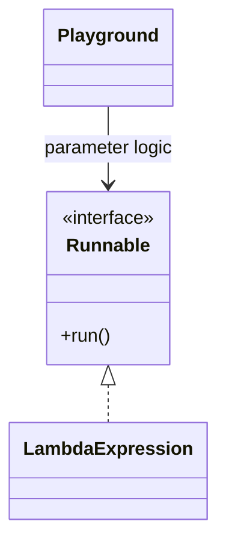
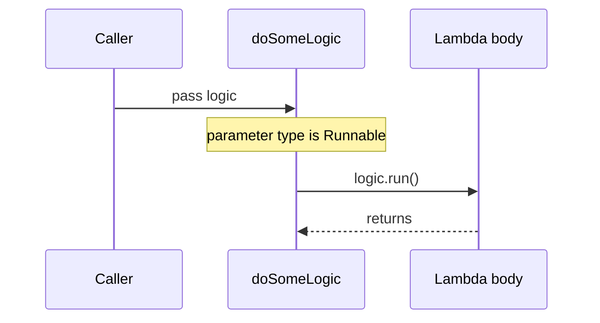

# Lambda as a Method Parameter

Java can pass behavior into a method when the parameter type is a functional interface: an interface with exactly one abstract method. The lambda is the small piece of behavior, and the interface tells Java which shape that behavior must have. Think of a kitchen ticket: the cook can accept any ticket, but the ticket must fit the restaurant's format before it can be used.

```java
static void doSomeLogic(Runnable logic) {
    logic.run();
}

doSomeLogic(() -> System.out.println("Hello"));
```

Here `Runnable` is the target type. Its single abstract method is `void run()`, so a lambda with no parameters and no return value matches it. This is related to how an [interface](topic:interface-vs-abstract-class) defines a contract, but with only one abstract operation. Like a post office slot labeled "letters only", the compiler knows which kind of parcel may go through.



The method parameter is not "lambda" as a raw type. Java has no parameter type named `lambda`; it needs a functional interface such as `Runnable`, `Supplier<T>`, `Consumer<T>`, `Function<T, R>`, or your own `@FunctionalInterface`. In everyday terms, the lambda is the appliance, and the functional interface is the socket shape it must plug into.

Passing a lambda does not run the body. The body runs only when the receiving method calls the interface method, such as `logic.run()`, `supplier.get()`, or `function.apply(value)`. This is like handing a recipe card to a cook: the dish is not made until the cook follows the recipe.



A lambda can read local variables from the surrounding method only if they are final or effectively final. Java copies the captured value into the lambda's context, so the local variable cannot keep changing behind its back. A traffic analogy: the lambda receives a snapshot of the address on the delivery slip, not a live editable street sign.

Use the standard functional interfaces when their shapes match the job. `Runnable` means no input and no result; `Supplier<T>` means no input and one result; `Consumer<T>` means one input and no result; `Function<T, R>` means one input and one result. In a workshop, these are different tool labels: "start", "produce", "consume", and "transform".

Lambdas are often shorter than [anonymous classes](topic:anonymous-class), but they are still typed by the target functional interface. If overloads accept different functional interfaces, the compiler may need an explicit cast or a typed variable. This is like two service windows accepting similar forms: you may need to point to the exact window.

The parameter list is part of the [method signature](topic:method-signature), so changing `Runnable` to `Supplier<String>` changes what callers may pass. It is not just a prettier syntax choice; it changes the API contract. Like changing a mail slot from letters to packages, callers must bring a different shape.

## 60-second interview answer

Yes. A Java method can accept a lambda expression if the parameter type is a functional interface. For `doSomeLogic(() -> System.out.println("Hello"))`, the method can be `static void doSomeLogic(Runnable logic) { logic.run(); }` because `Runnable` has one abstract method, `void run()`, matching a no-argument lambda with no return value. The lambda is not executed when passed; it executes when the method invokes `logic.run()`. For other shapes, use interfaces like `Supplier<T>`, `Consumer<T>`, `Function<T, R>`, or define your own functional interface. Captured local variables must be final or effectively final.

## Production relevance

Callbacks, retry hooks, validation rules, lazy loading, and stream operations all use this idea. A service method can accept "what to do" without hardcoding the action. In real systems, it is like giving a warehouse worker an instruction card instead of building a new worker for every small task.

Streams use the same target-type idea: `map(x -> ...)` receives a `Function`, and `forEach(x -> ...)` receives a `Consumer`. The lambda syntax is compact, but the API still controls the exact interface. Like traffic lanes, the route looks short, but each lane has a rule for what can drive there.

## Common misconceptions

- "The parameter type is lambda." It is not; the type is a functional interface. The lambda only fits because the interface has one abstract method, like a key fitting one lock.
- "The lambda runs as soon as it is passed." It does not; the receiving method must call it. Handing over a recipe does not cook dinner.
- "Any interface works." It must have exactly one abstract method. A form with two required signatures is not a single action anymore.
- "Captured locals can be changed later." They cannot; captured local variables must be final or effectively final. A delivery slip should not change after the courier leaves.
- "Lambda and anonymous class are identical." They are related, but lambdas have different rules for `this`, generated implementation details, and syntax. The old form is a full one-off class; the lambda is a compact target-typed function object.
