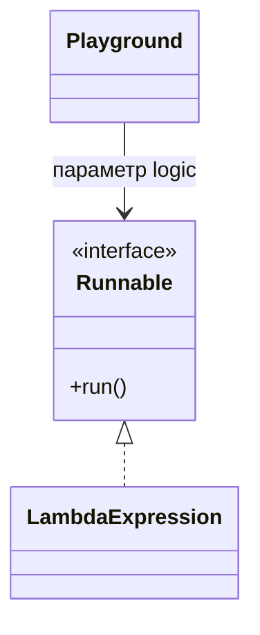
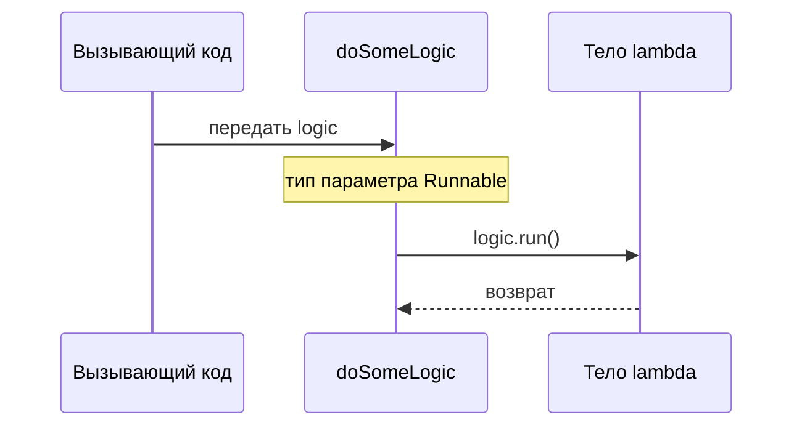

# Лямбда как параметр метода

Java может передавать поведение в метод, когда тип параметра — functional interface: интерфейс ровно с одним абстрактным методом. Lambda — это маленький фрагмент поведения, а интерфейс говорит Java, какой формы это поведение должно быть. Представьте кухонный заказ: повар может принять любой заказ, но бланк должен подходить под формат ресторана.

```java
static void doSomeLogic(Runnable logic) {
    logic.run();
}

doSomeLogic(() -> System.out.println("Hello"));
```

Здесь `Runnable` — целевой тип. Его единственный абстрактный метод — `void run()`, поэтому lambda без параметров и без возвращаемого значения ему соответствует. Это связано с тем, как [interface](topic:interface-vs-abstract-class) задает контракт, но здесь абстрактная операция только одна. Как почтовая щель с надписью «только письма»: компилятор знает, какой тип отправления можно пропустить.



Тип параметра метода — не «lambda» как сырой тип. В Java нет типа параметра с именем `lambda`; нужен functional interface, например `Runnable`, `Supplier<T>`, `Consumer<T>`, `Function<T, R>` или свой `@FunctionalInterface`. В бытовой аналогии lambda — это прибор, а functional interface — форма розетки, в которую он должен подключиться.

Передача lambda не запускает ее тело. Тело выполняется только тогда, когда принимающий метод вызывает метод интерфейса, например `logic.run()`, `supplier.get()` или `function.apply(value)`. Это как передать повару карточку рецепта: блюдо не приготовится, пока повар не начнет выполнять рецепт.



Lambda может читать локальные переменные из окружающего метода только если они final или effectively final. Java переносит захваченное значение в контекст lambda, поэтому локальная переменная не должна меняться у нее за спиной. Дорожная аналогия: lambda получает снимок адреса в накладной, а не живой редактируемый дорожный знак.

Используйте стандартные functional interfaces, когда их форма подходит задаче. `Runnable` — нет входа и нет результата; `Supplier<T>` — нет входа и есть результат; `Consumer<T>` — есть вход и нет результата; `Function<T, R>` — есть вход и есть результат. В мастерской это разные ярлыки инструментов: «запустить», «произвести», «принять» и «преобразовать».

Lambdas часто короче, чем [anonymous classes](topic:anonymous-class), но они все равно типизируются целевым functional interface. Если overloads принимают разные functional interfaces, компилятору может понадобиться явное приведение или переменная с указанным типом. Это как два окна обслуживания с похожими бланками: иногда нужно явно показать, в какое окно вы идете.

Список параметров является частью [method signature](topic:method-signature), поэтому замена `Runnable` на `Supplier<String>` меняет то, что могут передавать вызывающие стороны. Это не просто более красивый синтаксис; это изменение API-контракта. Как заменить почтовую щель для писем на окно для посылок: отправителям нужна другая форма.

## 60-секундный ответ на собеседовании

Да. Java-метод может принять lambda expression, если тип параметра — functional interface. Для `doSomeLogic(() -> System.out.println("Hello"))` метод может быть `static void doSomeLogic(Runnable logic) { logic.run(); }`, потому что у `Runnable` один абстрактный метод, `void run()`, и ему соответствует lambda без аргументов и без результата. Lambda не выполняется при передаче; она выполняется, когда метод вызывает `logic.run()`. Для других форм используют `Supplier<T>`, `Consumer<T>`, `Function<T, R>` или свой functional interface. Захваченные локальные переменные должны быть final или effectively final.

## Где это важно в production

Callbacks, retry hooks, validation rules, lazy loading и stream operations используют эту идею. Метод сервиса может принять «что сделать», не зашивая действие внутрь себя. В реальной системе это похоже на инструкционную карточку для работника склада вместо найма нового работника под каждую маленькую задачу.

Streams используют ту же идею целевого типа: `map(x -> ...)` получает `Function`, а `forEach(x -> ...)` получает `Consumer`. Синтаксис lambda компактный, но API все равно задает точный интерфейс. Как полосы движения: маршрут выглядит коротким, но у каждой полосы есть правило, кто может по ней ехать.

## Частые заблуждения

- «Тип параметра — lambda». Нет; тип — functional interface. Lambda подходит только потому, что у интерфейса один абстрактный метод, как ключ к одному замку.
- «Lambda запускается сразу при передаче». Нет; принимающий метод должен ее вызвать. Передача рецепта еще не готовит ужин.
- «Подойдет любой interface». Нет; у него должен быть ровно один абстрактный метод. Бланк с двумя обязательными подписями уже не описывает одно действие.
- «Захваченные locals можно потом менять». Нельзя; захваченные локальные переменные должны быть final или effectively final. Накладная не должна меняться после того, как курьер ушел.
- «Lambda и anonymous class идентичны». Они связаны, но у lambdas другие правила для `this`, деталей сгенерированной реализации и синтаксиса. Старый вариант — полноценный одноразовый класс; lambda — компактный target-typed function object.
