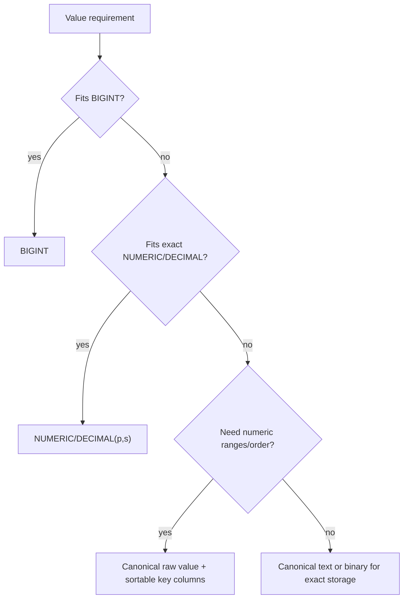
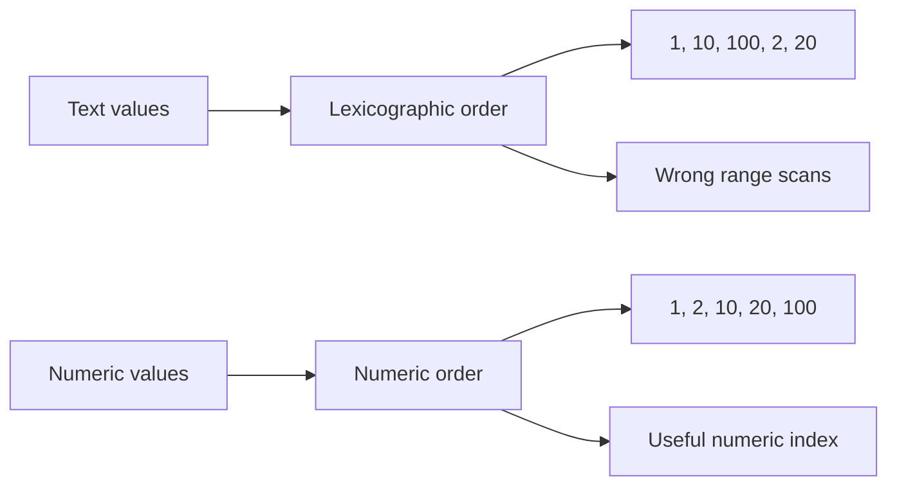

# Very Large Numbers in Relational Databases

Some interview questions sound like storage details but are really about
semantics: do we need exact arithmetic, numeric ordering, range filters,
aggregates, or only exact display? A database can store almost any value if you
turn it into text, but it cannot automatically compare that text as a number.
Think of a post office: it can keep any parcel in the back room, but sorting by
weight only works if every parcel has a real weight label, not just a handwritten
description.

The first decision is the unit and range. If the value fits `BIGINT`, use
`BIGINT`. If it is larger but still within the database's exact decimal support,
use `NUMERIC` / `DECIMAL` with explicit precision and scale. For fixed-scale
amounts such as token balances with 18 decimals, either store base units as an
integer-like `NUMERIC(p,0)` or store the human decimal form as `NUMERIC(p,18)`.
It is like a kitchen recipe: everyone must agree whether you count grains of salt
or spoonfuls, otherwise the same number means different things.

For `uint256`, the raw unsigned integer can require up to 78 decimal digits.
`NUMERIC(78,0)` can represent that in databases that support that precision, but
not every relational database does. SQL Server and Oracle-style `NUMBER` limits
are commonly much smaller, and MySQL `DECIMAL` has its own maximum precision. So
the correct interview answer includes "check the target database's numeric
limits", not just "use DECIMAL". This is like checking whether the warehouse
shelf can hold a long crate before promising that the crate fits.

## Why Plain Text Is Dangerous

A normal B-tree text index sorts strings by collation, not by numeric value.
That means `"100"` can sort before `"20"` because the first character `"1"` comes
before `"2"`. The index may be perfectly fast and still answer the wrong question
for `ORDER BY`, `BETWEEN`, `>`, `<`, pagination, and top-N queries. It is like a
traffic dispatcher sorting trucks by the first letter of their license plate
instead of by their load weight: the queue is ordered, but by the wrong rule.

Leading zeros, signs, decimal separators, scale, and locale/collation make text
even trickier. `"0020"`, `"20"`, `"+20"`, and `"20.0"` may all represent the same
number but sort and compare as different strings. A canonical text format helps
for equality and auditing, but it does not magically give numeric comparison.
This is like writing the same street address in four formats: the mail carrier
can read them, but an automatic sorting machine may treat them as four different
destinations.

Casting text in a query, for example `ORDER BY amount_text::numeric`, can restore
numeric semantics in databases that support the cast. The trade-off is that the
ordinary text index usually no longer matches the expression, so the database may
need a full scan and sort unless you create a matching expression index. Bad
stored values can also fail the cast at runtime. This is like asking every parcel
to be re-weighed at the counter instead of using the prebuilt sorting shelves.

## Practical Storage Patterns

For fixed-scale money or token values, store exact units. A common pattern is:
`amount_units NUMERIC(78,0)` for raw `uint256` base units, plus metadata that says
the display scale is 18. If you store human-readable decimal amounts directly,
use a type like `NUMERIC(78,18)` when the database supports it. Never use
`FLOAT`, `REAL`, or `DOUBLE` for exact balances. They are like kitchen measuring
cups with rounded marks: useful for soup, dangerous for accounting.

For arbitrary `BigInteger` values beyond native decimal support, decide whether
the database must compare them. If yes, store a canonical raw value for display
or audit and separate sortable components: sign, magnitude length, and fixed-size
big-endian chunks or high/low numeric limbs. Index those components in comparison
order. If no numeric ordering is needed, canonical text or binary storage can be
enough. This is like splitting an oversized package into numbered crates: the
label preserves the original package, while the crate numbers let the warehouse
sort it predictably.

For fixed-width unsigned values, such as a 32-byte `uint256`, a big-endian binary
representation can preserve numeric order when every value has the same length
and the database/index compares bytes lexicographically. That is a narrow, useful
case, not a general excuse to store all numbers as strings. It is like using
identical postal barcodes: the scanner works because every barcode follows the
same shape.

Keep database constraints close to the chosen representation. Add `CHECK`
constraints for non-negative values, maximum precision, scale, canonical text
format, or chunk ranges. Make Java validation agree with the database rules, and
bind exact values through [Prepared Statements](topic:prepared-statements) as
`BigDecimal`, `BigInteger`-derived decimal strings, or driver-supported exact
types, not through floating-point conversions. For Java numeric background, see
[Java data types](topic:java-data-types). This is like the kitchen and the
delivery ticket using the same measuring unit, so no one silently changes the
order.

## Indexing and Query Plans

Indexes are not just "make it faster" switches. A [database index](topic:database-indexes)
stores keys in an order defined by the column type and operator class. Numeric
columns use numeric comparison; text columns use text comparison. If your query
asks for numeric ranges over text, the [query plan](topic:query-plan) may either
use the wrong text order, skip the index, or use a special expression index if
one exists. It is like a city map sorted by street name: great for finding a
street, useless for finding the closest building by distance.

Large numeric or text keys also make indexes heavier. B-tree pages hold fewer
entries, writes update more bytes, and cache hit rates can drop. Composite
indexes such as `(account_id, amount_units)` can be excellent for "largest
balances per account" only when `amount_units` has sortable numeric semantics.
For physical ordering trade-offs, compare this with
[clustered and non-clustered indexes](topic:clustered-vs-nonclustered-indexes).
It is like a filing cabinet: thick folders fit fewer per drawer, so every lookup
may touch more drawers.

Aggregates are another trap. Even if one balance fits, `SUM(balance)` over many
rows may exceed the business range or the target type. Define whether overflow is
impossible by domain rules, should fail, or should be handled in a wider type.
This is like adding all cash registers in a store: each drawer may fit its cash,
but the daily total needs a bigger envelope.

## 60-second Interview Answer

> I would not store large numeric values as ordinary text if I need comparisons,
> ranges, `ORDER BY`, or numeric aggregates. First I define range and scale. If it
> fits `int64`, I use `BIGINT`. For exact fixed-scale amounts such as 18 decimals,
> I use `NUMERIC` / `DECIMAL` with enough precision, often storing base units as
> `NUMERIC(p,0)` or the human amount as `NUMERIC(p,18)`, never floating point. A
> `uint256` can need up to 78 decimal digits, so `NUMERIC(78,0)` is fine only in
> databases that support that precision. If the value is bigger than native
> decimal support and I still need ordering, I store a canonical raw value plus
> sortable key columns such as sign, length, and fixed-width chunks. Text sorting
> is lexicographic and collation-based, so `"100"` can come before `"20"`; a text
> index can be fast but wrong for numeric ranges.

## Common Misconceptions

- "Text avoids all problems." Text avoids a numeric type limit, but it also drops
  numeric comparison, range, aggregate, and validation semantics unless you build
  them back. A receipt can describe a parcel, but it is not a weighing scale.
- "Padding fixes text sorting." Fixed-width zero padding can work for non-negative
  integers with one scale and one binary collation. It gets fragile with signs,
  variable scale, decimals, and different collations. A shelf label helps only if
  every box uses the same label template.
- "Casting in every query is enough." Casting may be correct but slow without a
  matching expression index, and one bad row can break the query. Re-weighing
  every parcel at checkout is accurate but not a scalable sorting system.
- "DECIMAL is always enough." Vendor precision limits differ, and aggregates can
  need more headroom than individual rows. A crate that fits one warehouse may
  not fit another.
- "FLOAT is fine because the range is huge." Floating-point types trade exactness
  for range. That is unacceptable for ledgers, token balances, identifiers, and
  exact counters. A rounded measuring cup is not a bank vault.
- "`uint256` with 18 decimals means 96 digits." The raw `uint256` maximum is 78
  decimal digits. With display scale 18, the human form has up to 60 digits before
  the decimal point and 18 after it, still 78 significant digits.
