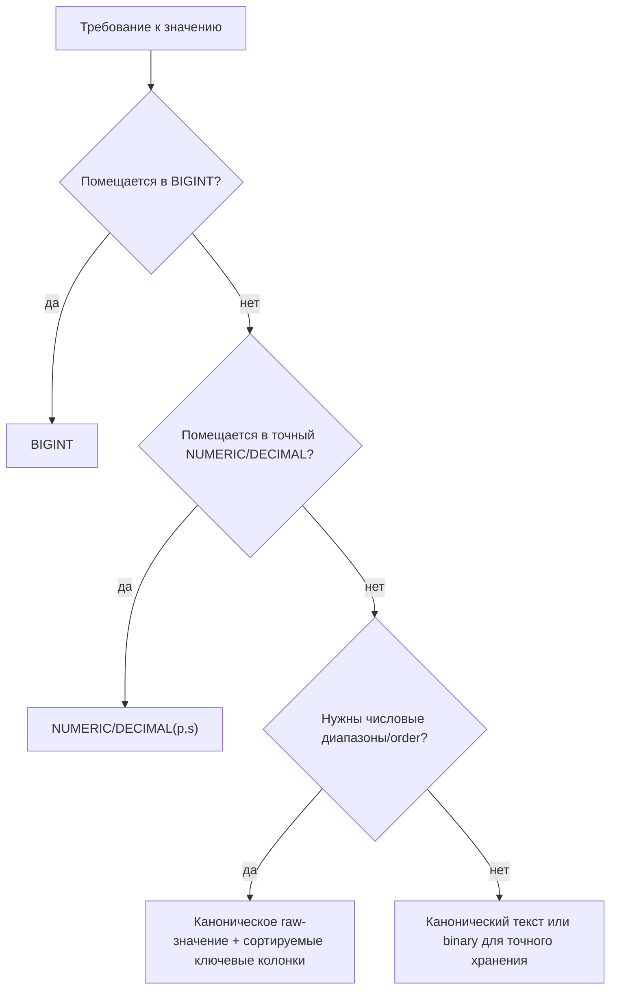
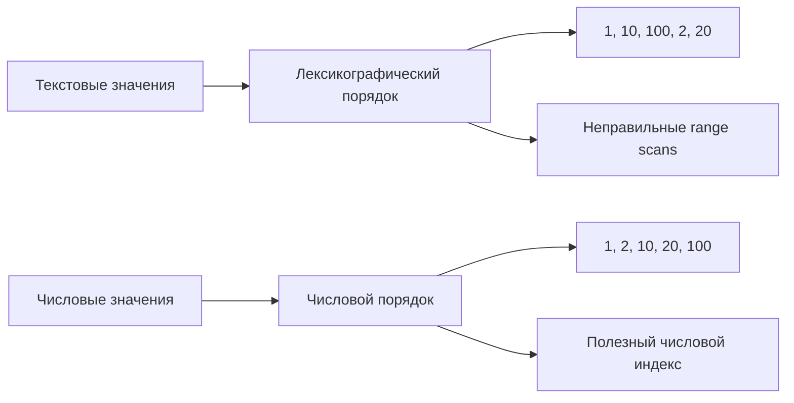

# Очень большие числа в реляционных БД

Некоторые вопросы на собеседовании выглядят как детали хранения, но на самом
деле они про семантику: нужна ли нам точная арифметика, числовая сортировка,
фильтры по диапазону, агрегаты или только точное отображение? База данных может
сохранить почти любое значение, если превратить его в текст, но она не начнёт
автоматически сравнивать этот текст как число. Представь почтовое отделение: оно
может положить любую посылку на склад, но сортировка по весу работает только
тогда, когда у каждой посылки есть настоящий вес, а не просто рукописное
описание.

Первое решение - единица измерения и диапазон. Если значение помещается в
`BIGINT`, используй `BIGINT`. Если оно больше, но всё ещё помещается в точный
decimal-тип конкретной БД, используй `NUMERIC` / `DECIMAL` с явными precision и
scale. Для сумм с фиксированным scale, например балансов токенов с 18 decimals,
можно хранить базовые единицы как целочисленный `NUMERIC(p,0)` или человекочитаемую
десятичную форму как `NUMERIC(p,18)`. Это как рецепт на кухне: все должны
договориться, считаем ли мы крупинки соли или ложки, иначе одно и то же число
будет означать разные вещи.

Для `uint256` исходное unsigned-целое может потребовать до 78 десятичных цифр.
`NUMERIC(78,0)` может представить такое значение в БД, которые поддерживают
такую точность, но не каждая реляционная БД это умеет. Ограничения SQL Server и
Oracle-подобного `NUMBER` обычно заметно меньше, а у MySQL `DECIMAL` есть свой
максимум precision. Поэтому правильный ответ на собеседовании включает "проверить
лимиты numeric-типа в целевой БД", а не просто "использовать DECIMAL". Это как
проверить, выдержит ли складская полка длинный ящик, прежде чем обещать, что он
туда поместится.

## Почему обычный текст опасен

Обычный B-tree индекс по тексту сортирует строки по collation, а не по числовому
значению. Поэтому `"100"` может оказаться перед `"20"`, потому что первый символ
`"1"` идёт перед `"2"`. Индекс может быть идеально быстрым и всё равно отвечать
не на тот вопрос для `ORDER BY`, `BETWEEN`, `>`, `<`, пагинации и top-N запросов.
Это как диспетчер на дороге, который сортирует грузовики по первой букве номера,
а не по весу груза: очередь упорядочена, но по неправильному правилу.

Ведущие нули, знаки, десятичные разделители, scale и locale/collation делают
текст ещё сложнее. `"0020"`, `"20"`, `"+20"` и `"20.0"` могут означать одно и то
же число, но сортироваться и сравниваться как разные строки. Канонический текст
помогает для equality и аудита, но не даёт числовое сравнение сам по себе. Это
как один и тот же адрес, записанный четырьмя способами: почтальон его прочитает,
но автоматическая сортировочная машина может решить, что это четыре разных
адреса.

Приведение текста в запросе, например `ORDER BY amount_text::numeric`, может
вернуть числовую семантику в БД, которые поддерживают такой cast. Цена в том, что
обычный текстовый индекс обычно больше не совпадает с выражением, поэтому базе
может понадобиться полный scan и sort, если нет подходящего expression index.
Плохие сохранённые значения также могут сломать cast во время выполнения. Это как
взвешивать каждую посылку заново у стойки вместо использования заранее
подготовленных сортировочных полок.

## Практические варианты хранения

Для денег или токенов с фиксированным scale храни точные единицы. Частый вариант:
`amount_units NUMERIC(78,0)` для raw `uint256` в базовых единицах плюс метаданные,
которые говорят, что display scale равен 18. Если ты хранишь человекочитаемые
десятичные суммы напрямую, используй тип вроде `NUMERIC(78,18)`, когда БД это
поддерживает. Никогда не используй `FLOAT`, `REAL` или `DOUBLE` для точных
балансов. Это как мерные стаканы на кухне с округлёнными делениями: годится для
супа, опасно для бухгалтерии.

Для произвольных значений `BigInteger`, которые выходят за пределы native
decimal-типа, реши, должна ли БД сравнивать эти значения. Если да, храни
каноническое raw-значение для отображения или аудита и отдельные сортируемые
компоненты: sign, длину magnitude и fixed-size big-endian chunks или high/low
numeric limbs. Индексируй эти компоненты в порядке сравнения. Если числовая
сортировка не нужна, канонического текста или binary-хранения может быть
достаточно. Это как разделить слишком большую посылку на пронумерованные ящики:
наклейка сохраняет исходную посылку, а номера ящиков позволяют складу сортировать
её предсказуемо.

Для fixed-width unsigned значений, например 32-byte `uint256`, big-endian binary
представление может сохранять числовой порядок, когда все значения имеют одну
длину и база/индекс сравнивает байты лексикографически. Это узкий полезный случай,
а не общее оправдание хранить все числа строками. Это как одинаковые почтовые
штрихкоды: сканер работает, потому что каждый штрихкод имеет одну и ту же форму.

Держи ограничения БД рядом с выбранным представлением. Добавь `CHECK` constraints
для неотрицательных значений, максимальной precision, scale, канонического формата
текста или диапазонов chunk-колонок. Java-валидация должна совпадать с правилами
БД, а точные значения нужно передавать через [Prepared Statements](topic:prepared-statements)
как `BigDecimal`, decimal-строки из `BigInteger` или поддерживаемые драйвером
точные типы, а не через floating-point преобразования. Для базы по числовым типам
в Java смотри [Java data types](topic:java-data-types). Это как кухня и накладная
на доставку, которые используют одну единицу измерения, чтобы никто тихо не
изменил заказ.

## Индексы и планы запросов

Индексы - это не просто переключатели "сделать быстрее". [Индекс базы данных](topic:database-indexes)
хранит ключи в порядке, который задан типом колонки и operator class. Числовые
колонки используют числовое сравнение; текстовые колонки используют текстовое
сравнение. Если запрос просит числовые диапазоны поверх текста, [план запроса](topic:query-plan)
может использовать неправильный текстовый порядок, пропустить индекс или
использовать специальный expression index, если он существует. Это как карта
города, отсортированная по названиям улиц: отлично для поиска улицы, бесполезно
для поиска ближайшего здания по расстоянию.

Большие numeric или text ключи также делают индексы тяжелее. На страницах B-tree
помещается меньше записей, записи обновляют больше байтов, а cache hit rate может
снижаться. Составные индексы вроде `(account_id, amount_units)` могут отлично
работать для "самых больших балансов по аккаунту" только тогда, когда
`amount_units` имеет сортируемую числовую семантику. Про физические trade-offs
сравни с [clustered и non-clustered indexes](topic:clustered-vs-nonclustered-indexes).
Это как картотека: толстые папки занимают больше места в ящике, поэтому поиск
может задевать больше ящиков.

Агрегаты - ещё одна ловушка. Даже если один баланс помещается, `SUM(balance)` по
многим строкам может выйти за бизнес-диапазон или целевой тип. Определи, должно
ли переполнение быть невозможным по правилам домена, должно падать с ошибкой или
должно обрабатываться в более широком типе. Это как сложить все кассы магазина:
каждый ящик может вместить свои деньги, но дневному итогу нужен конверт побольше.

## Ответ на собеседовании за 60 секунд

> Я бы не хранил большие числовые значения как обычный текст, если нужны
> сравнения, диапазоны, `ORDER BY` или числовые агрегаты. Сначала я определяю
> диапазон и scale. Если значение помещается в `int64`, беру `BIGINT`. Для точных
> сумм с фиксированным scale, например 18 decimals, использую `NUMERIC` /
> `DECIMAL` с достаточной precision: часто храню базовые единицы как
> `NUMERIC(p,0)` или человекочитаемую сумму как `NUMERIC(p,18)`, но не floating
> point. `uint256` может требовать до 78 десятичных цифр, поэтому `NUMERIC(78,0)`
> подходит только в БД, которые поддерживают такую precision. Если значение
> больше native decimal-поддержки и всё равно нужна сортировка, я храню
> каноническое raw-значение плюс сортируемые ключевые колонки, например sign,
> length и fixed-width chunks. Текстовая сортировка лексикографическая и зависит
> от collation, поэтому `"100"` может идти перед `"20"`; текстовый индекс может
> быть быстрым, но неправильным для числовых диапазонов.

## Частые заблуждения

- "Текст решает все проблемы." Текст обходит лимит числового типа, но теряет
  семантику числового сравнения, диапазонов, агрегатов и валидации, если ты не
  построишь её заново. Чек может описывать посылку, но это не весы.
- "Padding чинит текстовую сортировку." Fixed-width zero padding может работать
  для неотрицательных целых с одним scale и одной binary collation. Всё становится
  хрупким со знаками, переменным scale, decimals и разными collations. Наклейка на
  полке помогает только тогда, когда все коробки используют один шаблон наклейки.
- "Достаточно кастить в каждом запросе." Cast может быть корректным, но медленным
  без подходящего expression index, и одна плохая строка может сломать запрос.
  Взвешивать каждую посылку на кассе точно, но это не масштабируемая система
  сортировки.
- "DECIMAL всегда достаточно." Лимиты precision зависят от вендора, а агрегаты
  могут требовать больше запаса, чем отдельные строки. Ящик, который помещается
  на одном складе, может не поместиться на другом.
- "FLOAT нормален, потому что диапазон большой." Floating-point типы меняют
  точность на диапазон. Это недопустимо для ledger, балансов токенов,
  идентификаторов и точных счётчиков. Округлённый мерный стакан - не банковское
  хранилище.
- "`uint256` с 18 decimals означает 96 цифр." Максимум raw `uint256` - 78
  десятичных цифр. При display scale 18 человекочитаемая форма имеет до 60 цифр
  до десятичной точки и 18 после неё, всё равно 78 значащих цифр.
