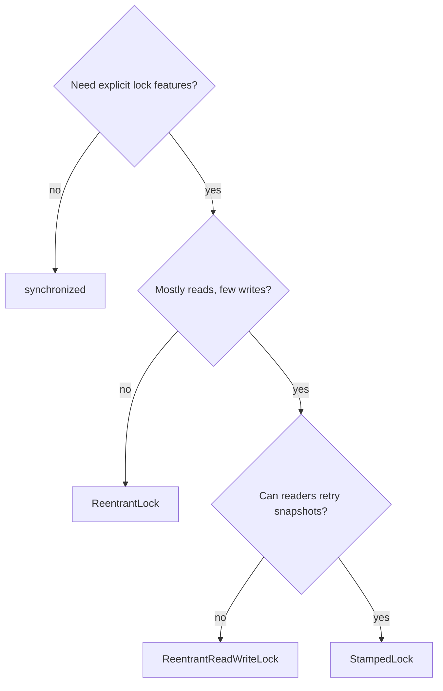
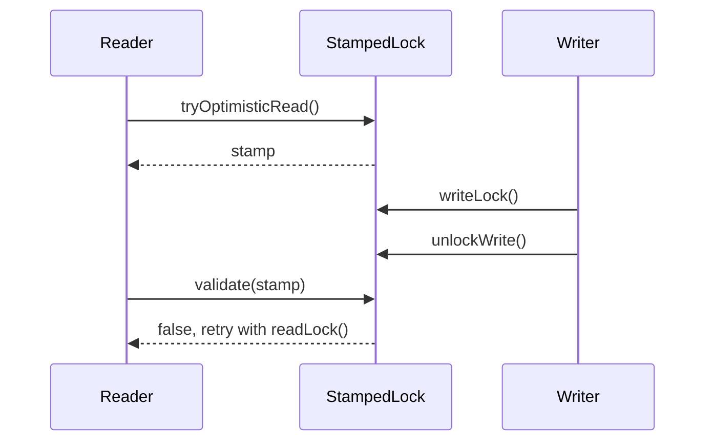

# Alternatives to synchronized: ReentrantLock, ReadWriteLock, StampedLock

`synchronized` is the default Java monitor: one thread enters, the others wait,
and the lock is released automatically when the block exits. Use it for small,
simple [critical sections](topic:critical-section). In everyday terms, it is one
key for one small kitchen: easy to use, hard to forget, and usually enough when
only one cook should touch the stove.

The alternatives are useful when the monitor is too blunt:

- `ReentrantLock` gives explicit `lock()`, `unlock()`, `tryLock()`, timed and
  interruptible acquisition, optional fairness, and multiple `Condition`s. It is
  like a post office ticket machine: you can decide whether to wait, leave, or
  use a separate queue.
- `ReentrantReadWriteLock` splits access into shared `readLock()` and exclusive
  `writeLock()`. It is like a library reading room: many people can read the
  same book, but editing the book requires everyone else to step away.
- `StampedLock` adds optimistic reads: a reader takes a stamp, reads without
  blocking writers, then calls `validate(stamp)`. It is like checking the price
  tag while a shop worker might still replace it: you must check the stamp before
  trusting what you saw.

Locks are still about avoiding a [race condition](topic:race-condition-avoidance)
between threads. If the problem is only visibility of one flag, [volatile](topic:volatile)
may be enough. If the operation is a small atomic update, [CAS](topic:compare-and-set)
or an atomic class may be better than any lock. Pick the smallest tool that
protects the invariant.

## ReentrantLock

Choose `ReentrantLock` when you need control that `synchronized` does not expose.
Typical reasons are `tryLock()` to avoid waiting forever, timed lock attempts,
`lockInterruptibly()` for cancellable work, fair queueing, or more than one
`Condition` per lock. Think of a service counter where a customer can check the
queue length and come back later instead of standing still.

It is reentrant, so the owning thread may acquire the same lock again and the
lock keeps a hold count. The same cook can walk through the kitchen door twice,
but must walk out twice before the room is free. In code that means every
successful `lock()` must be paired with `unlock()` in `finally`.

The cost is manual discipline. `synchronized` releases the monitor automatically;
`ReentrantLock` does not. Forgetting `unlock()` is like leaving the kitchen key in
your pocket after closing time: everyone else waits even though the work is done.

## ReentrantReadWriteLock

Choose `ReentrantReadWriteLock` for read-heavy data where reads are long enough
or frequent enough that letting them overlap matters. A cache of mostly stable
configuration is a common fit. It is like several clerks reading the same
catalog at once, while one clerk who needs to edit prices waits for the readers
to finish.

It can hurt when writes are frequent, when the protected work is tiny, or when
readers arrive continuously and starve writers. The extra bookkeeping is not
free. If every visitor to the library also keeps editing pages, separate read and
write doors create more traffic control than value.

Avoid read-to-write upgrades with `ReentrantReadWriteLock`. A thread that holds
a read lock and waits for a write lock can wait for all readers, including
itself. The safe pattern is usually to release the read lock, acquire the write
lock, then re-check the condition because another writer may have changed it.
That is like stepping away from the reading table before asking for the only pen,
then checking whether the page still needs editing.

## StampedLock

Choose `StampedLock` for advanced read-mostly structures where optimistic reads
can retry cheaply. A reader calls `tryOptimisticRead()`, copies the fields it
needs, then calls `validate(stamp)`. If validation fails, it retries under a
regular read lock. It is like glancing at a traffic sign while road workers may
replace it: if your timestamp is stale, drive around the block and read it again.

`StampedLock` is not reentrant and does not provide `Condition`s. That makes it a
poor default lock for service code with callbacks, nested calls, or complex
ownership. It is closer to a specialist traffic checkpoint than a general office
key.

Stamped conversion can be useful: if a thread is the only reader, it may convert
the read stamp into a write stamp without releasing the lock first. That avoids a
gap where another writer could enter. It is like the only person reviewing a
form taking the editor's pen without leaving the desk.

## 60-second interview answer

`synchronized` is best for simple mutual exclusion because it is concise,
reentrant, and automatically releases the monitor. `ReentrantLock` is the next
step when I need explicit control: `tryLock`, timed or interruptible acquisition,
fairness, or multiple `Condition`s. I always use `try/finally` around it.
`ReentrantReadWriteLock` is for read-heavy workloads where many readers can
proceed together and writes are less frequent; it can be worse if writes are
common or the critical section is tiny. `StampedLock` is for advanced read-mostly
cases with optimistic reads, where readers can copy data and validate the stamp,
retrying if a write happened. It is not reentrant, so I avoid it as a general
replacement for `synchronized`.

## Production relevance

In production, the right lock is a throughput and failure-mode decision, not a
style preference. A simple monitor keeps code easy to audit. `ReentrantLock`
helps when a request should time out, cancel, or try a fallback instead of
parking a thread. That is like a customer choosing another checkout lane when
one lane is stuck.

`ReentrantReadWriteLock` can improve throughput for stable shared data, but only
after measuring contention. A read-mostly dashboard cache may benefit. A hot
order book with constant writes may slow down because every entry and exit now
uses more traffic lights.

`StampedLock` is valuable for low-level state such as points, ranges, or cached
snapshots, where copying a few fields and retrying is cheap. It is risky for
general service methods because validation mistakes are easy to miss. Treat it
like a sharp kitchen knife: useful in trained hands, not the default tool for
opening every package.

## Common misconceptions

- "ReentrantLock is always faster than synchronized." Not true. Modern JVMs
  optimize monitors well. Choose `ReentrantLock` for features, then measure.
  Analogy: a larger delivery truck is not faster for every grocery run.
- "ReadWriteLock always improves read-heavy code." Only if reads overlap enough
  and writes are not constantly waiting. If the room is tiny, separate entrance
  and exit doors do not help much.
- "A read lock can safely upgrade to a write lock." Usually no. It may wait for
  itself. Put the book back on the table before asking for the editor's pen.
- "StampedLock optimistic read is safe without validation." No. The stamp is the
  receipt; without checking it, you may be using yesterday's price.
- "Locks replace all concurrency tools." No. For thread creation and task
  scheduling, use tools such as [Java multithreading](topic:java-multithreading)
  primitives and executor services. A lock protects shared state; it is not a
  work scheduler.
