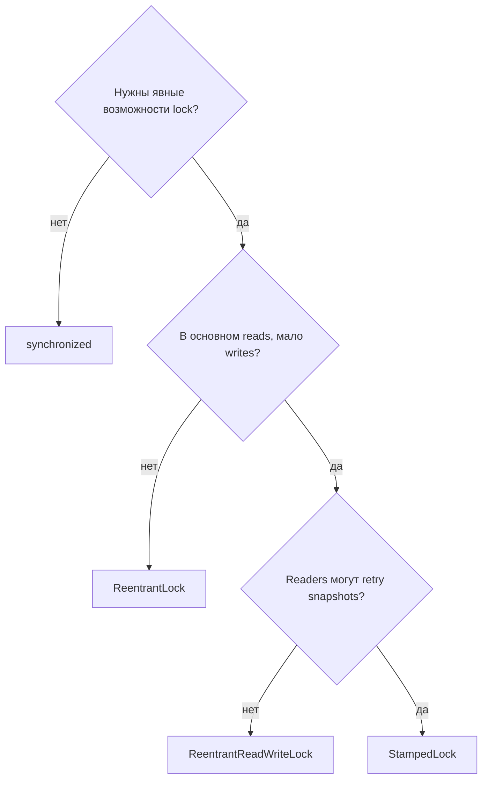
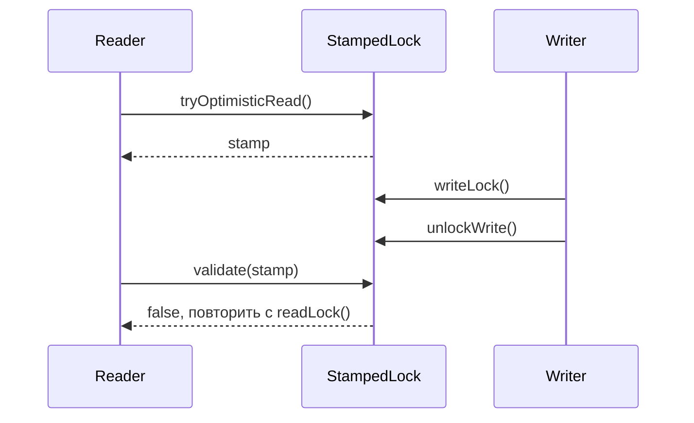

# Альтернативы synchronized: ReentrantLock, ReadWriteLock, StampedLock

`synchronized` - это стандартный Java monitor: один thread входит, остальные
ждут, а lock освобождается автоматически при выходе из блока. Используйте его
для небольших и простых [critical sections](topic:critical-section). В бытовой
аналогии это один ключ от маленькой кухни: просто использовать, трудно забыть и
обычно достаточно, когда только один повар должен трогать плиту.

Альтернативы полезны, когда monitor слишком грубый:

- `ReentrantLock` даёт явные `lock()`, `unlock()`, `tryLock()`, timed и
  interruptible acquisition, optional fairness и несколько `Condition`. Это как
  талонный автомат на почте: можно решить, ждать ли, уйти или перейти в
  отдельную очередь.
- `ReentrantReadWriteLock` разделяет доступ на общий `readLock()` и
  эксклюзивный `writeLock()`. Это как читальный зал библиотеки: многие люди
  могут читать одну книгу, но для редактирования книги всем остальным нужно
  отойти.
- `StampedLock` добавляет optimistic reads: reader берёт stamp, читает без
  блокировки writers, затем вызывает `validate(stamp)`. Это как проверить
  ценник, пока сотрудник магазина может его заменить: перед доверием к данным
  нужно проверить stamp.

Locks всё ещё нужны, чтобы избегать [race condition](topic:race-condition-avoidance)
между threads. Если проблема только в visibility одного флага, может хватить
[volatile](topic:volatile). Если операция является небольшим atomic update,
[CAS](topic:compare-and-set) или atomic class могут быть лучше любого lock.
Выбирайте минимальный инструмент, который защищает invariant.

## ReentrantLock

Выбирайте `ReentrantLock`, когда нужен контроль, которого нет у `synchronized`.
Типичные причины - `tryLock()`, чтобы не ждать бесконечно, timed lock attempts,
`lockInterruptibly()` для отменяемой работы, fair queueing или больше одного
`Condition` на lock. Представьте стойку обслуживания, где клиент может оценить
очередь и вернуться позже, а не стоять неподвижно.

Он reentrant, поэтому владеющий thread может снова получить тот же lock, а lock
ведёт hold count. Тот же повар может дважды пройти через дверь кухни, но должен
дважды выйти, прежде чем помещение станет свободным. В коде это значит, что
каждый успешный `lock()` должен быть парой к `unlock()` в `finally`.

Цена - ручная дисциплина. `synchronized` освобождает monitor автоматически;
`ReentrantLock` этого не делает. Забыть `unlock()` - как унести ключ от кухни в
кармане после закрытия: все остальные ждут, хотя работа уже закончена.

## ReentrantReadWriteLock

Выбирайте `ReentrantReadWriteLock` для read-heavy данных, где reads достаточно
длинные или частые, чтобы их параллельность имела значение. Cache почти
стабильной конфигурации - типичный пример. Это как несколько сотрудников,
одновременно читающих один каталог, пока сотрудник, которому нужно менять цены,
ждёт завершения чтения.

Он может навредить, когда writes частые, защищённая работа очень маленькая или
readers приходят постоянно и starving writers. Дополнительный учёт не бесплатен.
Если каждый посетитель библиотеки ещё и редактирует страницы, отдельные двери
для read и write создают больше регулирования, чем пользы.

Избегайте upgrade с read на write у `ReentrantReadWriteLock`. Thread, который
держит read lock и ждёт write lock, может ждать всех readers, включая самого
себя. Безопасный паттерн обычно такой: освободить read lock, получить write
lock, затем заново проверить условие, потому что другой writer мог изменить
данные. Это как отойти от читального стола перед просьбой о единственной ручке
редактора, а затем проверить, всё ли ещё нужно править страницу.

## StampedLock

Выбирайте `StampedLock` для продвинутых read-mostly структур, где optimistic
reads могут дёшево повториться. Reader вызывает `tryOptimisticRead()`, копирует
нужные поля, затем вызывает `validate(stamp)`. Если validation не проходит, он
повторяет чтение под обычным read lock. Это как взглянуть на дорожный знак, пока
дорожные рабочие могут его заменить: если timestamp устарел, нужно объехать
квартал и прочитать знак заново.

`StampedLock` не reentrant и не предоставляет `Condition`. Поэтому это плохой
lock по умолчанию для service-кода с callbacks, вложенными вызовами или сложным
ownership. Он больше похож на специализированный дорожный пункт контроля, чем
на обычный офисный ключ.

Stamped conversion может быть полезен: если thread является единственным reader,
он может convert read stamp в write stamp без предварительного release. Это
избегает окна, где мог бы войти другой writer. Это как единственный человек,
проверяющий форму, берёт ручку редактора, не отходя от стола.

## Ответ на 60 секунд

`synchronized` лучше всего подходит для простой mutual exclusion, потому что он
краткий, reentrant и автоматически освобождает monitor. `ReentrantLock` - следующий
шаг, когда нужен явный контроль: `tryLock`, timed или interruptible acquisition,
fairness либо несколько `Condition`. Я всегда использую `try/finally` вокруг
него. `ReentrantReadWriteLock` подходит для read-heavy workloads, где многие
readers могут идти вместе, а writes реже; он может быть хуже, если writes частые
или critical section очень маленькая. `StampedLock` подходит для продвинутых
read-mostly случаев с optimistic reads, где readers могут скопировать данные,
validate stamp и повторить чтение, если был write. Он не reentrant, поэтому я не
использую его как общий replacement для `synchronized`.

## Практическое значение

В production выбор lock - это решение о throughput и failure mode, а не вопрос
стиля. Простой monitor оставляет код лёгким для ревью. `ReentrantLock` помогает,
когда request должен timeout, отмениться или выбрать fallback вместо parking
thread. Это как клиент, который выбирает другую кассу, когда одна касса застряла.

`ReentrantReadWriteLock` может улучшить throughput для стабильных shared data, но
только после измерения contention. Read-mostly cache для dashboard может выиграть.
Горячая order book с постоянными writes может замедлиться, потому что каждый
вход и выход теперь проходит через дополнительные светофоры.

`StampedLock` ценен для низкоуровневого state вроде points, ranges или cached
snapshots, где копирование нескольких полей и retry дешёвы. Он рискован для
обычных service methods, потому что ошибки validation легко пропустить. Относитесь
к нему как к острому кухонному ножу: полезен в подготовленных руках, но не
является инструментом по умолчанию для открытия любой коробки.

## Частые заблуждения

- "ReentrantLock всегда быстрее synchronized." Неверно. Современные JVM хорошо
  оптимизируют monitors. Выбирайте `ReentrantLock` ради возможностей, затем
  измеряйте. Аналогия: большой грузовик доставки не быстрее для каждой поездки
  за продуктами.
- "ReadWriteLock всегда улучшает read-heavy код." Только если reads действительно
  достаточно перекрываются, а writes не ждут постоянно. Если помещение маленькое,
  отдельные двери входа и выхода мало помогают.
- "Read lock можно безопасно upgrade до write lock." Обычно нет. Он может ждать
  сам себя. Положите книгу обратно на стол, прежде чем просить ручку редактора.
- "StampedLock optimistic read безопасен без validation." Нет. Stamp - это чек;
  без проверки можно использовать вчерашнюю цену.
- "Locks заменяют все concurrency tools." Нет. Для создания threads и планирования
  задач используйте инструменты вроде [Java multithreading](topic:java-multithreading)
  primitives и executor services. Lock защищает shared state; это не scheduler
  работы.
