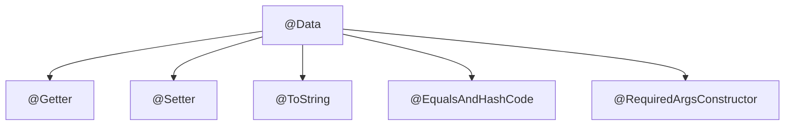
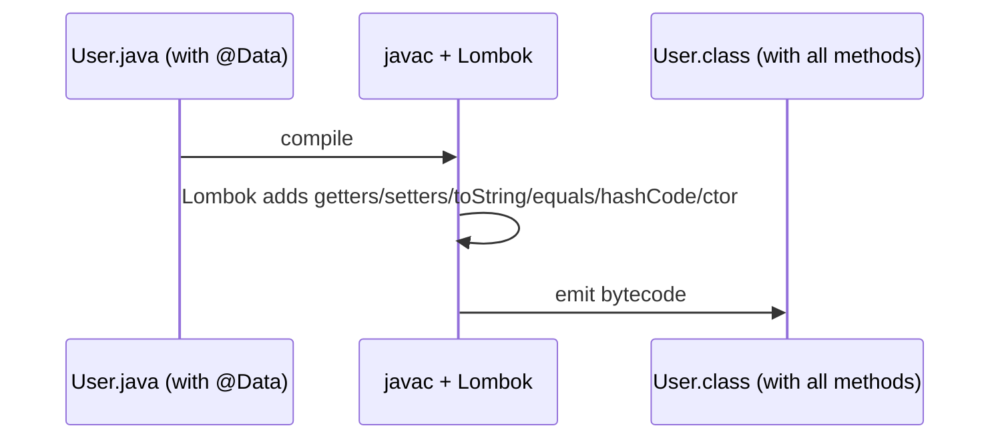

# What @Data from Lombok Does

Writing a plain data class in Java is repetitive: private fields, a getter and
setter for each, plus `toString`, `equals` and `hashCode`. **Lombok** is a
library that generates that boilerplate for you *at compile time*, driven by
annotations. `@Data` is its "everything for a data class" bundle.

Think of `@Data` as a **meal deal at a café**: instead of ordering the burger,
fries and drink separately, you order one combo and the kitchen plates all of it.
You write one annotation; Lombok serves up the whole set of methods.

## What the combo contains

`@Data` is a shortcut for **five** other Lombok annotations applied at once:



- **@Getter** — a public getter for *every* field.
- **@Setter** — a public setter for every *non-final* field (final fields can't be
  reassigned, so they get no setter).
- **@ToString** — a `toString()` listing the field names and values.
- **@EqualsAndHashCode** — `equals()` and `hashCode()` computed from all the
  fields, so two objects with equal field values are "equal".
- **@RequiredArgsConstructor** — a constructor taking exactly the *required*
  fields: those that are `final` or marked `@NonNull` and still uninitialised.

So this:

```java
@Data
public class User {
    private final Long id;
    private String name;
    private String email;
}
```

expands, at compile time, into roughly this:

```java
public class User {
    private final Long id;
    private String name;
    private String email;

    public User(Long id) { this.id = id; }          // required-args (only final id)

    public Long getId() { return id; }
    public String getName() { return name; }
    public void setName(String name) { this.name = name; }
    public String getEmail() { return email; }
    public void setEmail(String email) { this.email = email; }

    @Override public String toString() { /* "User(id=…, name=…, email=…)" */ }
    @Override public boolean equals(Object o) { /* compares id, name, email */ }
    @Override public int hashCode() { /* from id, name, email */ }
}
```

You never see this generated code in your `.java` file — Lombok injects it into the
`.class` during compilation. It's like a **kitchen prep station**: customers (your
code) only see the finished plate (the public methods), not the chopping that
happened in the back.

## How it works under the hood

Lombok is an **annotation processor** that hooks into `javac` and edits the
program's syntax tree (AST) before bytecode is written. Because the change happens
at compile time, the generated methods are real methods in the `.class` file —
there's no reflection or runtime cost.



The catch: your IDE also needs the **Lombok plugin** to "see" those methods while
you type, otherwise it underlines `getName()` as undefined even though the build
succeeds. It's like a recipe written in shorthand — the kitchen (compiler)
understands it, but a new cook (the IDE) needs the same cheat sheet to read along.

## 60-second interview answer

> `@Data` is a Lombok annotation that bundles `@Getter`, `@Setter`, `@ToString`,
> `@EqualsAndHashCode` and `@RequiredArgsConstructor`. So on a class it generates a
> getter for every field, a setter for every non-final field, a `toString`, an
> `equals`/`hashCode` over all fields, and a constructor for the required (final or
> `@NonNull`) fields. Lombok does this at compile time via annotation processing,
> so the methods are real bytecode with no runtime cost. It's great for cutting
> boilerplate on plain DTOs, but I'm careful with it: the generated `equals`/
> `hashCode` use all fields, which is dangerous on JPA entities and on mutable
> objects used as map keys. For immutable data I'd often reach for a `record` or
> `@Value` instead.

## Common misconceptions and traps

- ❌ **"@Data makes the class immutable."** The opposite — it adds *setters*, so the
  object is fully mutable. For immutability use Lombok's `@Value` (final fields, no
  setters) or a Java `record`.
- ⚠️ **equals/hashCode use every field.** If you put a `@Data` object in a `HashSet`
  or use it as a key in a [HashMap](topic:hashmap-basics) and then mutate a field,
  its hashCode changes and you can no longer find it. Mutable objects make poor keys.
- ⚠️ **Danger on JPA entities.** The generated `equals`/`hashCode` touch *all*
  fields, including lazy associations — which can trigger extra queries or
  `LazyInitializationException`, and including the database id, which is null before
  persist. The common advice is to *not* put `@Data` on entities (use `@Getter`/
  `@Setter` and a hand-written id-based `equals`).
- ⚠️ **`toString` can recurse or leak.** Two `@Data` objects that reference each
  other produce infinite recursion in `toString`; and printing every field can leak
  passwords/tokens. Exclude fields with `@ToString.Exclude`.
- ❌ **"It generates a no-args constructor."** It generates a *required-args*
  constructor. A class with `final`/`@NonNull` fields has **no** no-arg
  constructor unless you add `@NoArgsConstructor` — which frameworks like Jackson
  or JPA may need. See the [final keyword](topic:final) for why final fields force
  a constructor argument.
- 💡 **Pairs well with [@Builder](topic:builder)** for readable construction of
  objects with many fields, instead of a long constructor call.
