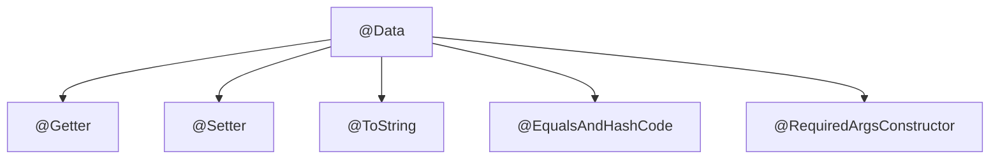
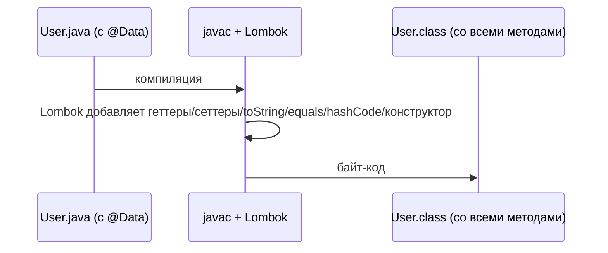

# Что делает аннотация @Data от Lombok

Писать обычный класс-носитель данных на Java утомительно: приватные поля, геттер и
сеттер для каждого, плюс `toString`, `equals` и `hashCode`. **Lombok** — это
библиотека, которая генерирует этот шаблонный код за вас *на этапе компиляции*,
управляясь аннотациями. `@Data` — это её набор «всё для класса данных».

Представьте `@Data` как **комбо-меню в кафе**: вместо того чтобы заказывать бургер,
картошку и напиток по отдельности, вы заказываете один комбо-набор, и кухня
выкладывает всё сразу. Вы пишете одну аннотацию — Lombok подаёт целый набор методов.

## Что входит в комбо

`@Data` — это сокращение для **пяти** других аннотаций Lombok, применённых сразу:



- **@Getter** — публичный геттер для *каждого* поля.
- **@Setter** — публичный сеттер для каждого *не-final* поля (final-поля нельзя
  переприсвоить, поэтому для них сеттер не генерируется).
- **@ToString** — метод `toString()`, выводящий имена и значения полей.
- **@EqualsAndHashCode** — методы `equals()` и `hashCode()`, вычисляемые по всем
  полям, так что два объекта с равными значениями полей считаются «равными».
- **@RequiredArgsConstructor** — конструктор, принимающий именно *обязательные*
  поля: те, что объявлены `final` или помечены `@NonNull` и ещё не
  проинициализированы.

То есть вот это:

```java
@Data
public class User {
    private final Long id;
    private String name;
    private String email;
}
```

на этапе компиляции разворачивается примерно в это:

```java
public class User {
    private final Long id;
    private String name;
    private String email;

    public User(Long id) { this.id = id; }          // конструктор по обязательным (только final id)

    public Long getId() { return id; }
    public String getName() { return name; }
    public void setName(String name) { this.name = name; }
    public String getEmail() { return email; }
    public void setEmail(String email) { this.email = email; }

    @Override public String toString() { /* "User(id=…, name=…, email=…)" */ }
    @Override public boolean equals(Object o) { /* сравнивает id, name, email */ }
    @Override public int hashCode() { /* по id, name, email */ }
}
```

Этот сгенерированный код вы никогда не увидите в своём `.java`-файле — Lombok
внедряет его в `.class` во время компиляции. Это как **заготовочный цех на кухне**:
посетители (ваш код) видят только готовое блюдо (публичные методы), а не нарезку,
что шла на задворках.

## Как это работает под капотом

Lombok — это **процессор аннотаций**, который встраивается в `javac` и
редактирует синтаксическое дерево программы (AST) до того, как будет записан
байт-код. Поскольку изменение происходит на этапе компиляции, сгенерированные
методы — это настоящие методы в `.class`-файле: ни рефлексии, ни затрат во время
выполнения.



Подвох: вашей IDE тоже нужен **плагин Lombok**, чтобы «видеть» эти методы, пока вы
печатаете, иначе она подчёркивает `getName()` как несуществующий, хотя сборка
проходит успешно. Это как рецепт, записанный в сокращениях: кухня (компилятор) его
понимает, но новому повару (IDE) нужна та же шпаргалка, чтобы читать заодно.

## Ответ за 60 секунд

> `@Data` — это аннотация Lombok, объединяющая `@Getter`, `@Setter`, `@ToString`,
> `@EqualsAndHashCode` и `@RequiredArgsConstructor`. То есть на классе она
> генерирует геттер для каждого поля, сеттер для каждого не-final поля, `toString`,
> `equals`/`hashCode` по всем полям и конструктор по обязательным (final или
> `@NonNull`) полям. Lombok делает это на этапе компиляции через обработку
> аннотаций, поэтому методы — это настоящий байт-код без затрат во время
> выполнения. Она отлично сокращает шаблонный код у простых DTO, но я с ней
> осторожен: сгенерированные `equals`/`hashCode` используют все поля, что опасно
> на JPA-сущностях и на изменяемых объектах в роли ключей map. Для неизменяемых
> данных я часто беру `record` или `@Value`.

## Распространённые заблуждения и ловушки

- ❌ **«@Data делает класс неизменяемым».** Наоборот — она добавляет *сеттеры*, так
  что объект полностью изменяемый. Для неизменяемости используйте `@Value` от
  Lombok (final-поля, без сеттеров) или Java-`record`.
- ⚠️ **equals/hashCode используют каждое поле.** Если положить `@Data`-объект в
  `HashSet` или использовать как ключ в [HashMap](topic:hashmap-basics), а потом
  изменить поле, его hashCode поменяется, и объект больше не найти. Изменяемые
  объекты — плохие ключи.
- ⚠️ **Опасность на JPA-сущностях.** Сгенерированные `equals`/`hashCode` трогают
  *все* поля, включая ленивые связи — что может вызвать лишние запросы или
  `LazyInitializationException`, — и включая id из базы, который равен null до
  сохранения. Общая рекомендация: *не* ставить `@Data` на сущности (использовать
  `@Getter`/`@Setter` и написанный вручную `equals` по id).
- ⚠️ **`toString` может зациклиться или утечь.** Два `@Data`-объекта, ссылающиеся
  друг на друга, дают бесконечную рекурсию в `toString`; а вывод каждого поля может
  утечь пароли/токены. Исключайте поля через `@ToString.Exclude`.
- ❌ **«Она генерирует конструктор без аргументов».** Она генерирует конструктор по
  *обязательным* полям. У класса с `final`/`@NonNull`-полями **нет** конструктора
  без аргументов, пока вы не добавите `@NoArgsConstructor` — а он нужен фреймворкам
  вроде Jackson или JPA. См. [ключевое слово final](topic:final) — почему
  final-поля требуют аргумент конструктора.
- 💡 **Хорошо сочетается с [@Builder](topic:builder)** для читаемого создания
  объектов с множеством полей вместо длинного вызова конструктора.
