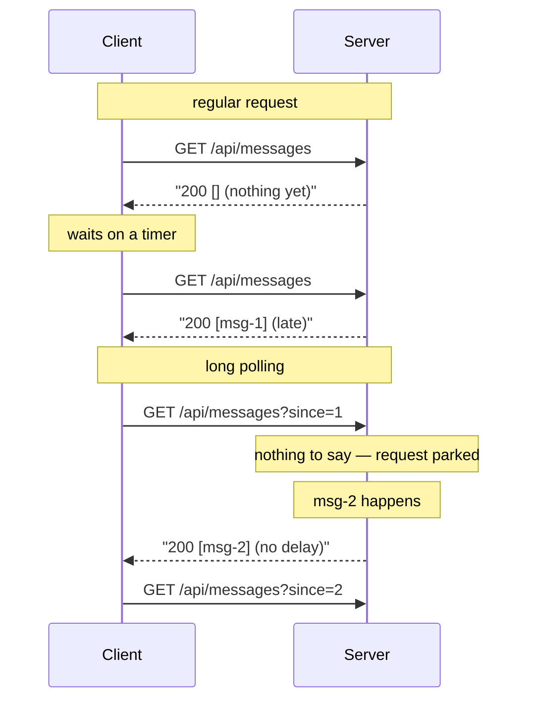
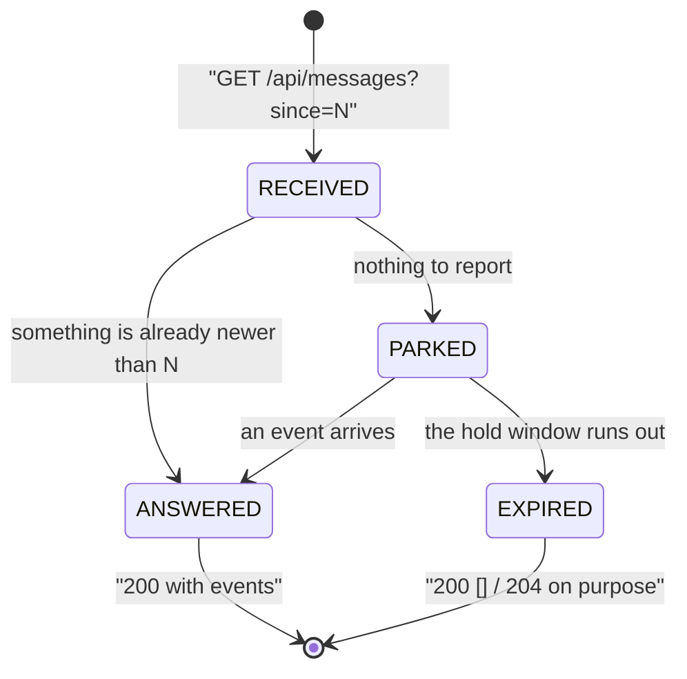
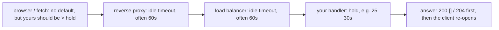

# Long Polling vs a Regular HTTP Request

## The one-sentence answer

Long polling is an ordinary HTTP request that the server **deliberately does not
answer yet**. The client sends the same `GET`; the handler, finding nothing to
report, holds the request open instead of returning an empty response, and
completes it the moment there is news — or answers empty on purpose when its hold
window runs out. Nothing new appears on the wire. The **waiting moved from the
client's timer to the server**.

## The loop you already know

A regular request is a closed loop, and the important word is *closed*:

1. the client opens a connection and sends a request;
2. a worker thread picks it up and runs the handler;
3. the handler produces a response — **now**;
4. the response is written, and the request is over.

Step 3 has no "wait a bit" option. If there is nothing interesting to say, the
handler still has to say something: `200 []`, or `204 No Content`. That answer
costs a TCP/TLS round trip, request headers, a handler invocation, usually a
database look-up and a log line — the exact same price as a useful answer. And
because nothing is open between requests, news that appears just after a response
has to wait for the client's next request. With a timer of *N* seconds, the
average delay is *N/2* and the worst case is *N*: you cannot make the data fresher
without paying for more empty requests, and you cannot cut the empty requests
without making the data staler. That trade-off is the entire reason long polling
exists.

## What long polling changes — and what it doesn't

Exactly one thing changes: **when the response is written**.

Everything else is identical, and this is worth being able to list in an
interview: same method and URL, same headers, cookies and auth, same status codes,
same TLS, same [CORS](topic:cors) rules, same access logs, same [HTTP
semantics](topic:http-methods) end to end. A proxy cannot tell the two apart. The
client cannot tell them apart *from the request it just sent* — only from how long
the response takes to arrive. There is no upgrade, no new protocol, no special
content type. That is precisely why long polling was the answer for a decade
before WebSockets: it needs nothing that plain HTTP/1.1 did not already have.

Two consequences follow immediately, and both matter:

- **It is still client-pull, not push.** The server can only write into a request
  it already has. Calling long polling "push" is wrong in a way that shows up in
  design decisions: the server never initiates, and a client that has not asked
  cannot be reached.
- **A response ends the request.** After every message the client must open a new
  one. One message per request is the ceiling — which is exactly why long polling
  stops paying off on a chatty stream, and why the alternatives
  ([SSE and WebSockets](topic:realtime-server-push)) keep one connection and write
  many messages into it.

## The lifecycle of a held request

Two branches out of `RECEIVED` are the whole design, and juniors usually only
implement the second one. A request whose cursor is behind the log must be
answered **immediately**; parking is only correct for a client that is already
caught up. Get that wrong and every client that was away for a minute waits for
the *next* event before it sees the previous ten.

## What the server pays

A parked request is **state on the server**. That is the real cost, and how much
it costs depends entirely on how you wrote the handler.

**Blocking handler.** `while (nothing) { sleep(); }`, or a `queue.poll(30,
SECONDS)`, inside a normal Spring MVC controller method. The request is parked, so
the worker thread is parked too — a thread doing nothing but occupying a slot in
the [thread pool](topic:java-thread-pool), plus its stack. With 200 Tomcat
workers, client 201 does not get served: not on this endpoint, and not on any
other endpoint sharing the pool. A notification feature written this way takes
down the checkout page, which is the single most common way long polling is
implemented badly.

**Async handler.** Return a `DeferredResult`, a `CompletableFuture`, a
`Mono`/`Flux`, or use the Servlet 3 async context. The framework remembers the
unfinished response, the worker returns to the pool immediately, and completing it
later is a callback from whatever produced the event. Now what stays open is a
socket, a file descriptor and a small registration — thousands of waiting clients
per instance instead of a couple of hundred. Same protocol behaviour, completely
different capacity: this is the [synchronous vs asynchronous
handling](topic:sync-vs-async-communication) distinction with a very concrete
price tag.

Either way, an idle client is not free. It costs one request per hold window
forever: with a 30-second hold, 2 requests a minute per tab, 120 requests a minute
for 60 tabs — cheap next to polling every second, and not zero.

## Timeouts: the ladder that has to be right

A hold is a **bounded, deliberate** wait, and its length is not a free choice.
Everything between the browser and your handler has an idle timeout, and whoever
fires first wins:

Read it from the inside out: the server's hold must be **shorter** than the
shortest timeout above it, so a quiet wait ends in a clean empty response instead
of a connection someone else cut — a cut connection reaches the client as a
network error, not as data. And the client's own read timeout must be **longer**
than the server's hold, or the client aborts its own perfectly healthy request.
Both mistakes look identical in the browser and are usually diagnosed as "the
long polling doesn't work". This is the same discipline as any other
[timeout and fallback](topic:service-timeouts-fallbacks) ladder; a
[gateway](topic:api-gateway) in front of your service is one more rung in it.

## The gap, and the cursor that saves it

The bug that survives code review: **between one response and the next request,
nothing is listening**. An event happening in that window has no parked request to
be written into. If the client just says "tell me when something happens", that
event is gone — silently, with no error, no log line, and a screen that is simply
wrong until the next event nudges it.

The fix is not a longer hold. It is that the endpoint must be answerable **from
state, not from a subscription**: keep an append-only log (or a version column, or
a "last updated" timestamp), have the client send where it stopped —
`?since=42` — and answer from the log first, parking only when `since` is already
at the head. Then the gap is harmless: the next request arrives with `since=42`,
finds `#43` in the log and is answered instantly.

That design has a side effect worth naming: delivery becomes **at-least-once**. A
client that times out or retries can receive the same event twice, so events need
stable ids and the client (or the consumer behind it) must be idempotent — the
same reasoning as the [Inbox pattern](topic:inbox-pattern) on the messaging side.
Treat a delivered event as a *hint* that state changed, not as the state itself.

## Where it still makes sense

Long polling is not merely historical. It is the right answer when:

- the message rate is **low** (a notification bell, a job or export that finishes,
  an approval, a payment confirmation) — a request per event is nothing when there
  are ten events an hour;
- the path is hostile to long-lived connections: corporate proxies that buffer or
  strip `text/event-stream`, a gateway that will not proxy WebSockets, a mobile
  network that drops idle sockets anyway;
- you want **one code path**: the same endpoint, the same auth, the same
  observability, the same `Retry-After` behaviour as the rest of your API — no
  second stack to secure, monitor and scale;
- you need it *today* and the infrastructure discussion for WebSockets will take a
  quarter.

It is the wrong answer for chat, typing indicators, cursors, tickers or anything
where events arrive several times a second per client: there, one response per
message turns into a request per message plus a re-open, and you have rebuilt
polling with extra steps. Note also that long polling **does not need sticky
sessions or a shared bus** — it is stateless between requests, so any instance can
answer, which is one real operational advantage it holds over SSE and WebSockets.
For the full comparison of the four options, see
[notifying a browser in real time](topic:realtime-server-push); for how the two
sides talk in general, [frontend and backend
interaction](topic:frontend-backend-interaction).

## The 60-second interview answer

> A regular HTTP request is answered as soon as the handler runs, even if the
> answer is "nothing new" — so to see fresh data the client has to ask again on a
> timer, paying a round trip per empty answer and accepting a delay of up to one
> interval. Long polling keeps the request instead of answering it: the client
> sends the same `GET`, and if there is nothing to report the server holds the
> request open and completes it the instant an event happens, so the delay is
> effectively zero. It is the same protocol — same method, headers, status codes,
> proxies — only the timing of the response changes, and it is still the client
> that asks, so the server can never speak first. The cost moves to the server: a
> parked request is state, so you must implement it asynchronously — a
> `DeferredResult` rather than a blocked thread — or a few hundred idle clients
> will exhaust the servlet thread pool. You also cap the hold at, say, 25 seconds
> so you answer before any proxy times the connection out, and the client's read
> timeout has to exceed that. The subtle part is the gap: a response ends the
> request, so an event landing before the client re-opens is only recoverable if
> the client sends a cursor like `?since=42` and the server answers from a log
> instead of a live subscription. I'd use it for low-rate notifications or where
> WebSockets/SSE aren't available, and switch to SSE or a WebSocket as soon as
> messages become frequent.

## Common traps and misconceptions

- **"Long polling keeps the connection open forever."** No — the hold is bounded
  on purpose, typically 20–30 seconds, because a browser, proxy, load balancer or
  NAT box will otherwise cut it and the client sees an error instead of an empty
  response.
- **"It's server push."** It is not. The server can only write into a request it
  already holds; it never initiates. A client that has not asked is unreachable.
- **"It's just polling with a big interval."** The opposite. Short polling has a
  long *client-side* wait and short server-side work; long polling has no client
  wait and a long server-side hold. Latency and occupancy swap places.
- **"A slow endpoint is long polling."** No. A slow endpoint is *working*; a long
  poll is *waiting for a condition* while doing nothing. Same duration, completely
  different resource profile — which is why the async implementation matters so
  much.
- **Implementing it with a blocked thread.** The most common real failure. A
  parked request must not hold a worker: use `DeferredResult`,
  `CompletableFuture`, the Servlet async context, or a reactive stack.
- **No cursor.** Subscribing on arrival and remembering nothing loses every event
  that lands between one response and the next request. Answer from a log with
  `?since=`; do not subscribe blindly.
- **A hold longer than the proxy's idle timeout.** Then the infrastructure ends
  the request, not you, and the client cannot distinguish that from a real
  failure.
- **A client read timeout shorter than the hold.** The client kills its own
  healthy request every cycle; it looks like a flaky server.
- **Forgetting the browser's connection limit.** Over HTTP/1.1 a browser allows
  about 6 connections per origin, and a parked long poll permanently occupies one
  of them. Over HTTP/2 they share one connection, which mostly removes the
  problem.
- **Retrying with no backoff.** If the endpoint returns 500 and the client
  re-opens immediately, you have written a self-inflicted denial of service. A
  failed poll must back off; a successful one may re-open at once.
- **Reading the metrics wrong.** A long-poll endpoint legitimately shows a p99
  latency equal to the hold. Measure "time from event to delivery" and "parked
  requests in flight" instead of raw request duration, or your dashboards will
  scream about a healthy system.
- **Assuming exactly-once.** Retries and timeouts make redelivery normal. Stable
  event ids plus an idempotent client are part of the design, not an extra.
