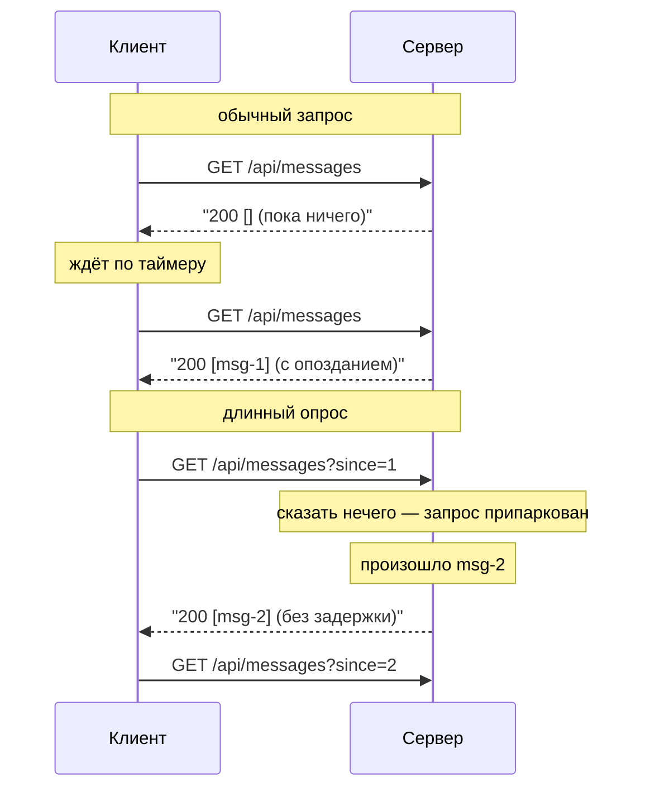
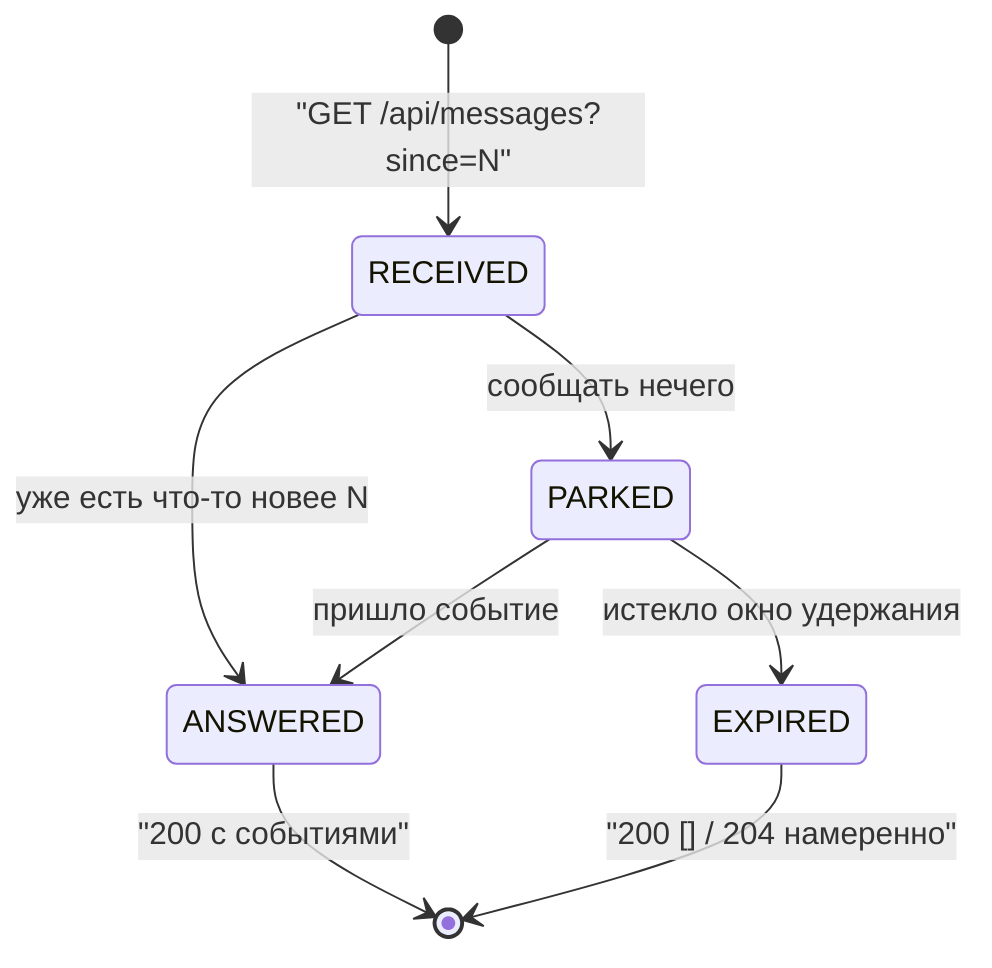
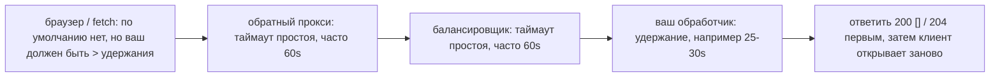

# Длинный опрос против обычного HTTP-запроса

## Ответ одной фразой

Длинный опрос (long polling) — это обычный HTTP-запрос, на который сервер
**намеренно пока не отвечает**. Клиент отправляет тот же `GET`; обработчик, не
найдя чего сообщить, не возвращает пустой ответ, а держит запрос открытым и
завершает его в момент появления новости — либо намеренно отвечает пустым, когда
истекает окно удержания. На проводе не появляется ничего нового. **Ожидание
переехало с таймера клиента на сервер.**

## Цикл, который вы уже знаете

Обычный запрос — замкнутый цикл, и важное слово здесь именно *замкнутый*:

1. клиент открывает соединение и отправляет запрос;
2. рабочий поток забирает его и выполняет обработчик;
3. обработчик выдаёт ответ — **сейчас**;
4. ответ записан, и запрос завершён.

У шага 3 нет варианта «подожди немного». Если сказать нечего интересного,
обработчик всё равно обязан что-то сказать: `200 []` или `204 No Content`. Этот
ответ стоит обмена TCP/TLS, заголовков запроса, вызова обработчика, обычно
обращения к базе и строки в логе — ровно столько же, сколько полезный ответ. А
поскольку между запросами ничего не открыто, новость, появившаяся сразу после
ответа, ждёт следующего запроса клиента. При таймере в *N* секунд средняя задержка
равна *N/2*, худшая — *N*: нельзя сделать данные свежее, не заплатив бо́льшим
числом пустых запросов, и нельзя сократить пустые запросы, не сделав данные более
устаревшими. Этот компромисс — и есть вся причина существования длинного опроса.

## Что длинный опрос меняет — и что нет

Меняется ровно одно: **момент, когда записывается ответ**.

Всё остальное идентично, и этот список стоит уметь перечислить на собеседовании:
тот же метод и URL, те же заголовки, куки и авторизация, те же коды состояния, тот
же TLS, те же правила [CORS](topic:cors), те же access-логи, та же
[семантика HTTP](topic:http-methods) от начала до конца. Прокси не отличит одно от
другого. Клиент не отличит их *по только что отправленному запросу* — только по
тому, как долго идёт ответ. Ни апгрейда, ни нового протокола, ни особого
content-type. Именно поэтому длинный опрос был ответом на протяжении десятилетия
до WebSocket: ему не нужно ничего, чего не было бы в обычном HTTP/1.1.

Отсюда сразу следуют два вывода, и оба важны:

- **Это по-прежнему pull, а не push.** Сервер может писать только в тот запрос,
  который у него уже есть. Называть длинный опрос «push» неверно так, что это
  проявляется в проектных решениях: сервер никогда не инициирует, и до клиента,
  который не спросил, дотянуться нельзя.
- **Ответ завершает запрос.** После каждого сообщения клиент обязан открыть новый.
  Одно сообщение на запрос — это потолок; именно поэтому длинный опрос перестаёт
  окупаться на «болтливом» потоке и поэтому альтернативы
  ([SSE и WebSocket](topic:realtime-server-push)) держат одно соединение и пишут в
  него много сообщений.

## Жизненный цикл придержанного запроса

Две ветки из `RECEIVED` — это и есть весь дизайн, и джуны обычно реализуют только
вторую. Запрос, чей курсор отстаёт от журнала, должен получить ответ
**немедленно**; парковка корректна только для клиента, который уже всё видел.
Ошибитесь тут — и каждый клиент, отсутствовавший минуту, будет ждать *следующего*
события, чтобы увидеть предыдущие десять.

## Чем платит сервер

Припаркованный запрос — это **состояние на сервере**. Это и есть настоящая цена, а
её размер целиком зависит от того, как написан обработчик.

**Блокирующий обработчик.** `while (nothing) { sleep(); }` или `queue.poll(30,
SECONDS)` внутри обычного метода контроллера Spring MVC. Запрос припаркован — а
значит, припаркован и рабочий поток: поток, который ничего не делает, но занимает
слот в [пуле потоков](topic:java-thread-pool), плюс его стек. При 200 воркерах
Tomcat клиент номер 201 не будет обслужен: ни на этом эндпоинте, ни на любом
другом, который делит тот же пул. Написанная так фича уведомлений роняет страницу
оплаты — и это самый частый способ реализовать длинный опрос плохо.

**Асинхронный обработчик.** Верните `DeferredResult`, `CompletableFuture`,
`Mono`/`Flux` или используйте асинхронный контекст сервлета. Фреймворк запоминает
незавершённый ответ, воркер сразу возвращается в пул, а завершение позже — это
колбэк от того, что породило событие. Теперь открытыми остаются сокет, файловый
дескриптор и небольшая регистрация: тысячи ждущих клиентов на экземпляр вместо
пары сотен. Поведение протокола то же, ёмкость — совершенно другая: это то самое
различие [синхронной и асинхронной](topic:sync-vs-async-communication) обработки с
очень конкретным ценником.

В любом случае простаивающий клиент не бесплатен. Он стоит одного запроса на окно
удержания, и так всегда: при удержании 30 секунд — 2 запроса в минуту на вкладку,
120 запросов в минуту на 60 вкладок. Дёшево по сравнению с опросом раз в секунду —
и не ноль.

## Таймауты: лестница, которую нужно выстроить верно

Удержание — это **ограниченное и намеренное** ожидание, и его длину нельзя выбрать
произвольно. У всего между браузером и вашим обработчиком есть таймаут простоя, и
побеждает тот, кто срабатывает первым:

Читайте изнутри наружу: удержание сервера должно быть **короче** самого короткого
таймаута над ним, чтобы тихое ожидание закончилось аккуратным пустым ответом, а не
соединением, которое оборвал кто-то другой, — оборванное соединение приходит к
клиенту как сетевая ошибка, а не как данные. А собственный таймаут чтения у
клиента должен быть **больше** удержания сервера, иначе клиент прервёт свой же
совершенно здоровый запрос. Обе ошибки в браузере выглядят одинаково и обычно
диагностируются как «длинный опрос не работает». Это та же дисциплина, что и в
любой другой лестнице [таймаутов и фолбэков](topic:service-timeouts-fallbacks);
[шлюз](topic:api-gateway) перед вашим сервисом — ещё одна её ступенька.

## Промежуток и курсор, который его спасает

Ошибка, которая проходит ревью: **между одним ответом и следующим запросом никто
не слушает**. Событию, случившемуся в этом окне, некуда записаться — нет
припаркованного запроса. Если клиент просто говорит «сообщи, когда что-нибудь
произойдёт», это событие потеряно: молча, без ошибки, без строки в логе, и экран
просто неверен, пока следующее событие его не подтолкнёт.

Лечится это не более длинным удержанием. Лечится тем, что на эндпоинт нужно уметь
отвечать **из состояния, а не из подписки**: держите журнал только на добавление
(или колонку версии, или отметку «последнее обновление»), пусть клиент присылает,
где он остановился — `?since=42`, — и отвечайте сначала из журнала, паркуя запрос
только когда `since` уже на самом краю. Тогда промежуток безвреден: следующий
запрос приходит с `since=42`, находит `#43` в журнале и получает ответ мгновенно.

У этого дизайна есть побочный эффект, который стоит назвать: доставка становится
**at-least-once**. Клиент, у которого сработал таймаут или который повторил
запрос, может получить одно событие дважды — поэтому событиям нужны стабильные id,
а клиент (или потребитель за ним) обязан быть идемпотентным. Это то же
рассуждение, что и в [Inbox-паттерне](topic:inbox-pattern) на стороне обмена
сообщениями. Считайте доставленное событие *подсказкой* о том, что состояние
изменилось, а не самим состоянием.

## Где это по-прежнему уместно

Длинный опрос — не только история. Это правильный ответ, когда:

- поток сообщений **низкий** (колокольчик уведомлений, завершившаяся задача или
  выгрузка, согласование, подтверждение платежа) — запрос на событие ничего не
  значит, когда событий десять в час;
- путь враждебен долгоживущим соединениям: корпоративные прокси, которые буферят
  или вырезают `text/event-stream`, шлюз, который не проксирует WebSocket,
  мобильная сеть, всё равно рвущая простаивающие сокеты;
- нужен **один путь кода**: тот же эндпоинт, та же авторизация, та же
  наблюдаемость, то же поведение `Retry-After`, как у остального API, — не нужно
  защищать, мониторить и масштабировать второй стек;
- это нужно *сегодня*, а обсуждение инфраструктуры под WebSocket займёт квартал.

И это неправильный ответ для чата, индикаторов набора, курсоров, тикеров и всего,
где события приходят по несколько раз в секунду на клиента: там один ответ на
сообщение превращается в запрос на сообщение плюс переоткрытие, и вы заново
изобрели опрос, только сложнее. Заметьте также, что длинному опросу **не нужны ни
sticky-сессии, ни общая шина**: между запросами он не хранит состояния, поэтому
ответить может любой экземпляр, — и это одно из его реальных эксплуатационных
преимуществ перед SSE и WebSocket. Полное сравнение четырёх вариантов — в
[уведомлении браузера в реальном времени](topic:realtime-server-push); о том, как
две стороны общаются в целом, — в
[взаимодействии фронтенда и бэкенда](topic:frontend-backend-interaction).

## Ответ на собеседовании за 60 секунд

> На обычный HTTP-запрос отвечают, едва отработает обработчик, даже если ответ —
> «ничего нового»; поэтому, чтобы видеть свежие данные, клиент вынужден спрашивать
> снова по таймеру, платя обменом за каждый пустой ответ и соглашаясь на задержку
> до целого интервала. Длинный опрос вместо ответа сохраняет запрос: клиент
> отправляет тот же `GET`, и если сообщать нечего, сервер держит запрос открытым и
> завершает его в момент события, поэтому задержка практически нулевая. Это тот же
> протокол — тот же метод, заголовки, коды состояния, прокси, — меняется только
> момент ответа, и спрашивает по-прежнему клиент, так что сервер никогда не может
> заговорить первым. Цена переезжает на сервер: припаркованный запрос — это
> состояние, поэтому реализовывать нужно асинхронно, через `DeferredResult`, а не
> через заблокированный поток, иначе пара сотен простаивающих клиентов исчерпает
> пул потоков сервлет-контейнера. Удержание ограничивают, скажем, 25 секундами,
> чтобы ответить раньше, чем любой прокси оборвёт соединение по таймауту, а
> таймаут чтения у клиента должен быть больше. Тонкое место — промежуток: ответ
> завершает запрос, поэтому событие, попавшее до переоткрытия, восстановимо только
> если клиент присылает курсор вида `?since=42`, а сервер отвечает из журнала, а не
> из живой подписки. Я бы взял это для уведомлений с низкой частотой или там, где
> WebSocket и SSE недоступны, и перешёл бы на SSE или WebSocket, едва сообщения
> станут частыми.

## Частые ловушки и заблуждения

- **«Длинный опрос держит соединение открытым бесконечно.»** Нет — удержание
  намеренно ограничено, обычно 20–30 секунд, потому что иначе браузер, прокси,
  балансировщик или NAT его оборвут, и клиент увидит ошибку вместо пустого ответа.
- **«Это server push.»** Нет. Сервер может писать только в запрос, который уже
  держит; он никогда не инициирует. До клиента, который не спросил, не дотянуться.
- **«Это просто опрос с большим интервалом.»** Наоборот. У короткого опроса
  длинное ожидание *на клиенте* и короткая работа на сервере; у длинного опроса
  ожидания на клиенте нет, зато есть долгое удержание на сервере. Задержка и
  занятость меняются местами.
- **«Медленный эндпоинт — это длинный опрос.»** Нет. Медленный эндпоинт
  *работает*; длинный опрос *ждёт условия*, ничего не делая. Одна и та же
  длительность и совершенно разный профиль ресурсов — именно поэтому асинхронная
  реализация так важна.
- **Реализация на заблокированном потоке.** Самый частый реальный провал.
  Припаркованный запрос не должен занимать воркер: используйте `DeferredResult`,
  `CompletableFuture`, асинхронный контекст сервлета или реактивный стек.
- **Нет курсора.** Подписка при поступлении запроса и отсутствие памяти теряют
  каждое событие, попавшее между ответом и следующим запросом. Отвечайте из
  журнала по `?since=`, а не подписывайтесь слепо.
- **Удержание длиннее таймаута простоя на прокси.** Тогда запрос завершает
  инфраструктура, а не вы, и клиент не отличит это от настоящего сбоя.
- **Таймаут чтения у клиента короче удержания.** Клиент каждый цикл убивает свой
  же здоровый запрос; выглядит как нестабильный сервер.
- **Забыть про лимит соединений в браузере.** По HTTP/1.1 браузер разрешает около
  6 соединений на источник, и припаркованный длинный опрос навсегда занимает одно
  из них. По HTTP/2 они делят одно соединение, что почти снимает проблему.
- **Повторы без backoff.** Если эндпоинт вернул 500, а клиент тут же переоткрывает
  запрос, вы написали себе отказ в обслуживании своими руками. Неудачный опрос
  обязан отступать по времени; удачный может переоткрываться сразу.
- **Неверное чтение метрик.** У long-poll эндпоинта p99 задержки законно равен
  удержанию. Измеряйте «время от события до доставки» и «сколько запросов
  припарковано», а не длительность запроса, иначе дашборды будут кричать о вполне
  здоровой системе.
- **Расчёт на exactly-once.** Повторы и таймауты делают повторную доставку
  нормой. Стабильные id событий плюс идемпотентный клиент — часть дизайна, а не
  дополнение.
