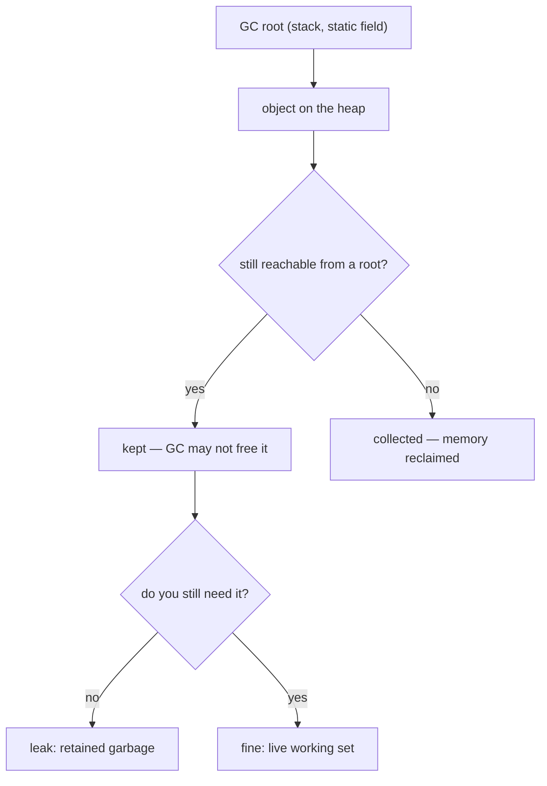
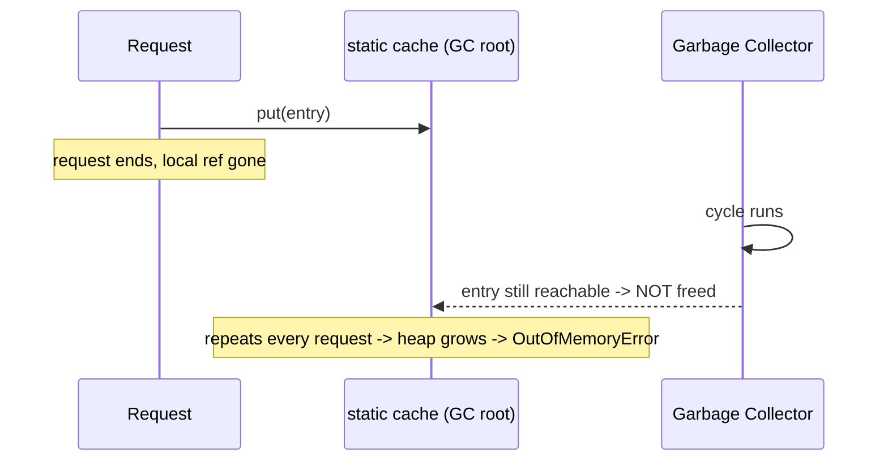

# Memory Leaks in Java

## The intuition

Java has a garbage collector, so it is tempting to think leaks are impossible.
They are not. The collector frees an object only when it is **unreachable** —
when no chain of references leads to it from a *GC root* (a live thread's stack,
a static field, a JNI handle). A **memory leak** in Java is an object you no
longer need that is still reachable, so the GC is *not allowed* to free it. The
heap fills with this retained garbage until you hit an `OutOfMemoryError`.

> **Real-world analogy.** Think of the heap as a big warehouse and the GC as the
> night cleaning crew. Every evening they throw out any box that no one is
> holding a rope to. A leak is a box you tied to a permanent pillar and then
> walked away from: you will never open it again, but because a rope still leads
> to it, the crew is forbidden from removing it. Do that every night and the
> warehouse slowly fills with boxes nobody will ever touch.

The key distinction: *garbage* (you are done with it) is not the same as
*unreachable* (no references point to it). The GC collects the unreachable, not
the merely unused. A leak is the gap between the two.

## Where leaks actually come from

A handful of patterns cause almost all real Java leaks:

- **Ever-growing static collections.** A `static Map`/`List` used as a cache or
  registry that you only ever add to. The static field is a GC root that lives
  for the whole JVM, so every entry is pinned forever.
  *Analogy: a lost-and-found shelf bolted to the wall that staff keep adding to
  but never clear — it overflows by closing time.*
- **Forgotten listeners and callbacks.** A short-lived object subscribes to a
  long-lived publisher and never unsubscribes. The publisher's subscriber list
  keeps the dead object — and everything it references — alive.
  *Analogy: you gave the front desk your phone number, moved out, and never told
  them; they keep your whole file on record forever.*
- **`ThreadLocal` in a thread pool.** Pooled threads (see
  [Java Thread Pool](topic:java-thread-pool)) are reused for thousands of tasks
  and live a long time. A value left in a `ThreadLocal` is pinned by that thread
  until you call `remove()` — ideally in a `finally` block (see
  [final vs finally vs finalize](topic:final-finally-finalize)).
  *Analogy: a shared delivery van keeps the last driver's parcel in the back; the
  next driver inherits it, and it rides around forever unless someone unloads it.*
- **Unclosed resources.** Streams, connections, and `Statement`s hold OS handles
  and buffers; if you never `close()` them they accumulate. Use try-with-resources.
  *Analogy: leaving the water running in every room — each open tap is cheap, but
  the bill (and the flood) grows without bound.*
- **Inner classes and lambdas capturing an outer instance.** A non-static inner
  class (or a capturing lambda) holds an implicit reference to its enclosing
  object; if that lambda outlives the work, it keeps the whole outer object alive.
  *Analogy: a sticky note that quietly drags the entire binder it was attached to.*
- **Mutating a key after it is in a `HashSet`/`HashMap`.** If a key's `hashCode`
  changes, you can no longer find or remove the entry, so it lingers.

## A 60-second interview answer

"Java's GC frees objects that become *unreachable* from any GC root. A memory
leak is when an object you no longer need stays reachable, so the GC can't
collect it — reachable garbage. The classic causes are: a static collection or
cache that only grows; listeners or callbacks that are never unregistered; values
left in a `ThreadLocal` on a pooled thread that outlives the task; and unclosed
resources holding buffers and handles. The fix is to bound the lifetime of the
reference: evict from the cache, unregister the listener, call `ThreadLocal.remove()`
in a `finally`, use try-with-resources, or use weak references for caches. You
diagnose leaks by watching the old generation grow after full GCs and taking a
heap dump to find what is retaining the objects."

## Production relevance

Leaks rarely crash immediately; they crash slowly. A service runs fine for hours,
then the old generation (see [JVM Heap Generations](topic:heap-generations)) stops
shrinking after full GCs, GC pauses lengthen, throughput drops, and finally
`OutOfMemoryError: Java heap space` takes the process down — often under load, at
the worst time. You find them with a heap dump (`jmap`, JFR, or
`-XX:+HeapDumpOnOutOfMemoryError`) analyzed in a tool like Eclipse MAT, which
shows the *dominator tree* and the GC-root path retaining the objects. Tuning the
collector ([Configuring the Garbage Collector](topic:gc-configuration)) can delay
the crash but never fixes a real leak — the reference still has to be released.

## Common traps and misconceptions

- **"The GC means no leaks."** The GC prevents *dangling pointers*, not leaks. It
  cannot know you are done with a still-referenced object.
- **"`System.gc()` fixes it."** It only *suggests* a collection; it cannot free
  something that is still reachable. The reference is the problem.
- **"`finalize()` will clean up."** `finalize` is deprecated, may never run, and
  delays collection — never rely on it for resource release. Use try-with-resources.
- **A leak is not always heap.** Native memory, metaspace (leaked classloaders),
  and direct `ByteBuffer`s leak too, and a heap dump won't show those clearly.
- **Bounded caches still need a policy.** A cache without a size cap or eviction is
  just a leak with good intentions; use an LRU/size bound or a
  [memory-sensitive cache](topic:reference-types-cache) backed by `SoftReference`.
- **Leaks live on the heap, not the stack.** Local variables die with their stack
  frame ([Stack vs Heap](topic:jvm-memory-areas)); a runaway stack is a
  [StackOverflowError](topic:stackoverflow-error), a different failure.
