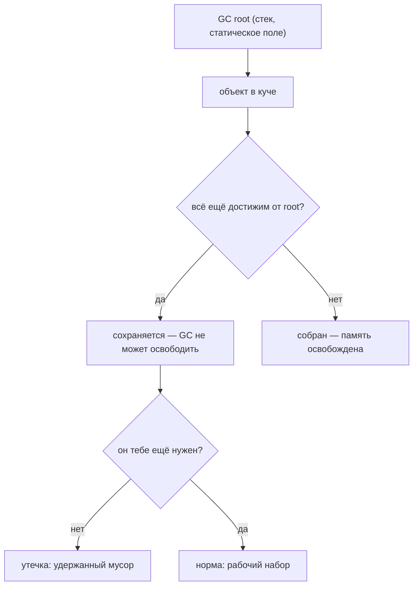
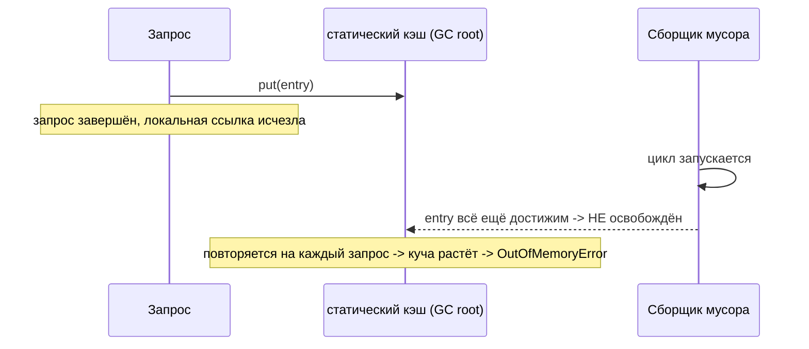

# Утечки памяти в Java

## Интуиция

В Java есть сборщик мусора, поэтому соблазнительно думать, что утечки невозможны.
Это не так. Сборщик освобождает объект, только когда тот **недостижим** — когда ни
одна цепочка ссылок не ведёт к нему от *GC root* (стек живого потока, статическое
поле, JNI-handle). **Утечка памяти** в Java — это ненужный объект, который всё ещё
достижим, поэтому GC *не имеет права* его освободить. Куча наполняется таким
удержанным мусором, пока не возникнет `OutOfMemoryError`.

> **Аналогия из жизни.** Представь кучу как большой склад, а GC — как ночную
> бригаду уборщиков. Каждый вечер они выкидывают любую коробку, к которой никто
> не держит верёвку. Утечка — это коробка, которую ты привязал к несущей колонне
> и ушёл: ты больше никогда её не откроешь, но раз к ней всё ещё ведёт верёвка,
> бригаде запрещено её трогать. Делай так каждую ночь — и склад постепенно
> забивается коробками, к которым уже никто не прикоснётся.

Ключевое различие: *мусор* (он тебе больше не нужен) — это не то же самое, что
*недостижимый* (на него не указывают ссылки). GC собирает недостижимое, а не
просто неиспользуемое. Утечка — это разрыв между этими двумя понятиями.

## Откуда на самом деле берутся утечки

Почти все реальные утечки в Java вызывает горстка паттернов:

- **Постоянно растущие статические коллекции.** `static Map`/`List` в роли кэша
  или реестра, в который только добавляют. Статическое поле — это GC root, живущий
  всё время работы JVM, поэтому каждая запись закреплена навсегда.
  *Аналогия: полка бюро находок, прикрученная к стене, в которую персонал всё
  складывает, но никогда не разбирает, — к закрытию она переполняется.*
- **Забытые listener и callback.** Короткоживущий объект подписывается на
  долгоживущий publisher и никогда не отписывается. Список подписчиков publisher
  держит мёртвый объект — и всё, на что тот ссылается, — живым.
  *Аналогия: ты оставил на ресепшене свой номер телефона, съехал и не сказал им;
  они вечно хранят всё твоё досье.*
- **`ThreadLocal` в пуле потоков.** Потоки из пула (см.
  [Java Thread Pool](topic:java-thread-pool)) переиспользуются для тысяч задач и
  живут долго. Значение, оставленное в `ThreadLocal`, закреплено этим потоком,
  пока ты не вызовешь `remove()` — желательно в блоке `finally` (см.
  [final vs finally vs finalize](topic:final-finally-finalize)).
  *Аналогия: общий фургон доставки везёт посылку прошлого водителя в кузове;
  следующий водитель наследует её, и она катается вечно, пока кто-нибудь не
  разгрузит.*
- **Незакрытые ресурсы.** Потоки, соединения и `Statement` держат OS-handle и
  буферы; если их никогда не `close()`, они накапливаются. Используй
  try-with-resources.
  *Аналогия: оставленная открытой вода в каждой комнате — каждый кран дёшев, но
  счёт (и потоп) растёт без предела.*
- **Внутренние классы и лямбды, захватывающие внешний экземпляр.** Нестатический
  внутренний класс (или захватывающая лямбда) держит неявную ссылку на
  объемлющий объект; если такая лямбда переживает работу, она удерживает весь
  внешний объект живым.
  *Аналогия: стикер, который тихо тянет за собой всю папку, к которой был приклеен.*
- **Изменение ключа после помещения в `HashSet`/`HashMap`.** Если `hashCode`
  ключа меняется, ты больше не можешь найти или удалить запись, и она остаётся.

## Ответ за 60 секунд

«GC в Java освобождает объекты, ставшие *недостижимыми* от любого GC root. Утечка
памяти — это когда ненужный объект остаётся достижимым, поэтому GC не может его
собрать, — достижимый мусор. Классические причины: статическая коллекция или кэш,
который только растёт; listener или callback, которые никогда не отписывают;
значения, оставленные в `ThreadLocal` на потоке из пула, переживающем задачу; и
незакрытые ресурсы, держащие буферы и handle. Лечение — ограничить время жизни
ссылки: удалять из кэша, отписывать listener, вызывать `ThreadLocal.remove()` в
`finally`, использовать try-with-resources или слабые ссылки для кэшей.
Диагностируют утечки, наблюдая за ростом old generation после полных GC и снимая
heap dump, чтобы найти, что удерживает объекты».

## Значение на практике

Утечки редко падают сразу; они падают медленно. Сервис работает часами, затем old
generation (см. [Поколения кучи JVM](topic:heap-generations)) перестаёт
уменьшаться после полных GC, паузы GC удлиняются, пропускная способность падает, и
наконец `OutOfMemoryError: Java heap space` роняет процесс — часто под нагрузкой, в
самый неподходящий момент. Их находят по heap dump (`jmap`, JFR или
`-XX:+HeapDumpOnOutOfMemoryError`), анализируя его в инструменте вроде Eclipse MAT,
который показывает *dominator tree* и путь от GC root, удерживающий объекты.
Настройка сборщика ([Настройка сборщика мусора](topic:gc-configuration)) может
отсрочить падение, но никогда не чинит настоящую утечку — ссылку всё равно нужно
отпустить.

## Типичные ловушки и заблуждения

- **«Раз есть GC — утечек нет».** GC предотвращает *висячие указатели*, а не
  утечки. Он не может знать, что ты закончил работу с ещё достижимым объектом.
- **«`System.gc()` это исправит».** Он лишь *предлагает* сборку; он не может
  освободить то, что всё ещё достижимо. Проблема в ссылке.
- **«`finalize()` всё подчистит».** `finalize` устарел, может никогда не
  выполниться и задерживает сборку — никогда не полагайся на него для
  освобождения ресурсов. Используй try-with-resources.
- **Утечка — не всегда куча.** Нативная память, metaspace (утёкшие classloader) и
  прямые `ByteBuffer` тоже текут, и heap dump их явно не покажет.
- **Ограниченному кэшу всё равно нужна политика.** Кэш без ограничения размера или
  вытеснения — это утечка с благими намерениями; используй LRU/ограничение размера
  или [кэш, чувствительный к памяти](topic:reference-types-cache) на основе
  `SoftReference`.
- **Утечки живут в куче, а не в стеке.** Локальные переменные умирают вместе со
  своим stack frame ([Стек против кучи](topic:jvm-memory-areas)); неуправляемый
  рост стека — это [StackOverflowError](topic:stackoverflow-error), другой сбой.
