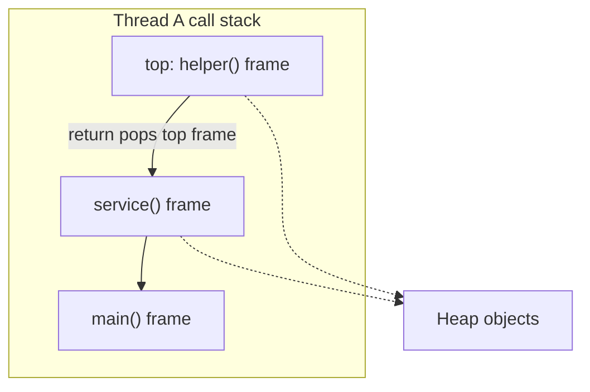
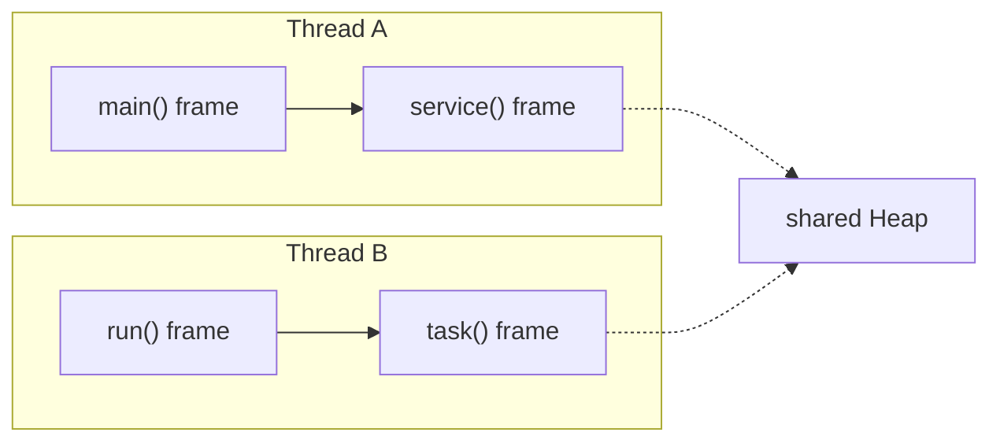

# Method Calls and Stack Frames

## The core idea

When one method calls another method on the same Java thread, the JVM does not create a second stack. The thread already has one call stack, and the new method call pushes a new stack frame on top of it. Think of a kitchen rail with order tickets: the cook keeps one rail, and each new task adds another ticket on top of the current work.

That new frame belongs to the called method. It contains that method's parameters, local variables, operand stack, and bookkeeping needed to return to the caller. The caller's frame remains underneath, paused until the callee returns. Like a post office clerk placing a new form on top of the current folder, the old form is still there, but the clerk works on the top form first.

When the called method returns, its frame is popped. Its local variables and parameter slots disappear as stack storage. In traffic terms, the top car leaves the one-lane checkpoint, and the car behind it becomes active again.

Objects are different. If the method creates an object with `new`, the object itself lives on the heap; the stack frame stores only a primitive value or a reference value. This is the same idea as [what a variable stores and where](topic:variable-storage) and [where reference types are stored](topic:reference-types-storage): the kitchen ticket can contain a table number, but the table is not physically on the ticket.

## Same stack, different frame

"Same stack" does not mean "same local variable area". Each method call has its own frame. If `main()` has a local variable named `count` and `calculate()` also has a local variable named `count`, those are two separate slots in two separate frames. It is like two order tickets both saying "salt": each ticket has its own instruction.

Method parameters are also local slots in the callee's frame. Java passes arguments by value. For primitives, the primitive value is copied. For objects, the reference value is copied, so caller and callee can point to the same heap object while still having separate stack slots.

## Threads

Each Java thread has its own call stack. If another thread runs at the same time, it has a different stack with its own frames. The heap is shared by threads, so stack slots in different threads can hold references to the same heap object. For the threading side of this model, see [Java Multithreading](topic:java-multithreading) and [Context Switch](topic:context-switch). It is like two cooks working at two different rails of tickets while both can take ingredients from the same pantry.

## 60-second interview answer

For one thread, method calls use the same thread stack, but every call creates a new stack frame. The callee's parameters and local variables live in that new frame, above the caller's frame. The caller's frame is not merged with the callee's frame; it just waits underneath. When the method returns, the callee frame is popped and its local variables are gone. If the method created objects, those objects are on the heap, not inside the stack frame; the frame only held references to them. A different Java thread has its own separate stack.

## Why this matters in production

Stack depth is finite. Deep recursion or accidental endless recursion keeps adding frames until the thread throws `StackOverflowError`. It is like a kitchen rail that can hold only so many tickets before it jams.

Local variables are naturally isolated per call. This is why two recursive calls can each have their own `i`, `sum`, or `node` variable. Like separate delivery slips at a post office, changing one slip does not rewrite the others.

Heap objects can outlive a frame if some other frame, field, static variable, or thread still references them. Garbage collection of heap objects is covered by [JVM Heap Generations](topic:heap-generations). The quick memory image is simple: the ticket disappears after the order, but the dish may still be on the table.

## Common misconceptions

Misconception: the called method's variables are placed inside the caller's frame. They are not. The called method gets a separate frame on the same stack.

Misconception: every method call creates a new stack. It creates a new frame, not a new stack. A new stack belongs to a new thread.

Misconception: objects created inside a method are stored on the stack. In the normal interview mental model, `new` creates heap objects, and the frame stores references. The JIT may optimize some allocations internally, but that does not change the basic JVM model you should explain first.

Misconception: after a method returns, everything it touched disappears. Only the frame and its local slots disappear. Heap objects survive while they are still reachable.
