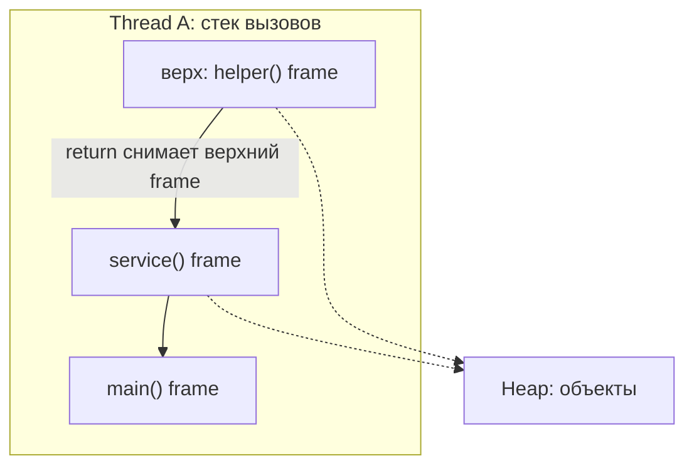
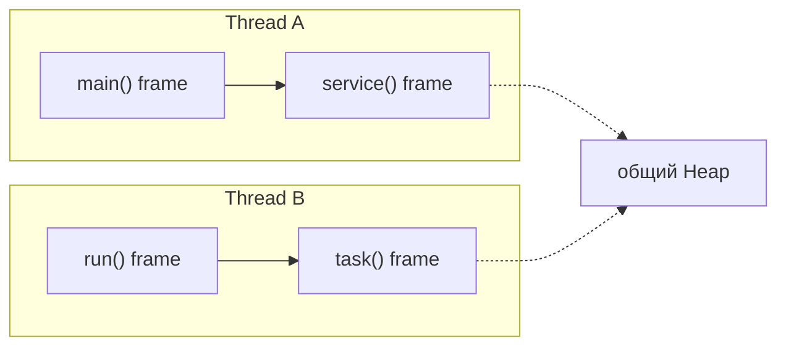

# Вызовы методов и кадры стека

## Главная идея

Когда один метод вызывает другой метод в том же Java-потоке, JVM не создаёт второй стек. У потока уже есть один стек вызовов, и новый вызов метода добавляет сверху новый кадр стека. Представь кухонную рейку с заказами: у повара одна рейка, а каждая новая задача добавляет сверху ещё один листок.

Этот новый кадр принадлежит вызванному методу. В нём находятся параметры этого метода, локальные переменные, operand stack и служебные данные, чтобы вернуться к вызывающему методу. Кадр вызывающего метода остаётся ниже и ждёт, пока вызванный метод завершится. Как в почтовом отделении: сотрудник кладёт новый бланк поверх текущей папки, старый бланк остаётся на месте, но работа идёт с верхним.

Когда вызванный метод возвращается, его кадр снимается со стека. Его локальные переменные и слоты параметров исчезают как память стека. В дорожной аналогии верхняя машина покидает однополосный пункт контроля, и снова активной становится машина за ней.

Объекты устроены иначе. Если метод создаёт объект через `new`, сам объект живёт в heap; кадр стека хранит только примитивное значение или значение ссылки. Это та же идея, что и в темах [что хранит переменная и где](topic:variable-storage) и [где хранятся ссылочные типы](topic:reference-types-storage): кухонный листок может содержать номер столика, но сам столик физически не лежит на листке.

## Тот же стек, но другой кадр

"Тот же стек" не означает "та же область локальных переменных". У каждого вызова метода свой кадр. Если в `main()` есть локальная переменная `count` и в `calculate()` тоже есть локальная переменная `count`, это два отдельных слота в двух отдельных кадрах. Это как два кухонных листка, где на обоих написано "соль": у каждого листка своя инструкция.

Параметры метода тоже являются локальными слотами в кадре вызванного метода. Java передаёт аргументы по значению. Для примитивов копируется примитивное значение. Для объектов копируется значение ссылки, поэтому вызывающий и вызванный методы могут указывать на один и тот же heap-объект, но их слоты в стеке всё равно отдельные.

## Потоки

У каждого Java-потока свой стек вызовов. Если другой поток выполняется одновременно, у него другой стек со своими кадрами. Heap общий для потоков, поэтому слоты в разных стеках могут хранить ссылки на один и тот же heap-объект. Про потоковую часть этой модели смотри [Java Multithreading](topic:java-multithreading) и [Context Switch](topic:context-switch). Это как два повара с двумя разными рейками заказов, но оба берут ингредиенты из одной кладовой.

## Ответ за 60 секунд

В одном потоке вызовы методов используют один и тот же стек этого потока, но каждый вызов создаёт новый кадр стека. Параметры и локальные переменные вызванного метода находятся в этом новом кадре, над кадром вызывающего метода. Кадр вызывающего метода не смешивается с кадром вызванного метода; он просто ждёт ниже. Когда метод возвращается, кадр вызванного метода снимается со стека, и его локальные переменные исчезают. Если метод создал объекты, эти объекты находятся в heap, а не внутри кадра стека; кадр хранил только ссылки на них. У другого Java-потока свой отдельный стек.

## Почему это важно в production

Глубина стека ограничена. Глубокая рекурсия или случайная бесконечная рекурсия добавляет кадры до тех пор, пока поток не получит `StackOverflowError`. Это как кухонная рейка, на которую можно повесить только ограниченное число заказов, прежде чем она заклинит.

Локальные переменные естественно изолированы для каждого вызова. Поэтому у двух рекурсивных вызовов могут быть свои переменные `i`, `sum` или `node`. Как отдельные почтовые квитанции: изменение одной квитанции не переписывает остальные.

Heap-объекты могут пережить кадр, если на них всё ещё ссылается другой кадр, поле, static-переменная или поток. Сборка heap-объектов описана в теме [JVM Heap Generations](topic:heap-generations). Короткая картинка памяти такая: листок заказа исчезает после выполнения, но блюдо может всё ещё стоять на столе.

## Частые заблуждения

Заблуждение: переменные вызванного метода помещаются внутрь кадра вызывающего метода. Нет. Вызванный метод получает отдельный кадр в том же стеке.

Заблуждение: каждый вызов метода создаёт новый стек. Он создаёт новый кадр, а не новый стек. Новый стек принадлежит новому потоку.

Заблуждение: объекты, созданные внутри метода, хранятся на стеке. В обычной собеседовательной модели `new` создаёт объекты в heap, а кадр хранит ссылки. JIT может оптимизировать некоторые выделения памяти внутри, но это не меняет базовую модель JVM, которую нужно объяснить сначала.

Заблуждение: после возврата метода исчезает всё, с чем он работал. Исчезают только кадр и его локальные слоты. Heap-объекты живут дальше, пока они достижимы.
