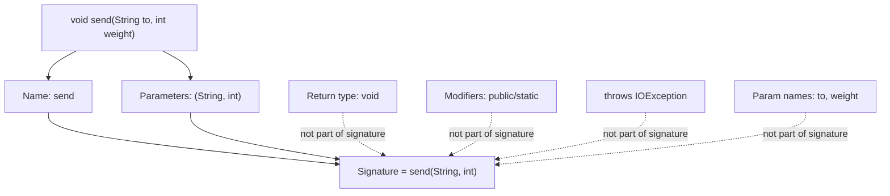
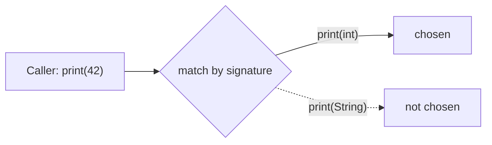

# What Is a Method Signature

A **method signature** in Java is the method's **name** together with the
**number, types and order of its parameters**. That's it. In the Java Language
Specification the signature is exactly *name + parameter types* — everything else
about the method is left out.

Think of a **reception desk at an office**. The signature is the sign on the
window: *"Parcels — bring an ID and a tracking number."* What identifies that
window is the service name and exactly what you have to hand over (and in what
order). It does **not** matter what colour the receipt is, who the clerk is, or
whether they might shout "no!" — those don't change which window you walked up to.

## What is part of it — and what is not

**In the signature:**

- the **method name** — the sign over the window;
- the **parameter types**, their **count** and their **order** — the exact set of
  papers you must hand over, in the right order. `send(String, int)` and
  `send(int, String)` are *different* windows.

**NOT in the signature:**

- the **return type** — like the colour of the receipt you walk away with; it
  doesn't define the window;
- **access modifiers** (`public`, `private`, `static`, `final`) — the desk's
  opening hours, not its purpose;
- the **`throws` clause** — a sign saying "we may turn you away"; still the same
  service;
- the **parameter names** — `send(String to, int weight)` and
  `send(String x, int y)` have the **same** signature. The labels you scribble on
  the form don't matter, only the *kind* of paper.

## Why the signature matters

The compiler uses the signature as the method's *identity*. Two situations depend
entirely on it:

**Overloading** — same name, **different** signature. Like one reception window
that accepts several kinds of drop-off: hand over a `String` and it does one
thing, hand over a `String` and an `int` and it does another. The names match;
the parameter lists differ, so they are distinct methods.

**Overriding** — a subclass replaces a parent method by repeating its signature
**exactly**. Like a new branch office keeping the *same* window sign so customers
still know where to go (see [OOP Principles](topic:oop-principles) and
[Interface vs Abstract Class](topic:interface-vs-abstract-class)). If the
signature differs even slightly, you've *overloaded*, not *overridden* — a classic
silent bug that `@Override` catches.

## 60-second interview answer

> A method signature in Java is the method **name plus the parameter types, in
> order** (and their count). The **return type is not part of it**, and neither are
> access modifiers, the `throws` clause, or parameter names. The signature is how
> the compiler tells methods apart: **overloading** means same name with a
> different signature, and **overriding** means a subclass repeats the parent's
> signature exactly. That's also why you can't declare two methods that differ only
> by return type — their signatures are identical, so the compiler sees a
> duplicate.

## Common misconceptions

- ❌ **"The return type is part of the signature."** It isn't. That's why
  `int f()` and `String f()` in the same class **don't compile** — same signature,
  duplicate method. Like trying to put two identical "Parcels" signs on one window.
- ❌ **"Different parameter names make a different method."**
  `f(int a)` and `f(int b)` are the **same** signature — only types and order
  count.
- ❌ **"Order of parameters doesn't matter."** `f(int, String)` and
  `f(String, int)` are **different** signatures, so they can coexist as overloads.
- ❌ **"Generics give me distinct signatures."** Because of type erasure,
  `f(List<String>)` and `f(List<Integer>)` have the **same** erased signature and
  cause a *name clash* — they can't coexist.
- ❌ **"Throwing different exceptions makes the signature different."** The
  `throws` clause is not part of the signature; it can't be used to overload.
