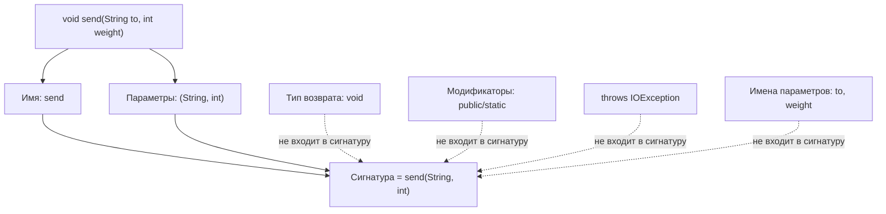
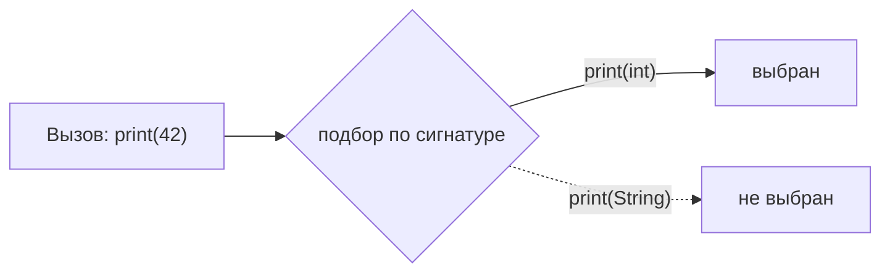

# Что такое сигнатура метода

**Сигнатура метода** в Java — это **имя** метода вместе с **количеством, типами и
порядком его параметров**. И всё. В спецификации языка Java сигнатура — это ровно
*имя + типы параметров*; всё остальное про метод в неё не входит.

Представьте **стойку приёма в офисе**. Сигнатура — это табличка на окне:
*«Посылки — принесите паспорт и трек-номер»*. Это окно определяется названием
услуги и тем, что именно вы должны передать (и в каком порядке). И **неважно**,
какого цвета квитанция, кто сегодня за стойкой и могут ли вам сказать «нет» —
это не меняет, к какому окну вы подошли.

## Что входит — а что нет

**Входит в сигнатуру:**

- **имя метода** — табличка над окном;
- **типы параметров**, их **количество** и **порядок** — точный набор бумаг,
  которые нужно передать, в правильном порядке. `send(String, int)` и
  `send(int, String)` — это *разные* окна.

**НЕ входит в сигнатуру:**

- **тип возвращаемого значения** — как цвет квитанции, которую вы уносите; он не
  определяет окно;
- **модификаторы доступа** (`public`, `private`, `static`, `final`) — часы работы
  стойки, а не её назначение;
- **блок `throws`** — табличка «можем отказать»; услуга всё та же;
- **имена параметров** — `send(String to, int weight)` и `send(String x, int y)`
  имеют **одинаковую** сигнатуру. Подписи, которые вы делаете на бланке, не важны —
  важен лишь *вид* бумаги.

## Почему сигнатура важна

Компилятор использует сигнатуру как *идентичность* метода. От неё целиком зависят
две ситуации:

**Перегрузка (overloading)** — то же имя, **другая** сигнатура. Как одно окно
приёма, принимающее несколько видов передач: передадите `String` — оно делает
одно, передадите `String` и `int` — другое. Имена совпадают, списки параметров
различаются, значит это разные методы.

**Переопределение (overriding)** — подкласс заменяет метод родителя, **точно**
повторяя его сигнатуру. Как новый филиал, сохраняющий *ту же* табличку на окне,
чтобы клиенты знали, куда идти (см. [Принципы ООП](topic:oop-principles) и
[Интерфейс против абстрактного класса](topic:interface-vs-abstract-class)). Если
сигнатура отличается хоть немного, вы *перегрузили*, а не *переопределили* —
классическая незаметная ошибка, которую ловит `@Override`.

## Ответ за 60 секунд

> Сигнатура метода в Java — это **имя метода плюс типы параметров, в порядке**
> следования (и их количество). **Тип возвращаемого значения в неё не входит**, как
> и модификаторы доступа, блок `throws` и имена параметров. Сигнатура — это то, как
> компилятор различает методы: **перегрузка** — то же имя с другой сигнатурой, а
> **переопределение** — подкласс точно повторяет сигнатуру родителя. Поэтому же
> нельзя объявить два метода, отличающихся только типом возврата: их сигнатуры
> одинаковы, и компилятор видит дубликат.

## Частые заблуждения

- ❌ **«Тип возврата входит в сигнатуру».** Нет. Именно поэтому `int f()` и
  `String f()` в одном классе **не компилируются** — одинаковая сигнатура, дубликат
  метода. Как попытка повесить две одинаковые таблички «Посылки» на одно окно.
- ❌ **«Разные имена параметров делают метод другим».** `f(int a)` и `f(int b)` —
  это **одна и та же** сигнатура; важны только типы и порядок.
- ❌ **«Порядок параметров не важен».** `f(int, String)` и `f(String, int)` — это
  **разные** сигнатуры, поэтому они могут сосуществовать как перегрузки.
- ❌ **«Дженерики дают разные сигнатуры».** Из-за стирания типов `f(List<String>)`
  и `f(List<Integer>)` имеют **одинаковую** стёртую сигнатуру и вызывают *конфликт
  имён* — сосуществовать они не могут.
- ❌ **«Разные выбрасываемые исключения делают сигнатуру другой».** Блок `throws`
  не входит в сигнатуру; через него нельзя сделать перегрузку.
