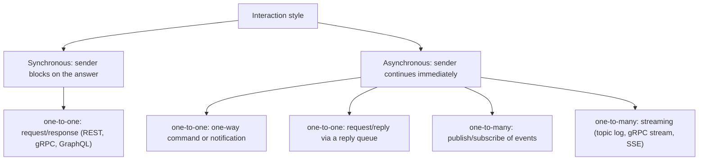
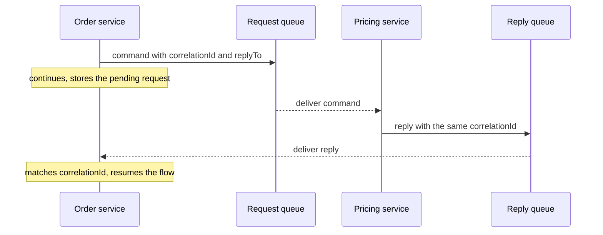
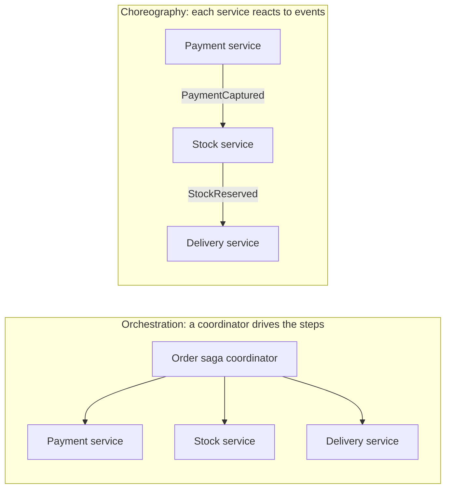

# Types of Interaction Between Microservices

Inside a monolith, one module talks to another with a method call: instant, reliable, single receiver, same transaction. The moment the modules become separate services, that single mechanism splits into a whole family of interaction styles, and picking the wrong one is one of the most expensive mistakes in a distributed system.

The useful way to answer this question in an interview is not to list protocols. It is to classify interactions along **two independent axes**:

1. **Does the sender wait for the answer?** — synchronous or asynchronous.
2. **How many receivers does the message have?** — one-to-one or one-to-many.

Everything else (REST, gRPC, Kafka, AMQP, WebSocket) is a *transport* choice made underneath one of those cells.

Note the asymmetry: there is no natural "synchronous one-to-many" cell. A caller cannot block on many independent answers without inventing a scatter-gather aggregator, which is really a composition of one-to-one calls.

## 1. Synchronous request/response (one-to-one)

Service A sends a request and blocks its own flow until Service B answers. This is the default that most teams start with: REST over HTTP with JSON, gRPC with protobuf, GraphQL for a client-shaped read, and older SOAP/RPC stacks.

It is the right choice when the caller genuinely cannot continue without the answer: validating a token, reading a profile to render a page, checking whether stock exists before confirming an order.

The price is **temporal coupling** — both services must be alive and fast *at the same moment*. B's latency becomes A's latency, and B's downtime becomes A's downtime unless you defend the boundary with timeouts, retry budgets, bulkheads and circuit breakers; see [Service Timeouts, Fallbacks, and Circuit Breakers](topic:service-timeouts-fallbacks). Long synchronous chains (A waits for B waits for C) multiply that risk and are the classic way to build a distributed monolith.

## 2. Asynchronous one-way command or notification (one-to-one)

Service A puts a message on a queue addressed at one logical consumer and moves on. No reply is expected: "send this email", "generate this report", "reindex this document". The broker holds the message while the consumer is busy or restarting, so the interaction survives the consumer being temporarily down.

Exactly one consumer *instance* processes each message, even when the consumer is scaled to ten replicas — that is what makes it one-to-one. The queue also acts as a shock absorber: producers can spike while consumers drain at a steady rate.

Because delivery is usually at-least-once, the consumer must be idempotent. Reliably publishing the message in the same breath as a local database change needs the [Outbox pattern](topic:outbox-pattern), and deduplicating a redelivered message needs the [Inbox pattern](topic:inbox-pattern).

## 3. Asynchronous request/reply (one-to-one)

Sometimes you do want an answer, but you do not want to hold a thread and a connection open while waiting. The sender publishes a request carrying a `correlationId` and a `replyTo` address, keeps a record of the pending work, and continues. The reply arrives later on the reply queue and is matched back by `correlationId`. A webhook/callback URL is the HTTP-shaped version of the same idea.

This is how you keep an interaction non-blocking without giving up the answer. The cost is bookkeeping: correlation state, timeouts for replies that never come, and traces that now span two messages instead of one call.

## 4. Publish/subscribe of events (one-to-many)

The publisher announces a **fact** — `OrderPlaced`, `PaymentCaptured`, `UserDeleted` — and does not know or care who consumes it. Zero, one or seven subscriber services react, each with its own copy of the message. Adding an eighth consumer requires no change to the publisher, which is the strongest decoupling any of these styles offers.

Two flavours matter in interviews:

- **Event notification** — a thin message ("order 42 changed"); consumers call back for details. Small payloads, but it re-introduces synchronous read traffic.
- **Event-carrying state transfer** — the message includes the data consumers need, so they can act without calling back and can keep a local read model. Bigger payloads and duplicated data, but real availability independence.

The trade-off of pub/sub is that the publisher loses visibility of the outcome. Nobody tells it that a subscriber failed; that becomes an operational concern of dead-letter queues, lag dashboards and alerts.

## 5. Streaming and long-lived channels

Not every interaction is one message with one outcome. Some are a continuous flow: a consumer group reading a Kafka topic log at its own pace and able to replay history, gRPC server/client/bidirectional streams, WebSocket or Server-Sent Events pushing updates to a subscriber.

Streaming is the natural style for telemetry, price ticks, progress updates, change data capture and analytics pipelines. Its distinguishing property is *position*: the consumer owns an offset, so it can be slow, restart, or reprocess from the past. Broker choice matters a lot here — a replayable log behaves very differently from a queue that deletes on acknowledgement; compare them in [Kafka vs RabbitMQ](topic:kafka-vs-rabbitmq).

## 6. Indirect interaction through data

Two services can also interact without ever sending each other a message.

- **Shared database** — several services read and write the same tables. It is the fastest way to integrate and almost always the wrong one: the schema becomes an undeclared public API, nobody can migrate it, and one service's lock or long transaction hurts the others. Treat it as an anti-pattern, not a style you would propose.
- **Shared cache or shared blob storage** — legitimate in narrow cases (a warm read-through cache, a large file handed over by reference instead of by payload), but still a coupling point that needs an owner.
- **Data replication / CDC** — one service owns the data and streams changes so others can build read-only local copies. This is a disciplined version of sharing: still one writer, and the copy is explicitly eventually consistent.
- **Batch / file transfer** — nightly exports, ETL jobs, reconciliation files. Unfashionable but very much alive for reporting, finance and integration with external systems.

## Who drives the flow: orchestration vs choreography

Once more than two services are involved, a second question appears — *who knows the business process?*

**Orchestration** puts the process in one place: readable, easy to monitor, easy to change — at the price of a component that knows about everyone and can become a bottleneck. **Choreography** spreads the process across event subscriptions: maximum decoupling, but the end-to-end flow exists only in the reader's head unless you invest in tracing.

Both are how a multi-service business transaction is actually implemented, because there is no cross-service [ACID](topic:acid-principles) transaction to lean on — you get a saga of local transactions plus compensating actions instead. A related composition shape is **API composition**: a gateway or BFF fans out to several services and assembles one response for the client, which is what keeps chatty aggregation out of the domain services themselves.

## What the message means: command, event, query

Orthogonal to timing and cardinality, it is worth naming the *intent* of a message, because it drives naming and ownership:

- **Command** — "do this" (`ReserveStock`). One intended handler; the sender expects an effect.
- **Event** — "this happened" (`StockReserved`). Immutable past tense, any number of consumers, sender expects nothing.
- **Query/document** — "give me this" or "here is the data". Read-only, no state change.

Mixing them up produces the common smell of an "event" that is really a disguised command aimed at one specific service. The same read/write split shows up inside a single service's API too; see [REST and separation of concerns](topic:employee-api-rest-cqrs).

## 60-second interview answer

> I classify service interactions on two axes. First, **timing**: synchronous request/response, where the caller waits — REST, gRPC, GraphQL — versus asynchronous messaging, where the sender hands off and continues. Second, **cardinality**: one-to-one versus one-to-many. Combining them gives the practical set: synchronous request/response; asynchronous one-way commands to a queue; asynchronous request/reply using a reply queue and a `correlationId`; publish/subscribe of domain events to many consumers; and streaming over a replayable log or a long-lived channel. There is also indirect interaction through data — data replication or batch/file transfer, and the shared-database anti-pattern. Above that sits coordination: orchestration, where one coordinator drives a saga, or choreography, where services react to each other's events. I choose synchronous when the caller cannot proceed without the answer, and asynchronous when the work can complete later, when I need to fan out to unknown consumers, or when I want to survive the other service being down.

## Production relevance

**The style determines your failure modes.** Synchronous interactions fail loudly and immediately — timeouts, 5xx, cascading latency — so they need timeouts and circuit breakers. Asynchronous ones fail quietly and later: growing queue depth, consumer lag, dead-letter queues, duplicates. You must monitor completely different signals depending on which you chose.

**Most real systems are hybrids, and that is correct.** A checkout flow typically reads inventory synchronously, publishes `OrderPlaced` as an event, sends the confirmation email through a one-way command, and streams the order-status updates to the client. The skill is not picking one style but drawing the boundary between them; the criteria for that call are in [Choosing Sync or Async Service Communication](topic:service-communication-choice), and the deeper trade-off in [Synchronous vs Asynchronous Communication](topic:sync-vs-async-communication).

**Contracts outlive code.** Whatever the style, the message or endpoint schema is a published API: it needs versioning, backward-compatible evolution, and a consumer-facing test strategy. Async makes this harder, not easier, because a broken payload surfaces in a consumer you may not own.

**Each style buys a different kind of decoupling.** Async buys *time* decoupling (the peer can be down). Pub/sub buys *identity* decoupling (you do not know your consumers). Event-carrying state transfer buys *availability* decoupling (you do not need to call back). None of them removes schema and semantic coupling — that is a good line to have ready, and it is the same point made in [Why Microservices Are Used](topic:why-microservices).

## Common misconceptions

- **"Sync vs async is the whole classification."** It is only one axis. Cardinality is the axis that separates a command from an event, and that distinction shapes ownership more than timing does.
- **"REST is synchronous and Kafka is asynchronous, so the protocol *is* the interaction type."** The transport and the interaction style are separate choices. Async request/reply can run over HTTP with a callback URL, and you can build a blocking pseudo-RPC over a message broker — usually a bad idea, but it happens.
- **"Events and commands are the same thing with different names."** A command names an action and expects one handler; an event names a fact and expects nobody in particular. Sending `ReserveStock` as an "event" secretly couples the publisher to one consumer.
- **"Publish/subscribe means each consumer competes for the message."** No: in pub/sub every subscriber gets its own copy, while in a work queue the instances compete and only one wins. Mixing these up leads to jobs running seven times or events being seen by one service only.
- **"Asynchronous means guaranteed delivery, so I can drop error handling."** Brokers typically give at-least-once delivery, which means duplicates and, without an outbox, lost publishes when the local commit succeeds and the send fails. Reliability is built with the [Outbox pattern](topic:outbox-pattern), the [Inbox pattern](topic:inbox-pattern) and idempotent consumers.
- **"A shared database is a legitimate interaction style if the services are small."** It re-creates a monolith with none of a monolith's advantages: no local transaction across the whole flow, no independent deploys, no schema ownership. See [Types of Monolithic Architectures](topic:monolithic-architecture-types) for what you would actually be building.
- **"Choreography is the modern choice, orchestration is legacy."** Choreography decouples but hides the process; orchestration centralises but makes the process explicit and debuggable. Long flows with compensation are often far safer orchestrated.
